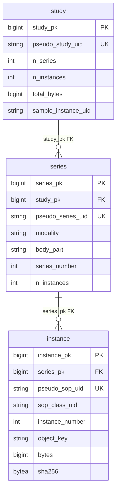

# 개발지시서 — Series/Instance 백필 (Demo D-13 Unblocker)

> **Status**: Draft v0.1 · **Feature slug**: `backfill-series-instance` · **Last updated**: 2026-04-26
> **작성자**: @planner
> **근거**:
> - 기존 백필 스펙: [dev-spec-metadata-thumbnail-ingest §FR-BACKFILL-1](../../docs/specs/dev-spec-metadata-thumbnail-ingest.md) (전례: backfill_v2_metadata.py)
> - 기존 코드: [`scripts/demo_seed/backfill_v2_metadata.py`](../../scripts/demo_seed/backfill_v2_metadata.py)
> - DB 스키마: [`src/radivault_central/db/models.py`](../../src/radivault_central/db/models.py) `Series`, `Instance`, `Study`
> - Repository 패턴: [`src/radivault_central/db/repository.py`](../../src/radivault_central/db/repository.py) `insert_study_full`
> - Pseudo UID 알고리즘: [`src/radivault_gateway/deid/engine.py`](../../src/radivault_gateway/deid/engine.py) `DeidEngine.pseudo_uid`
> - 데모 컨텍스트: `progress.txt` (D-13 to CEO 데모, 250 study × series=0 / instance=0 무결성 결함)

---

## 1. 기능 개요

Central DB 의 250 개 study 행에 대해 비어 있는 `series` / `instance` 자식 테이블을 Orthanc 의 raw DICOM 메타데이터로부터 재구성하고, `study.sample_instance_uid` 를 채워 Buyer Portal study detail 페이지의 "Series Count: 0", "Sample DICOM 비활성화", "Preview unavailable" 데이터 무결성 결함을 D-13 데모 전에 해소한다. 일회성·idempotent 단일 스크립트.

## 2. 사용자 스토리

- **As a** Demo Operator (Kyle), **I want** central DB 의 모든 데모 study 가 series/instance 행을 채우고 sample_instance_uid 가 비-NULL 이 되기를 원한다, **so that** Buyer Portal 의 study detail 페이지가 정상적으로 series count, preview, sample DICOM download CTA 를 노출할 수 있다.
- **As a** Buyer (데모 시연 페르소나), **I want** 검색 결과에서 study 를 클릭했을 때 series 목록과 sample DICOM 다운로드 버튼이 활성 상태로 보이기를 원한다, **so that** RadiVault 의 데이터 셀프-서브 트라이얼 가치 제안이 한 화면에서 검증된다.

## 3. 범위

### 포함 (In-scope)
- Orthanc `/studies` 엔드포인트에서 모든 study 를 enumerate.
- 각 Orthanc study → state_db `uid_map` 으로 pseudo_study_uid 매핑.
- 각 study 에 대해 Orthanc `/studies/{id}/series` → `series` 행 INSERT (idempotent: 이미 존재 시 SKIP).
- 각 series 의 instance → `instance` 행 INSERT (idempotent).
- `study` 행의 `n_series`, `n_instances`, `total_bytes`, `sample_instance_uid` UPDATE.
- pseudo_series_uid / pseudo_sop_uid 가 state_db `uid_map` 에 있으면 그것을 사용; 없으면 deterministic SHA256 fallback (gateway deid 알고리즘과 1:1 동일).
- raw DICOM `object_key` 컬럼은 placeholder `orthanc:{orthanc_instance_id}` 로 채움 (raw DICOM 이 MinIO 에 없는 환경 가정 — 실 환경 검증은 §11 오픈 질문 참고).
- 진행 로그 `[i/N] study=<short> series=<n> instances=<n> OK/FAIL`.
- 실패 study skip 후 다음 study 진행 (한 study 의 실패가 전체를 abort 하지 않음).

### 제외 (Out-of-scope)
- 실 운영 환경 (HOSP-001/002 외 병원) 에 대한 일반화 — D-13 데모 한정 단발성.
- raw DICOM 의 MinIO 업로드 / 마이그레이션 — Hot Storage 마이그레이션은 별도 트랙 (order-fulfillment §C-1).
- Series/Instance 행 신규 작성 시 `study.preview_status` / `preview_thumbnail_key` 변경 — 이미 backfill_v2_metadata.py 가 처리, 본 스크립트는 절대 건드리지 않음.
- 신규 study 의 ingest — 기존 row 가 있는 study 만 대상.
- patient_pseudo / hospital / KCD 등 다른 도메인 row 갱신.
- 다중-worker 병렬화 — 250 study × 평균 700 instance 는 단일 프로세스로 충분 (§5 성능 참조).

## 4. 기능 요구사항

- **FR-1 (대상 enumerate)**: 스크립트는 Orthanc `/studies` 로 study 목록을 가져온다. `--limit N` 으로 첫 N 개만 처리할 수 있어야 한다 (테스트용).
- **FR-2 (study 매핑)**: 각 Orthanc study 의 `MainDicomTags.StudyInstanceUID` 를 state_db `uid_map(uid_kind='study')` 에서 조회. 매핑 누락 시 해당 study 는 SKIP 하고 카운터 증가, 사유 로그 (`no uid_map entry for {original_uid}`).
- **FR-3 (central row 존재 가드)**: pseudo_study_uid 로 `study` 테이블 SELECT. 없으면 SKIP (`central row missing for {pseudo_uid}`). 본 스크립트는 study 행을 신규 생성하지 않는다.
- **FR-4 (series enumerate)**: Orthanc `/studies/{orthanc_study_id}/series` JSON 응답을 사용. 응답이 비어있으면 SKIP (`no series for {pseudo_uid}`).
- **FR-5 (series pseudo UID 결정)**: 각 series 의 원본 `SeriesInstanceUID` 를 state_db `uid_map(uid_kind='series')` 에서 조회. 있으면 사용, 없으면 §6 의 fallback 알고리즘으로 deterministic 하게 계산.
- **FR-6 (series row upsert)**: pseudo_series_uid 로 `series` SELECT. 있으면 SKIP (idempotent 재실행 안전성). 없으면 INSERT — `study_pk`, `pseudo_series_uid`, `modality`, `body_part`, `series_number`, `n_instances` 채움. 매핑 표는 §6.1.
- **FR-7 (instance enumerate)**: Orthanc `/series/{orthanc_series_id}/instances` JSON 응답 사용. InstanceNumber 기준 오름차순 정렬 (지정 없으면 응답 순서).
- **FR-8 (instance pseudo UID 결정)**: 각 instance 의 원본 `SOPInstanceUID` 를 state_db `uid_map(uid_kind='sop')` 에서 조회. 있으면 사용, 없으면 fallback 알고리즘.
- **FR-9 (instance row upsert)**: pseudo_sop_uid 로 `instance` SELECT. 있으면 SKIP. 없으면 INSERT — 매핑 표 §6.2 참조. `object_key` 는 `orthanc:{orthanc_instance_id}` placeholder.
- **FR-10 (instance bytes 계산)**: `bytes` 컬럼은 Orthanc `/instances/{id}` JSON 의 `FileSize` 필드를 사용 (가능한 경우). 없으면 `/instances/{id}/file` GET 으로 다운로드 후 `len(content)` 사용 (느린 경로, fallback only).
- **FR-11 (instance sha256 계산)**: `sha256` 컬럼은 raw DICOM bytes 의 SHA-256. Orthanc `/instances/{id}/attachments/dicom/md5` 는 MD5 만 제공하므로 사용 불가. `/instances/{id}/file` 으로 다운로드 후 `hashlib.sha256(data).digest()` 로 32-byte LargeBinary 저장.
- **FR-12 (study counter UPDATE)**: study 단위 트랜잭션 마지막에 `study.n_series = INSERT 된 series 수 + 기존 series 수`, `study.n_instances = SUM(series.n_instances)`, `study.total_bytes = SUM(instance.bytes)` 로 갱신. 기존 값과 다르면 덮어쓴다 (manifest v1 의 부정확한 값 교정).
- **FR-13 (sample_instance_uid 결정)**: study 의 첫 번째 series (series_number ASC, NULL 은 최후) → 그 series 의 instance 중 중간 인덱스 (`len(instances) // 2`) → 해당 instance 의 `pseudo_sop_uid` 를 `study.sample_instance_uid` 로 SET. 이미 비-NULL 인 경우에도 덮어쓴다 (idempotent 재실행 시 결정성 유지).
- **FR-14 (배치 트랜잭션)**: study 단위 commit. 한 study 처리 중 예외 발생 시 해당 study 트랜잭션 ROLLBACK 후 다음 study 로 진행. 전체 abort 금지.
- **FR-15 (진행 로그)**: 각 study 처리 후 `[i/N] study={pseudo_short} series={n_series} instances={n_inst} OK` 또는 `[i/N] FAIL <reason>` 형식으로 INFO 레벨 출력. 종료 시 `backfill_summary ok=X fail=Y duration_s=Z` 출력.
- **FR-16 (CLI 인자)**: `--orthanc`, `--orthanc-user`, `--orthanc-password`, `--db-dsn`, `--state-db`, `--limit`, `--dry-run`, `-v/--verbose` 인자를 backfill_v2_metadata.py 와 동일 명명 규칙으로 제공. `--bucket` 인자는 본 스크립트에서 사용하지 않으나 받아들임 (호환성).
- **FR-17 (dry-run)**: `--dry-run` 시 Orthanc 호출은 하나, DB INSERT/UPDATE 는 수행하지 않고 "would insert N series, M instances" 형식으로 미리보기 출력.
- **FR-18 (exit code)**: 모든 study 성공 시 0, 하나 이상 실패 시 1, Orthanc 초기 enumerate 실패 시 2.

## 5. 비기능 요구사항

| 항목 | 요구 |
|------|------|
| 성능 | 250 study × 평균 700 instance ≈ 175k 행. study 당 Orthanc 4 요청 + DB 1 트랜잭션. 단일 프로세스로 30분 이내 완료 (≈ 7.2 s/study 상한). |
| 보안 | DICOM raw bytes 를 다운로드하지만 디스크에 영속 저장하지 않음 (메모리에서 SHA-256 계산 후 폐기). PHI 변환 / 익명화는 수행하지 않음 (이미 ingest 시 완료된 pseudo UID 만 다룸). |
| 가용성 | 데모 환경 단발성 실행. 운영 환경 적용 금지 (스크립트 헤더 docstring 에 명시). |
| 로깅·감사 | INFO 레벨 진행 로그. central `audit_ingest_event` 테이블에는 기록하지 **않음** (본 스크립트는 데이터 교정용이지 ingest 이벤트가 아님 — 추적성은 `study.raw_dicom_tags.backfilled_by` 에 `"backfill_series_instance.py"` 추가로 대신함). |
| 국제화 | N/A — 운영자 전용 CLI. |

## 6. 데이터 모델

### 6.1 Orthanc → `series` 테이블 매핑

| Orthanc tag | series 컬럼 | 변환 |
|---|---|---|
| `MainDicomTags.SeriesInstanceUID` | (입력만; pseudo 변환 후 `pseudo_series_uid`) | §FR-5 + §6.3 |
| (study lookup) | `study_pk` | `Study.study_pk` (pseudo_study_uid 로 SELECT) |
| `MainDicomTags.Modality` | `modality` | str, NULL 허용 |
| `MainDicomTags.BodyPartExamined` | `body_part` | str, NULL 허용 |
| `MainDicomTags.SeriesNumber` | `series_number` | int, parse 실패 시 NULL |
| `len(instances)` | `n_instances` | int, FR-7 의 instance 카운트 |
| (없음) | `raw_dicom_tags` | NULL (본 백필은 series JSONB 미사용) |

### 6.2 Orthanc → `instance` 테이블 매핑

| Orthanc tag / 동작 | instance 컬럼 | 변환 |
|---|---|---|
| `MainDicomTags.SOPInstanceUID` | (입력만; pseudo 변환 후 `pseudo_sop_uid`) | §FR-8 + §6.3 |
| (series lookup) | `series_pk` | 위에서 INSERT 된 `Series.series_pk` |
| `MainDicomTags.SOPClassUID` | `sop_class_uid` | str, NULL 허용 |
| `MainDicomTags.InstanceNumber` | `instance_number` | int, parse 실패 시 NULL |
| `f"orthanc:{orthanc_instance_id}"` | `object_key` | str, placeholder (§11 오픈 질문 1) |
| `FileSize` 또는 `len(file_bytes)` | `bytes` | BigInteger, FR-10 |
| `hashlib.sha256(file_bytes).digest()` | `sha256` | LargeBinary (32 bytes), FR-11 |

### 6.3 Pseudo UID 결정 알고리즘

```
def resolve_pseudo_uid(state_conn, original_uid: str, kind: str,
                       *, salt_bytes: bytes, org_root: str) -> str:
    # 1차: state_db.uid_map 조회 (gateway 가 ingest 시 기록)
    row = state_conn.execute(
        "SELECT pseudo_uid FROM uid_map WHERE original_uid=? AND uid_kind=?",
        (original_uid, kind)
    ).fetchone()
    if row:
        return row["pseudo_uid"]

    # 2차 (fallback): gateway DeidEngine.pseudo_uid 와 비트 동일 알고리즘
    digest = hashlib.sha256(salt_bytes + original_uid.encode("utf-8")).digest()
    suffix = str(int.from_bytes(digest[:5], "big"))
    pseudo = f"{org_root}.{suffix}"
    return pseudo[:64]  # DICOM UID max 64 chars
```

- `kind` ∈ `{"study", "series", "sop"}`.
- Fallback 알고리즘은 [`engine.py:310-329`](../../src/radivault_gateway/deid/engine.py) 와 1:1 동일.
- `salt_bytes`, `org_root` 는 gateway config 에서 로드해야 함 — `--gateway-config` CLI 인자로 yaml 경로를 받거나, `--salt`/`--org-root` 직접 인자 (§11 오픈 질문 2 — 운영자 결정 필요).
- Fallback 사용 시 INFO 로그에 `pseudo_uid_fallback kind=series original={short_hash} pseudo={short}` 기록.

### 6.4 ER 관계 (변경 없음, 참고용)



## 7. API 계약

본 스크립트는 외부 API 를 노출하지 않는다. 호출 (consume) 하는 인터페이스만 정리:

```
GET  {orthanc}/studies                              → list[orthanc_study_id: str]
GET  {orthanc}/studies/{id}                         → { MainDicomTags: { StudyInstanceUID, ... } }
GET  {orthanc}/studies/{id}/series                  → list[ { ID, MainDicomTags: { SeriesInstanceUID, Modality, BodyPartExamined, SeriesNumber }, Instances: [...] } ]
GET  {orthanc}/series/{id}/instances                → list[ { ID, MainDicomTags: { SOPInstanceUID, SOPClassUID, InstanceNumber }, FileSize? } ]
GET  {orthanc}/instances/{id}                       → { FileSize, MainDicomTags: { ... } }
GET  {orthanc}/instances/{id}/file                  → bytes (raw DICOM, FR-11 SHA-256 입력)
```

DB 작업:
```
SELECT pseudo_uid FROM uid_map WHERE original_uid=? AND uid_kind=?           -- state.sqlite3
SELECT * FROM study WHERE pseudo_study_uid=?                                  -- central postgres
SELECT * FROM series WHERE pseudo_series_uid=?                                -- idempotent guard
INSERT INTO series (study_pk, pseudo_series_uid, modality, body_part, series_number, n_instances) ...
SELECT * FROM instance WHERE pseudo_sop_uid=?                                 -- idempotent guard
INSERT INTO instance (series_pk, pseudo_sop_uid, sop_class_uid, instance_number, object_key, bytes, sha256) ...
UPDATE study SET n_series=?, n_instances=?, total_bytes=?, sample_instance_uid=?, raw_dicom_tags=? WHERE study_pk=?
```

## 8. 시퀀스·플로우

```
operator
  │
  └─▶ python scripts/demo_seed/backfill_series_instance.py [--args]
        │
        ├─▶ Orthanc GET /studies                         (FR-1)
        │
        └─▶ for each orthanc_study_id (i/N):
              │
              ├─▶ Orthanc GET /studies/{id}              → original StudyInstanceUID
              ├─▶ state_db SELECT uid_map(study)         → pseudo_study_uid       (FR-2)
              │       │ miss ─▶ SKIP, log fail
              │       ▼
              ├─▶ central SELECT study WHERE pseudo=?   (FR-3)
              │       │ miss ─▶ SKIP, log fail
              │       ▼
              ├─▶ Orthanc GET /studies/{id}/series       (FR-4)
              │
              └─▶ BEGIN TRANSACTION
                    │
                    ├─▶ for each series:
                    │     ├─ resolve pseudo_series_uid   (FR-5, §6.3)
                    │     ├─ SELECT series WHERE pseudo=? → exists? skip insert
                    │     ├─ Orthanc GET /series/{id}/instances  (FR-7)
                    │     ├─ for each instance:
                    │     │   ├─ resolve pseudo_sop_uid  (FR-8)
                    │     │   ├─ SELECT instance WHERE pseudo=? → exists? skip
                    │     │   ├─ Orthanc GET /instances/{id}/file → bytes
                    │     │   ├─ compute sha256, length
                    │     │   └─ INSERT instance (FR-9)
                    │     └─ INSERT series (after instances counted) (FR-6)
                    │
                    ├─▶ pick sample_instance_uid          (FR-13)
                    │     = first_series.instances[middle].pseudo_sop_uid
                    │
                    ├─▶ UPDATE study SET counters + sample_instance_uid + raw_dicom_tags  (FR-12)
                    │
                    └─▶ COMMIT  (or ROLLBACK on exception, FR-14)
                          │
                          └─▶ log [i/N] OK/FAIL          (FR-15)
        │
        └─▶ log backfill_summary, exit (FR-18)
```

## 9. 의존성

- **상위/외부 시스템**:
  - Orthanc (HTTP API, basic auth) — `http://localhost:8042` 가 데모 기본값.
  - Central Postgres (psycopg/SQLAlchemy sync engine) — DSN 기본값 `backfill_v2_metadata.py` 와 동일.
  - Gateway state DB (SQLite) — 기본 경로 `/Users/yonghyuk/Radivault/demo_data/gateway/state.sqlite3`.
- **하위 모듈**:
  - `src/radivault_central/db/models.py` — `Study`, `Series`, `Instance` ORM (변경 없음, import 만).
  - `src/radivault_gateway/deid/engine.py` — pseudo_uid 알고리즘 참고 (코드 재사용 안 함, 동일 로직 재구현).
- **선행 조건**:
  - `study` 테이블에 250 행이 존재 (현재 만족).
  - state_db `uid_map` 에 study kind 매핑 250 건 존재 (현재 만족 — backfill_v2_metadata 와 동일 사전조건).
  - Orthanc 에 raw DICOM 255 study 보유 (현재 만족).
  - **state_db 에 series/sop kind 매핑이 존재하지 않을 가능성 매우 높음** (Flow A metadata-only 경로는 series/sop pseudo_uid 호출 안 함). 따라서 fallback 알고리즘이 거의 모든 series/instance 에 적용될 것으로 예상 → §11 오픈 질문 2 (salt + org_root 운영자 제공) 가 사실상 필수.
- **Python 패키지**: `boto3` (FR-16 호환성 인자만, 실 사용 X), `requests`, `sqlalchemy`, `psycopg[binary]` — 모두 backfill_v2_metadata 가 이미 사용 중이므로 추가 설치 불필요.

## 10. 수용 기준 (Acceptance Criteria)

`@qa` 가 이걸 기준으로 검수:

- [ ] **AC-1 (FR-1, FR-15)**: 스크립트 실행 후 stdout 에 `[1/250]` ~ `[250/250]` 로그 라인이 250 줄 출력된다 (또는 `--limit` 인자 값만큼).
- [ ] **AC-2 (FR-12)**: 실행 후 다음 SQL 결과에서 `series_rows`, `instance_rows` 모두 0 이 아니어야 한다.
  ```sql
  SELECT s.modality, COUNT(DISTINCT s.study_pk) AS studies,
         COUNT(DISTINCT se.series_pk) AS series_rows,
         COUNT(i.instance_pk) AS instance_rows
  FROM study s
  LEFT JOIN series se ON se.study_pk = s.study_pk
  LEFT JOIN instance i ON i.series_pk = se.series_pk
  GROUP BY s.modality;
  ```
  데모 기대값: CT studies=97 series_rows≥97 instance_rows≥9000 (CT 평균 ≥100/study).
- [ ] **AC-3 (FR-13)**: `SELECT COUNT(*) FROM study WHERE sample_instance_uid IS NULL;` 가 0 (또는 §FR-2/FR-3 으로 SKIP 된 건수만큼).
- [ ] **AC-4 (FR-12)**: 모든 study 에 대해 `study.n_series = (SELECT COUNT(*) FROM series WHERE study_pk=study.study_pk)` 일치, `study.n_instances = (SELECT COUNT(*) FROM instance i JOIN series se ON i.series_pk=se.series_pk WHERE se.study_pk=study.study_pk)` 일치.
- [ ] **AC-5 (FR-14, idempotent)**: 동일 스크립트를 두 번 연속 실행 시 두 번째 실행은 모든 series/instance 가 SKIP 처리되어 INSERT 0 건. 진행 로그에 `series=N (existing)` 표시. study counter UPDATE 만 다시 수행 (멱등성 보장).
- [ ] **AC-6 (Buyer Portal end-to-end)**: 임의의 250 study UID 로 portal study detail 페이지 (`GET /studies/{pseudo_study_uid}`) HTTP 200 응답, 응답 body 에 `series_count > 0` 이고 `sample_dicom.enabled === true`. (수동 확인 또는 e2e 테스트).
- [ ] **AC-7 (FR-9, object_key)**: `SELECT DISTINCT LEFT(object_key, 8) FROM instance LIMIT 5;` 결과 모든 행이 `'orthanc:'` prefix.
- [ ] **AC-8 (FR-11, sha256)**: `SELECT COUNT(*) FROM instance WHERE LENGTH(sha256) <> 32;` 결과 0.
- [ ] **AC-9 (FR-14, partial failure)**: 임의의 1 개 Orthanc study 매핑을 일부러 손상 (예: state_db 에서 uid_map 행 삭제) 후 실행 → 해당 study 만 SKIP, 나머지 249 개 정상 처리. exit code 1.
- [ ] **AC-10 (FR-17, dry-run)**: `--dry-run --limit 3` 실행 후 DB INSERT/UPDATE 0 건 (실행 전후 `SELECT COUNT(*) FROM series` 동일).
- [ ] **AC-11 (성능)**: 250 study 처리 총 소요 시간 ≤ 30 분 (1800 s). 초과 시 NEEDS-FIX.
- [ ] **AC-12 (raw_dicom_tags 트레이스)**: `SELECT raw_dicom_tags->>'backfilled_by' FROM study LIMIT 5;` 결과에 `'backfill_series_instance.py'` 가 포함되거나 (기존 backfill_v2 의 값과 함께 배열로). 기존 v2 backfill 의 값을 덮어쓰지 않도록 머지 (`{...existing, "series_instance_backfilled_by": ...}`).
- [ ] **AC-13 (search 영향)**: 스크립트 실행 후 search index 재빌드 불필요 (search 는 study 단위로 이미 indexed). `verify.py V-2/V-3` PASS 유지 회귀 0.

## 11. 오픈 질문

1. **object_key 정책**: raw DICOM 이 MinIO 의 어떤 bucket 에도 영속 저장되어 있지 않은가? Kyle 의 트리거 컨텍스트에서 "raw DICOM 이 MinIO 에 없으면 placeholder 로 두라" 는 가이드를 주었으나, 실 운영 시점 (D-day 이후) 에는 sample download FR-API-1 이 이 placeholder 를 어떻게 dereference 하는가?
   - **권고**: D-13 데모는 placeholder 로 충분 (sample-download flow 는 별도 트랙). D-day 후 order-fulfillment §C-1 Hot Storage 마이그레이션 트랙에서 실 object_key 로 교체.
2. **Salt + org_root 입수 방법**: pseudo UID fallback 알고리즘은 gateway 의 `salt` 와 `org_root_oid` 가 필수. 두 옵션:
   - **옵션 A (권고)**: `--gateway-config /path/to/configs/demo_gateway.yaml` 인자로 yaml 을 로드해 `deid.salt` + `deid.org_root_oid` 추출. backfill_v2_metadata 에는 없는 새 인자.
   - **옵션 B**: `--salt <hex>` `--org-root <oid>` 직접 받음. 운영자가 yaml 을 직접 grep 해야 해서 실수 위험.
   - **옵션 C**: HOSP-001 / HOSP-002 두 병원이라 yaml 이 두 개 (`demo_gateway.yaml`, `demo_gateway_h2.yaml`?). study → hospital_pk 로 어떤 salt 를 쓸지 분기 필요할 수 있음. → Kyle 확인 필요.
3. **state_db 위치 (multi-hospital)**: 현재 default 는 `demo_data/gateway/state.sqlite3` 하나. HOSP-002 도 별도 state.sqlite3 가 있는가? 있다면 `--state-db` 를 study 별로 동적으로 골라야 함. → Kyle 확인 필요.
4. **이미 series 행이 일부 존재하는 study**: 일부 study 가 (이전 시도로) 부분적 series 행을 가지고 있을 가능성. Idempotent guard (`SELECT pseudo_series_uid`) 가 작동하나, `study.n_series` UPDATE 시 "기존 + 신규" 합계 vs "신규만" 의 모호성 발생. → 권고: UPDATE 시 항상 `SELECT COUNT(*) FROM series WHERE study_pk=?` 로 재계산 (덮어쓰기).

## 12. 위험 / 롤백

### 위험
- **R-1**: salt/org_root 가 잘못 입력되면 fallback pseudo UID 가 gateway 가 생성한 것과 다른 값이 됨 → search/portal 의 cross-reference 깨짐. **완화**: 실행 전 1 study 로 dry-run 하고 첫 번째 series/sop 의 fallback 결과를 state_db 의 study uid_map 패턴 (org_root 접두 동일) 과 비교해 검증.
- **R-2**: 175k instance 행 INSERT 가 디스크 I/O / WAL 부담 증가 → Postgres 성능 저하. **완화**: study 단위 commit 으로 트랜잭션 크기 제한, 평균 700 행/트랜잭션.
- **R-3**: Orthanc `/instances/{id}/file` 250 × 700 ≈ 175k 다운로드 = 수십 GB 데이터 전송. **완화**: localhost 통신, 메모리 처리 (디스크 쓰기 X). 그래도 디스크 free space 와 Orthanc 부하 모니터링.
- **R-4**: 데모 시연 중 실행하면 portal 응답성 저하. **완화**: D-day 전날 (D-1) 에만 실행, 데모 당일 실행 금지.

### 롤백
- 본 스크립트의 INSERT 만 롤백하려면:
  ```sql
  -- 신중히, 트랜잭션으로!
  BEGIN;
  TRUNCATE TABLE instance;
  TRUNCATE TABLE series;
  UPDATE study
     SET n_series = 0, n_instances = 0, total_bytes = 0,
         sample_instance_uid = NULL,
         raw_dicom_tags = raw_dicom_tags - 'series_instance_backfilled_by'
   WHERE raw_dicom_tags ? 'series_instance_backfilled_by';
  COMMIT;
  ```
- 위 SQL 은 **본 스크립트가 만든 행만 제거하지 못함** (idempotent 로 신규 행만 만들지만, instance/series 테이블에 다른 출처의 행이 없다는 가정 하). 현재 상태 (series=0, instance=0) 가 그 가정을 만족시킨다.
- 롤백 후 재실행: 동일 스크립트 다시 실행하면 동일 결과 (deterministic).

## 13. 실행 절차 (운영자용)

```bash
# 1. 사전 점검
docker exec radivault-postgres-1 psql -U central_app -d central -c \
  "SELECT modality, COUNT(*) AS studies, COUNT(sample_instance_uid) AS sample_set
   FROM study GROUP BY modality;"
# 기대: sample_set = 0 (모든 study)

# 2. dry-run (3 study 만)
python scripts/demo_seed/backfill_series_instance.py \
  --gateway-config configs/demo_gateway.yaml \
  --limit 3 --dry-run -v

# 3. 풀 실행
python scripts/demo_seed/backfill_series_instance.py \
  --gateway-config configs/demo_gateway.yaml \
  2>&1 | tee logs/backfill_series_instance_$(date +%Y%m%d_%H%M).log

# 4. 사후 검증 (AC-2/AC-3)
docker exec radivault-postgres-1 psql -U central_app -d central -c \
  "SELECT s.modality,
          COUNT(DISTINCT s.study_pk) AS studies,
          COUNT(DISTINCT se.series_pk) AS series_rows,
          COUNT(i.instance_pk) AS instance_rows
   FROM study s
   LEFT JOIN series se ON se.study_pk = s.study_pk
   LEFT JOIN instance i ON i.series_pk = se.series_pk
   GROUP BY s.modality;"

docker exec radivault-postgres-1 psql -U central_app -d central -c \
  "SELECT COUNT(*) FROM study WHERE sample_instance_uid IS NULL;"
# 기대: 0

# 5. Buyer Portal 스모크 (AC-6)
curl -s http://localhost:3000/api/studies/<some_pseudo_uid> | jq '.series_count, .sample_dicom.enabled'
# 기대: > 0, true
```

## 14. 법적·보안 고려

- **PHI 처리**: 본 스크립트는 raw DICOM bytes 를 일시적으로 다운로드해 SHA-256 만 계산 후 폐기. **디스크 영속화 금지** (`tempfile.NamedTemporaryFile` 도 사용 금지, 메모리 BytesIO 만). 이는 backfill_v2_metadata.py 와 다른 점 — v2 는 thumbnail 생성을 위해 디스크 staging 이 필요했지만, 본 스크립트는 메타데이터만.
- **개인정보보호법 (한국 PIPA)**: pseudo UID 는 익명화된 식별자이며 원본 UID 와의 매핑은 gateway state.sqlite3 (병원 On-Prem) 에만 존재. 본 스크립트는 state.sqlite3 를 **읽기 전용** 으로 접근. 매핑을 외부로 export 하지 않음.
- **HIPAA Safe Harbor**: pseudo UID 는 §164.514(b)(2)(i)(R) 의 "any other unique identifying number" 에 해당하지 않음 (deterministic 익명화 + 재식별 키 분리 보관). 본 스크립트는 익명화 상태를 변경하지 않음.
- **감사 로그**: 본 스크립트의 실행 기록은 운영자 측에서 `tee logs/backfill_series_instance_*.log` 로 보존 권고. central `audit_ingest_event` 테이블은 ingest 이벤트 전용이므로 사용하지 않음.
- **운영 환경 적용 금지**: 스크립트 헤더 docstring 에 `# DEMO-ONLY: do not run in production` 을 명시하고, `os.environ.get("RADIVAULT_ENV") == "production"` 시 즉시 abort.

## 15. 변경 이력

| 버전 | 날짜 | 작성자 | 변경 |
|------|------|--------|------|
| 0.1 | 2026-04-26 | @planner | 최초 작성 — D-13 데모 unblocker. backfill_v2_metadata.py 패턴 재사용. Kyle 의 §11 오픈 질문 2/3 결정 대기. |

---

### NEXT_STEP
- 완료 산출물: `docs/specs/dev-spec-backfill-series-instance.md` (v0.1 Draft)
- 제안 다음 단계:
  - **백엔드 전용 (UI 없음)**: `@developer` — `claude` 브랜치에서 `scripts/demo_seed/backfill_series_instance.py` 구현 착수.
  - 디자인 명세 불필요 (CLI 스크립트, design-spec 생략 가능 — 본 dev-spec §3 In-scope 에 명시).
- 아키텍처 영향: 없음 (기존 schema·테이블 사용, API/계약 변경 없음).
- PRD 영향: 없음 (데모 운영 트랙).
- Kyle 결정 필요 사항:
  - **K-1 (§11 Q2)**: salt/org_root 입수 방법 — 옵션 A (`--gateway-config yaml`) vs B (`--salt --org-root`) vs C (hospital 별 분기). 권고: 옵션 A.
  - **K-2 (§11 Q3)**: HOSP-002 의 state_db 가 별도 파일인가? 있다면 `--state-db` 를 study→hospital 별로 분기해야 하는지.
  - **K-3 (§11 Q1)**: object_key placeholder 정책 D-day 이후 마이그레이션 일정 — order-fulfillment §C-1 트랙으로 위임 가능한지.
  - **K-4 (§14)**: `RADIVAULT_ENV=production` 가드 활성화 동의. (default-deny 가 안전)
