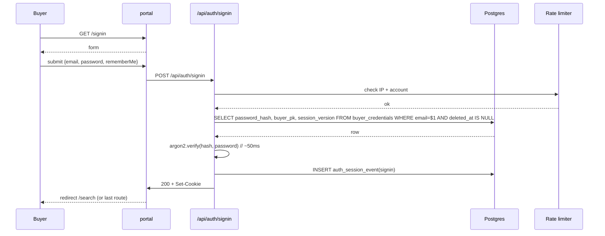

# 개발지시서 — Buyer Auth (이메일/비밀번호 + API key 이중 모델)

> **Status**: Draft v0.1 · **Feature slug**: `buyer-auth` · **Last updated**: 2026-04-25
> **작성자**: @planner (Claude Opus 4.7) · **근거**: [`docs/research/buyer-auth-research.md`](../research/buyer-auth-research.md) (569 줄, v0.1 2026-04-25), [`docs/prd.md`](../prd.md), [`docs/ARCHITECTURE.md`](../ARCHITECTURE.md) §3 Zone 3 / §9 기술 스택
> **Supersedes**: [`docs/specs/dev-spec-portal-redesign.md`](./dev-spec-portal-redesign.md) §FR-BP-2 (Sign-in flow), §FR-BP-13 (Account API key 표시) — 본 spec 으로 대체. portal-redesign 의 두 섹션 끝에 본 spec 으로의 cross-reference 추가 권고 (별도 PR).

---

## 0. 컨텍스트 — 왜 이 spec 이 지금 필요한가

`portal-redesign` 분석 단계에서 buyer 인증 모델이 누락된 채 통과되었다. 현재 production 의 `/signin` 은 50자 raw API key (`rv_live_…`) 를 텍스트 입력 한 줄로 받는 구조이며, 이는 Stripe / Vercel / Linear / Notion / Hugging Face 등 동급 B2B SaaS 어디에도 없는 패턴이다 (researcher §0). CEO 데모 D-13 (2026-05-08) 무대에서 글로벌 AI 기업 의사결정자가 "production 인지" 즉시 의심할 위험이 매우 크다.

본 spec 은 **(a) 웹 포털 = email + password (Argon2id) self-serve 가입** + **(b) 프로그램 접근 = API key, /account 에서 reveal-once + revoke + 자동 재발급** 이중 모델로 재설계한다. 이는 researcher §2.5 의 universal B2B 패턴과 §9.1 의 12 개 FR 권고를 dev-spec 형식으로 정제한 것이다.

---

## 1. 기능 개요

RadiVault Buyer Portal 의 신규 인증 시스템. 웹 UI 는 **email + password** 로 self-serve 가입·로그인·비밀번호 재설정을 지원하고, 프로그램 접근(curl, SDK) 은 signup 직후 자동 발급되는 **API key** 1개로 처리한다. PIPA / NIST SP 800-63B Rev.4 / OWASP Argon2id (m=19 MiB, t=2, p=1) 표준을 v0.1 부터 충족한다.

---

## 2. 사용자 스토리

- **신규 buyer (As a global AI researcher)**, I want to sign up with my work email and a password without contacting sales, so that I can start searching the RadiVault catalog within 30 seconds. (researcher §8.1)
- **재방문 buyer (As a returning customer)**, I want to sign in with email + password and stay signed in for 30 days, so that I do not waste time re-authenticating each visit. (researcher §6.2)
- **프로그래매틱 접근 buyer (As an MLOps engineer)**, I want to copy a single API key from `/account` and use it in my CI pipeline `curl` commands, so that I can integrate RadiVault search into my training-data ingestion job. (researcher §8.3)
- **데모 시연자 (As Kyle, on stage at D-13)**, I want a one-line `BUYER_AUTH_SKIP_EMAIL_VERIFY=true` env to bypass email OTP delivery, so that the demo flows without an actual SES dependency. (researcher §8.4)
- **회원탈퇴 buyer (As a buyer who no longer needs the service)**, I want to delete my account from `/account`, so that my personal data is purged per PIPA §22 / GDPR Art.17.

---

## 3. 범위

### 3.1 포함 (In-scope, v0.1)

- `POST /api/auth/signup` — email + password + organization + intent + PIPA/ToS consent → buyer 생성 + 자동 API key 1개 발급 + iron-session cookie 발급.
- `POST /api/auth/signin` — email + password → Argon2id verify → iron-session cookie 발급.
- `POST /api/auth/signout` — iron-session destroy + audit log.
- `POST /api/auth/verify-email` + `POST /api/auth/resend-otp` — 6자리 email OTP (10 분 TTL, 3회 시도 제한).
- `POST /api/auth/password-reset/request` + `POST /api/auth/password-reset/confirm` — 32-byte token (60 분 TTL, 1회 사용).
- `DELETE /api/auth/account` — 회원탈퇴 (soft delete + 30일 grace + hard delete cron, PIPA §22).
- `GET /api/account/api-key` — 마스킹된 API key 메타데이터 (kid, last4, created, last_used).
- `POST /api/account/api-key` — API key 재발급 (revoke + new issue, 단일 키 모델 v0.1).
- 신규 DB 테이블: `buyer_credentials`, `email_verification_otp`, `password_reset_token`, `auth_session_event`.
- 한국어 모드 (`/ko/signup`, `/ko/signin`) — PIPA §15/§17/§28-8/정통망법 §50 동의 양식 4종 분리. (Q8 default YES, researcher §3.1)
- 데모 시연 모드: `BUYER_AUTH_SKIP_EMAIL_VERIFY=true`, `BUYER_AUTH_DEMO_SEED=true`. (Q1, Q5 default YES)
- Rate limit: signup 1/min/IP, signin 5/min/IP, OTP 발송 3/15min/account, password-reset 3/hour/IP. (Q10 default in-memory v0.1)
- audit trail (`auth_session_event`) — signup / signin / signout / signin_failed / password_reset / api_key_rotated / account_deleted 7 종.

### 3.2 제외 (Out-of-scope, v0.1)

- **SSO** (Google Workspace / GitHub / SAML / Okta) — v0.1.5 이후. (Q2 default 비포함)
- **다중 API key** — v0.1 은 buyer 당 단일 키. v0.2 에서 Hugging Face 식 다중 라벨 키. (Q3 default 단일)
- **API key rotate (grace period)** — v0.1 은 즉시 revoke + 즉시 신규 발급만. v0.1.5 에서 7일 grace period. (Q4 default 비포함)
- **SMS OTP / KISA 본인인증** — buyer 는 글로벌, 한국 hospital admin 용은 별도 spec. (researcher §4.4)
- **만 14세 미만 보호자 동의** — buyer = 법인 종사자 가정으로 면제. (researcher §3.1 F)
- **비밀번호 복잡도 강제** (대문자/숫자/특수문자) — NIST SP 800-63B Rev.4 권고 따라 길이만 강제 (8자 minimum). (researcher §5.2)
- **HaveIBeenPwned k-Anonymity 사전 검사** — v0.1.5 에 추가. v0.1 은 라이브러리 의존성 최소화.
- **Password strength meter (zxcvbn)** — UX 개선이지만 256KB 번들 부담. v0.1.5. (Q9 default 비사용)
- **"Forgot email" 계정 복구** — B2B 표준 = sales 문의. v0.1 비지원. (Q11)
- **2FA / TOTP** — ISMS-P 인증 시점 (Phase 3) 까지 비지원.
- **hospital admin SHA-256 → Argon2id 마이그레이션** — 별도 feature, v0.1.5. (Q7 default 별도)
- **결제·구독 / Stripe Billing 연동** — `/account` Billing 탭은 v0.2.

---

## 4. 기능 요구사항

> 각 FR 는 researcher §9.1 의 12 개 FR 을 dev-spec 형식으로 정제. 수용 기준은 §10 참조.

### FR-AUTH-1 — Buyer signup 폼 + API endpoint
**근거**: researcher §2.2, §8.1, §9.1 FR-AUTH-1·2.

- 화면: `/signup` (영문 default), `/ko/signup` (한국어).
- 폼 필드 (모두 required 표시는 §11 PIPA 처리에 따라 분리):
  - `email` — RFC 5322 검증, max 254 chars, citext UNIQUE 제약.
  - `password` — 8 ≤ len ≤ 64, NIST 복잡도 강제 없음.
  - `organization` — max 200 chars, 자유 입력.
  - `intent` — enum {`research`, `commercial-ai`, `clinical-trial`, `other`} 라디오. PRD tier 매핑 근거.
  - `tosPrivacyConsent` — required boolean (영문 페이지 1체크박스 = ToS + Privacy 1쌍).
  - `pipaConsents` — 한국어 페이지에서만 노출. 객체 `{collectUse: bool, thirdParty: bool, crossBorder: bool, marketing: bool}`. 앞 3 필수, marketing 선택. (§11.1 참조)
  - `marketingEmailOptIn` — 영문 페이지 선택 boolean (default unchecked). (Q6 default 노출)
- 백엔드 동작 (FR-AUTH-1 endpoint = `POST /api/auth/signup`):
  1. zod schema 검증 (실패 → `ERR_VALIDATION` 400).
  2. `buyer_credentials.email` UNIQUE 충돌 시 `ERR_EMAIL_TAKEN` 409.
  3. Argon2id 해싱 (m=19456, t=2, p=1, salt=16B). 평균 ~50ms.
  4. transaction:
     - INSERT `buyer` (existing schema, organization·intent 추가 컬럼).
     - INSERT `buyer_credentials`.
     - INSERT `buyer_api_key` (auto-issued, label='default', tier='preview').
     - INSERT `auth_session_event` (event_type=`signup`).
  5. iron-session cookie 발급 (§FR-AUTH-7 payload).
  6. (skip-flag false 시) 백그라운드 OTP 발송 (§FR-AUTH-2).
  7. response: `{buyerId, email, apiKeyRevealOnce: '<full key string>'}` — `apiKeyRevealOnce` 는 응답 1회만 평문 노출, 이후 server 어디에도 평문 보관 금지.
- Rate limit: 1/min/IP (signup spam 방지).
- response time SLO: p95 < 500ms (Argon2 50ms + DB 3 INSERT + cookie sign).

### FR-AUTH-2 — Email OTP verification + skip-flag
**근거**: researcher §4.2, §8.4, §9.1 FR-AUTH-9.

- OTP: 6자리 숫자 (000000–999999), `crypto.randomInt`. TTL 10 분.
- DB: `email_verification_otp` 테이블 (otp_hash = SHA-256(otp + buyer_pk salt)).
- 발송 채널: production = AWS SES `noreply@radivault.io`, dev/demo = stdout JSON log (`[OTP DEV] buyer=bd_xxx code=123456`).
- ENV `BUYER_AUTH_SKIP_EMAIL_VERIFY=true` 시:
  - signup 직후 `buyer_credentials.email_verified_at = NOW()` 자동 설정.
  - `/api/auth/verify-email` 호출은 200 + no-op.
  - OTP 행 INSERT 자체 생략.
- API:
  - `POST /api/auth/verify-email` body `{email, otp}` → success `{verifiedAt}`. 실패 시 `ERR_OTP_INVALID` (잘못된 코드) / `ERR_OTP_EXPIRED` (만료) / `ERR_OTP_LOCKED` (3회 초과).
  - `POST /api/auth/resend-otp` body `{email}` → 항상 200 (계정 존재 누설 방지).
- Resend rate limit: 3/15min/account (DB row count check).
- 시도 제한: `email_verification_otp.attempts >= 3` → 행 invalidate, 새 OTP 요구.
- UI 동선: signup 직후 dashboard 진입 가능 (검색 자유). 단 `/orders/new` (실제 주문) 진입 시 `email_verified_at IS NULL` 이면 `/verify` 로 redirect. (researcher §2.7 Stripe 모델)

### FR-AUTH-3 — Password 정책
**근거**: researcher §5.1, §5.2.

- 해싱: Argon2id, npm `argon2` 패키지 (`hash-wasm` 백엔드).
- 파라미터: `m=19456 (19 MiB), t=2, p=1, hashLength=32, saltLength=16`. encoded string 으로 `password_hash` 컬럼에 저장 (`$argon2id$v=19$m=19456,t=2,p=1$<salt>$<hash>`).
- 길이: 8 ≤ len ≤ 64. zod regex 강제.
- 복잡도: 강제 없음. 단 frontend tooltip "긴 패스프레이즈 권장" (zxcvbn meter 는 v0.1.5).
- 평문은 어디에도 저장·로깅·response 금지. zod parsing 직후 hashing, 이후 즉시 GC.
- 변경 시 모든 활성 iron-session 무효화 (§FR-AUTH-7 sessionVersion 증분).

### FR-AUTH-4 — Signin 폼 + endpoint
**근거**: researcher §2.3, §5.4, §9.1 FR-AUTH-3·4.

- 화면: `/signin` (영문), `/ko/signin` (한국어).
- 폼 필드:
  - `email`
  - `password`
  - `rememberMe` — checkbox (default checked, v0.1 은 항상 30일 sliding 적용 — §FR-AUTH-7).
- Hidden 링크: "Forgot password?" → `/password-reset`, "Don't have an account? Sign up" → `/signup`, "Sign in with API key (deprecated)" → `/signin/legacy` (§12 backwards-compat).
- 백엔드 (`POST /api/auth/signin`):
  1. zod 검증.
  2. `SELECT password_hash, buyer_pk FROM buyer_credentials WHERE email = $1`.
  3. 행 없음 → Argon2 dummy hash verify (timing-safe) + `ERR_AUTH_INVALID` 401.
  4. `argon2.verify(hash, password)` 실패 → `ERR_AUTH_INVALID` 401, `auth_session_event` event_type=`signin_failed` INSERT.
  5. 성공 → iron-session 발급, event_type=`signin` INSERT.
- Rate limit: 5/min/IP, 10/hour/account. 초과 시 `ERR_RATE_LIMITED` 429 + 1분 락아웃.
- response time SLO: p95 < 200ms (Argon2 verify 50ms + DB SELECT 5ms + cookie sign 5ms + buffer).

### FR-AUTH-5 — Signout
**근거**: researcher §6.4.

- `POST /api/auth/signout`:
  1. `session.destroy()` (iron-session sealed cookie 무효화).
  2. `auth_session_event` event_type=`signout` INSERT.
  3. response 200 `{redirect: '/'}`.
- v0.1: 현재 디바이스만 로그아웃 (cookie destroy).
- v0.1.5: server-side session table 도입 시 `revoke all sessions` 옵션 추가.

### FR-AUTH-6 — Password reset
**근거**: researcher §5.3, §9.1 FR-AUTH-6.

- 화면: `/password-reset` (이메일 입력) + `/password-reset/confirm?token=…` (새 비밀번호 2회 입력).
- 백엔드:
  - `POST /api/auth/password-reset/request` body `{email}`:
    1. **항상 200 응답** (계정 존재 누설 방지, B2B 표준).
    2. 계정 존재 시: `crypto.randomBytes(32).toString('base64url')` → token 생성. `password_reset_token` 행 INSERT (token_hash = SHA-256(token), expires_at = NOW() + 60min).
    3. 이메일 발송 (or stdout in dev): URL = `https://portal.radivault.io/password-reset/confirm?token=<base64url>`.
    4. Rate limit: 3/hour/IP, 3/hour/account.
  - `POST /api/auth/password-reset/confirm` body `{token, newPassword}`:
    1. SHA-256(token) 으로 `password_reset_token` lookup.
    2. 미존재 / 만료 / 사용됨 → `ERR_TOKEN_INVALID` 400.
    3. password 정책 검증 (FR-AUTH-3).
    4. transaction: Argon2 재해싱 + `password_hash` 갱신 + `password_reset_token.used_at = NOW()` + `auth_session_event` event_type=`password_reset` + sessionVersion 증분 (모든 활성 세션 invalidate).
    5. response 200.

### FR-AUTH-7 — Session 모델
**근거**: researcher §6.

- 라이브러리: iron-session v8 (이미 portal 도입, 변경 없음).
- 신규 BuyerSession payload:
  ```ts
  {
    buyerId: string,        // 'bd_' + cuid2
    email: string,           // audit 표시용
    signedInAt: number,      // epoch ms (sliding 갱신)
    emailVerified: boolean,
    sessionVersion: number,  // password 변경/account delete 시 증분
    locale: 'en' | 'ko',
    // apiKey 평문은 절대 cookie 에 보관 금지
  }
  ```
- TTL: **sliding 24h + absolute 30d**. (researcher §6.2 Stripe·Vercel 모델 30d sliding 권고했으나, 데모 D-13 보안 마진 위해 sliding 24h 로 보수적 채택. Q (§15) 에 변경 가능 표시.)
- middleware: 매 요청마다 `session.signedInAt = Date.now()` 갱신, absolute 30d 초과 시 `session.destroy()` + `/signin` redirect.
- `sessionVersion` 검증: 매 요청마다 DB `buyer_credentials.session_version` 과 비교, 불일치 시 destroy.
- API key 처리: 세션 → `buyerId` → `SELECT token_hash, kid FROM buyer_api_key WHERE buyer_pk = $1 AND revoked_at IS NULL` (server-side), 검색 API 호출 시 server 가 raw key 를 reconstruct 할 필요 없이 `kid` + HMAC 으로 search BFF 에 위임. **세션 유출 ≠ API key 평문 유출** 분리 원칙 (researcher §6.1).

### FR-AUTH-8 — `/account` API key reveal-once + revoke + 자동 재발급
**근거**: researcher §7.2, §7.3, §7.4 옵션 A (Q3 default 단일).

- 화면: `/account` 의 "API Keys" 섹션 (탭 또는 단일 페이지 — design-spec 결정).
- v0.1 단일 키 모델:
  - signup 직후 자동 1개 발급, label='default', tier='preview'.
  - UI 표시: `kid`, masked (`rv_live_K8dF…3xQ2` — first 11 + ellipsis + last 4), Created, Last used, Tier.
  - Buttons: `[Reveal once]` (signup 직후 1회만, session flag), `[Regenerate]`, `[Revoke]`.
- API:
  - `GET /api/account/api-key` → `{kid, masked, createdAt, lastUsedAt, tier}` (평문 절대 미노출).
  - `POST /api/account/api-key` body `{action: 'regenerate' | 'revoke'}`:
    - `regenerate`: transaction = 기존 `buyer_api_key.revoked_at = NOW()` + 신규 row INSERT. response `{kid, masked, plaintext: '<one-time>'}`.
    - `revoke`: `revoked_at = NOW()`. response `{kid, status: 'revoked'}`. **buyer 가 검색 API 호출 불가능 상태**, UI 에서 "Generate new key" CTA 노출.
  - 모든 action → `auth_session_event` event_type=`api_key_rotated` / `api_key_revoked`.
- Reveal-once 구현: signup `apiKeyRevealOnce` response 를 frontend 가 sessionStorage 에 잠시 보관 후 모달 표시 → 모달 close 시 sessionStorage clear. 새로고침 시 reveal 불가.
- Rate limit: regenerate 3/hour/buyer.

### FR-AUTH-9 — PIPA 동의 양식 (한국어 페이지)
**근거**: researcher §3.1, §3.2, §3.3.

- 적용 페이지: `/ko/signup` (한국어 모드 v0.1 포함, Q8 default YES).
- 분리 노출 (각 섹션 펼침/접기 모달, 단독 체크박스):
  - **A. 개인정보 수집·이용 동의 (PIPA §15)** — 필수, default unchecked.
    - 항목: 이메일, 비밀번호 (Argon2id 해시), 기관명, 직책, 이용 의도.
    - 목적: 의료영상 데이터 검색·주문 서비스 제공, 부정사용 방지.
    - 보유: 회원 탈퇴 시까지 (전자상거래법 5년 보존 의무 별도).
    - 거부 시: 회원가입 제한.
  - **B. 개인정보 제3자 제공 동의 (PIPA §17)** — 필수 (서비스 본질), default unchecked.
    - 제공받는 자: 한국 협력 병원 admin (hospital metadata 매칭 시).
    - 제공 항목: 기관명, 이용 의도.
    - 거부 시: 검색 결과의 hospital metadata 제외.
  - **C. 개인정보 국외이전 동의 (PIPA §28-8)** — 필수 (RadiVault 핵심), default unchecked.
    - 이전 국가: 미국 (AWS us-east-1), 유럽 (AWS eu-west-1).
    - 이전 항목: 이메일, 기관명, 검색 로그.
    - 거부 시: 회원가입 제한.
  - **D. 광고성 정보 수신 동의 (정통망법 §50)** — 선택, 채널별 분리 (이메일/SMS — v0.1 은 이메일만), default unchecked.
    - 거부 시: 가입 가능 (위반 시 최대 3천만원 과태료, researcher §3.1 E).
- "전체 동의" 체크박스 허용. 단 각 항목 요약을 펼침/모달로 확인 가능.
- 동의 철회 경로: `/account` → "동의 관리" 링크 (v0.1 은 stub, v0.1.5 구현).
- 위탁 (PIPA §22) 통지: privacy policy 페이지에 "AWS, Datadog, AWS SES" 등 명시 (별도 동의 불요).

### FR-AUTH-10 — Marketing email opt-in
**근거**: researcher §3.4, §10 Q6 default YES.

- 영문 `/signup` 폼: `[ ] Send me product updates and marketing emails (optional)` — default unchecked.
- 한국어 `/ko/signup`: §FR-AUTH-9 의 항목 D 와 동일.
- DB: `buyer_credentials.marketing_email_opt_in BOOLEAN NOT NULL DEFAULT FALSE`.
- opt-out 경로:
  - `/account` 의 "Communication preferences" 토글.
  - 모든 마케팅 이메일 푸터 unsubscribe 링크 (별도 마케팅 시스템 — v0.1 stub).
- audit: opt-in/opt-out 변경 시 `auth_session_event` event_type=`marketing_pref_changed` INSERT.

### FR-AUTH-11 — 회원탈퇴
**근거**: PIPA §22, GDPR Art.17.

- UI: `/account` 하단 "Danger zone" → "Delete account" 버튼 → 확인 모달 ("type your email to confirm").
- API: `DELETE /api/auth/account` body `{emailConfirmation}`:
  1. session 의 email 과 body emailConfirmation 일치 확인.
  2. **Soft delete (즉시)**:
     - `buyer_credentials.deleted_at = NOW()`, email = `deleted-{buyer_pk}@radivault.invalid` (UNIQUE 제약 회피 + 동일 이메일 재가입 허용).
     - `buyer_api_key.revoked_at = NOW()` (모든 키).
     - session destroy.
     - `auth_session_event` event_type=`account_deleted`.
  3. **30일 grace + hard delete (cron)**:
     - 별도 cron job (v0.1.5 구현, v0.1 은 spec 만 명시): 30일 경과한 soft-deleted buyer 의 `buyer_credentials`, `email_verification_otp`, `password_reset_token`, `auth_session_event` row 모두 hard delete.
     - `buyer` 테이블의 검색 audit (`search_audit`) 는 PIPA 익명정보 처리 후 보관 (별도 spec).
  4. response 200 `{redirect: '/', deletedAt}`.
- 30일 grace 내 동일 이메일로 재가입 시도 → "이전 계정이 삭제 처리 중입니다. 30일 후 재가입 가능합니다." 메시지 (또는 customer support 안내).

### FR-AUTH-12 — 데모 시연 모드 (skip-flag + seed)
**근거**: researcher §8.4, Q1·Q5 default YES.

- ENV (docker-compose.demo.yml):
  - `BUYER_AUTH_SKIP_EMAIL_VERIFY=true` — signup 직후 verified=true, OTP 행 미생성.
  - `BUYER_AUTH_PWD_RESET_DISABLED=true` — `/password-reset` 진입 시 "Demo mode: password reset disabled" 토스트.
  - `BUYER_AUTH_DEMO_SEED=true` — 컨테이너 startup 시 seed script 실행.
- Seed script: `scripts/seed_demo_buyer.py` (별도 PR):
  - buyer: email=`demo@radivault.io`, password=`Demo1234!`, organization=`Acme AI Inc.`, intent=`commercial-ai`.
  - buyer_api_key: tier=`preview`, label=`default`.
  - 이미 존재 시 idempotent (UPDATE).
- 데모 안전망:
  - 시연 시 "live signup" (Q1 default YES) 도 가능 — `BUYER_AUTH_SKIP_EMAIL_VERIFY=true` 덕에 OTP 발송 의존성 없음.
  - 백업 = `demo@radivault.io` 로 sign-in 시연.
- production 환경에서 위 ENV 모두 false 강제 (deploy 시점 검증 — `infra/check-env-prod.sh`).

---

## 5. 비기능 요구사항

| 항목 | 요구 | 측정 방법 |
|---|---|---|
| **성능 — signup** | p95 < 500ms (Argon2 50ms + DB 3 INSERT + cookie sign) | k6 부하 테스트 100 RPS / 1min |
| **성능 — signin** | p95 < 200ms | k6 100 RPS / 1min |
| **성능 — Argon2 메모리** | 컨테이너 memory budget +20 MiB peak (m=19 MiB × 동시 1개 가정) | docker stats during k6 |
| **보안 — 비밀번호 평문 저장** | 0 건. 코드·로그·DB·메트릭·session 어디에도 평문 흔적 금지 | grep audit + DB sample query 검사 (@qa) |
| **보안 — 비밀번호 해싱** | Argon2id m=19456 t=2 p=1 saltLength=16 hashLength=32 | DB row 파라미터 파싱 검사 |
| **보안 — Rate limit** | signup 1/min/IP, signin 5/min/IP, OTP 3/15min/account, password-reset 3/hour/IP | k6 burst test |
| **보안 — Session 만료** | sliding 24h, absolute 30d | iron-session config + middleware unit test |
| **보안 — TLS** | 모든 endpoint TLS 1.2+ 강제 (Cloudflare edge) | SSL Labs A+ |
| **보안 — Cookie** | HttpOnly, Secure, SameSite=Lax, prefix `__Host-` | curl -I 검사 |
| **가용성** | 99.9% uptime (excluding planned maintenance) | Datadog synthetic / monthly |
| **로깅·감사** | 모든 인증 event 가 `auth_session_event` 에 기록 (event_type 7종) | DB row count vs k6 invocation count |
| **국제화 (i18n)** | EN + KR 페이지, locale routing (`/ko/...`), 모든 user-facing 문자열 i18n key 추출 | i18n key coverage report |
| **접근성 (a11y)** | WCAG 2.1 AA — form label-input 페어, focus order, error message ARIA-live, contrast ratio ≥ 4.5:1 | axe-core CI |
| **법적 — PIPA 동의** | 한국어 페이지에 §15/§17/§28-8/정통망법 §50 4종 분리 (FR-AUTH-9) | manual review by Kyle + 변호사 자문 (§11) |
| **데이터 보존** | soft delete 즉시 + 30일 grace + hard delete (FR-AUTH-11). PIPA §22 grace period 명시 | cron job log + DB row count 검사 |

---

## 6. 데이터 모델

### 6.1 ER 다이어그램 (mermaid)

```mermaid
erDiagram
    buyer ||--o| buyer_credentials : has
    buyer ||--o{ buyer_api_key : owns
    buyer ||--o{ email_verification_otp : pending
    buyer ||--o{ password_reset_token : pending
    buyer ||--o{ auth_session_event : audit

    buyer {
        text buyer_pk PK
        text organization
        text intent
        text country
        timestamptz created_at
        timestamptz updated_at
    }

    buyer_credentials {
        text buyer_pk PK_FK
        citext email UK
        text password_hash
        timestamptz email_verified_at
        boolean marketing_email_opt_in
        int session_version
        jsonb pipa_consents
        text consent_terms_version
        timestamptz deleted_at
        timestamptz created_at
        timestamptz updated_at
    }

    buyer_api_key {
        text kid PK
        text buyer_pk FK
        text token_hash
        text label
        text tier
        timestamptz created_at
        timestamptz last_used_at
        timestamptz revoked_at
    }

    email_verification_otp {
        bigserial id PK
        text buyer_pk FK
        text otp_hash
        timestamptz expires_at
        int attempts
        timestamptz consumed_at
        timestamptz created_at
    }

    password_reset_token {
        bigserial id PK
        text buyer_pk FK
        text token_hash UK
        timestamptz expires_at
        timestamptz used_at
        timestamptz created_at
    }

    auth_session_event {
        bigserial id PK
        text buyer_pk FK
        text event_type
        text ip
        text user_agent
        jsonb metadata
        timestamptz created_at
    }
```

### 6.2 신규/변경 테이블 정의

> 위치: **central DB** (`radivault_central` schema, 기존 `buyer`/`buyer_api_key` 와 동일 DB). 별도 DB 분리는 v0.2 multi-region 시 재검토. (근거: 기존 `bootstrap_search_tables.sql` 와 join 단순성, FR-INF-1 commit 4400b70.)

```sql
-- 6.2.1 buyer (기존 테이블, 컬럼 추가 ALTER)
ALTER TABLE buyer
  ADD COLUMN organization TEXT,
  ADD COLUMN intent TEXT CHECK (intent IN ('research','commercial-ai','clinical-trial','other')),
  ADD COLUMN country TEXT;

-- 6.2.2 buyer_credentials (신규)
CREATE EXTENSION IF NOT EXISTS citext;
CREATE TABLE buyer_credentials (
  buyer_pk TEXT PRIMARY KEY REFERENCES buyer(buyer_pk) ON DELETE CASCADE,
  email CITEXT NOT NULL UNIQUE,
  password_hash TEXT NOT NULL,
  email_verified_at TIMESTAMPTZ NULL,
  marketing_email_opt_in BOOLEAN NOT NULL DEFAULT FALSE,
  session_version INT NOT NULL DEFAULT 1,
  pipa_consents JSONB NOT NULL DEFAULT '{}'::jsonb,  -- {collectUse, thirdParty, crossBorder, marketing} ts
  consent_terms_version TEXT NOT NULL,                 -- 'tos-v1.0', 'privacy-v1.0'
  deleted_at TIMESTAMPTZ NULL,
  created_at TIMESTAMPTZ NOT NULL DEFAULT NOW(),
  updated_at TIMESTAMPTZ NOT NULL DEFAULT NOW()
);
CREATE INDEX idx_buyer_credentials_email ON buyer_credentials(email) WHERE deleted_at IS NULL;
CREATE INDEX idx_buyer_credentials_deleted ON buyer_credentials(deleted_at) WHERE deleted_at IS NOT NULL;

-- 6.2.3 buyer_api_key (기존, 컬럼 추가)
ALTER TABLE buyer_api_key
  ADD COLUMN label TEXT NOT NULL DEFAULT 'default',
  ADD COLUMN last_used_at TIMESTAMPTZ NULL;
-- 기존 token_hash, kid, tier, revoked_at, created_at 그대로 유지.

-- 6.2.4 email_verification_otp (신규)
CREATE TABLE email_verification_otp (
  id BIGSERIAL PRIMARY KEY,
  buyer_pk TEXT NOT NULL REFERENCES buyer(buyer_pk) ON DELETE CASCADE,
  otp_hash TEXT NOT NULL,             -- SHA-256(otp + salt)
  expires_at TIMESTAMPTZ NOT NULL,
  attempts INT NOT NULL DEFAULT 0,
  consumed_at TIMESTAMPTZ NULL,
  created_at TIMESTAMPTZ NOT NULL DEFAULT NOW()
);
CREATE INDEX idx_otp_buyer_active ON email_verification_otp(buyer_pk, expires_at)
  WHERE consumed_at IS NULL;

-- 6.2.5 password_reset_token (신규)
CREATE TABLE password_reset_token (
  id BIGSERIAL PRIMARY KEY,
  buyer_pk TEXT NOT NULL REFERENCES buyer(buyer_pk) ON DELETE CASCADE,
  token_hash TEXT NOT NULL UNIQUE,    -- SHA-256(token)
  expires_at TIMESTAMPTZ NOT NULL,
  used_at TIMESTAMPTZ NULL,
  created_at TIMESTAMPTZ NOT NULL DEFAULT NOW()
);
CREATE INDEX idx_pwd_reset_active ON password_reset_token(buyer_pk, expires_at)
  WHERE used_at IS NULL;

-- 6.2.6 auth_session_event (신규)
CREATE TABLE auth_session_event (
  id BIGSERIAL PRIMARY KEY,
  buyer_pk TEXT NULL REFERENCES buyer(buyer_pk) ON DELETE SET NULL,  -- signup_failed 시 NULL
  event_type TEXT NOT NULL CHECK (event_type IN (
    'signup','signin','signout','signin_failed',
    'email_verified','password_reset','api_key_rotated','api_key_revoked',
    'marketing_pref_changed','account_deleted'
  )),
  ip TEXT,
  user_agent TEXT,
  metadata JSONB,
  created_at TIMESTAMPTZ NOT NULL DEFAULT NOW()
);
CREATE INDEX idx_auth_event_buyer_time ON auth_session_event(buyer_pk, created_at DESC);
CREATE INDEX idx_auth_event_type_time ON auth_session_event(event_type, created_at DESC);
```

### 6.3 마이그레이션 스크립트

- 파일: `central/db/migrations/0007_buyer_auth.sql` (다음 가용 번호 — developer 가 확인).
- 순서: ALTER buyer → CREATE EXTENSION citext → CREATE buyer_credentials → ALTER buyer_api_key → CREATE 3 신규 테이블.
- 롤백: `central/db/migrations/0007_buyer_auth.down.sql` (DROP 역순).
- 기존 데이터: 현재 buyer 행이 이미 존재하면 (FR-INF-1 commit 4400b70 의 seed) `buyer_credentials` row 가 없는 상태로 시작. signin 시도 시 "Migrate to email/password — 임시 패스워드 발급" 마이그 페이지 노출 (§12).

---

## 7. API 계약

> 모든 endpoint base = `https://portal.radivault.io/api`. 응답은 `application/json`. error response 공통 형식: `{error: {code: 'ERR_*', message: 'human-readable', field?: 'name'}}`.

### 7.1 POST /api/auth/signup

```
Request:
  Content-Type: application/json
  {
    "email": "alice@acme.ai",
    "password": "correct-horse-battery-staple",
    "organization": "Acme AI Inc.",
    "intent": "commercial-ai",
    "tosPrivacyConsent": true,
    "marketingEmailOptIn": false,
    "pipaConsents": null,           // 영문 페이지 = null
    "locale": "en"
  }

Response 201:
  Set-Cookie: __Host-buyer_session=<sealed>; HttpOnly; Secure; SameSite=Lax; Path=/
  {
    "buyerId": "bd_01HK...",
    "email": "alice@acme.ai",
    "emailVerified": false,
    "apiKeyRevealOnce": "rv_live_K8dF7sX9aB2cD4eF6gH8iJ0kL2mN4oP6qR8sT0uV2wX3xQ2",
    "apiKeyKid": "rv_live_K8dF...",
    "next": "/search"
  }

Errors:
  400 ERR_VALIDATION       — zod 실패 (field 명시)
  409 ERR_EMAIL_TAKEN      — 이메일 중복
  409 ERR_EMAIL_RECENTLY_DELETED  — 30일 grace 미경과
  429 ERR_RATE_LIMITED     — 1/min/IP 초과
  500 ERR_INTERNAL
```

### 7.2 POST /api/auth/signin

```
Request:
  {
    "email": "alice@acme.ai",
    "password": "correct-horse-battery-staple",
    "rememberMe": true
  }

Response 200:
  Set-Cookie: __Host-buyer_session=<sealed>; ...
  {
    "buyerId": "bd_01HK...",
    "email": "alice@acme.ai",
    "emailVerified": true,
    "next": "/search"
  }

Errors:
  400 ERR_VALIDATION
  401 ERR_AUTH_INVALID    — email/password 불일치 (timing-safe)
  423 ERR_ACCOUNT_LOCKED  — 10/hour/account 초과 (15분 락아웃)
  429 ERR_RATE_LIMITED    — 5/min/IP 초과
```

### 7.3 POST /api/auth/signout

```
Request: (empty body, cookie 필요)
Response 200:
  Set-Cookie: __Host-buyer_session=; Max-Age=0
  {"redirect": "/"}
```

### 7.4 POST /api/auth/verify-email

```
Request:
  {"email": "alice@acme.ai", "otp": "123456"}

Response 200:
  {"verifiedAt": "2026-04-25T12:34:56Z"}

Errors:
  400 ERR_OTP_INVALID     — 코드 불일치
  400 ERR_OTP_EXPIRED     — TTL 초과
  423 ERR_OTP_LOCKED      — 3회 시도 초과
  404 ERR_BUYER_NOT_FOUND
```

### 7.5 POST /api/auth/resend-otp

```
Request:
  {"email": "alice@acme.ai"}

Response 200:  (항상 200, 계정 존재 누설 방지)
  {"sent": true}

Errors:
  429 ERR_RATE_LIMITED    — 3/15min/account
```

### 7.6 POST /api/auth/password-reset/request

```
Request:
  {"email": "alice@acme.ai"}

Response 200:  (항상 200)
  {"sent": true}

Errors:
  429 ERR_RATE_LIMITED    — 3/hour/IP
```

### 7.7 POST /api/auth/password-reset/confirm

```
Request:
  {"token": "<base64url>", "newPassword": "<8..64>"}

Response 200:
  {"reset": true, "redirect": "/signin"}

Errors:
  400 ERR_VALIDATION
  400 ERR_TOKEN_INVALID   — 미존재/만료/사용됨
```

### 7.8 DELETE /api/auth/account

```
Request:
  Cookie: __Host-buyer_session=...
  {"emailConfirmation": "alice@acme.ai"}

Response 200:
  Set-Cookie: __Host-buyer_session=; Max-Age=0
  {"deletedAt": "...", "hardDeleteAt": "...", "redirect": "/"}

Errors:
  400 ERR_VALIDATION       — emailConfirmation 불일치
  401 ERR_UNAUTHORIZED     — 세션 없음
```

### 7.9 GET /api/account/api-key

```
Request:
  Cookie: __Host-buyer_session=...

Response 200:
  {
    "kid": "rv_live_K8dF...",
    "masked": "rv_live_K8dF…3xQ2",
    "label": "default",
    "tier": "preview",
    "createdAt": "...",
    "lastUsedAt": "..."
  }

Errors:
  401 ERR_UNAUTHORIZED
  404 ERR_NO_ACTIVE_KEY    — revoke 후 미발급 상태
```

### 7.10 POST /api/account/api-key

```
Request:
  Cookie: __Host-buyer_session=...
  {"action": "regenerate"}   // or "revoke"

Response 200 (regenerate):
  {
    "kid": "rv_live_NEW...",
    "masked": "rv_live_NEW…aB12",
    "plaintext": "rv_live_NEW...",   // one-time
    "tier": "preview"
  }

Response 200 (revoke):
  {"kid": "rv_live_K8dF...", "status": "revoked"}

Errors:
  400 ERR_VALIDATION       — action 값 부정
  401 ERR_UNAUTHORIZED
  429 ERR_RATE_LIMITED     — 3/hour/buyer
```

### 7.11 공통 에러 코드 표

| code | HTTP | 의미 |
|---|---|---|
| `ERR_VALIDATION` | 400 | zod schema 실패 (field 포함) |
| `ERR_AUTH_INVALID` | 401 | 자격 증명 불일치 |
| `ERR_UNAUTHORIZED` | 401 | session 무효 |
| `ERR_EMAIL_TAKEN` | 409 | signup 중복 |
| `ERR_EMAIL_RECENTLY_DELETED` | 409 | 30일 grace 내 |
| `ERR_OTP_INVALID` | 400 | OTP 코드 오류 |
| `ERR_OTP_EXPIRED` | 400 | OTP TTL 초과 |
| `ERR_OTP_LOCKED` | 423 | OTP 3회 시도 초과 |
| `ERR_TOKEN_INVALID` | 400 | password reset token 무효 |
| `ERR_RATE_LIMITED` | 429 | rate limit 초과 |
| `ERR_ACCOUNT_LOCKED` | 423 | signin 10/hour/account 초과 |
| `ERR_BUYER_NOT_FOUND` | 404 | buyer row 미존재 |
| `ERR_NO_ACTIVE_KEY` | 404 | revoke 후 미발급 |
| `ERR_INTERNAL` | 500 | 서버 오류 |

---

## 8. 시퀀스·플로우

### 8.1 Signup happy path (mermaid)

```mermaid
sequenceDiagram
    autonumber
    participant U as Buyer (Browser)
    participant FE as Next.js portal
    participant BFF as /api/auth/signup
    participant DB as Postgres central
    participant SES as AWS SES (or stdout)

    U->>FE: GET /signup
    FE-->>U: signup form (zod schema)
    U->>FE: submit {email, password, org, intent, consents}
    FE->>BFF: POST /api/auth/signup
    BFF->>BFF: zod validate
    BFF->>DB: SELECT 1 FROM buyer_credentials WHERE email=$1
    DB-->>BFF: 0 rows
    BFF->>BFF: argon2.hash(password)  // ~50ms
    BFF->>DB: BEGIN; INSERT buyer; INSERT buyer_credentials; INSERT buyer_api_key; INSERT auth_session_event(signup); COMMIT
    DB-->>BFF: ok
    alt BUYER_AUTH_SKIP_EMAIL_VERIFY=false
      BFF->>DB: INSERT email_verification_otp
      BFF->>SES: send OTP (or stdout log)
    end
    BFF->>FE: 201 + Set-Cookie + apiKeyRevealOnce
    FE->>FE: stash apiKeyRevealOnce in sessionStorage
    FE-->>U: redirect /search + reveal-once modal trigger
```

### 8.2 Signin happy path



### 8.3 Password reset flow

```mermaid
sequenceDiagram
    participant U as Buyer
    participant FE as portal
    participant BFF as API
    participant DB as Postgres
    participant SES as Email

    U->>FE: GET /password-reset
    U->>FE: submit {email}
    FE->>BFF: POST /api/auth/password-reset/request
    BFF->>DB: SELECT buyer_pk WHERE email=$1
    alt row exists
      BFF->>BFF: token = randomBytes(32)
      BFF->>DB: INSERT password_reset_token (token_hash, expires_at=NOW+60min)
      BFF->>SES: send link with ?token=...
    end
    BFF-->>FE: 200 (always)
    FE-->>U: "Check your email"

    Note over U,SES: ...later...

    U->>FE: GET /password-reset/confirm?token=...
    U->>FE: submit {newPassword}
    FE->>BFF: POST /api/auth/password-reset/confirm
    BFF->>DB: SELECT WHERE token_hash=SHA256(token) AND used_at IS NULL AND expires_at>NOW
    DB-->>BFF: row
    BFF->>BFF: argon2.hash(newPassword)
    BFF->>DB: BEGIN; UPDATE password_hash; UPDATE used_at; INCR session_version; INSERT event; COMMIT
    BFF-->>FE: 200
    FE-->>U: redirect /signin
```

### 8.4 API key reveal-once + regenerate

```mermaid
sequenceDiagram
    participant U as Buyer
    participant FE as /account
    participant BFF as /api/account/api-key
    participant DB as Postgres

    Note over U,FE: case 1 — signup 직후 reveal-once
    FE->>FE: read apiKeyRevealOnce from sessionStorage
    FE-->>U: modal "Copy your API key now"
    U->>FE: close modal
    FE->>FE: sessionStorage.removeItem

    Note over U,DB: case 2 — regenerate
    U->>FE: click [Regenerate]
    FE->>BFF: POST {action:'regenerate'}
    BFF->>DB: BEGIN; UPDATE old key revoked_at; INSERT new buyer_api_key; INSERT event; COMMIT
    BFF-->>FE: {plaintext, kid, masked}
    FE-->>U: modal "New key — copy now"
```

---

## 9. 의존성

### 9.1 라이브러리 (npm)

- **`argon2`** (^0.41.x) — Argon2id 해싱. native binding (node-pre-gyp). 데모 빌드는 미리 cache. 대안: `hash-wasm` 순수 WASM (cold start ~80ms). 결정 = `argon2` native (제안, Q §15).
- **`iron-session`** (^8.x) — 이미 portal 사용 중. 변경 없음.
- **`zod`** (^3.x) — 이미 사용 중.
- **`@noble/hashes`** (^1.x) — SHA-256 (OTP/token hashing). 이미 사용 중.
- **`@aws-sdk/client-ses`** (^3.x) — production 이메일 발송. dev/demo 는 미사용 (stdout).
- **`@paralleldrive/cuid2`** (^2.x) — buyer_pk / kid 생성. 이미 사용 중.

### 9.2 외부 서비스

- **AWS SES** — production OTP / password reset 이메일. domain `radivault.io` SES verified 필요 (별도 infra task). dev/demo 는 의존성 없음 (skip-flag + stdout).
- **(미래) Upstash Redis** — v0.1.5 rate limit 저장소. v0.1 은 in-memory (Next.js middleware Map). multi-instance deploy 시 한계 있으나 데모 D-13 단일 컨테이너로 회피.

### 9.3 인프라 / 데이터

- **Postgres central** (기존). citext extension 활성화 필요.
- **Cloudflare** — `__Host-` cookie prefix 강제 위해 TLS termination 필수.

### 9.4 선행 기능

- `dev-spec-buyer-portal-demo.md` 의 BFF 인증 (50자 API key 페이스트) — 본 spec 으로 supersede. 단 backwards-compat 위해 `/signin/legacy` (deprecated, 90일 후 제거) 유지 (§12).
- `dev-spec-portal-redesign.md` §FR-BP-2, §FR-BP-13 — 본 spec 으로 supersede.
- `bootstrap_search_tables.sql` (commit 1457eb3) — buyer / buyer_api_key 테이블 기존. 본 spec 의 ALTER 가 그 위에 가산.
- `seed_buyer.py` (commit 672dfa4) — 기존 시드. 본 spec 의 `seed_demo_buyer.py` 가 superset (password 추가).

### 9.5 영향 받는 기능 (downstream)

- `dev-spec-fulfillment.md` — `/orders/new` 진입 시 `email_verified_at IS NULL` 차단 추가 필요.
- `dev-spec-search.md` — search BFF 의 API key 헤더 추출 로직은 변경 없음 (`Authorization: Bearer <plaintext>` 유지). 단 client (portal SSR) 가 plaintext 를 갖고 있지 않으므로, server-to-server 호출 시 `kid` + HMAC 사용 또는 server-side 가 plaintext 를 short-lived cache 에서 reconstruct. v0.1 권고: portal SSR 이 buyer 의 검색 호출을 server-side 에서 proxy 하면서 자체 `INTERNAL_SEARCH_KEY` 사용, buyer 의 `buyer_api_key.kid` 는 audit 용으로만 전달. (결정 Q §15)

---

## 10. 수용 기준 (Acceptance Criteria)

> @qa 가 자동화 + 수동 체크리스트로 검증.

### 10.1 기능 AC

- [ ] **AC-AUTH-1.1** signup 폼 7 필드 (영문) / 8 필드 (한국어 PIPA 4종 분리) 모두 렌더 + zod 검증.
- [ ] **AC-AUTH-1.2** 중복 이메일 signup → 409 ERR_EMAIL_TAKEN. response 본문에 password 평문 미포함.
- [ ] **AC-AUTH-1.3** signup 성공 응답에 `apiKeyRevealOnce` 평문 포함, DB 에는 `token_hash` 만 저장 (평문 SELECT 결과 0건).
- [ ] **AC-AUTH-2.1** `BUYER_AUTH_SKIP_EMAIL_VERIFY=true` 시 signup 직후 `email_verified_at IS NOT NULL`.
- [ ] **AC-AUTH-2.2** `BUYER_AUTH_SKIP_EMAIL_VERIFY=false` 시 signup 직후 `email_verified_at IS NULL` + OTP row 1개 INSERT + stdout 또는 SES 호출 1회.
- [ ] **AC-AUTH-2.3** OTP 3회 오답 시 423 ERR_OTP_LOCKED, row invalidate.
- [ ] **AC-AUTH-3.1** Argon2id 해시 파라미터 `$argon2id$v=19$m=19456,t=2,p=1$...` 형식 검증 (DB sample query).
- [ ] **AC-AUTH-3.2** 7자 password signup → 400 ERR_VALIDATION (field=password).
- [ ] **AC-AUTH-3.3** 65자 password signup → 400 ERR_VALIDATION.
- [ ] **AC-AUTH-4.1** signin 5회 wrong/min/IP 시 6번째 → 429 ERR_RATE_LIMITED.
- [ ] **AC-AUTH-4.2** signin wrong vs nonexistent email 응답 시간 차이 < 20ms (timing-safe).
- [ ] **AC-AUTH-5.1** signout 후 cookie max-age=0, 동일 cookie 재사용 → 401.
- [ ] **AC-AUTH-6.1** password-reset 존재 vs 미존재 이메일 모두 200 응답 (누설 방지).
- [ ] **AC-AUTH-6.2** confirm 시 token 1회 사용 후 재사용 → 400 ERR_TOKEN_INVALID.
- [ ] **AC-AUTH-6.3** password 변경 후 기존 모든 iron-session cookie 무효 (sessionVersion 증분 검증).
- [ ] **AC-AUTH-7.1** session sliding 갱신: 10시간 후 요청 → signedInAt 갱신, 30일 + 1초 후 요청 → destroy + 401.
- [ ] **AC-AUTH-7.2** cookie attribute: HttpOnly, Secure, SameSite=Lax, name prefix `__Host-`.
- [ ] **AC-AUTH-8.1** GET /api/account/api-key 평문 미포함, masked 만 반환.
- [ ] **AC-AUTH-8.2** regenerate 시 기존 키 즉시 revoke + 신규 1회 평문 반환 + DB 평문 미저장.
- [ ] **AC-AUTH-9.1** /ko/signup 에 4종 동의 분리 체크박스 + 펼침 모달 4종 전부 렌더.
- [ ] **AC-AUTH-9.2** 마케팅 동의 거부 + 필수 3종 동의 → 가입 성공.
- [ ] **AC-AUTH-9.3** 필수 동의 1개 누락 → 400 ERR_VALIDATION.
- [ ] **AC-AUTH-10.1** marketing opt-in toggle 변경 시 `auth_session_event` row 1개 INSERT (event_type=marketing_pref_changed).
- [ ] **AC-AUTH-11.1** account delete → soft delete 즉시 + 모든 키 revoke + session destroy. 30일 내 동일 이메일 재가입 → 409 ERR_EMAIL_RECENTLY_DELETED.
- [ ] **AC-AUTH-12.1** demo seed 실행 후 `demo@radivault.io / Demo1234!` signin 성공.

### 10.2 비기능 AC

- [ ] **AC-NFR-1** k6 100 RPS 1min: signup p95 < 500ms.
- [ ] **AC-NFR-2** k6 100 RPS 1min: signin p95 < 200ms.
- [ ] **AC-NFR-3** grep audit: codebase 어디에도 `console.log(.*password)` / `logger.*password` 0건.
- [ ] **AC-NFR-4** axe-core CI: WCAG 2.1 AA violations = 0.
- [ ] **AC-NFR-5** EN/KR locale switch 시 모든 user-facing 문자열 번역됨 (i18n key coverage 100%).
- [ ] **AC-NFR-6** auth_session_event row count = (k6 인증 호출 수 + 데모 시나리오 수) ± 0.
- [ ] **AC-NFR-7** SSL Labs scan: A+ 등급, TLS 1.2+ only.

### 10.3 데모 AC (D-13)

- [ ] **AC-DEMO-1** Cold start scenario: 랜딩 → signup → search 까지 30초 이내.
- [ ] **AC-DEMO-2** Returning user: signin → /search 5초 이내.
- [ ] **AC-DEMO-3** API key reveal modal → 복사 → curl 호출 → 200 응답.
- [ ] **AC-DEMO-4** 데모 ENV 미설정 production 빌드 → `BUYER_AUTH_SKIP_EMAIL_VERIFY` 가 false 인지 startup 검증 통과.

---

## 11. 법적·보안 고려

### 11.1 한국 개인정보보호법 (PIPA) / 정통망법

- **PIPA §15** 개인정보 수집·이용 동의 — FR-AUTH-9 항목 A. 4가지 명시 (수집항목/목적/보유기간/거부권리).
- **PIPA §17** 제3자 제공 동의 — FR-AUTH-9 항목 B. RadiVault 의 hospital metadata 매칭이 이에 해당.
- **PIPA §22** 개인정보 처리 위탁 — privacy policy 통지 (AWS, Datadog, AWS SES). 별도 동의 불요.
- **PIPA §28-8** 개인정보 국외이전 동의 — FR-AUTH-9 항목 C. RadiVault 핵심.
- **PIPA §22** 회원탈퇴 권리 — FR-AUTH-11. 즉시 soft delete + 30일 grace + hard delete.
- **정통망법 §50** 광고성 정보 수신 동의 — FR-AUTH-10. 채널별 분리 (v0.1 은 이메일만), default unchecked, 위반 시 최대 3천만원.
- **변호사 자문 필수** (researcher §12 Disclaimer): "한국 거주 buyer 가입 시 PIPA 적용 범위", "익명/가명/개인정보 경계", "국외이전 동의 buyer 측 의무" 등.

### 11.2 GDPR / CCPA

- **Lawful basis** = consent (Art.6(1)(a)) + contract (Art.6(1)(b)).
- **Right to erasure** (Art.17) = FR-AUTH-11.
- **Right to data portability** (Art.20) = v0.2 (account data export JSON).
- **Cookie consent** = `__Host-buyer_session` 은 strictly necessary, 별도 banner 불요. marketing/analytics cookie 도입 시 별도 banner.

### 11.3 OWASP / NIST 보안 표준

- **Argon2id m=19MiB t=2 p=1** ([OWASP Password Storage Cheat Sheet](https://cheatsheetseries.owasp.org/cheatsheets/Password_Storage_Cheat_Sheet.html)).
- **NIST SP 800-63B Rev.4** — 8자 minimum, 64자 maximum, 복잡도 강제 금지, 주기적 변경 강제 금지 ([draft](https://pages.nist.gov/800-63-4/sp800-63b/passwords/)).
- **비밀번호 평문 0 건** 원칙 — 코드·로그·DB·메트릭·session·response·error message 어디에도 미포함. @qa grep audit 필수.
- **Rate limit** — signup 1/min/IP, signin 5/min/IP + 10/hour/account, OTP 3/15min/account, password-reset 3/hour/IP. Brute force / credential stuffing 방어.
- **Timing-safe comparison** — signin wrong-password 와 nonexistent-email 응답 시간 일치 (Argon2 dummy hash verify).
- **Session token server-side 무효화** — `sessionVersion` 증분 메커니즘 (FR-AUTH-3, FR-AUTH-6, FR-AUTH-11).
- **Audit trail** — `auth_session_event` 7종 event 모두 기록. ISMS-P 2.5.5 인증·인가 요구 충족.
- **Cookie hardening** — `HttpOnly`, `Secure`, `SameSite=Lax`, `__Host-` prefix.
- **Email enumeration 방어** — password-reset, resend-otp 항상 200 응답.

### 11.4 데이터 마스킹 / 로깅

- 모든 application log 에서 password / OTP / api key plaintext / token plaintext 마스킹. 위반 시 PR block.
- error response 에 stack trace 미포함 (prod). dev/demo 는 노출 OK.
- audit log 에 IP / user_agent 보관 (PIPA 보존 기간 = 회원 탈퇴 시까지 + 1년 침해사고 분석용).

### 11.5 v0.1 범위 외 보안 사항 (명시)

- 2FA / TOTP — Phase 3 ISMS-P 인증 시.
- Session table server-side (revoke all devices) — v0.1.5.
- HaveIBeenPwned k-Anonymity 사전 검사 — v0.1.5.
- API key fine-grained scopes (Hugging Face 식) — v0.2.
- 비밀번호 변경 강제 주기 — NIST 권고 (반대) vs ISMS-P (요구) 충돌, 변호사·인증컨설팅 자문 후 결정 (researcher §3.5).

---

## 12. 롤아웃 + 롤백

### 12.1 단계별 배포

1. **Pre-deploy** (1일 전):
   - `central/db/migrations/0007_buyer_auth.sql` 적용 (staging).
   - `infra/check-env-prod.sh` 로 production ENV 검증.
   - SES domain `radivault.io` verify 확인.
2. **Deploy v0.1** (D-day):
   - portal Next.js 빌드 + canary 10% 트래픽.
   - Datadog 모니터링: signup error rate, signin latency, Argon2 memory.
   - 30분 안정화 → 100% rollout.
3. **Post-deploy** (1일 후):
   - 기존 buyer (FR-INF-1 seed) 에게 "Migrate to email/password" 이메일 안내 (별도 마케팅 task).
   - `/signin/legacy` 는 90일 동안 backwards-compat 으로 유지, "Sign in with API key (deprecated)" 배너 표시.

### 12.2 Backwards compatibility

- 기존 50자 API key 페이스트 모델은 `/signin/legacy` 페이지로 분리 (deprecated 표시).
- 90일 후 `/signin/legacy` 제거 (별도 PR, v0.1.5).
- `Authorization: Bearer rv_live_…` 헤더는 검색 API 에서 계속 valid (server-to-server, programmatic 접근 보호).

### 12.3 Rollback 시나리오

- **Symptom**: signup error rate > 5% 또는 signin latency p95 > 1s 5분 지속.
- **Action 1**: feature flag `BUYER_AUTH_NEW_MODEL=false` 로 즉시 fallback (이전 50자 API key 페이스트 모델).
- **Action 2**: DB schema 는 backwards-compat (ALTER ADD COLUMN 만, DROP 없음) 이라 rollback 시 데이터 보존.
- **Action 3**: 30분 내 hotfix 불가 시 portal previous tag 로 deploy revert.

### 12.4 데이터 무결성 보장

- `central/db/migrations/0007_buyer_auth.sql` 는 idempotent (`CREATE TABLE IF NOT EXISTS`, `ALTER TABLE ... ADD COLUMN IF NOT EXISTS`).
- 신규 buyer 가입과 기존 buyer signin 이 동시 발생 시 `buyer_credentials` row 부재 → "이 이메일로 임시 비밀번호 발급받기" 마이그 안내 (1회용 password reset token 자동 발송).

---

## 13. 변경 이력

| 버전 | 날짜 | 작성자 | 변경 |
|------|------|--------|------|
| 0.1 | 2026-04-25 | @planner | 최초 작성. researcher §9.1 의 12 FR + §10 의 12 Q default 채택. portal-redesign §FR-BP-2/§FR-BP-13 supersede. |

---

## 14. Supersede 알림 — portal-redesign 영향

본 spec 은 다음 두 섹션을 **대체**합니다:

| 대체 대상 | 내용 | 본 spec 의 대응 |
|---|---|---|
| `dev-spec-portal-redesign.md` §FR-BP-2 | Sign-in flow ("기존 50자 API key 페이스트 유지") | §FR-AUTH-4 (email + password signin) + §12.2 (legacy 90일 유지) |
| `dev-spec-portal-redesign.md` §FR-BP-13 | Account API key 표시 (cookie 의 apiKey 그대로 reveal-once) | §FR-AUTH-8 (DB hash 기반 reveal-once + regenerate + revoke) |

**권고 (별도 PR)**: portal-redesign 의 두 섹션 끝에 다음 cross-reference 추가:
> ⚠ Superseded by [`dev-spec-buyer-auth.md`](./dev-spec-buyer-auth.md) §FR-AUTH-4 / §FR-AUTH-8 (2026-04-25). 본 섹션은 historical reference.

design-spec-portal-redesign.md 의 `/signin`, `/account` wireframe 도 같은 PR 에서 design-spec-buyer-auth.md 로 이관 필요.

---

## 15. Q (Kyle 결정 필요 / Default 채택)

> 본 spec 은 researcher §10 의 Q1~Q12 에 대해 다음 default 를 채택했다. Kyle 이 변경하면 spec 을 v0.2 로 업데이트한다.

| # | 질문 | Researcher 권고 | **본 spec default** | 변경 시 영향 |
|---|---|---|---|---|
| Q1 | 데모에서 live signup 시연? | YES (임팩트 강함) | **YES** | 데모 스크립트만 |
| Q2 | "Continue with Google" SSO v0.1 포함? | NO (v0.1.5) | **NO** | 포함 시 +1주, FR-AUTH-13 추가 |
| Q3 | 다중 API key 지원? | C (auto 1 + 추가 가능) | **NO (v0.1 단일)** — 데모 단순화 우선 | 변경 시 buyer_api_key UNIQUE 제약 + UI 다중 행 |
| Q4 | API key rotate (grace period) v0.1? | NO | **NO** | v0.1.5 추가 |
| Q5 | 데모에서 실제 이메일 발송? | skip-flag | **skip-flag (stdout)** | production 은 SES verified domain |
| Q6 | Marketing email opt-in 체크박스 노출? | YES (default unchecked) | **YES** | UX 결정 |
| Q7 | hospital admin SHA-256 → Argon2id 마이그를 같이? | NO (별도) | **NO (v0.1.5 별도 spec)** | 같이 진행 시 +2주 |
| Q8 | 한국 buyer PIPA 동의 양식 v0.1 포함? | NO (v0.2) | **YES (한국어 모드 v0.1)** — portal-redesign §11 와 일관 | i18n 부담 +3일 |
| Q9 | Password strength meter (zxcvbn)? | YES | **NO (v0.1.5)** — 256KB 번들 부담 회피 | UX 약화 |
| Q10 | rate limit 저장소? | in-memory v0.1, Upstash v0.1.5 | **in-memory** | multi-instance 시 한계 |
| Q11 | "Forgot email" 지원? | NO | **NO** | sales 문의로 fallback |
| Q12 | /signup 풀 페이지 vs 모달? | 풀 페이지 | **풀 페이지** — design-spec 결정 사항 | design-spec 영향 |

### 15.1 본 spec 자체의 추가 결정 사항 (Q13~Q17)

| # | 질문 | **본 spec default** | 비고 |
|---|---|---|---|
| Q13 | iron-session sliding TTL 24h vs 30d? | **24h sliding + 30d absolute** (보수) | researcher §6.2 는 30d sliding 권고. 데모 D-13 보안 마진 위해 보수 채택. Kyle 변경 가능 |
| Q14 | `argon2` native vs `hash-wasm`? | **`argon2` native** | Docker build 시 node-pre-gyp cache, cold start 빠름 |
| Q15 | search BFF 가 buyer API key 평문을 reconstruct 하는 방식? | **portal SSR 이 INTERNAL_SEARCH_KEY 로 search 호출, buyer kid 는 audit metadata 로만 전달** | buyer plaintext 가 DB 외 어디에도 없도록. 별도 dev-spec-search 갱신 필요 |
| Q16 | 신규 테이블 위치 (central DB vs 별도 auth DB)? | **central DB (radivault_central schema)** | 기존 buyer/buyer_api_key 와 join 단순. v0.2 multi-region 시 재검토 |
| Q17 | `intent` enum 값 set? | **`research`, `commercial-ai`, `clinical-trial`, `other`** | PRD tier 매핑 확인 필요 |

### 15.2 변경 절차

Kyle 이 위 default 변경 시:
1. 본 spec §13 변경 이력에 v0.2 row 추가.
2. 영향 받는 FR 섹션 갱신.
3. design-spec / 코드 / 마이그레이션 영향 평가.
4. 메인 세션이 변경 사유 progress.txt 에 기록.

---

**END OF dev-spec-buyer-auth v0.1**
