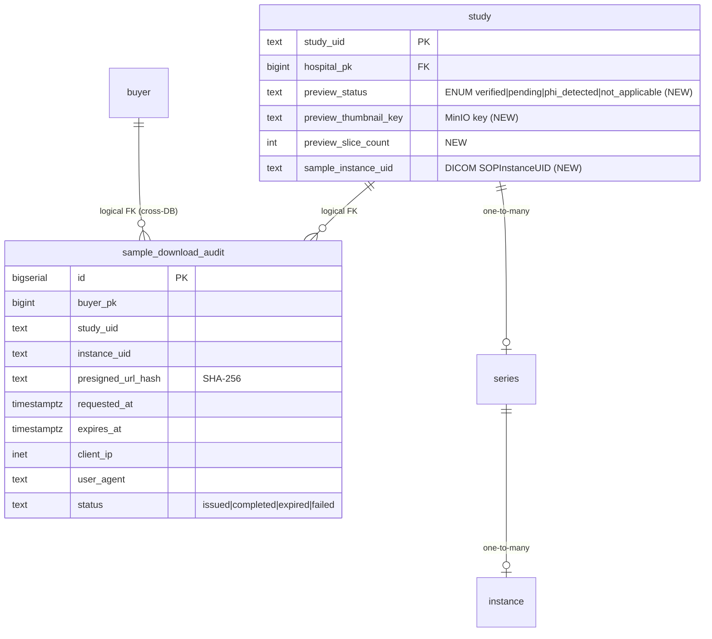

# 개발지시서 — Buyer Browse → Preview → Download Workflow

> **Status**: Draft v0.1 · **Feature slug**: `buyer-browse-preview` · **Last updated**: 2026-04-25
> **작성자**: @planner (Claude Opus 4.7) · **근거**:
>  - [`docs/research/buyer-browse-preview-download.md`](../research/buyer-browse-preview-download.md) v1.0 (2026-04-25, 433 줄) — §3.2 (Gradient 하이브리드), §4.1 (DICOM PS3.18 Sup 203), §4.3 (대표 슬라이스 알고리즘), §5.3 (이중 검증 게이트), §6.4 (presigned URL TTL), §7.3 (SaMD 비분류 보장), §8.1 (D-13 MVP 권고)
>  - [`docs/specs/dev-spec-portal-redesign.md`](./dev-spec-portal-redesign.md) v0.1 — FR-BP-3..9 (검색·상세·주문 UI), FR-INF-* (인프라 부트스트랩), AC-BP-* (수용 기준), §11 (법적·보안 고려)
>  - [`docs/specs/dev-spec-buyer-auth.md`](./dev-spec-buyer-auth.md) v0.1 — iron-session BuyerSession 스키마, /account API key reveal-once 모델, FR-AUTH-7 sessionVersion
>  - 선행 dev-spec: `dev-spec-metadata-index.md` (SearchRequest 스키마, hospital_opaque_id), `dev-spec-central-ingest.md` (study/series/instance 모델, audit chain), `dev-spec-order-fulfillment.md` (presigned URL · 5-phase FSM, **본 spec 의 sample download 는 별도 경로**), `dev-spec-de-id-pixel.md` (Burned-in OCR 파이프라인 — 본 spec 은 그 출력의 재검증 게이트)
>  - [`docs/prd.md`](../prd.md) §4.3 (구매자 포털) · §4.4 (주문 처리)
>  - [`docs/ARCHITECTURE.md`](../ARCHITECTURE.md) §4.3 (Thumbnail Cache + CDN, **본 spec 이 구체화**) · §5.x (Web Portal)

> **선행 상태 요약 (2026-04-25 기준)**:
>  - `web/portal/` Next.js 14 App Router 에 `/search` `/studies/[uid]` 라우트 골격 존재 — `dev-spec-portal-redesign` FR-BP-3·8 구현 단계.
>  - `src/radivault_central/` 에 manifest/storage/router 모듈 존재하나 **WADO/preview 엔드포인트 0 건**.
>  - `src/radivault_search/` 는 query-only — preview 관여 없음.
>  - Central DB 250 study (HOSP-001 Bon × ~150, HOSP-002 Tunteun × ~100) TCIA seed 완료.
>  - **본 spec 의 D-13 MVP 는 `preview_status='verified'` 5 study 만 thumbnail/preview/sample-download 노출**, 245 study 는 metadata-only (현재 동작 보존).

---

## 1. 기능 개요

RadiVault Buyer 가 로그인 후 **검색 카드 → 상세 슬라이스 viewer → 샘플 1 study 즉시 다운로드** 까지 한 번에 흐를 수 있는 시각 preview 워크플로우. D-13 MVP 는 사전 렌더링된 JPEG 시퀀스 + 수동 OCR 검증된 5 sample study 만 노출하여 SaMD 분류 위험과 PHI leak 위험을 0 으로 통제하면서, "Gradient Atlas 하이브리드 (preview free + DICOM order)" 패턴을 D-13 데모 무대에서 시연 가능 수준으로 구현한다.

핵심 가치는 (a) **buyer 가 카탈로그를 시각적으로 신뢰** 할 수 있다는 신호, (b) **sample 1 study 즉시 다운로드** 로 self-serve trial funnel 진입, (c) **기존 cohort order 흐름과 명확히 분리** 된 "Try sample" CTA 분리.

---

## 2. 사용자 스토리

- **As a** 글로벌 AI researcher (Buyer Dana, 영어), **I want** `/search` 결과 카드에서 modality 별 대표 슬라이스 썸네일을 즉시 확인하고, 흥미 있는 study 만 클릭해 슬라이스 viewer 로 들어가 데이터의 실제 화질·해부학 영역을 30초 안에 평가 **so that** 영업 문의 없이 RadiVault 카탈로그가 우리 모델 학습에 적합한지 self-serve 로 판단한다.
- **As a** Buyer Dana, **I want** 흥미 있는 study 1 건의 대표 DICOM 슬라이스를 1-click 으로 즉시 다운로드 **so that** Python 으로 직접 열어 metadata · pixel array · header 가 우리 ingest 파이프라인과 호환되는지 5 분 안에 검증한다.
- **As a** Kyle (D-13 demo 시연자), **I want** /search 카드의 thumbnail → /studies/[uid] viewer → sample download 을 30 초 클릭 시퀀스로 무대에서 시연 **so that** 투자자에게 "Gradient/Segmed 와 동급의 buyer 경험" 을 한눈에 보여준다.
- **As a** RadiVault 운영자 (compliance), **I want** preview/download 노출 전 OCR 검증 게이트가 100% 적용되어 PHI leak 0 건 보장 **so that** PIPA 28-8 + 식약처 SaMD 비분류 정책 준수 증거를 audit log 에 남긴다.
- **As a** RadiVault 운영자 (rate limit), **I want** sample download 가 buyer 별 일일 1 회 quota 로 통제 **so that** 익명정보라도 무제한 다운로드로 인한 재식별 위험 누적을 방지한다.

---

## 3. 범위

### 3.1 포함 (In-scope, D-13 MVP v0.1)

1. **검색 결과 카드 thumbnail** — `/search` 의 각 study row 좌측에 256×256 JPEG 1 장 (PS3.18 Sup 203 spec 준수).
2. **Study detail slice viewer** — `/studies/[uid]` 의 새 `<SliceViewer>` 컴포넌트. 사전 렌더링 JPEG 시퀀스 (5–30 슬라이스) + slider/키보드/휠 navigation, zoom/pan/window-level 까지만.
3. **SaMD 면책 footer** — viewer 전역 `"Display only — not for diagnostic use"` 배너 (한국어/영어).
4. **Burned-in PHI 게이트 (수동 + DB 플래그)** — D-13 은 `preview_status='verified'` study 5 건 (Hot Storage 수동 OCR 검증) 만 thumbnail/viewer/sample download 노출. 245 study 는 placeholder.
5. **Sample 1 study 즉시 다운로드** — `POST /v1/studies/{uid}/sample-download` → 1 instance DICOM presigned URL (TTL 1h). per-buyer 1/day quota.
6. **Central WADO-rendered proxy 신규 3 엔드포인트** — thumbnail / frames / sample-download (Bearer rv_live_*).
7. **BFF 신규 3 라우트** — Central proxy + buyerPk OR apiKey 세션 가드 (portal-redesign BLOCKER #1 패턴).
8. **DB 스키마 확장** — `study` ALTER 4 컬럼 + `sample_download_audit` 신규 테이블 + Alembic 1 revision.
9. **Sample 5 study seed 스크립트** — `scripts/demo_seed/seed_preview_samples.py` (idempotent).
10. **Quota counter** — Redis `quota:{buyer_pk}:{YYYYMMDD}` (Q-6 default).
11. **Preview cache bucket** — MinIO `radivault-preview` 신규 버킷 (Q-5 default).
12. **데모 시나리오 통합** — 기존 9 단계 골든패스에 viewer + sample download 1 단계 추가 → 10 단계.

### 3.2 제외 (Out-of-scope, v0.1)

1. **OHIF / Cornerstone3D iframe 통합** — v0.2 풀 스코프, 별 dev-spec `dev-spec-buyer-dicomweb-gateway.md`.
2. **Cohort 일괄 다운로드 (manifest + s5cmd 패턴)** — 기존 `dev-spec-order-fulfillment` 5-phase 흐름 그대로 유지. 본 spec 변경 없음.
3. **자동 OCR 워커 (Presidio DicomImageRedactorEngine)** — D-13 은 수동 검증, 자동화는 v0.1.5 신규 spec.
4. **Burned-in PHI 검증 한국어 모델 학습** — 영어 OCR 으로도 D-13 시연 불요 (TCIA seed 는 영어 데이터셋).
5. **DICOM SEG / SR / KOS overlay** — SaMD 분류 위험으로 일체 제외 (research §7.3).
6. **측정 도구 / AI overlay / segmentation** — SaMD 분류 위험으로 일체 제외.
7. **Sample download ZIP 묶음** — Q-7 default 단일 .dcm. ZIP 은 v0.1.5.
8. **Sample preview 가격 부과 / Stripe 연동** — Q-1 default free. Billing 은 dev-spec-billing-revenue-share v0.2.
9. **다국어 viewer UI** — 영어 fixed (한국어는 SaMD footer 만 KR 토글).
10. **모바일 viewer 최적화** — desktop 1280px+ 우선. mobile 은 best-effort.
11. **Burned-in PHI 자동 격리 워커** — 검증 미통과 study 의 자동 metadata-only fallback 은 본 spec 의 DB 플래그 기반 SELECT 필터로 충분, 별도 워커 v0.1.5.
12. **다운로드 quota dashboard / billing tier UI** — `/account` 에 quota 잔여만 표시, tier 기반 상한 변경 UI 없음 (v0.2).
13. **법무 자문** — D-13 이후 (Q-4 default).

---

## 4. 기능 요구사항

### 4.1 FR-PREVIEW-* — Preview UI

#### FR-PREVIEW-1 — Study card thumbnail (검색 결과)
**근거**: research §3.2 (Gradient "instant image previews"), §4.1 (PS3.18 Sup 203), §8.1 D-13 MVP table.

- `/search` (`SearchApp.tsx`) 의 결과 row 좌측에 **256×256 JPEG 썸네일 1 장** 렌더.
- **요구 spec**:
  - 포맷: `image/jpeg` (PS3.18 Sup 203 필수 media type).
  - 픽셀: 256×256 (정사각, letterbox 또는 crop 허용).
  - 파일 크기: < 30 KB (Quality 80, progressive).
  - 캐시: MinIO `radivault-preview` bucket 의 `thumbnails/{study_uid}.jpg` 키. **runtime WADO 호출 0 건** — 사전 렌더링된 정적 JPEG 만 BFF/CDN 통과.
  - PHI: PS3.18 spec 명시 "Patient Identifying Information 포함 금지" — `preview_status='verified'` study 만 노출.
- **렌더 분기**:
  - `preview_status='verified'`: thumbnail 표시.
  - `'pending' | 'phi_detected' | 'not_applicable'`: placeholder (modality 아이콘 + 라벨 `"Preview unavailable"`).
- **lazy load**: IntersectionObserver 로 viewport 진입 시에만 fetch (NFR-PERF-1).
- **fallback chain**: BFF 200 (이미지) → 404 → placeholder. 404 가 아닌 5xx 는 재시도 1회 후 placeholder.

#### FR-PREVIEW-2 — StudyDetail slice viewer
**근거**: research §4.4 (OHIF 풀 스코프 vs 정적 JPEG MVP), §7.3 (SaMD 비분류 — zoom/pan/WL only), §8.1 D-13 MVP.

- `/studies/[uid]` 페이지에 `<SliceViewer seriesId="..." />` 컴포넌트 렌더.
- **데이터 소스**: 사전 렌더링된 JPEG 시퀀스 (5–30 슬라이스). MinIO `radivault-preview/frames/{study_uid}/{series_num}/{frame_num}.jpg`.
- **navigation**:
  - 슬라이더 (HTML `<input type="range">`).
  - 키보드 ↑↓ (next/prev frame), Page Up/Down (±5 frame), Home/End (first/last).
  - 마우스 휠 (next/prev frame).
  - 터치 swipe (좌우, mobile best-effort).
- **viewer 기능 — 허용**:
  - Zoom in/out (CSS transform scale, 0.5×~4×).
  - Pan (drag).
  - Window-level (밝기/대비, JPEG 표시 한정 — DICOM raw window center/width 는 사전 렌더링에 고정).
- **viewer 기능 — 금지** (SaMD risk):
  - 측정 (선/각도/거리/면적/ROI).
  - AI overlay / segmentation / heatmap.
  - DICOM SEG / SR / RTSTRUCT 표시.
  - 진단 보조 텍스트 / quantitative readout.
- **footer 배너 (FR-PREVIEW-4 와 결합)**: `<SliceViewer>` 하단에 항상 표시.
- **preload**: 현재 frame ±3 슬라이스 사전 fetch (NFR-PERF-2).
- **세션·인증**: BuyerSession 필수. `preview_status='verified'` 외 study 의 `/studies/[uid]` 는 viewer 자리에 placeholder + "Preview unavailable for this study" 메시지.

#### FR-PREVIEW-3 — Burned-in PHI 검증 게이트
**근거**: research §5.1·5.3 (Presidio DicomImageRedactorEngine, 이중 검증 게이트), §8.1.

- **D-13 MVP 동작**: 수동 게이트.
  - 5 sample study (HOSP-001 3 + HOSP-002 2) 의 모든 슬라이스를 사람 눈으로 PHI 부재 확인.
  - 검증 통과 → `study.preview_status='verified'` 업데이트 + thumbnail/frames/sample_instance_uid 시드.
  - 미검증 245 study → `preview_status='pending'` 유지.
- **풀 스코프 (v0.1.5+)**: 자동 OCR 워커.
  - Central 측 background job 이 신규 study 마다 Presidio DicomImageRedactorEngine 실행.
  - PASS → `'verified'`, FAIL → `'phi_detected'` + 운영자 알림.
- **렌더 분기 (모든 endpoint 공통)**:
  - `verified`: thumbnail/frames/sample-download 200.
  - `pending`/`not_applicable`: thumbnail/frames 404, sample-download 403.
  - `phi_detected`: thumbnail/frames/sample-download 모두 403 (audit log + 알림).
- **invariant**: `preview_status != 'verified'` 인 study 의 픽셀 데이터는 BFF/Central 어느 경로로도 buyer 에게 도달 불가. metadata (search 결과 row) 는 그대로 노출.

#### FR-PREVIEW-4 — SaMD 면책 배너 (footer)
**근거**: research §7.3 (식약처 SaMD 분류 회피), §8.1.

- viewer 페이지 (`/studies/[uid]`) 하단에 sticky 배너:
  - EN: `"Display only — not for diagnostic use. RadiVault is not a medical device."`
  - KR (locale='ko'): `"표시 전용 — 진단 용도 사용 금지. RadiVault 는 의료기기가 아닙니다."`
- 디자인: 옅은 회색 배경 (#f3f4f6), 테두리 상단 1px, 폰트 12px, 화면 너비 전체.
- DOM: `<footer data-testid="samd-disclaimer" role="contentinfo">`.
- 항상 표시 — viewer fullscreen mode 에서도 dismiss 불가.
- 사용약관 (`/terms`) 에도 동일 문구 명시 (out-of-scope of 본 spec, ToS 본문 갱신 별도 PR).

### 4.2 FR-DOWNLOAD-* — Sample Download

#### FR-DOWNLOAD-1 — Sample DICOM 즉시 다운로드
**근거**: research §6.1 (Stripe-style preview free + paid full), §6.4 (TTL 1h), §8.1 D-13 MVP.

- **UI**:
  - `/studies/[uid]` 우측 사이드바 또는 viewer 상단에 `[Download sample DICOM]` 버튼.
  - `preview_status='verified'` study 만 활성화. 외 disabled + 툴팁 `"Sample download requires verified preview status."`.
  - Click → spinner → BFF `POST /api/studies/{uid}/sample-download` → presigned URL 응답 → `<a download>` 트리거 (자동 다운로드 시작).
- **백엔드 동작 (Central `POST /v1/studies/{uid}/sample-download`)**:
  1. Bearer key 검증 → buyer_pk 추출.
  2. study lookup → `preview_status` 검증 (verified 외 403 `ERR_PREVIEW_NOT_VERIFIED`).
  3. quota 체크: Redis `quota:{buyer_pk}:{YYYYMMDD}` GET. >= 1 시 429 `ERR_QUOTA_EXCEEDED`.
  4. `sample_instance_uid` lookup → MinIO 의 대표 슬라이스 DICOM 파일 (`samples/{study_uid}/{sample_instance_uid}.dcm`).
  5. presigned URL 발급 (S3 / MinIO SDK, TTL 3600s, GET only, HTTPS).
  6. quota INCR (`INCR quota:{buyer_pk}:{YYYYMMDD}` + `EXPIRE 86400`).
  7. `sample_download_audit` INSERT (buyer_pk, study_uid, instance_uid, presigned_url_hash=SHA-256(url), requested_at, expires_at, client_ip, user_agent).
  8. response: `{presigned_url: string, expires_at: ISO8601, instance_uid: string, study_uid: string}`.
- **TTL**: 3600 초 (1 시간) — research §6.4 권고.
- **Quota (Q-1 default)**: free tier buyer 1 download/day. tier='paid'/'enterprise' 는 v0.2 에서 별도 quota.
- **포맷 (Q-7 default)**: 단일 .dcm 파일 (대표 슬라이스 1 SOPInstanceUID). ZIP 묶음 v0.1.5.
- **분리 원칙 (CRITICAL)**: 본 sample-download 는 기존 `/v1/orders/{orderId}/download-urls` (order-fulfillment 5-phase) 와 **완전 별도 경로**. order DB 행 / order_outbox / transfer_job 미생성. audit 도 별도 테이블 (`sample_download_audit`).

#### FR-DOWNLOAD-2 — Cohort 다운로드 (deferred 풀 스코프)
**근거**: research §6.2 (instant vs cart vs manifest), 기존 dev-spec-order-fulfillment.

- 기존 `dev-spec-order-fulfillment` 5-phase 흐름 그대로 유지. 본 spec 에서 변경 0 건.
- UX 분리: `/studies/[uid]` 에 두 CTA 명확히 분리 — `[Download sample DICOM]` (즉시) vs `[Add to cohort]` (cart → order).
- 데모 시나리오에서 **둘 다 시연** — sample 은 즉시 1-click, cohort 는 5-phase tracker.

### 4.3 FR-API-* — Central WADO-rendered Proxy

#### FR-API-1 — Central 신규 3 엔드포인트
**근거**: research §4.1·4.2 (PS3.18 Sup 203 + Rendered).

신규 모듈: `src/radivault_central/routers/preview.py`.

```
GET /v1/studies/{study_uid}/thumbnail
  Auth:    Bearer rv_live_* (buyer_api_key)
  Rate:    tier_preview (existing limiter)
  Query:   none
  Response (200):
    Content-Type: image/jpeg
    Cache-Control: public, max-age=86400, immutable
    ETag: SHA-256(study_uid + preview_thumbnail_key)
    Body: <JPEG bytes, 256×256, < 30KB>
  Errors:
    401 ERR_AUTH_INVALID
    403 ERR_PREVIEW_NOT_VERIFIED  (preview_status != 'verified')
    404 ERR_STUDY_NOT_FOUND
    429 ERR_RATE_LIMITED
    5xx upstream MinIO 오류

GET /v1/studies/{study_uid}/series/{series_num}/frames/{frame_num}
  Auth:    Bearer rv_live_*
  Rate:    tier_preview
  Path:    series_num: int (1-based, study 내 series sequence), frame_num: int (1-based, 슬라이스 인덱스)
  Response (200):
    Content-Type: image/jpeg
    Cache-Control: public, max-age=86400, immutable
    ETag: SHA-256(study_uid + series_num + frame_num + preview_thumbnail_key)
    Body: <JPEG bytes, full-resolution preview frame>
  Errors:
    401, 403 ERR_PREVIEW_NOT_VERIFIED, 404 ERR_FRAME_NOT_FOUND, 429, 5xx

POST /v1/studies/{study_uid}/sample-download
  Auth:    Bearer rv_live_*
  Rate:    tier_preview + quota:{buyer_pk}:{YYYYMMDD} <= 1
  Request: { } (empty body or omit)
  Response (200):
    {
      "presigned_url": "https://minio.radivault.io/...?X-Amz-Signature=...",
      "expires_at": "2026-04-25T15:23:00Z",
      "instance_uid": "1.2.840.113619...",
      "study_uid": "1.2.840.113619...",
      "size_bytes": 524288
    }
  Errors:
    401 ERR_AUTH_INVALID
    403 ERR_PREVIEW_NOT_VERIFIED
    404 ERR_STUDY_NOT_FOUND
    409 ERR_SAMPLE_INSTANCE_MISSING  (sample_instance_uid IS NULL)
    429 ERR_QUOTA_EXCEEDED  (daily 1 초과)
    5xx ERR_PRESIGN_FAILED
```

- **인증 통합**: 기존 `radivault_central.auth.verify_buyer_api_key` 재사용. session BFF 에서 Bearer header 통과.
- **Rate limit**: `radivault_central.config` 의 기존 limiter 활용. tier='preview' 의 endpoint 그룹 `preview_*` 신설.
- **audit chain 통합**: 모든 3 endpoint 가 `audit_event_chain` 에 INSERT (event_type='preview_thumbnail' / 'preview_frame' / 'sample_download_request').

#### FR-API-2 — BFF 신규 3 라우트
**근거**: portal-redesign FR-BP-17 (BFF 패턴), buyer-auth FR-AUTH-7 (BuyerSession), `web/portal/src/lib/upstream.ts`.

신규 파일:
- `web/portal/src/app/api/studies/[uid]/thumbnail/route.ts`
- `web/portal/src/app/api/studies/[uid]/series/[seriesNum]/frames/[frameNum]/route.ts`
- `web/portal/src/app/api/studies/[uid]/sample-download/route.ts`

```
GET /api/studies/[uid]/thumbnail
  Session guard: getBuyerSession() — buyerPk OR apiKey 미존재 시 401
  Upstream: central:8000 GET /v1/studies/{uid}/thumbnail (Bearer session.apiKey)
  Response: 응답 그대로 stream (Content-Type: image/jpeg)
  Edge cache: Vercel/Next.js `export const revalidate = 3600` (1h)
  Errors envelope (non-200): { error, detail, request_id }

GET /api/studies/[uid]/series/[seriesNum]/frames/[frameNum]
  동일 패턴, JPEG stream, edge-cache 1h

POST /api/studies/[uid]/sample-download
  Session guard: 동일
  Upstream: central:8000 POST /v1/studies/{uid}/sample-download
  Response: { presigned_url, expires_at, instance_uid, study_uid, size_bytes } JSON
  No edge cache (POST + dynamic).
```

- **upstream stream 방식**: thumbnail/frames 는 `Response.body` ReadableStream 그대로 client 까지 통과. JSON parse 안 함.
- **세션 가드 (BLOCKER #1 패턴)**: portal-redesign 에서 정의한 `iron-session` BuyerSession 의 `apiKey` (or 새 `buyerPk` 기반 server-side key reconstruction) 미존재 시 401 + signin redirect.
- **CORS**: 동일 origin. 외부 cross-origin 호출 차단.

### 4.4 FR-DATA-* — DB 스키마

#### FR-DATA-1 — `study` ALTER + `sample_download_audit` 신규
**근거**: research §5.3 (검증 상태 관리), §6.3 (per-buyer download quota).

기존 central DB `study` 테이블 ALTER + 신규 테이블 1.

```sql
-- alembic/versions/000Y_buyer_browse_preview.py — upgrade()

-- 1) study ALTER: preview 상태 4 컬럼 추가
ALTER TABLE study
  ADD COLUMN preview_status TEXT NOT NULL DEFAULT 'pending'
    CHECK (preview_status IN ('pending', 'verified', 'phi_detected', 'not_applicable')),
  ADD COLUMN preview_thumbnail_key TEXT NULL,    -- MinIO key, e.g., 'thumbnails/{study_uid}.jpg'
  ADD COLUMN preview_slice_count INTEGER NULL,   -- frames count for slice viewer (NULL if not applicable)
  ADD COLUMN sample_instance_uid TEXT NULL;      -- DICOM SOPInstanceUID for sample-download

CREATE INDEX idx_study_preview_status ON study(preview_status)
  WHERE preview_status = 'verified';

-- 2) sample_download_audit 신규
CREATE TABLE sample_download_audit (
  id BIGSERIAL PRIMARY KEY,
  buyer_pk BIGINT NOT NULL,                       -- FK 는 cross-DB (search) 이므로 논리적 참조만
  study_uid TEXT NOT NULL,                        -- study.study_uid 논리 참조
  instance_uid TEXT NOT NULL,                     -- 발급된 sample SOPInstanceUID
  presigned_url_hash TEXT NOT NULL,               -- SHA-256 hex (URL 평문 보관 X)
  requested_at TIMESTAMPTZ NOT NULL DEFAULT now(),
  expires_at TIMESTAMPTZ NOT NULL,
  client_ip INET NULL,
  user_agent TEXT NULL,
  status TEXT NOT NULL DEFAULT 'issued'
    CHECK (status IN ('issued', 'completed', 'expired', 'failed'))
);

CREATE INDEX idx_sample_dl_audit_buyer_time ON sample_download_audit(buyer_pk, requested_at DESC);
CREATE INDEX idx_sample_dl_audit_study ON sample_download_audit(study_uid, requested_at DESC);

-- downgrade() — destructive
DROP INDEX idx_sample_dl_audit_study;
DROP INDEX idx_sample_dl_audit_buyer_time;
DROP TABLE sample_download_audit;
DROP INDEX idx_study_preview_status;
ALTER TABLE study
  DROP COLUMN sample_instance_uid,
  DROP COLUMN preview_slice_count,
  DROP COLUMN preview_thumbnail_key,
  DROP COLUMN preview_status;
```

- **migration 위치**: central repo `src/radivault_central/alembic/versions/`. revision 1 개.
- **destructive**: study ALTER 4 컬럼 추가는 NOT NULL DEFAULT 'pending' 으로 idempotent. 기존 250 row 모두 'pending' 자동 적용 — 즉 thumbnail/sample-download 0 건 노출 (안전 default).
- **search 서비스 영향**: `search.studies.search` 의 결과 row 에 `preview_status` 노출 여부 — D-13 MVP 는 노출 X (BFF 에서 thumbnail URL 만 lazy fetch). v0.1.5 에서 search response `meta` 에 추가 검토.

### 4.5 FR-OPS-* — Operations / Seed

#### FR-OPS-1 — Sample 5 study seed 스크립트
**근거**: research §8.1 (D-13 MVP 5 sample), 기존 `scripts/demo_seed/` 패턴.

신규 파일: `scripts/demo_seed/seed_preview_samples.py`.

- **선정 기준** (default, Q-2):
  - HOSP-001 (Bon) 에서 3 study — modality 다양성 (CT × 1, MR × 1, CR/DR × 1).
  - HOSP-002 (Tunteun) 에서 2 study — modality 다양성 (CT × 1, MR × 1).
  - 전체 합 5. 선정 study UID 는 스크립트 상단 const 또는 `--samples` flag.
- **각 study 별 동작**:
  1. Orthanc (병원 측 PACS, demo 환경에서는 docker `orthanc-hosp-001` / `orthanc-hosp-002`) 에 WADO-RS rendered 호출 → 대표 슬라이스 (median index) 256×256 JPEG 추출 → MinIO `radivault-preview/thumbnails/{study_uid}.jpg` 업로드.
  2. 슬라이스 시퀀스 (5–30개, study 의 실제 instance count 에 따라) JPEG 변환 → MinIO `radivault-preview/frames/{study_uid}/{series_num}/{frame_num}.jpg` 업로드. **frame_num 1-based**.
  3. 대표 1 slice 의 raw DICOM 파일 → MinIO `radivault-preview/samples/{study_uid}/{sop_instance_uid}.dcm` 업로드.
  4. central DB UPDATE:
     ```sql
     UPDATE study
       SET preview_status = 'verified',
           preview_thumbnail_key = 'thumbnails/{study_uid}.jpg',
           preview_slice_count = <N>,
           sample_instance_uid = '<sop_instance_uid>'
       WHERE study_uid = '<study_uid>';
     ```
- **idempotent**: 재실행 시 (a) 이미 verified 인 study 는 skip, (b) MinIO 업로드는 overwrite, (c) DB UPDATE 는 동일 값으로 멱등.
- **수동 검증 게이트** (D-13 MVP):
  - 스크립트 실행 후 운영자가 MinIO 의 thumbnail/frames 5×N 슬라이스를 사람 눈으로 PHI 부재 확인.
  - 통과 시 `--mark-verified` flag 로 재실행 → DB UPDATE 적용. flag 없이는 `preview_status='pending_verification'` 임시 상태 (DB CHECK 제약은 'pending' 으로 통합).
  - 자동화 (Presidio OCR) 는 v0.1.5 별 spec.
- **CLI**:
  ```
  python scripts/demo_seed/seed_preview_samples.py \
    --hosp-001-studies <uid1>,<uid2>,<uid3> \
    --hosp-002-studies <uid4>,<uid5> \
    --minio-endpoint http://localhost:9000 \
    --bucket radivault-preview \
    [--mark-verified]  # 수동 검증 후 플래그
    [--dry-run]
  ```
- **D-day 운영 SOP 갱신**: `docs/ops/demo-day-runbook.md` 에 본 스크립트 실행 + 수동 검증 단계 추가 (out-of-scope of 본 spec 의 코드 변경, runbook 갱신은 별도 PR).

---

## 5. 비기능 요구사항

| 항목 | 요구 |
|------|------|
| **NFR-PERF-1 — Thumbnail latency** | StudyCard thumbnail lazy load (IntersectionObserver). 첫 fold p95 < 800 ms (50 카드 동시 viewport 진입 가정). edge cache hit 시 < 100 ms. |
| **NFR-PERF-2 — Slice viewer** | 첫 슬라이스 표시 p95 < 500 ms. 슬라이스 전환 p95 < 200 ms (현재 frame ±3 preload). cache miss 시 p95 < 1.5 s. |
| **NFR-PERF-3 — Sample download** | presigned URL 발급 p95 < 300 ms (DB lookup + Redis quota + S3 sign + audit INSERT). 다운로드 자체 throughput 은 MinIO/CDN 네트워크 의존 (out-of-scope SLA). |
| **NFR-SEC-1 — Presigned URL** | HTTPS only. TTL 3600 s. IP 제한 X (mobile / SDK 호환). Referer 제한 X (curl 호환). audit log 100% 기록 (`sample_download_audit` INSERT). URL 평문 DB 보관 금지 — SHA-256 해시만. |
| **NFR-SEC-2 — PHI leak 0** | `preview_status='verified'` 외 study 의 thumbnail/frames/sample-download endpoint 응답 0 건. WHERE 절 enforce + Playwright e2e assert. |
| **NFR-SEC-3 — Bundle leak** | `rv_live_*` 평문 키, presigned URL 평문 모두 client JS bundle 0 건. `grep -r 'rv_live_\|X-Amz-Signature' .next/static/` 0 건. |
| **NFR-LOG-1 — Audit chain** | Central 3 endpoint 모두 `audit_event_chain` INSERT (gateway-agent dev-spec 패턴). buyer_pk + endpoint + study_uid + status_code + latency_ms + request_id. |
| **NFR-LOG-2 — Sample download audit** | `sample_download_audit` 테이블에 100% 기록. Playwright assert: 1 download 시 1 row INSERT. |
| **NFR-A11Y — 접근성** | WCAG 2.1 AA. `<SliceViewer>` 키보드 전체 탐색 (Tab / Arrow / Page). slider `<input type="range" aria-label="Slice number">`. SaMD footer `role="contentinfo"`. 색 대비 4.5:1. |
| **NFR-I18N** | viewer UI 영어 fixed. SaMD 면책 배너만 EN/KR 토글 (locale='ko' 시 KR). |
| **NFR-COMPLIANCE — SaMD** | viewer 기능은 zoom/pan/window-level 한정. 측정·진단·AI overlay 일체 불가. CI lint: `grep -r 'measure\|segment\|diagnose' web/portal/src/components/SliceViewer/` 0 건. |
| **NFR-RATE — Quota** | Redis `quota:{buyer_pk}:{YYYYMMDD}` INCR + EXPIRE 86400. 초과 시 429 + `Retry-After: <seconds_until_midnight_KST>`. |

---

## 6. 데이터 모델

### 6.1 기존 테이블 재사용 (수정 없음)

- `buyer`, `buyer_api_key`, `search_audit` (search-side, dev-spec-metadata-index §6).
- `series`, `instance` (central-ingest).
- `audit_event_chain`, `audit_anchor` (central-ingest, gateway-agent).
- `order`, `transfer_job`, `download_event`, `order_outbox` (order-fulfillment) — **본 spec 변경 0**.

### 6.2 기존 테이블 ALTER (FR-DATA-1)

`study` 테이블 4 컬럼 추가. §4.4 FR-DATA-1 의 SQL 참조.

### 6.3 신규 테이블 (FR-DATA-1)

`sample_download_audit` 1 개. §4.4 FR-DATA-1 의 SQL 참조.

### 6.4 ERD (mermaid)



### 6.5 MinIO bucket 구조 (Q-5 default)

```
radivault-preview/
├── thumbnails/
│   └── {study_uid}.jpg           # 256x256, < 30KB
├── frames/
│   └── {study_uid}/
│       └── {series_num}/         # 1-based
│           └── {frame_num}.jpg   # 1-based, full-resolution preview
└── samples/
    └── {study_uid}/
        └── {sop_instance_uid}.dcm  # 대표 슬라이스 raw DICOM
```

- bucket policy: private (Central 만 access). presigned URL 만 buyer 노출.
- versioning: disabled (덮어쓰기 허용, 멱등).
- lifecycle: 90일 후 Glacier (out-of-scope of v0.1).

### 6.6 Redis 키 구조 (Q-6 default)

```
quota:{buyer_pk}:{YYYYMMDD}     INTEGER, EXPIRE 86400 sec
  값: 일일 sample download count. >= 1 이면 429.

session:{session_id}             (iron-session 내부, 변경 없음)
```

- KST 기준 자정 reset (TTL 86400 sec, INCR 시점부터). 정확한 자정 reset 은 v0.2 (cron + Redis Streams).

---

## 7. API 계약

§4.3 FR-API-1 (Central) + FR-API-2 (BFF) 의 풀 스펙 참조. 본 절은 핵심 4 엔드포인트 요약.

### 7.1 Central (radivault_central)

```
GET  /v1/studies/{uid}/thumbnail
GET  /v1/studies/{uid}/series/{seriesNum}/frames/{frameNum}
POST /v1/studies/{uid}/sample-download
```

### 7.2 BFF (web/portal Next.js)

```
GET  /api/studies/[uid]/thumbnail
GET  /api/studies/[uid]/series/[seriesNum]/frames/[frameNum]
POST /api/studies/[uid]/sample-download
```

### 7.3 에러 envelope (portal-redesign §7.5 승계)

```json
{
  "error": "ERR_PREVIEW_NOT_VERIFIED",
  "detail_en": "This study has not passed PHI verification.",
  "detail_ko": "이 스터디는 PHI 검증을 통과하지 않았습니다.",
  "hint": "Try a verified sample study (5 available in demo).",
  "request_id": "req_01HX...",
  "doc": "https://docs.radivault.io/errors/ERR_PREVIEW_NOT_VERIFIED"
}
```

### 7.4 신규 에러 코드 (이 spec 에서 도입)

| 코드 | HTTP | 의미 |
|---|---|---|
| `ERR_PREVIEW_NOT_VERIFIED` | 403 | preview_status != 'verified' |
| `ERR_FRAME_NOT_FOUND` | 404 | 요청된 series_num/frame_num 없음 |
| `ERR_SAMPLE_INSTANCE_MISSING` | 409 | sample_instance_uid IS NULL (운영 누락) |
| `ERR_QUOTA_EXCEEDED` | 429 | 일일 sample download quota 초과 |
| `ERR_PRESIGN_FAILED` | 500 | MinIO/S3 presign SDK 오류 |

---

## 8. 시퀀스·플로우

### 8.1 검색 카드 thumbnail 로드 (lazy)

```
Buyer Browser     Portal /search        BFF /api/studies/[uid]/thumbnail    Central :8000     MinIO
    │ /search          │                        │                                │                │
    │─────────────────▶│                        │                                │                │
    │ 50 cards render  │                        │                                │                │
    │ (placeholder)    │                        │                                │                │
    │                  │                        │                                │                │
    │ scroll → IntersectionObserver fires per card                              │                │
    │                  │ GET /api/studies/{uid}/thumbnail                       │                │
    │                  │───────────────────────▶│                                │                │
    │                  │ session check (BuyerSession.apiKey)                    │                │
    │                  │                        │ GET /v1/studies/{uid}/thumbnail (Bearer)        │
    │                  │                        │───────────────────────────────▶│                │
    │                  │                        │                                │ verify key      │
    │                  │                        │                                │ verify preview_status='verified'
    │                  │                        │                                │ MinIO GET object│
    │                  │                        │                                │───────────────▶│
    │                  │                        │                                │◀───────────────│
    │                  │                        │ stream JPEG (Cache-Control 1h) │                │
    │                  │                        │◀───────────────────────────────│                │
    │                  │ stream JPEG passthrough│                                │                │
    │                  │◀───────────────────────│                                │                │
    │     │                        │                                │                │
    │ replaces placeholder                      │                                │                │
```

### 8.2 Slice viewer navigation

```
Buyer        Portal /studies/[uid]      BFF .../frames/[n]     Central        MinIO
  │ click card  │                              │                    │              │
  │────────────▶│                              │                    │              │
  │             │ GET /api/search/studies/[uid] (existing)          │              │
  │             │ → metadata + series[]                              │              │
  │             │                              │                    │              │
  │             │ for each i in [1..5]: GET /api/studies/[uid]/series/1/frames/[i]
  │             │ (preload 5 around middle)    │                    │              │
  │             │─────────────────────────────▶│                    │              │
  │             │                              │ GET /v1/.../frames/[i]            │
  │             │                              │───────────────────▶│              │
  │             │                              │                    │ verify status│
  │             │                              │                    │ MinIO GET    │
  │             │                              │                    │─────────────▶│
  │             │                              │                    │◀─────────────│
  │             │                              │ stream JPEG        │              │
  │             │                              │◀───────────────────│              │
  │             │ stream                       │                    │              │
  │             │◀─────────────────────────────│                    │              │
  │ render frame in <canvas> or           │                    │              │
  │             │                              │                    │              │
  │ press ↓     │                              │                    │              │
  │ next frame from preload cache (instant)    │                    │              │
  │             │                              │                    │              │
  │ press ↓ ↓ ↓ ↓ (run out of preload)         │                    │              │
  │             │ fetch next 3 frames          │                    │              │
```

### 8.3 Sample download flow (1-click)

```
Buyer            Portal /studies/[uid]    BFF /api/.../sample-download    Central     MinIO    Redis     PG
  │ click "Download sample"  │                       │                        │           │        │        │
  │─────────────────────────▶│                       │                        │           │        │        │
  │                          │ POST /api/studies/[uid]/sample-download         │           │        │        │
  │                          │──────────────────────▶│                        │           │        │        │
  │                          │ session.apiKey ok    │                        │           │        │        │
  │                          │                       │ POST /v1/studies/[uid]/sample-download (Bearer)
  │                          │                       │───────────────────────▶│           │        │        │
  │                          │                       │                        │ verify key│        │        │
  │                          │                       │                        │ SELECT preview_status   │   │
  │                          │                       │                        │──────────────────────────▶│
  │                          │                       │                        │◀──────────────────────────│
  │                          │                       │                        │ verified ✓             │
  │                          │                       │                        │ INCR quota:bp:YYYYMMDD │
  │                          │                       │                        │────────────────▶│      │
  │                          │                       │                        │◀──── 1 ─────────│      │
  │                          │                       │                        │ <= 1, ok        │      │
  │                          │                       │                        │ MinIO presign (TTL 1h)  │
  │                          │                       │                        │───────────▶│           │
  │                          │                       │                        │◀───────────│           │
  │                          │                       │                        │ INSERT sample_download_audit │
  │                          │                       │                        │──────────────────────────▶│
  │                          │                       │                        │ INSERT audit_event_chain  │
  │                          │                       │                        │──────────────────────────▶│
  │                          │                       │ {presigned_url, expires_at, ...}  │           │   │
  │                          │                       │◀───────────────────────│           │           │   │
  │                          │ JSON pass             │                        │           │           │   │
  │                          │◀──────────────────────│                        │           │           │   │
  │ <a download href=presigned_url> auto-trigger     │                        │           │           │   │
  │ direct GET MinIO presigned URL                                            │           │           │   │
  │──────────────────────────────────────────────────────────────────────────────────────▶│           │   │
  │◀────────────────────────────────────────────────────── DICOM bytes (stream) ──────────│           │   │
```

### 8.4 PHI gate 차단 시퀀스 (negative)

```
Buyer        BFF              Central
  │ POST sample-download  │                │
  │ (study with preview_status='pending')  │
  │──────────────────────▶│                │
  │                       │ POST /v1/.../sample-download
  │                       │───────────────▶│
  │                       │                │ SELECT preview_status
  │                       │                │ ('pending')
  │                       │                │ 403 ERR_PREVIEW_NOT_VERIFIED
  │                       │◀───────────────│
  │ 403 envelope          │                │
  │◀──────────────────────│                │
  │ UI: toast "Sample download requires verified preview status"
```

---

## 9. 의존성

### 9.1 상위 모듈

- `dev-spec-portal-redesign` (FR-BP-3·8 — search results + study detail UI 재용).
- `dev-spec-buyer-auth` (BuyerSession, /account API key).

### 9.2 하위 모듈·서비스

- **Central (`radivault_central`)** — 신규 `routers/preview.py` 모듈, MinIO 클라이언트 (`storage/minio_client.py`) 확장 (presign helper).
- **search** — 변경 0. study 메타 그대로 사용.
- **MinIO** — 신규 bucket `radivault-preview` 생성. bucket policy = private.
- **Redis** — 기존 인스턴스 재사용 (rate-limit 인프라). 신규 키 prefix `quota:`.
- **gateway-agent** — 변경 0 (audit chain 은 Central 내부 INSERT).

### 9.3 외부 시스템·벤더

- **DICOM PS3.18 Sup 203** (NEMA 표준) — thumbnail spec 준수.
- **TCIA seed** — 5 sample study 의 원본 (이미 central DB 에 존재).
- **Orthanc** (병원 측 PACS, demo 환경 docker) — seed 스크립트가 WADO-RS rendered 호출 1회. runtime 0 건.

### 9.4 선행 기능 (이미 완료)

- `dev-spec-buyer-portal-demo` v0.1 + QA PASS.
- `dev-spec-metadata-index` v0.1 + FR-INF-1..4 (search 테이블 부트스트랩, Session 22~23 완료).
- `dev-spec-central-ingest` v0.1 + 250 study TCIA seed.
- `dev-spec-buyer-auth` v0.1 (FR-AUTH-7 BuyerSession).

### 9.5 기술 스택 — 본 dev-spec 에서 결정·확정

| 영역 | 결정 | 근거 |
|---|---|---|
| Preview cache storage | **MinIO bucket `radivault-preview` (private + presigned URL)** | Q-5 default. 기존 MinIO 인프라 재사용, S3 호환. |
| Quota counter | **Redis `quota:{buyer_pk}:{YYYYMMDD}` INCR + EXPIRE 86400** | Q-6 default. 기존 Redis 인프라 재사용. |
| Sample DICOM 포맷 | **단일 .dcm 파일 (대표 슬라이스 1 SOPInstanceUID)** | Q-7 default. ZIP 묶음 v0.1.5. |
| Slice viewer 컴포넌트 | **순수 React + `<canvas>` 또는 `` (정적 JPEG 시퀀스)** | research §4.4 MVP 단축 경로. OHIF/Cornerstone v0.2. |
| Window-level 처리 | **CSS filter (brightness/contrast)** — JPEG 표시 한정 | DICOM raw window center/width 는 사전 렌더링에 고정 |
| Presigned URL SDK | **`minio` Python SDK 의 `presigned_get_object`** (Central 측) | 기존 MinIO 사용. boto3 alt 가능 |

**ARCHITECTURE.md §4.3 갱신 제안**: "Thumbnail Cache + CDN" 항목을 본 spec FR-API-1 + FR-DATA-1 + MinIO bucket 구조로 구체화. PS3.18 Sup 203 spec 준수 명시 추가.

**ARCHITECTURE.md §6 또는 §7 신규 추가 제안**: "**SaMD 비분류 보장 정책**" 섹션 — viewer 기능 zoom/pan/window-level 한정, 측정·진단·AI overlay 일체 불가. 본 spec FR-PREVIEW-2·4 + NFR-COMPLIANCE 가 enforce.

**PRD §4.3 갱신 제안**: "썸네일 미리보기" + "샘플 1 study 즉시 다운로드" 명시. 풀 OHIF 통합은 v0.2 로 분리 표기.

---

## 10. 수용 기준 (Acceptance Criteria)

> `@qa` 검수 기준. 모든 항목은 binary-testable.

### 10.1 Preview AC (FR-PREVIEW-*)

- [ ] **AC-PREVIEW-1.1** `/search` 결과 카드 중 `preview_status='verified'` 5 study 에 thumbnail JPEG 표시 (Playwright `` assert).
- [ ] **AC-PREVIEW-1.2** `preview_status != 'verified'` 245 study 에 placeholder (modality 아이콘 + `"Preview unavailable"` 텍스트) 표시.
- [ ] **AC-PREVIEW-1.3** thumbnail 응답 `Content-Type: image/jpeg` + `< 30 KB` + `256×256 px`.
- [ ] **AC-PREVIEW-1.4** lazy load 동작 — IntersectionObserver fire 전에는 thumbnail HTTP 요청 0 건 (DevTools network panel).
- [ ] **AC-PREVIEW-2.1** `/studies/[uid]` (`preview_status='verified'`) 페이지가 `<SliceViewer>` 렌더 + slider + 키보드 ↑↓ + 휠 동작.
- [ ] **AC-PREVIEW-2.2** `<footer data-testid="samd-disclaimer">` 가 viewer 페이지 항상 표시 + locale='en' 시 EN, 'ko' 시 KR 텍스트.
- [ ] **AC-PREVIEW-2.3** viewer 에 측정/segmentation/AI overlay 버튼 0 건 (Playwright `[data-testid*="measure"]` 0 hits + grep `web/portal/src/components/SliceViewer/` 결과 0 건).
- [ ] **AC-PREVIEW-2.4** zoom (0.5×~4×) + pan + window-level (CSS filter) 3 기능 동작.
- [ ] **AC-PREVIEW-3.1** `preview_status='phi_detected'` study 의 thumbnail/frames/sample-download endpoint 모두 403 `ERR_PREVIEW_NOT_VERIFIED`.
- [ ] **AC-PREVIEW-3.2** `preview_status='pending'` study 의 동일 endpoint 모두 403.
- [ ] **AC-PREVIEW-3.3** seed 5 study 의 모든 thumbnail/frames JPEG 에 PHI 부재 — 수동 검증 체크리스트 100% 완료 (D-13 운영 SOP).

### 10.2 Download AC (FR-DOWNLOAD-*)

- [ ] **AC-DOWNLOAD-1.1** verified study 의 `POST /api/studies/[uid]/sample-download` → 200 + `{presigned_url, expires_at, instance_uid, study_uid, size_bytes}` 응답 schema 검증.
- [ ] **AC-DOWNLOAD-1.2** free tier buyer 가 같은 날 2번째 sample-download 호출 시 429 `ERR_QUOTA_EXCEEDED` + `Retry-After` 헤더.
- [ ] **AC-DOWNLOAD-1.3** sample-download 1회 성공 시 `sample_download_audit` 테이블에 1 row INSERT (Playwright + DB query). `presigned_url_hash` = SHA-256(presigned_url).
- [ ] **AC-DOWNLOAD-1.4** presigned URL 의 TTL `expires_at` = now + 3600s (±5s tolerance).
- [ ] **AC-DOWNLOAD-1.5** presigned URL 직접 GET 시 DICOM 파일 다운로드 성공 (Content-Type `application/dicom` 또는 `application/octet-stream`).
- [ ] **AC-DOWNLOAD-1.6** TTL 만료 후 (1h+ 경과) 동일 URL 재 GET → 403 (S3 native).
- [ ] **AC-DOWNLOAD-1.7** Sample download 와 cohort order 흐름 분리 — sample-download 호출 시 `order` / `transfer_job` / `order_outbox` 테이블에 row INSERT 0 건.

### 10.3 API AC (FR-API-*)

- [ ] **AC-API-1.1** Central `GET /v1/studies/{uid}/thumbnail` Bearer 인증 + verified study 200 + image/jpeg.
- [ ] **AC-API-1.2** Central `GET /v1/studies/{uid}/series/{n}/frames/{m}` 200 + image/jpeg + ETag 헤더.
- [ ] **AC-API-1.3** Central `POST /v1/studies/{uid}/sample-download` 200 + presigned URL JSON.
- [ ] **AC-API-1.4** 3 endpoint 모두 Bearer 미존재 시 401 `ERR_AUTH_INVALID`.
- [ ] **AC-API-1.5** 3 endpoint 모두 rate limit 적용 (tier_preview, 기본 60/min/key — config 확인).
- [ ] **AC-API-1.6** 3 endpoint 모두 `audit_event_chain` INSERT (event_type=`preview_thumbnail` / `preview_frame` / `sample_download_request`).
- [ ] **AC-API-2.1** BFF `GET /api/studies/[uid]/thumbnail` session 가드 + 200 stream + edge cache header.
- [ ] **AC-API-2.2** BFF `GET /api/studies/[uid]/series/[n]/frames/[m]` 동일 패턴.
- [ ] **AC-API-2.3** BFF `POST /api/studies/[uid]/sample-download` 200 + JSON.
- [ ] **AC-API-2.4** BFF 3 라우트 모두 session 미존재 시 401 + signin redirect 힌트.

### 10.4 Data AC (FR-DATA-*)

- [ ] **AC-DATA-1.1** Alembic `upgrade head` 후 `study` 테이블에 4 신규 컬럼 (`preview_status`, `preview_thumbnail_key`, `preview_slice_count`, `sample_instance_uid`) 존재.
- [ ] **AC-DATA-1.2** `preview_status` 컬럼 CHECK 제약 4 enum 값 enforce — 외 값 INSERT 시 23514 violation.
- [ ] **AC-DATA-1.3** `idx_study_preview_status` partial index (WHERE verified) 존재.
- [ ] **AC-DATA-1.4** `sample_download_audit` 테이블 + 2 인덱스 존재.
- [ ] **AC-DATA-1.5** 기존 250 study 모두 `preview_status='pending'` (NOT NULL DEFAULT 적용).
- [ ] **AC-DATA-1.6** Alembic `downgrade -1` 으로 4 컬럼 + 테이블 + 인덱스 모두 cleanup (destructive 검증).

### 10.5 Ops AC (FR-OPS-*)

- [ ] **AC-OPS-1.1** `seed_preview_samples.py --hosp-001-studies ... --hosp-002-studies ...` 실행 → MinIO 의 `thumbnails/`, `frames/`, `samples/` 3 prefix 모두 5 study × N 객체 업로드.
- [ ] **AC-OPS-1.2** 재실행 (idempotent) — 두 번째 실행에서도 exit 0 + DB row UPDATE 동일.
- [ ] **AC-OPS-1.3** `--mark-verified` flag 적용 시 5 study 모두 `preview_status='verified'` 로 UPDATE.
- [ ] **AC-OPS-1.4** `--dry-run` 시 MinIO/DB 변경 0 건 + dry-run 로그만 출력.

### 10.6 Demo AC (골든패스)

- [ ] **AC-DEMO-1** D-13 골든패스 10 단계 시연 가능:
  1. Homepage → 2. /signin → 3. dashboard → 4. /search (썸네일 강조) → **5. 카드 클릭 → /studies/[uid] (slice viewer 시연 + sample download 클릭)** → 6. /account API key reveal → 7. /orders/new (cohort) → 8. /orders/[id] tracker → 9. downloads → 10. /hospital portal switch (FR-HO-*).
- [ ] **AC-DEMO-2** Scene 5 의 sample download 클릭 → 5초 안에 .dcm 파일 다운로드 시작 (브라우저 download bar 확인).
- [ ] **AC-DEMO-3** Scene 5 의 SaMD 면책 footer 가 viewer 화면에 명확히 표시 (스크린샷 가능).

### 10.7 NFR AC

- [ ] **AC-NFR-PERF-1** Lighthouse `/search` LCP p75 < 2.5s (50 카드, 5 verified). thumbnail 첫 fold p95 < 800ms (Playwright performance trace).
- [ ] **AC-NFR-PERF-2** Slice viewer 첫 슬라이스 표시 p95 < 500ms. 슬라이스 전환 (preload hit) p95 < 200ms.
- [ ] **AC-NFR-SEC-1** presigned URL 평문이 Central DB 어디에도 보관 0 건 (`grep -r 'X-Amz-Signature' /var/lib/postgresql/` 또는 SQL `SELECT * FROM sample_download_audit WHERE presigned_url_hash LIKE '%signature%'` 0 건).
- [ ] **AC-NFR-SEC-2** Playwright e2e — `preview_status='pending'` study 245 건 중 random sample 10 건의 thumbnail/frames/sample-download 호출 → 모두 403/404, 응답 body 에 image bytes 0 건.
- [ ] **AC-NFR-SEC-3** `grep -r 'rv_live_\|X-Amz-Signature' web/portal/.next/static/` 0 건.
- [ ] **AC-NFR-LOG-1** verified study thumbnail 1회 GET 시 `audit_event_chain` 에 row INSERT (event_type='preview_thumbnail').
- [ ] **AC-NFR-A11Y** Lighthouse Accessibility ≥ 95 (`/studies/[uid]` 페이지). slider keyboard navigation Tab + Arrow.
- [ ] **AC-NFR-COMPLIANCE** SaMD lint — `grep -ri 'measure\|segment\|diagnose\|annotat' web/portal/src/components/SliceViewer/` 0 건.

### 10.8 회귀 AC

- [ ] **AC-REG-1** 기존 `dev-spec-buyer-portal-demo` AC 전건 PASS 유지.
- [ ] **AC-REG-2** 기존 `dev-spec-metadata-index` AC 전건 PASS (search 응답 schema 변경 0).
- [ ] **AC-REG-3** 기존 `dev-spec-order-fulfillment` AC 전건 PASS (cohort 다운로드 흐름 변경 0).
- [ ] **AC-REG-4** verify.py V-1..V-9 전건 PASS 유지.

---

## 11. 법적·보안 고려

### 11.1 PHI · PII 처리

- preview/download 노출 study 는 `preview_status='verified'` 100% — 수동 OCR 검증 통과.
- thumbnail/frames JPEG 에 환자명·환자ID·생년월일·MRN·DOB·주민번호 0 건 — 수동 검증 + Playwright sampling.
- sample DICOM 파일은 dev-spec-de-id-pixel 의 출력 (이미 PixelData + tag deidentified). 본 spec 은 그 검증 후 노출만 담당.

### 11.2 PIPA (개인정보보호법) §28-8 — 국외이전

- 익명정보 (재식별 불가) 만 노출 → §28-8 적용 외. 그러나 익명화 완전성 입증 책임은 RadiVault.
- 본 spec 은 (a) 수동 검증 게이트 + (b) audit log + (c) 검증 미통과 자동 차단 으로 입증 자료 축적.

### 11.3 식약처 SaMD 비분류 보장 — research §7.3

- viewer 기능은 zoom/pan/window-level 한정. 측정/진단/AI overlay 일체 금지.
- ToS + viewer footer 양쪽에 `"Display only — not for diagnostic use. RadiVault is not a medical device."` 명시.
- CI lint 로 `web/portal/src/components/SliceViewer/` 코드에 measure/segment/diagnose 키워드 0 건 enforce.
- **Q-4 default**: 법무 자문은 D-13 이후. v0.1.5 에서 식약처 RaQA 사전상담 권고.

### 11.4 DICOM PS3.18 Sup 203 spec 준수

- thumbnail endpoint 의 응답: `image/jpeg` 필수 — spec 준수.
- "Patient Identifying Information 포함 금지" — spec 명시 + 본 spec FR-PREVIEW-3 게이트.
- 256×256 픽셀은 spec 권고 범위 내 (96–256 industry).

### 11.5 Presigned URL 보안 — research §6.4

- HTTPS only.
- TTL 1시간 (다운로드 + 재시도 마진).
- IP 제한 X (mobile/SDK 호환), Referer 제한 X (curl 호환).
- 평문 URL DB 보관 X — SHA-256 해시만.
- audit log 100% (`sample_download_audit`).

### 11.6 다운로드 quota — 재식별 위험 누적 방지

- free tier 1/day 제한. tier 별 차등은 v0.2.
- 익명정보라도 무제한 다운로드 시 buyer 측 ML 모델로 reidentify 시도 가능성 — quota 로 통제.

### 11.7 TCIA CC-BY attribution

- sample 5 study 는 TCIA seed → CC-BY 3.0/4.0 attribution 필수.
- viewer 페이지 footer 에 `"Demo data based on TCIA — CC BY 3.0/4.0."` 추가 (FR-SH-4 portal-redesign 승계).

### 11.8 법무 자문 필요 항목 (Kyle 결정)

| # | 항목 | 위치 | 시점 |
|---|---|---|---|
| L-1 | SaMD 분류 위험 — viewer 기능 범위 식약처 사전상담 | viewer scope | D-13 후 (Q-4) |
| L-2 | thumbnail preview 의 PIPA 익명정보 적합성 | preview gate | D-13 후 |
| L-3 | sample DICOM 다운로드 의 익명화 입증 책임 | sample download | D-13 후 |
| L-4 | "Display only — not for diagnostic use" 면책 효력 (한국법 vs 미국법) | viewer footer + ToS | D-13 후 |
| L-5 | TCIA CC-BY attribution 위치·문구 정확성 | viewer footer | v0.1 빌드 전 |
| L-6 | 다운로드 quota 정책의 약관 명시 (tier 차등 가능 여부) | ToS | v0.2 |

---

## 12. 시퀀스·플로우 (계속) — 데모 골든패스 통합

기존 9 단계 골든패스 → 신규 10 단계.

| # | 기존 → 신규 | Scene | 변경 |
|---|---|---|---|
| 1 | 1 → 1 | Homepage `/` | 변경 0 |
| 2 | 2 → 2 | `/signin` | 변경 0 |
| 3 | 3 → 3 | Dashboard `/` | 변경 0 |
| 4 | 4 → 4 | `/search` (3-pane) | **카드 thumbnail 강조** (FR-PREVIEW-1) |
| - | (신규) → **5** | **`/studies/[uid]` slice viewer + sample download** | **본 spec 추가** |
| 5 | 5 → 6 | `/account` API key reveal | 변경 0 |
| 6 | 6 → 7 | `/orders/new` cohort | 변경 0 |
| 7 | 7 → 8 | `/orders/[id]` tracker | 변경 0 |
| 8 | 8 → 9 | `/orders/[id]/downloads` | 변경 0 |
| 9 | 9 → 10 | `/hospital` portal switch | 변경 0 |

**Scene 5 (신규) 시연 흐름** (예상 시간 60–90초):
1. /search 의 verified study 카드 (modality 다양) 1 건 클릭.
2. /studies/[uid] 페이지 진입 → metadata + slice viewer 렌더.
3. 슬라이더 dragging → 슬라이스 전환 (preload hit, 즉시 반응).
4. 키보드 ↑↓ → 동일.
5. SaMD footer 명시 (zoom-in 스크린샷).
6. `[Download sample DICOM]` 클릭 → 1초 spinner → .dcm 파일 다운로드 시작 (브라우저 bar).
7. (옵션) 터미널에서 `pydicom.dcmread('sample.dcm')` 한 줄 실행 → metadata 출력 → "5분 안에 검증 가능" 메시지.

---

## 13. 의존성·마이그레이션 계획

### 13.1 롤아웃 순서 (D-13 → D-day)

| 단계 | 범위 | 일정 (D-13 = 2026-05-08) | 책임자 |
|---|---|---|---|
| P0 (DB) | FR-DATA-1 (Alembic + study ALTER + sample_download_audit) | D-12 | @developer |
| P1 (Central API) | FR-API-1 (3 endpoint) + MinIO bucket 생성 | D-11 ~ D-10 | @developer |
| P2 (Seed) | FR-OPS-1 (`seed_preview_samples.py`) + 5 study 수동 OCR 검증 | D-10 | @developer + Kyle (검증) |
| P3 (BFF) | FR-API-2 (3 BFF route) | D-9 | @developer |
| P4 (UI) | FR-PREVIEW-1·2·4 (StudyCard thumbnail, SliceViewer, SaMD footer), FR-DOWNLOAD-1 (UI) | D-8 ~ D-6 | @developer + @designer (design-spec 선행) |
| P5 (QA) | AC 전건 검수 | D-5 ~ D-3 | @qa |
| P6 (Rehearsal) | 골든패스 10 단계 리허설 | D-2 ~ D-1 | Kyle |

### 13.2 롤백 계획

- P0 (DB): `alembic downgrade -1` — destructive 검증 완료 (AC-DATA-1.6).
- P1 (Central API): git revert + Central pod 재배포.
- P2 (Seed): MinIO 버킷 contents 삭제 + DB UPDATE `preview_status='pending'`.
- P3 (BFF): git revert.
- P4 (UI): git revert. /search /studies/[uid] 기존 동작 유지.

### 13.3 데이터 마이그레이션

- `study` 4 컬럼 추가는 NOT NULL DEFAULT — 기존 250 row 모두 'pending' 자동 적용. **destructive 0 건**.
- `sample_download_audit` 신규 — 기존 데이터 영향 0.
- search 서비스 `study` 메타 read 영향 0 (4 컬럼은 search 가 SELECT 안 함, central 만).

---

## 14. 리스크·미해결 질문 (Open Questions / Q-flag)

### 14.1 Kyle 결정 필요 — Q-flag 7개 (각 default 명시)

- **Q-1** (Sample preview 가격): **default = 회원가입 후 free 무제한 daily 1 회**. 대안: free 1회 평생 / paid tier 차등 / 가격 책정. 권고: default 유지 (D-13 시연 friction zero).
- **Q-2** (Sample study 개수): **default = 5** (HOSP-001 × 3 + HOSP-002 × 2). 대안: 10 / 20. 권고: default 유지 (수동 OCR 검증 부담 vs 다양성 trade-off, 5 가 적절).
- **Q-3** (SaMD 회피 범위): **default = 표시 only (zoom/pan/window-level 까지)**. 대안: 측정 추가 / 식약처 등급 신청. 권고: default 유지 (D-13 무대 안전).
- **Q-4** (법무 자문 시점): **default = D-13 이후**. 대안: D-13 전 사전 / 식약처 RaQA. 권고: default 유지 (D-13 demo 우선, 자문은 v0.1.5 차순위).
- **Q-5** (Preview 캐시 위치): **default = MinIO `radivault-preview` bucket (신규 생성)**. 대안: 기존 `radivault-anonymized` 의 prefix / S3 분리. 권고: default 유지 (신규 bucket → 격리, lifecycle 관리 용이).
- **Q-6** (Quota counter 위치): **default = Redis `quota:{buyer_pk}:{YYYYMMDD}` TTL 86400**. 대안: PG row count `sample_download_audit` GROUP BY date / Cloudflare WAF. 권고: default 유지 (Redis 기존 인프라 + 단순).
- **Q-7** (Sample download 포맷): **default = 단일 .dcm 파일 (대표 슬라이스 1 SOPInstanceUID)**. 대안: ZIP 묶음 (전체 시리즈) / NIfTI 변환. 권고: default 유지 (단순 + 빠름. ZIP/NIfTI 는 v0.1.5).

### 14.2 법무 자문 flag (Kyle, §11.8 재인용)

L-1 ~ L-6 전건 D-13 후 자문.

### 14.3 아키텍처·PRD 갱신 필요

- **A-1** `ARCHITECTURE.md §4.3` Thumbnail Cache + CDN 구체화 (PS3.18 Sup 203 + MinIO bucket 구조 + presigned URL TTL 표).
- **A-2** `ARCHITECTURE.md §6 또는 §7` 신규 절 "SaMD 비분류 보장 정책" 추가.
- **A-3** `docs/prd.md §4.3` 에 "썸네일 미리보기" + "샘플 1 study 즉시 다운로드" 명시 (현재는 "썸네일 미리보기" 만 추상적 언급, 풀 OHIF 통합과 분리 표기).

### 14.4 기술 리스크

- **R-1** (수동 OCR 검증 빠짐): D-13 무대에서 Kyle 이 실제 검증 안 한 채 `--mark-verified` 실행 시 PHI leak 위험. Mitigation: `seed_preview_samples.py` 에 `--mark-verified` flag 사용 시 STDIN confirmation prompt (`"Type 'I have manually verified all 5 studies' to confirm"`) + 운영 SOP.
- **R-2** (sample_instance_uid 누락): seed 스크립트가 sample DICOM 업로드 후 DB UPDATE 실패 시 `ERR_SAMPLE_INSTANCE_MISSING` 발생. Mitigation: seed 스크립트 transaction 처리 + verify.py V-13 신규 (sample-download 왕복 smoke test).
- **R-3** (MinIO presigned URL 외부 노출 시 안전): URL 자체가 capability — 누설 시 anyone GET 가능. Mitigation: TTL 1h + audit log + (v0.1.5) bucket-level WAF rule.
- **R-4** (5 study 의 modality 다양성 부족): Kyle 이 수동 선정 시 CT 5 건 등으로 단조롭게 갈 위험. Mitigation: seed 스크립트의 default 선정 알고리즘 — modality SET COVER (CT × 1 + MR × 1 + CR/DR × 1 + ...).
- **R-5** (slice viewer 의 zoom/pan 중 측정 도구로 진화 압력): 디자인/개발 단계에서 "유용한 기능" 명목으로 측정 도구 추가 압력. Mitigation: NFR-COMPLIANCE CI lint + design-spec 의 SaMD scope 절 명시 + code review 의 SaMD checklist.

### 14.5 verify.py 신설 권고

- **V-13 신규** (본 spec 수반): "preview verified study smoke test" — `.buyer_key.local.txt` 로 (a) `GET /v1/studies/{verified_uid}/thumbnail` 200 + image/jpeg, (b) `GET .../series/1/frames/1` 200 + image/jpeg, (c) `POST .../sample-download` 200 + presigned URL 형식 검증. 실패 시 demo_seed_ready.lock 생성 보류.

---

## 15. 변경 이력

| 버전 | 날짜 | 작성자 | 변경 |
|---|---|---|---|
| 0.1 | 2026-04-25 | @planner (Claude Opus 4.7) | 최초 작성. FR-PREVIEW-* (4) + FR-DOWNLOAD-* (2) + FR-API-* (2) + FR-DATA-* (1) + FR-OPS-* (1) 총 10 FR, NFR 11, AC 40+, Q-flag 7. dev-spec-portal-redesign / dev-spec-buyer-auth 와 정합. |
