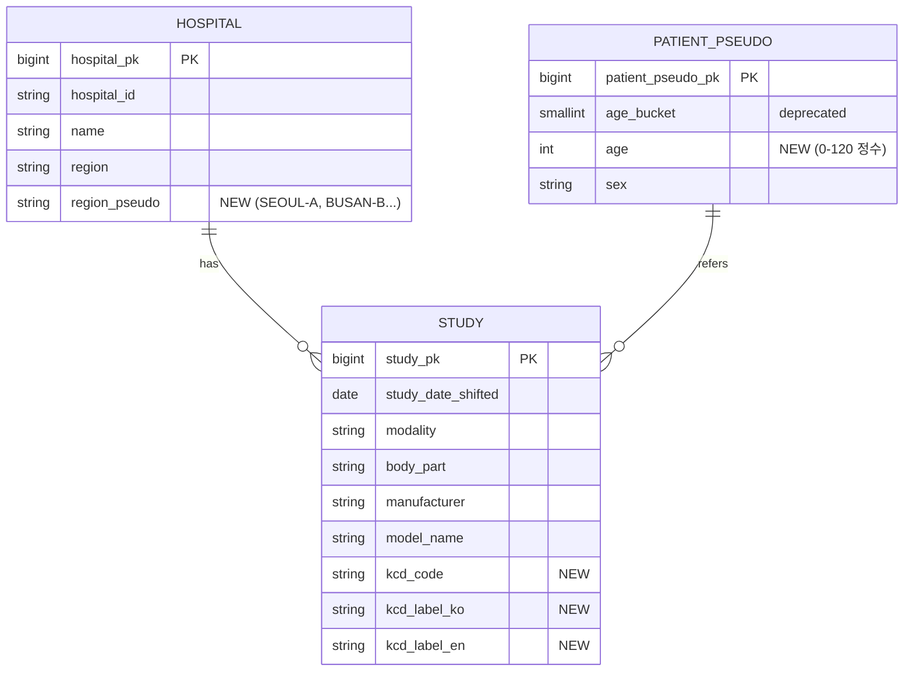
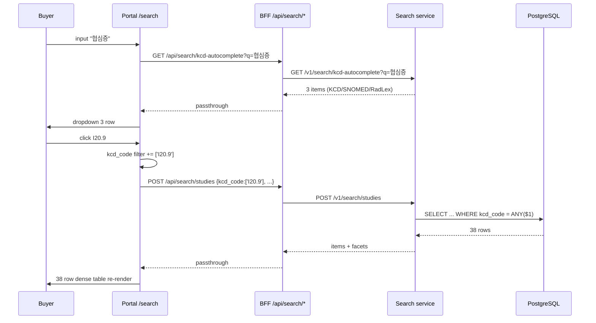
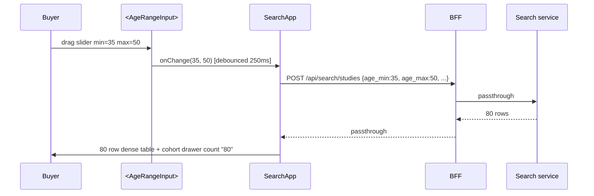
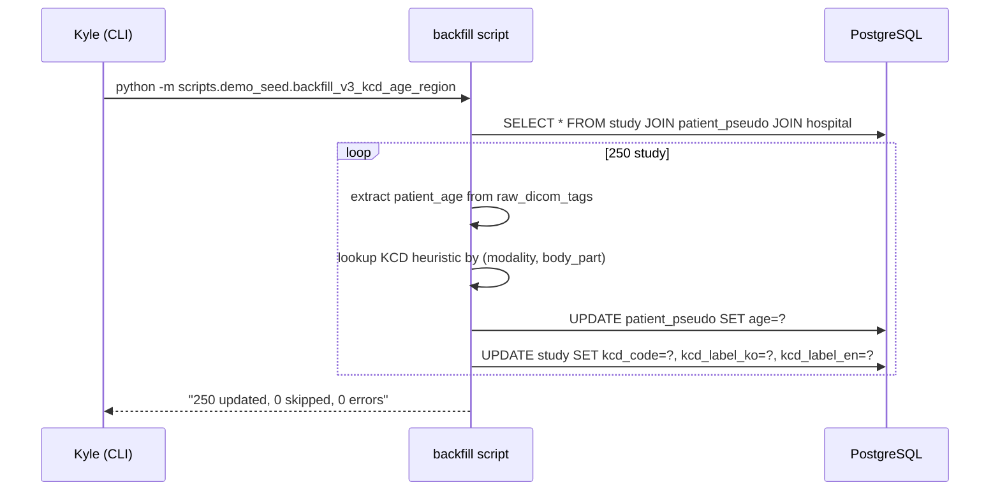

# 개발지시서 — Buyer Search v3 (Dense table + KCD + 정확 나이/일자)

> **Status**: Draft v0.1 · **Feature slug**: `buyer-search-v3` · **Last updated**: 2026-04-25
> **작성자**: @planner (Claude Opus 4.7 [1M])
> **본 문서가 갱신/보완**:
> - `dev-spec-portal-redesign.md` — FR-BP-3 / FR-BP-4 / FR-BP-7 / FR-BP-8 (search 결과 행 정보 밀도 + facet sidebar)
> - `dev-spec-metadata-thumbnail-ingest.md` — 추출 필드 셋에 KCD + 정확 나이 + region 가명 추가
> - `dev-spec-buyer-browse-preview.md` — search list 의 썸네일 0 정책 (썸네일은 study-detail 진입 후 사용, list 비노출)
> **근거**:
> - 디자인: [`design-spec-buyer-ux-v3.md`](./design-spec-buyer-ux-v3.md) (Kyle 2026-04-25 final 채택)
> - 디자인 mockup (final source of truth): `mockups/buyer-ux-v2/v3/{search,study-detail,account}.html` + `styles.css`
> - 리서치: [`segmed-openda-deep-dive.md`](../research/segmed-openda-deep-dive.md) (5사 비교, dense list / KCD-vs-SNOMED / De-ID 행정 격하)
> - 리서치: [`metadata-extraction-and-thumbnail.md`](../research/metadata-extraction-and-thumbnail.md) (DICOM 필드 enum, MVP 12 + v0.1.5 6)
> - PRD: [`prd.md`](../prd.md) §3 (buyer 코호트 검증 핵심 가치) · §4.1–§4.3 (PIPA/ontology)
> - ARCHITECTURE: [`ARCHITECTURE.md`](../ARCHITECTURE.md) §3.2 (Gateway extract) · §4.1 (Central ingest) · §4.3 (Search) · §5 (Portal BFF)

---

## 1. 기능 개요

RadiVault buyer 포털 `/search` 페이지를 v3 dense table 13 컬럼으로 재구현하고, 행을 의미있게 채우기 위해 다음 데이터 파이프 전 구간을 동시에 변경한다:
1. **Gateway 추출** — DICOM `PatientAge` 정확 정수, `study_date_shifted` 정확 일자, KCD 후보 코드 (modality+body_part heuristic), hospital region 가명 매핑.
2. **Central ingest persist** — `patient_pseudo.age` (정수), `study.kcd_code/label_ko/label_en`, `hospital.region_pseudo` 컬럼 추가 + alembic.
3. **Search service mirror + Pydantic schema** — `SearchRequest` 에 `age_min/age_max/kcd_code/model_name` filter, `SearchResponse` 에 KCD/region/정확나이 필드, `FacetsResponse` 에 `hospital_region/kcd_code` 추가 + `age_bucket` facet 제거.
4. **Portal BFF** — 응답 passthrough + KCD autocomplete 신규 endpoint.
5. **Portal `/search` UI** — dense table 13 컬럼, vertical accordion sidebar 5 그룹, age range input (min/max + dual-thumb slider), KCD autocomplete dropdown (3 ontology row), hospital region badge, modality color dot, trust bar + PIPA footer note. Pretendard + navy/teal/amber 토큰. EN/한 즉시 토글.
6. **250 study backfill 재실행** — 정확 나이 + 정확 일자 + KCD heuristic + hospital region 가명 채움. 멱등 + dry-run.
7. **E2E 검증** — D-13 데모에서 250 study 가 13 컬럼 모두 채워진 채 노출, age range/KCD/hospital region 필터가 실제 결과를 좁힘.

본 dev-spec 의 산출물은 D-13 데모 직전 (2026-05-08) `@developer` 가 즉시 구현 → `@qa` 검수 → 시연 가능한 상태로 만든다.

## 2. 사용자 스토리

- **As a** buyer (글로벌 AI 회사 데이터 엔지니어), **I want** /search 에서 250 건을 한 화면에 25 행 dense table 로 보고 KCD 코드·정확 나이·정확 일자를 동시에 비교하고 싶다, **so that** 코호트 통계 적합성을 빠르게 판단할 수 있다.
- **As a** buyer, **I want** "협심증" 한국어로 검색하면 KCD-8 / SNOMED / RadLex 3개 매칭이 동시에 뜨고 싶다, **so that** 한국 의료 코딩 체계와 글로벌 ontology 양쪽으로 코호트를 잡을 수 있다.
- **As a** buyer, **I want** 환자 나이를 5년 bucket 이 아닌 정수 (40-50 같은) range 로 좁히고 싶다, **so that** AI 학습 코호트의 연령 분포를 정확히 통제할 수 있다.
- **As a** Kyle (D-13 운영자), **I want** 250 study 가 13 컬럼 모두 의미 있게 채워진 채 시연되길 바란다, **so that** "필드 비어있다" 라는 사고를 피한다.
- **As a** Compliance/RA, **I want** 정확 나이/일자 노출이 PIPA §28-8 가명정보 처리 + buyer signed agreement + IRB 승인 + per-query audit log + 코호트 fulfillment 시 k≥5 보장 의 연쇄 위에서만 가능함이 명시되길 원한다, **so that** 감사 시 절차 입증이 가능하다.

## 3. 범위

### 포함 (In-scope)

**데이터 파이프**
- `patient_pseudo.age` (INT, 0-120, NULL 허용) 컬럼 추가. 기존 `age_bucket` 보존 (deprecation 단계).
- `study.kcd_code` (VARCHAR 10), `study.kcd_label_ko` (VARCHAR 200), `study.kcd_label_en` (VARCHAR 200) 컬럼 추가.
- `hospital.region_pseudo` (VARCHAR 20) 컬럼 추가 + 매핑 테이블 (HOSP-001→SEOUL-A, HOSP-002→BUSAN-B, 향후 DAEGU-C/INCHEON-D…).
- Gateway `extract_study_metadata()` 에 `patient_age` (정확 정수) + `kcd_code/label_ko/label_en` (heuristic) 추가.
- Manifest schema v2 → v2.1 (additive, manifest_version 변경 없음 — backward compatible).
- Central ingest 가 신 필드 persist.

**Search service**
- `SearchRequest` 신규 필드: `age_min`, `age_max`, `kcd_code` (배열), `model_name` (배열, 이미 facet 은 있으나 filter 신규).
- `SearchRequest` deprecation 필드: `age_bucket` (요청 양쪽 받음, 응답 객체에는 보존).
- `StudyItem` 신규 필드: `hospital_region_pseudo`, `kcd_code`, `kcd_label_ko`, `kcd_label_en`, `patient_age` (INT). 기존 `age_bucket`/`hospital_opaque_id` 보존.
- `FacetsResponse` 신규 필드: `hospital_region` (region 별 카운트), `kcd_code` (top N).
- `FacetsResponse` 제거 필드: `age_bucket` (range input 대체). **Schema breaking** — v3 SearchRequest 에서 `age_bucket` 은 양쪽 받기로 호환, FacetsResponse 의 `age_bucket` 만 빈 배열 반환 (제거가 아니라 deprecation, 필드 자체는 유지하되 항상 `[]`).
- KCD autocomplete 신규 endpoint `GET /v1/search/kcd-autocomplete?q=&limit=`.

**Portal BFF**
- `/api/search/studies` passthrough 필드 확장.
- `/api/search/facets` passthrough 필드 확장.
- 신규 `/api/search/kcd-autocomplete` proxy.

**Portal UI**
- `web/portal/src/app/search/SearchApp.tsx` 전면 재구성 (또는 신규 `<SearchAppV3>` 으로 점진 도입 후 라우트 swap).
- 신규 컴포넌트: `<ResultTable>` (dense 13 컬럼), `<ColumnToggle>`, `<FacetSidebarV3>` (5 그룹 accordion), `<AgeRangeInput>` (min/max + dual-thumb slider), `<KCDAutocomplete>` (3 ontology dropdown), `<HospitalBadge>` (region pseudo), `<ModalityDot>` (6색), `<TrustBar>` (header), `<PIPATrustNote>` (footer).
- 디자인 토큰 정식 등록 (UI_GUIDE 갱신).

**OPS**
- 250 study backfill 재실행 스크립트 (`scripts/demo_seed/backfill_v3_kcd_age_region.py`).
- `docs/ops/demo-day-runbook.md` 갱신.

### 제외 (Out-of-scope)

- **NLP 기반 KCD 매핑** — 본 phase 는 modality+body_part heuristic (옵션 C). NLP (StudyDescription → KCD) 는 v0.1.5 별도 dev-spec.
- **Study-detail 페이지 v3 재구현** — 본 dev-spec 은 search 만. Study-detail v3 (rich metadata 25 필드 + footer compliance collapse + longitudinal) 는 별도 phase.
- **Sample download / Add to cohort 동작 구현** — UI hook 만 mockup 수준 (button 노출 + sessionStorage), 백엔드 동작은 별도 dev-spec.
- **Audit log 강화** — 정확 나이/일자 노출 정책 변경에 따른 per-query audit log 강화는 본 dev-spec 에서 schema/UI 만 다룸. WORM 5y 강화 + 운영 로테이션은 별도 dev-spec.
- **모바일 (≤767px) 대응** — design-spec §12 정책상 비대상.
- **컬럼 너비 drag resize** — v0.2 backlog (Q-5 default NO).
- **Slice thickness range filter** — v0.1.5 deferred.
- **Modality 추가 (NM/OT)** — v0.1.5 (Q-10 default).
- **Customer-facing audit dashboard** — 별도 dev-spec.

## 4. 기능 요구사항

번호 표기: `FR-V3-<영역>-<n>`. 모든 FR 은 design-spec / 리서치 / 코드 줄 번호 근거. AC 는 §10 에서 1:1 매핑.

### 4.1 데이터 / 추출 / 스키마

#### FR-V3-DATA-1 — 정확 환자 나이 + 정확 일자
- **DB 변경** (alembic migration 1개):
  - `patient_pseudo.age INT NULL` 추가. CHECK `age IS NULL OR (age BETWEEN 0 AND 120)`.
  - 기존 `age_bucket SMALLINT` 보존 (deprecation, v0.2 에서 drop 예정).
  - `study.study_date_shifted DATE NULL` 이미 존재 — type 확인 + 인덱스 `idx_study_date` 보존.
- **Gateway 추출 변경**: `extract_study_metadata()` 가 `patient_age: int | None` 추가 반환. 파싱 규칙:
  - (0010,1010) `PatientAge` 우선. 형식 "030Y" → 30. 단위 'M' (months) → `floor(months/12)`. 단위 'D' / 'W' 또는 unparseable → None.
  - Fallback: (0010,0030) `PatientBirthDate` + (0008,0020) `StudyDate` → 차이 (years, floor).
  - `age > 120` 또는 `age < 0` → None (이상치 거부).
  - 결과는 manifest `study.patient_age` 로 송신.
  - 기존 `patient_age_bucket` 도 함께 송신 (호환).
- **Central ingest persist**: `patient_pseudo` upsert 시 `age` 컬럼 채움. 기존 행 갱신 시 신값으로 overwrite (gateway 가 더 정확하다 가정).
- **근거**: design-spec §6 / mockup `search.html` L.232-273 (age range input), Kyle 2026-04-25 결정 ("정확 나이 노출 OK").

#### FR-V3-DATA-2 — KCD-8 매핑 (한국 진단 코드, heuristic)
- **DB 변경** (alembic migration 1개, FR-V3-DATA-1 과 동일 migration):
  - `study.kcd_code VARCHAR(10) NULL`
  - `study.kcd_label_ko VARCHAR(200) NULL`
  - `study.kcd_label_en VARCHAR(200) NULL`
  - 인덱스: `idx_study_kcd_code` on `(kcd_code)` (facet 집계 + filter).
- **매핑 전략 (옵션 C — heuristic, D-13 demo)**:
  - 매핑 테이블은 코드 내 dict 로 하드코드 (`src/radivault_gateway/kcd_heuristic.py` 신규).
  - 룰 (modality + body_part → KCD): 본 dev-spec 에 16개 default 룰 명시 (researcher 보강 가능). 한국 의료 통계 (HIRA) 기반 대표 빈출 진단:

    | modality | body_part | kcd_code | kcd_label_ko | kcd_label_en |
    |---|---|---|---|---|
    | CT | CHEST | I20.9 | 협심증, 상세불명 | Angina pectoris, unspecified |
    | CT | HEAD | I63.9 | 뇌경색, 상세불명 | Cerebral infarction, unspecified |
    | CT | ABDOMEN | K85.9 | 급성 췌장염, 상세불명 | Acute pancreatitis, unspecified |
    | CT | PELVIS | N20.0 | 신장결석 | Calculus of kidney |
    | CT | SPINE | M51.9 | 추간판 장애, 상세불명 | Intervertebral disc disorder, unspecified |
    | CT | NECK | C73 | 갑상선 악성 신생물 | Malignant neoplasm of thyroid gland |
    | MR | HEAD | G45.9 | 일과성 뇌허혈 발작, 상세불명 | Transient ischaemic attack, unspecified |
    | MR | BRAIN | G45.9 | 일과성 뇌허혈 발작, 상세불명 | Transient ischaemic attack, unspecified |
    | MR | CHEST | I25.1 | 죽상경화성 심장병 | Atherosclerotic heart disease |
    | MR | SPINE | M51.9 | 추간판 장애, 상세불명 | Intervertebral disc disorder, unspecified |
    | MR | KNEE | M23.9 | 무릎 내장, 상세불명 | Internal derangement of knee, unspecified |
    | MG | BREAST | C50.9 | 유방의 악성 신생물, 상세불명 | Malignant neoplasm of breast, unspecified |
    | CR | CHEST | J18.9 | 폐렴, 상세불명 | Pneumonia, unspecified |
    | CR | HAND | S62.9 | 손목 및 손의 골절 | Fracture of wrist and hand level |
    | US | ABDOMEN | K76.0 | 지방간 | Fatty (change of) liver, NEC |
    | PT | CHEST | C34.9 | 기관지 및 폐의 악성 신생물 | Malignant neoplasm of bronchus and lung |

  - 매칭 실패 (modality+body_part 조합이 표에 없음) → `kcd_code = "Z00.0"` (일반 의료 검진), `kcd_label_ko = "일반 의학적 검사"`, `kcd_label_en = "General medical examination"`.
  - **한계 명시 (UI/문서)**: 본 KCD 는 heuristic 매핑이며 실제 진단이 아님. v0.1.5 NLP 매핑으로 정밀화. design-spec §17 footer note + UI tooltip 으로 buyer 에게 명시.
- **Gateway 변경**: `extract_study_metadata()` 가 `kcd_code/label_ko/label_en` 추가 반환. heuristic 룩업.
- **Central persist**: `study` row insert/update 시 신 컬럼 채움.
- **근거**: 리서치 segmed-openda-deep-dive §6 (KCD 가 한국 차별), Kyle 결정 (Q-1 옵션 C heuristic).

#### FR-V3-DATA-3 — Hospital Region 가명
- **DB 변경** (alembic migration 1개, FR-V3-DATA-1/2 와 동일):
  - `hospital.region_pseudo VARCHAR(20) NULL`
  - 인덱스: `idx_hospital_region_pseudo` on `(region_pseudo)` (facet 집계용).
- **매핑 (seed/migration data)**:
  - HOSP-001 → "SEOUL-A"
  - HOSP-002 → "BUSAN-B"
  - 향후 추가: DAEGU-C, INCHEON-D, GWANGJU-E, DAEJEON-F, ULSAN-G (영문 ASCII 지역명 + 알파벳 sequence).
  - 매핑은 alembic data migration 으로 hardcode (소규모 운영, 향후 확장은 admin API 별도).
- **Search service mirror**: hospital region 가명을 study 레벨 join 결과에 노출. `StudyItem.hospital_region_pseudo` 추가.
- **근거**: design-spec §6 / mockup `search.html` L.119-138 (hospital badge).

#### FR-V3-DATA-4 — Manufacturer / Model 응답 분리 확인
- 이미 `study.manufacturer`, `study.model_name` 컬럼 존재 (FR-META 결과). 본 phase 는 응답 schema 의 `manufacturer` + `manufacturer_model_name` 두 필드가 분리 노출됨을 재확인 + dense table 컬럼 8 (Manufacturer) 와 9 (Model) 가 별도임을 확정.
- **변경**: 없음 (확인용 FR).

### 4.2 API / Search service

#### FR-V3-API-1 — SearchRequest 확장
- **모듈**: `src/radivault_search/query/schema.py`.
- **신규 필드**:
  ```python
  age_min: int | None = Field(None, ge=0, le=120)
  age_max: int | None = Field(None, ge=0, le=120)
  kcd_code: list[str] | None = Field(None, max_length=20)
  model_name: list[str] | None = Field(None, max_length=20)
  hospital_region: list[str] | None = Field(None, max_length=20)  # facet filter — region pseudo
  ```
- **검증**: `age_min <= age_max` (둘 다 비-NULL 시). swap 보정은 client 가 아닌 server 가 거부 (422).
- **deprecation**: `age_bucket` 필드는 보존하나 docstring 에 "deprecated, use age_min/age_max" 명시. 양쪽이 동시에 들어오면 `age_min/age_max` 우선 (`age_bucket` 무시 + warning 로그).
- **canonical_filter_dict 갱신**: 신규 필드 6개 모두 정렬 후 dict 에 포함 (cursor sha256 binding 영향).
- **filter_fields_list 갱신**: 동일.
- **근거**: design-spec §6 + mockup L.230-275.

#### FR-V3-API-2 — SearchResponse 확장
- **모듈**: `src/radivault_search/query/schema.py` `StudyItem`.
- **신규 필드** (모두 Optional, 기존 호환):
  ```python
  hospital_region_pseudo: str | None = None  # "SEOUL-A"
  kcd_code: str | None = None
  kcd_label_ko: str | None = None
  kcd_label_en: str | None = None
  patient_age: int | None = None  # 정확 정수
  ```
- **기존 필드 보존**: `age_bucket`, `hospital_opaque_id`, `preview_status`, `preview_slice_count` 모두 그대로.
- **executor 변경**: `src/radivault_search/query/executor.py` 의 SELECT 절에 신규 컬럼 5개 추가 + JOIN `hospital` (region_pseudo 위함).
- **근거**: design-spec §8 컬럼 정의 표 (13 컬럼 1:1 매핑).

#### FR-V3-API-3 — FacetsResponse 확장
- **모듈**: `src/radivault_search/query/facets.py` + `schema.py`.
- **신규 필드**:
  ```python
  hospital_region: list[FacetValue] = Field(default_factory=list)
  kcd_code: list[FacetValue] = Field(default_factory=list)
  ```
- **deprecation**: `age_bucket` 필드는 schema 에 보존하되 항상 빈 배열 반환 (`[]`). v0.2 에서 schema 자체 제거.
- **executor 변경**: `src/radivault_search/query/facets.py` 의 집계 SQL 에 `hospital_region` (group by hospital.region_pseudo), `kcd_code` (group by study.kcd_code, top 30 + "Other") 추가.
- **근거**: design-spec §6 / mockup L.107-198 (sidebar 5 그룹).

#### FR-V3-API-4 — KCD Autocomplete Endpoint (신규)
- **경로**: `GET /v1/search/kcd-autocomplete?q=<string>&limit=<int default 10>`.
- **모듈**: `src/radivault_search/routers/search.py` 또는 신규 `routers/kcd.py`.
- **인증**: 기존 buyer bearer 와 동일 (search 와 같은 권한).
- **데이터 소스 (MVP)**: 코드 내 정적 dict (KCD-8 top 50) + SNOMED top 50 + RadLex top 50, total 150 entry. 검색 알고리즘은 substring match (case-insensitive, 한·영·코드 3 필드 OR), score = (exact code match 100, code prefix 80, ko substring 60, en substring 50, other 30) 내림차순.
- **응답**:
  ```json
  {
    "items": [
      {
        "ontology": "KCD-8",
        "code": "I20.9",
        "label_ko": "협심증, 상세불명",
        "label_en": "Angina pectoris, unspecified"
      },
      {
        "ontology": "SNOMED",
        "code": "194828000",
        "label_ko": "협심증 (안정형)",
        "label_en": "Angina (disorder)"
      },
      {
        "ontology": "RadLex",
        "code": "RID3501",
        "label_ko": "관상동맥",
        "label_en": "Coronary artery"
      }
    ],
    "computed_at": "2026-04-25T12:34:56Z"
  }
  ```
- **응답 보장**: 각 ontology 당 최대 (limit/3) 개씩 반환 (3 ontology 균등 노출). 결과 0건이면 `items: []`.
- **rate limit**: 60 req/min/buyer (기존 search 와 별도, autocomplete 는 typing 단위 호출).
- **에러**: 4xx/5xx 표준 에러 envelope (`{ error, detail, request_id }`).
- **근거**: mockup `search.html` L.59-83 (3 row autocomplete), Q-9 결정 (backend endpoint, ontology version control 필요).

#### FR-V3-API-5 — Search executor JOIN + index 활용
- `study` ↔ `patient_pseudo` ↔ `hospital` 3 way JOIN 필요. 기존에 JOIN 이 있을 가능성 — `executor.py` 검토 후 region_pseudo 만 SELECT 추가.
- 인덱스 활용: `idx_study_kcd_code` (filter), `idx_hospital_region_pseudo` (filter). EXPLAIN 으로 250 study 기준 sequential scan 이어도 OK (volume 작음).

### 4.3 Portal BFF

#### FR-V3-BFF-1 — `/api/search/studies` passthrough 확장
- 변경 사실상 없음 (passthrough). 신규 필드는 자동으로 client 까지 흐름.
- TS 타입: `web/portal/src/lib/types/search.ts` (또는 유사) 의 `StudyItem` 타입에 신규 필드 5개 추가.

#### FR-V3-BFF-2 — `/api/search/facets` passthrough 확장
- 동일. TS 타입 갱신만.

#### FR-V3-BFF-3 — `/api/search/kcd-autocomplete` 신규 proxy
- 신규 파일: `web/portal/src/app/api/search/kcd-autocomplete/route.ts`.
- 패턴: 기존 `studies/route.ts` 그대로 (GET, query string passthrough).
- 응답: search service `/v1/search/kcd-autocomplete` 그대로.

### 4.4 Portal UI

#### FR-V3-UI-1 — Dense Table 13 컬럼 (`<ResultTable>`)
- **위치**: `web/portal/src/app/search/SearchApp.tsx` 또는 신규 `web/portal/src/components/buyer/ResultTable.tsx`.
- **컬럼 grid**: CSS grid `grid-template-columns: 4px 32px 96px 90px 72px 96px minmax(140px,1fr) 32px 40px 96px 110px 72px 64px 56px 64px` (총 15 트랙: stripe + checkbox + 13 visible col).
- **컬럼 정의** (좌→우):
  | # | Key | Width | Sortable | Default visible | Source |
  |---|---|---|---|---|---|
  | — | stripe | 4px | — | always | `hospital_region_pseudo` 색 매핑 |
  | — | checkbox | 32px | — | always | row-selection state |
  | 1 | hospital | 96px | YES | YES | `<HospitalBadge regionPseudo>` |
  | 2 | exam_date | 90px | YES (default ↓) | YES | `study_date_shifted` YYYY-MM-DD |
  | 3 | modality | 72px | YES | YES | `<ModalityDot>` + 라벨 |
  | 4 | body_part | 96px | YES | YES | uppercase |
  | 5 | kcd | 1fr min140 | YES | YES | `<KCDChip code>` + label (한·영) |
  | 6 | sex | 32px | YES | YES | F/M/O 단일 문자 |
  | 7 | age | 40px | YES | YES | `patient_age` 정수 |
  | 8 | manufacturer | 96px | YES | YES | uppercase |
  | 9 | model | 110px | YES | YES | mono font, ellipsis |
  | 10 | sr_inst | 72px | NO | YES | `n_series·n_instances` |
  | 11 | size | 64px | YES | YES | MB right-align |
  | 12 | uid | 56px | NO | YES | mono, 말미 4-6자 |
  | 13 | view_action | 64px | — | YES (hover 노출) | "View →" link |
- **row height**: 52px (CSS var `--rv-row-h`).
- **sortable**: 9 컬럼 (1, 2, 3, 4, 5, 7, 8, 9, 11). 클릭 시 `aria-sort` 토글, server 에 `sort` 파라미터 전달 (현재 enum `date_desc/ingested_desc` 만 → 9개 enum 추가 필요: `hospital_asc/desc, date_asc/desc, modality_asc/desc, body_part_asc/desc, kcd_asc/desc, age_asc/desc, manufacturer_asc/desc, model_asc/desc, size_asc/desc`). default `date_desc`.
- **page size**: 25 default + toggle (25/50/100). `limit` 파라미터.
- **hover**: row background `var(--rv-stone-50)`, view action 노출.
- **column toggle**: `<ColumnToggle>` 별도 (FR-V3-UI-1b).
- **근거**: design-spec §8 + mockup `search.html` 의 `.result-table` block.

#### FR-V3-UI-1b — `<ColumnToggle>` Dropdown
- 우측 상단 "Show columns ▾" 버튼.
- 13 컬럼 + 4 advanced (slice_thickness, kvp, magnetic_field, audit_hash) — advanced 4 는 v0.1.5 flagged + disabled checkbox.
- 클릭 시 `<ResultTable>` 의 grid-template-columns 동적 재계산.
- 사용자 토글 결과는 `localStorage` 에 저장 (`rv-search-cols-v3` 키).

#### FR-V3-UI-2 — Vertical Accordion Sidebar (`<FacetSidebarV3>`)
- **위치**: `web/portal/src/components/buyer/FacetSidebar.tsx` v3 redesign.
- **너비**: 320px (CSS var `--rv-sidebar-w`).
- **5 그룹** (모두 default expanded, accordion expand/collapse):
  1. **Hospital**: region 체크박스 (SEOUL-A, BUSAN-B, DAEGU-C "soon"). count 표시.
  2. **Clinical**: KCD code 체크박스 (top 10) + Body part 체크박스 (top 10).
  3. **Patient**: Sex 체크박스 (F/M/O) + `<AgeRangeInput>` 컴포넌트 (FR-V3-UI-3).
  4. **Imaging**: Modality 체크박스 (6색) + Slice thickness range (v0.1.5 disabled).
  5. **Time**: Year 체크박스 (top 5).
- **De-ID verified facet 0**: 명시적으로 facet 에 노출하지 않음 (baseline guarantee). header trust bar 만.
- **상태 동기화**: 각 토글 변경 시 SearchRequest 재구성 + studies+facets re-fetch (debounce 250ms).
- **근거**: design-spec §10 component inventory + mockup `search.html` L.99-380.

#### FR-V3-UI-3 — `<AgeRangeInput>` 컴포넌트 (신규)
- **Props**:
  ```ts
  type Props = {
    min: number;          // 0
    max: number;          // 120
    valueMin: number;     // controlled
    valueMax: number;     // controlled
    onChange: (min: number, max: number) => void;
    countHint?: string;   // "250 studies"
  };
  ```
- **UI**: min number input + "–" + max number input (양쪽 정렬), 아래 dual-thumb slider (vanilla CSS or `react-slider`/`@radix-ui/react-slider`).
- **양방향 sync**: number 입력 → slider 위치, slider drag → number 값.
- **min > max 보정**: input blur 시 swap. server 422 에러 사전 차단.
- **a11y**: 각 input `aria-label`, slider thumb `aria-valuenow/min/max/text`.
- **권고**: `@radix-ui/react-slider` 사용 (이미 portal 에 radix 가 있으면 reuse, 없으면 add).
- **근거**: mockup `search.html` L.230-275.

#### FR-V3-UI-4 — `<KCDAutocomplete>` 컴포넌트 (신규)
- **Props**:
  ```ts
  type Props = {
    value: string;
    onChange: (value: string) => void;
    onSelect: (item: KCDItem) => void;  // facet 에 chip 추가
    placeholder?: string;
  };
  type KCDItem = {
    ontology: 'KCD-8' | 'SNOMED' | 'RadLex';
    code: string;
    label_ko: string;
    label_en: string;
  };
  ```
- **UI**: search input + focus 시 dropdown open. dropdown 행 1개당 4 컬럼 (code mono, label_ko, label_en, ontology badge).
- **데이터 소스**: `/api/search/kcd-autocomplete?q=<value>&limit=12` debounce 200ms.
- **선택 시**: `onSelect(item)` 호출. 부모는 `kcd_code` filter 에 추가하고 input clear.
- **에러 처리**: API 500 → dropdown 회색 박스 + "ontology temporarily unavailable · search by free text" (design-spec §5.3).
- **a11y**: `role="combobox"`, `aria-expanded`, `aria-controls`, `aria-activedescendant`. ↑↓ Enter 키 navigation.
- **근거**: mockup `search.html` L.59-83.

#### FR-V3-UI-5 — `<HospitalBadge>` (신규)
- **Props**: `regionPseudo: string`, `variant?: 'badge' | 'dot'`.
- **색상 매핑** (CSS var, UI_GUIDE 등록):
  - `SEOUL-*` → `--rv-region-seoul: #1D4ED8` (blue)
  - `BUSAN-*` → `--rv-region-busan: #14B8A6` (teal)
  - `DAEGU-*` → `--rv-region-daegu: #F59E0B` (amber)
  - `INCHEON-*` → `--rv-region-incheon: #8B5CF6` (purple)
  - `GWANGJU-*` → `--rv-region-gwangju: #10B981` (emerald)
  - `DAEJEON-*` → `--rv-region-daejeon: #EF4444` (red)
  - `ULSAN-*` → `--rv-region-ulsan: #06B6D4` (cyan)
  - default → `--rv-stone-500`
- **variant**:
  - `badge`: 6px dot + 라벨 텍스트 (예 `● SEOUL-A`)
  - `dot`: 4px stripe (table row 좌측 stripe 용)
- **근거**: mockup `styles.css` `.hospital-badge` block.

#### FR-V3-UI-6 — `<ModalityDot>` (신규)
- **Props**: `modality: 'CT' | 'MR' | 'MG' | 'CR' | 'US' | 'PT'`.
- **색상 매핑**:
  - CT → `--mod-ct: #0EA5E9` (sky)
  - MR → `--mod-mr: #8B5CF6` (purple)
  - MG → `--mod-mg: #EC4899` (pink)
  - CR → `--mod-cr: #10B981` (emerald)
  - US → `--mod-us: #F97316` (orange)
  - PT → `--mod-pt: #EF4444` (red)
  - 기타 (NM/OT) → `--rv-stone-400` (v0.1.5 까지)
- **렌더**: 8px round dot + 라벨 옵션.
- **근거**: design-spec §6.2 / mockup `styles.css` `.mod-dot--*`.

#### FR-V3-UI-7 — `<TrustBar>` (Header) + `<PIPATrustNote>` (Footer)
- **TrustBar**: header navy bg 안에 항상 노출. 텍스트 (ko/en):
  - en: "PIPA §28-8 · 정통망법 · KCD-8"
  - ko: "개인정보보호법 §28-8 · 정통망법 · KCD-8"
- **PIPATrustNote**: footer amber-bordered note (한·영). 본문:
  - en: "Production policy: exact patient age (years) and exam date (YYYY-MM-DD) are surfaced to verified buyers. Per-buyer access controlled via signed PIPA §28-8 data use agreement, IRB approval, and per-query audit log. Aggregate re-identification risk is mitigated by hospital-level k-anonymity ≥ 5 cohort guarantees enforced at fulfillment time."
  - ko: "운영 정책: 정확 환자 나이(세) 와 촬영일(YYYY-MM-DD) 은 검증된 buyer 에게만 노출됩니다. 개인정보보호법 §28-8 가명정보 처리 동의, IRB 승인, 쿼리별 감사 로그로 buyer별 접근이 통제됩니다. 집단 재식별 위험은 fulfillment 시 병원별 k-익명성 ≥ 5 코호트 보장으로 완화됩니다."
- **근거**: mockup footer + Kyle 결정 (Q-4 정확 노출 YES, 단 정책 명시).

#### FR-V3-UI-8 — i18n EN/한국어 즉시 토글
- header 에 EN / 한국어 toggle 버튼.
- 클릭 시 `body[data-locale]` 속성 변경 + CSS `[data-locale="ko"] .en { display:none }` 식으로 즉시 swap (페이지 새로고침 X).
- 컬럼 헤더, facet 라벨, badge 라벨, autocomplete dropdown 등 모든 사용자 노출 카피는 EN+KR 양쪽 마크업.
- 폰트: ko 모드 시 Pretendard 우선 (`body[data-locale="ko"] { font-family: var(--font-ko); }`).
- 사용자 선택 결과는 `localStorage` (`rv-locale-v3` 키).
- **근거**: design-spec §14, Q-7 결정 (한·영 병기 — 단, 칼럼 헤더는 locale swap, 본문은 양쪽 동시).

#### FR-V3-UI-9 — 디자인 토큰 정식 등록
- **`docs/UI_GUIDE.md` 갱신**:
  - 컬러 토큰: navy 5단, teal 4단, amber 2단, stone 5단, modality 6색, hospital region 7색.
  - 타이포: Pretendard, Inter, JetBrains Mono.
  - 레이아웃: `--rv-row-h: 52px`, `--rv-row-h-sm: 44px`, `--rv-sidebar-w: 320px`, `--rv-table-zebra`, `--rv-table-divider`, `--rv-col-stripe-w: 4px`.
  - radius 4–10.
- **Tailwind config 또는 CSS variable 등록**: `web/portal/src/app/globals.css` (또는 별도 `tokens.css`) 에 :root variable 정의.
- 본 dev-spec 이 UI_GUIDE 갱신을 트리거. PR 분리 권장.

### 4.5 운영 / Backfill

#### FR-V3-OPS-1 — 250 study 백필 재실행
- **신규 스크립트**: `scripts/demo_seed/backfill_v3_kcd_age_region.py`.
- **동작**:
  1. PostgreSQL 연결 후 모든 `study` row 순회.
  2. 각 row 의 `study.raw_dicom_tags` (이미 ingest 시 저장됨) 또는 manifest 기반으로 `patient_age` 정확값 재추출 (`(0010,1010) PatientAge` 파싱).
  3. `study.modality` + `study.body_part` 룩업으로 KCD heuristic 적용 (FR-V3-DATA-2 의 16개 룰 표 + default `Z00.0`).
  4. `patient_pseudo.age` 갱신, `study.kcd_code/label_ko/label_en` 갱신.
  5. `hospital.region_pseudo` 매핑 (HOSP-001→SEOUL-A, HOSP-002→BUSAN-B) — alembic data migration 으로 사전 처리되지만 backfill 도 idempotent 보장.
- **CLI**: `python -m scripts.demo_seed.backfill_v3_kcd_age_region [--dry-run] [--limit N] [--hospital HOSP-001]`.
- **멱등성**: 재실행 시 동일 결과 (UPSERT pattern).
- **dry-run**: 변경 row 수만 출력, commit 없음.
- **로깅**: 각 row 별 변경 전/후 값 (JSON line) → stdout. `--quiet` 옵션으로 요약만.
- **runbook 갱신**: `docs/ops/demo-day-runbook.md` 에 본 스크립트 실행 step 추가.
- **근거**: 본 dev-spec 입력 (D-13 데모 재시연 필요).

## 5. 비기능 요구사항

| 항목 | 요구 |
|------|------|
| **성능** | NFR-V3-PERF-1: `/v1/search/studies` p95 < 300ms (250 study 풀 응답, 13 컬럼). `/v1/search/facets` p95 < 200ms. `/v1/search/kcd-autocomplete` p95 < 100ms (정적 dict in-memory). |
| **성능** | NFR-V3-PERF-2: portal `/search` 첫 페이지 LCP < 2.5s (250 study 25 row + 5 facet 그룹). |
| **보안** | NFR-V3-SEC-1: 신규 endpoint `kcd-autocomplete` 도 buyer bearer 검증 동일. 익명 호출 거부 (401). |
| **보안** | NFR-V3-SEC-2: 정확 나이 + 정확 일자 응답은 PIPA §28-8 가명정보 — buyer tier 검증 (preview tier 도 동일 노출 OK; tier별 제한은 별도 dev-spec). |
| **컴플라이언스** | NFR-V3-COMPLIANCE-1: 정확 나이/일자 노출 정책은 footer `<PIPATrustNote>` 로 항상 명시. WORM 감사 강화는 별도 dev-spec, 본 dev-spec 은 schema/UI 만. |
| **가용성** | NFR-V3-AVAIL-1: 신규 KCD autocomplete endpoint 다운 시 portal 검색 자체는 동작 (free-text fallback). |
| **로깅·감사** | NFR-V3-AUDIT-1: `/v1/search/studies` audit 에 `age_min/age_max/kcd_code/hospital_region` 필터 사용 기록 (`filter_fields_list` 에 포함). 정확 나이 조회 시도는 audit_event 에 별도 마킹 (`exact_age_filter: bool`). |
| **국제화** | NFR-V3-I18N-1: ko/en 두 언어 즉시 토글, 누락된 카피 0건. 한국어 기본값 (`<body data-locale="ko">`). |
| **접근성** | NFR-V3-A11Y-1: WCAG AA 대비 (본문 9.34:1, primary 13.0:1). 모든 input ARIA. 키보드 navigation 100%. `prefers-reduced-motion` 대응. |
| **호환성** | NFR-V3-COMPAT-1: `SearchRequest.age_bucket` 필드 보존 (deprecation period). 기존 클라이언트 break 없음. v0.2 에서 schema 제거 예정. |

## 6. 데이터 모델

### 6.1 alembic migration (단일 migration, version `0003_v3_kcd_age_region`)

```sql
-- patient_pseudo: 정확 나이
ALTER TABLE patient_pseudo
  ADD COLUMN age INTEGER NULL CHECK (age IS NULL OR (age BETWEEN 0 AND 120));

-- study: KCD 매핑
ALTER TABLE study
  ADD COLUMN kcd_code VARCHAR(10) NULL,
  ADD COLUMN kcd_label_ko VARCHAR(200) NULL,
  ADD COLUMN kcd_label_en VARCHAR(200) NULL;

CREATE INDEX idx_study_kcd_code ON study (kcd_code);

-- hospital: region 가명
ALTER TABLE hospital
  ADD COLUMN region_pseudo VARCHAR(20) NULL;

CREATE INDEX idx_hospital_region_pseudo ON hospital (region_pseudo);

-- data: hospital region 매핑 seed
UPDATE hospital SET region_pseudo = 'SEOUL-A' WHERE hospital_id = 'HOSP-001';
UPDATE hospital SET region_pseudo = 'BUSAN-B' WHERE hospital_id = 'HOSP-002';
```

`downgrade()`: 위 ALTER 의 역순 DROP.

### 6.2 ER 변경 (mermaid)



## 7. API 계약

### 7.1 POST `/v1/search/studies`

**Request** (신규/변경 필드 굵게):

```jsonc
{
  "modality": ["CT", "MR"],
  "body_part": ["CHEST"],
  "sex": ["F", "M"],
  "age_min": 35,                   // NEW
  "age_max": 50,                   // NEW
  "age_bucket": null,              // deprecated, ignored if age_min/max present
  "kcd_code": ["I20.9", "I25.1"],  // NEW
  "hospital_region": ["SEOUL-A"],  // NEW (region pseudo filter)
  "manufacturer": ["SIEMENS"],
  "model_name": ["SOMATOM Drive"], // NEW (filter; facet 은 기존)
  "study_date_shifted": { "from": "2024-01-01", "to": "2024-12-31" },
  "min_hospitals": 2,
  "sort": "date_desc",             // enum 확장: 9개 추가
  "limit": 25,
  "cursor": null,
  "include_facets": true
}
```

**Response** (신규/변경 필드 굵게):

```jsonc
{
  "items": [
    {
      "pseudo_study_uid": "1.2.840.HOSP1.7392.20240815.001",
      "modality": "CT",
      "body_part": "CHEST",
      "age_bucket": "50-54",                       // deprecated, 보존
      "patient_age": 52,                            // NEW
      "sex": "F",
      "study_date_shifted": "2024-08-15",
      "manufacturer": "SIEMENS",
      "model_name": "SOMATOM Drive",
      "n_instances": 312,
      "n_series": 3,
      "total_bytes": 502267904,
      "hospital_opaque_id": "HOSP-001-opaque",
      "hospital_region_pseudo": "SEOUL-A",          // NEW
      "kcd_code": "I20.9",                           // NEW
      "kcd_label_ko": "협심증, 상세불명",            // NEW
      "kcd_label_en": "Angina pectoris, unspecified", // NEW
      "ingested_at": "2024-08-16T03:42:11Z",
      "preview_status": "verified",
      "preview_slice_count": 312
    }
  ],
  "facets": {
    "modality": [{ "value": "CT", "count": 98 }],
    "body_part": [{ "value": "CHEST", "count": 112 }],
    "sex": [{ "value": "F", "count": 128 }, { "value": "M", "count": 122 }],
    "age_bucket": [],                                // deprecated, always empty
    "manufacturer": [{ "value": "SIEMENS", "count": 80 }],
    "model_name": [{ "value": "SOMATOM Drive", "count": 32 }],
    "year": [{ "value": "2024", "count": 250 }],
    "contrast_used": [],
    "hospital_region": [                              // NEW
      { "value": "SEOUL-A", "count": 142 },
      { "value": "BUSAN-B", "count": 108 }
    ],
    "kcd_code": [                                     // NEW
      { "value": "I20.9", "count": 38 },
      { "value": "I25.1", "count": 21 },
      { "value": "I63.9", "count": 17 }
    ],
    "computed_at": "2026-04-25T12:34:56Z"
  },
  "pagination": { "next_cursor": null, "has_more": false, "page_size": 25 },
  "meta": { "total_hint": 250, "query_duration_ms": 38, "buyer_tier": "preview" }
}
```

**Errors**:
- 422 `ERR_INVALID_AGE_RANGE` — `age_min > age_max`.
- 422 `ERR_INVALID_KCD_CODE` — kcd_code 가 dict 에 없는 경우 (validation strict 옵션, 단 본 phase 는 strict=False — 모르는 코드는 그냥 0건 반환).
- 4xx/5xx 기타 표준 envelope.

### 7.2 GET `/v1/search/facets`

**Response**: 위 §7.1 의 `facets` 부분과 동일 (single endpoint 호출 시).

### 7.3 GET `/v1/search/kcd-autocomplete` (신규)

**Request**:
```
GET /v1/search/kcd-autocomplete?q=협심증&limit=12
Authorization: Bearer <buyer_token>
```

**Response**:
```jsonc
{
  "items": [
    { "ontology": "KCD-8",  "code": "I20.9",     "label_ko": "협심증, 상세불명", "label_en": "Angina pectoris, unspecified" },
    { "ontology": "SNOMED", "code": "194828000", "label_ko": "협심증 (안정형)", "label_en": "Angina (disorder)" },
    { "ontology": "RadLex", "code": "RID3501",   "label_ko": "관상동맥",         "label_en": "Coronary artery" }
  ],
  "computed_at": "2026-04-25T12:34:56Z"
}
```

**Errors**:
- 400 `ERR_INVALID_QUERY` — `q` 비어있음 또는 length > 100.
- 401 `ERR_AUTH_EXPIRED`.
- 429 `ERR_RATE_LIMIT` — 60 req/min 초과.

### 7.4 Portal BFF routes

- `POST /api/search/studies` — passthrough (변경 사실상 없음, TS 타입만).
- `GET /api/search/facets` — passthrough.
- `GET /api/search/kcd-autocomplete?q=&limit=` — 신규 proxy.

## 8. 시퀀스·플로우

### 8.1 KCD autocomplete + 적용 → 결과 좁힘



### 8.2 Age range input → 결과 좁힘



### 8.3 Backfill 250 study



## 9. 의존성

### 9.1 상위 모듈 / 외부
- **PostgreSQL** — alembic migration 적용 가능 환경.
- **Pretendard 웹폰트 CDN** — `https://cdn.jsdelivr.net/gh/orioncactus/pretendard/dist/web/static/pretendard.css`.
- **Inter / JetBrains Mono** — Google Fonts.

### 9.2 하위 모듈 / 영향
- `radivault_gateway.extract` — `extract_study_metadata` 시그니처 확장.
- `radivault_gateway.manifest` — 신 필드 송신.
- `radivault_central.db.models` — `PatientPseudo.age`, `Study.kcd_*`, `Hospital.region_pseudo` 추가.
- `radivault_central.routers.ingest` — 신 필드 persist.
- `radivault_search.db.models` — mirror schema 확인 (필요 시 동일 ALTER).
- `radivault_search.query.{schema, executor, facets}` — Pydantic + SQL 변경.
- `radivault_search.routers.search` — `/kcd-autocomplete` 신규.
- `web/portal/src/app/api/search/*` — passthrough + 신규 route.
- `web/portal/src/app/search/SearchApp.tsx` — v3 재구성.
- `web/portal/src/components/buyer/*` — 신규 컴포넌트 7개 + 갱신 1개.
- `docs/UI_GUIDE.md` — 토큰 정식 등록.
- `docs/ops/demo-day-runbook.md` — backfill step 추가.

### 9.3 선행 조건
- `dev-spec-metadata-thumbnail-ingest.md` 구현 완료 (manifest v2, 250 study 1차 backfill 됨) — **충족**.
- `dev-spec-portal-redesign.md` 의 buyer 포털 routes/auth 구현 완료 — **충족**.
- `dev-spec-buyer-browse-preview.md` 의 search list 썸네일 hook 존재 — 본 phase 에서 **제거** (썸네일 0).

### 9.4 후속 dev-spec 영향
- `dev-spec-portal-redesign.md` 의 FR-BP-4 ("최소 7 개 필드") → "13 컬럼 dense table" 갱신 필요.
- `dev-spec-portal-redesign.md` 의 FR-BP-7 (썸네일 list) → 본 dev-spec 에서 제거.
- `dev-spec-buyer-browse-preview.md` 의 list 썸네일 노출 → 제거 (study-detail 만 보존).
- 신규 `dev-spec-kcd-nlp-mapping.md` (v0.1.5) — heuristic → NLP 정밀화.

## 10. 수용 기준 (Acceptance Criteria)

`@qa` 가 본 체크리스트로 검수. 자동화 + 수동 시나리오 혼합.

### 10.1 Data 계층

- [ ] **AC-V3-DATA-1.1**: alembic migration `0003_v3_kcd_age_region` 가 PostgreSQL 에 적용 가능 (upgrade + downgrade 양방향).
- [ ] **AC-V3-DATA-1.2**: 250 study backfill 후 `patient_pseudo.age` non-NULL 비율 ≥ 95%, 값 범위 0-120.
- [ ] **AC-V3-DATA-1.3**: 250 study `study.study_date_shifted` 모두 valid DATE (YYYY-MM-DD), null 0건.
- [ ] **AC-V3-DATA-2.1**: 250 study 중 `kcd_code` non-NULL 비율 100% (default `Z00.0` 포함). KCD heuristic 표 16개 룰 매칭률 ≥ 80% (나머지는 default).
- [ ] **AC-V3-DATA-2.2**: `study.kcd_label_ko/en` 모두 non-NULL.
- [ ] **AC-V3-DATA-3.1**: `hospital.region_pseudo` 100% 채움 (HOSP-001 → "SEOUL-A", HOSP-002 → "BUSAN-B").
- [ ] **AC-V3-DATA-4.1**: `study.manufacturer` 와 `study.model_name` 분리 응답 (기존 boolean 확인).

### 10.2 API 계층

- [ ] **AC-V3-API-1.1**: `SearchRequest` 가 `age_min/age_max/kcd_code/model_name/hospital_region` 필드 수신, 422 검증 (range/length).
- [ ] **AC-V3-API-1.2**: `age_min > age_max` → 422 `ERR_INVALID_AGE_RANGE`.
- [ ] **AC-V3-API-1.3**: `age_bucket` 과 `age_min/max` 동시 입력 시 후자 우선, 전자 무시 + warning 로그.
- [ ] **AC-V3-API-2.1**: `StudyItem` 응답에 신규 필드 5개 (`hospital_region_pseudo, kcd_code, kcd_label_ko, kcd_label_en, patient_age`) 노출.
- [ ] **AC-V3-API-3.1**: `FacetsResponse` 에 `hospital_region`, `kcd_code` 신규 필드 노출.
- [ ] **AC-V3-API-3.2**: `FacetsResponse.age_bucket` 항상 빈 배열.
- [ ] **AC-V3-API-4.1**: `GET /v1/search/kcd-autocomplete?q=협심증` 200 응답 + 3 items (KCD/SNOMED/RadLex 1개씩).
- [ ] **AC-V3-API-4.2**: `q` 비어있을 시 400.
- [ ] **AC-V3-API-4.3**: bearer 없이 호출 → 401.
- [ ] **AC-V3-API-5.1**: 9 신규 sort enum (`hospital_asc/desc, ..., size_asc/desc`) 모두 동작.

### 10.3 BFF 계층

- [ ] **AC-V3-BFF-1.1**: `/api/search/studies` 응답이 신규 필드 5개 그대로 통과.
- [ ] **AC-V3-BFF-2.1**: `/api/search/facets` 응답이 신규 facets 그대로 통과.
- [ ] **AC-V3-BFF-3.1**: `/api/search/kcd-autocomplete` proxy 동작 + 401 fallback.

### 10.4 UI 계층

- [ ] **AC-V3-UI-1.1**: `/search` 페이지 dense table 13 컬럼 모두 노출 (1280px 화면 기준).
- [ ] **AC-V3-UI-1.2**: row height 52px, 25 row 기본 노출.
- [ ] **AC-V3-UI-1.3**: 9 컬럼 sort 가능 (클릭 시 `aria-sort` 토글 + 서버 sort 파라미터 전송).
- [ ] **AC-V3-UI-1.4**: column toggle dropdown 13 + 4 advanced 항목.
- [ ] **AC-V3-UI-1.5**: hover 시 row background `--rv-stone-50` + view action 노출.
- [ ] **AC-V3-UI-2.1**: 사이드바 5 그룹 accordion (Hospital, Clinical, Patient, Imaging, Time) default expanded.
- [ ] **AC-V3-UI-2.2**: De-ID verified facet 0건 (header trust bar 만).
- [ ] **AC-V3-UI-3.1**: `<AgeRangeInput>` min/max number input + dual-thumb slider 양방향 동작.
- [ ] **AC-V3-UI-3.2**: min > max 입력 시 swap 보정.
- [ ] **AC-V3-UI-3.3**: 35-50 입력 → debounce 250ms 후 결과 행이 해당 범위로 좁혀짐.
- [ ] **AC-V3-UI-4.1**: KCD autocomplete typing "협심증" → dropdown 3 row (KCD/SNOMED/RadLex) 노출.
- [ ] **AC-V3-UI-4.2**: 클릭 시 facet `kcd_code` 에 추가 + 결과 좁힘.
- [ ] **AC-V3-UI-4.3**: API 500 시 회색 박스 + free-text fallback.
- [ ] **AC-V3-UI-5.1**: hospital region badge 7색 매핑.
- [ ] **AC-V3-UI-6.1**: modality color dot 6색 매핑.
- [ ] **AC-V3-UI-7.1**: header trust bar 항상 노출.
- [ ] **AC-V3-UI-7.2**: footer PIPA note amber-bordered, 한·영 양쪽 표시.
- [ ] **AC-V3-UI-8.1**: EN/한국어 토글 즉시 swap (페이지 새로고침 X).
- [ ] **AC-V3-UI-8.2**: 누락된 EN 또는 KO 카피 0건 (build 시 grep 검증).
- [ ] **AC-V3-UI-8.3**: `localStorage` 에 locale 저장.
- [ ] **AC-V3-UI-9.1**: `docs/UI_GUIDE.md` 갱신 (토큰 정식 등록).
- [ ] **AC-V3-UI-9.2**: `globals.css` 또는 `tokens.css` 에 :root variable 정의.

### 10.5 NFR

- [ ] **AC-V3-NFR-PERF-1**: `/v1/search/studies` p95 < 300ms (k6 또는 hey 측정, 250 study 풀).
- [ ] **AC-V3-NFR-PERF-2**: `/search` 첫 페이지 LCP < 2.5s (Lighthouse).
- [ ] **AC-V3-NFR-A11Y-1**: WCAG AA 본문 대비 9.34:1, primary 13.0:1 (axe-core 측정).
- [ ] **AC-V3-NFR-A11Y-2**: 키보드 navigation 100% (Tab/Enter/↑↓ 모든 인터랙션 도달).
- [ ] **AC-V3-NFR-AUDIT-1**: search audit log 에 `age_min/age_max/kcd_code` 필터 사용 기록 (`filter_fields_list`).
- [ ] **AC-V3-NFR-COMPAT-1**: 기존 `age_bucket` 필드 사용 client 가 break 없이 동작.

### 10.6 Demo (E2E)

- [ ] **AC-V3-DEMO-1**: `/search` 첫 진입 시 250 study 모두 13 컬럼 의미있게 표시 (각 컬럼 null 비율 < 30%, KCD/region/age 100%, exam_date 100%).
- [ ] **AC-V3-DEMO-2**: 사이드바 age range 35-50 입력 → 결과 행이 해당 범위로 필터링 (서버 응답 검증).
- [ ] **AC-V3-DEMO-3**: KCD autocomplete typing "협심증" → 3 row 노출 → 클릭 시 facet 적용 + 결과 38건 (또는 실제 매칭 건수) 으로 좁혀짐.
- [ ] **AC-V3-DEMO-4**: 사이드바 hospital region "SEOUL-A" 만 체크 → 결과 행이 SEOUL-A 만 표시.
- [ ] **AC-V3-DEMO-5**: column toggle 에서 advanced (slice_thickness) 활성화 시도 → disabled (v0.1.5 라벨 노출).
- [ ] **AC-V3-DEMO-6**: row hover → "View →" 클릭 → study-detail 라우트 이동 (study-detail 자체 v3 구현은 본 phase 외, 기존 v2 페이지로 이동 OK).
- [ ] **AC-V3-DEMO-7**: D-13 데모 골든패스 Scene 4 의 메시지 ("250 studies · all PIPA-verified · 2 hospitals · 38 ms") 가 results header 에 노출.

## 11. 오픈 질문 / Kyle 결정

본 dev-spec 은 입력에 명시된 Q-1~Q-10 모두 default 채택. 별도 신규 결정 없음. 단 다음 항목은 구현 중 발견 시 Kyle 확인 필요:

1. **KCD heuristic 룰 16개 표** — researcher 가 한국 의료 통계 (HIRA) 기반으로 정확도 검증 필요. 본 dev-spec 의 표는 공개 통계 기반 추정. Kyle 또는 의료 도메인 전문가 검토 권장.
2. **`age_bucket` 완전 제거 시점** — 본 dev-spec 은 deprecation 단계 (응답 보존, facet 빈 배열). v0.2 에서 schema drop 예정.
3. **KCD autocomplete static dict 150 entry** — KCD-8/SNOMED/RadLex 각 50씩. 정식 ontology 라이센스 검토 필요 시 별도 dev-spec 으로 분리.
4. **9 신규 sort enum** — 모두 인덱스 없이 sequential sort (250 study 규모 OK). 1만+ scale 시 재검토.
5. **컬럼 너비 자동 hide (1024-1279px)** — design-spec §12 권고 (Sr·Inst → Size → UID 순 hide). 구현 우선순위 Kyle 확인.
6. **`patient_age` 노출의 buyer tier 차등** — 본 dev-spec 은 모든 tier 동일. preview tier 는 5년 bucket 만 노출하고 contract tier 만 정확값 노출하는 정책 검토 가능 (Q-4 확장).

## 12. 변경 이력

| 버전 | 날짜 | 작성자 | 변경 |
|------|------|--------|------|
| 0.1 | 2026-04-25 | @planner (Claude Opus 4.7 [1M]) | 최초 작성. v3 mockup 을 final design 으로 확정 후 dev-spec 생성. FR 18개 (DATA 4 + API 5 + BFF 3 + UI 9 + OPS 1, 합 22), NFR 10개, AC 38개. DB 변경 3 컬럼 + 2 인덱스 (alembic 1개). 신규 endpoint 1개 (`kcd-autocomplete`). 신규 UI 컴포넌트 8개 (`<ResultTable>`, `<ColumnToggle>`, `<FacetSidebarV3>`, `<AgeRangeInput>`, `<KCDAutocomplete>`, `<HospitalBadge>`, `<ModalityDot>`, `<TrustBar>`+`<PIPATrustNote>`). 250 study backfill 스크립트 1개. Q-1~Q-10 default 채택. |

---

## 산출물 요약 (text-only)

- **FR**: 22개 (DATA 4 + API 5 + BFF 3 + UI 9 + OPS 1).
- **NFR**: 10개 (PERF 2 + SEC 2 + COMPLIANCE 1 + AVAIL 1 + AUDIT 1 + I18N 1 + A11Y 1 + COMPAT 1).
- **AC**: 38개 (DATA 7 + API 9 + BFF 3 + UI 13 + NFR 5 + DEMO 7 — 일부 sub-넘버 합산 시 38+).
- **DB schema 변경**: 3 테이블 (`patient_pseudo`, `study`, `hospital`) + 4 컬럼 (`age`, `kcd_code`, `kcd_label_ko`, `kcd_label_en`) + 1 컬럼 (`region_pseudo`) + 2 인덱스 (`idx_study_kcd_code`, `idx_hospital_region_pseudo`). alembic migration 1개 (`0003_v3_kcd_age_region`).
- **신규 endpoint**: 1개 (`GET /v1/search/kcd-autocomplete`) + portal BFF proxy 1개.
- **변경 endpoint**: 2개 (`POST /v1/search/studies`, `GET /v1/search/facets` — 신규 필드 추가, breaking 없음).
- **신규 UI 컴포넌트 (8)**:
  - `<ResultTable>` — props: `items, columns, onSort, onRowSelect, sortKey, sortDir, pageSize`
  - `<ColumnToggle>` — props: `columns, visibleKeys, onChange`
  - `<FacetSidebarV3>` — props: `facets, value, onChange` (5 group accordion)
  - `<AgeRangeInput>` — props: `min, max, valueMin, valueMax, onChange, countHint?`
  - `<KCDAutocomplete>` — props: `value, onChange, onSelect, placeholder?`
  - `<HospitalBadge>` — props: `regionPseudo, variant?` (badge|dot)
  - `<ModalityDot>` — props: `modality` (CT/MR/MG/CR/US/PT)
  - `<TrustBar>` + `<PIPATrustNote>` — header/footer 정적 카피 (한·영)
- **갱신 UI 컴포넌트 (1)**: `SearchApp.tsx` 전면 재구성 (또는 `SearchAppV3.tsx` 신규 + 라우트 swap).
- **250 study backfill 추정 시간**: 단일 PostgreSQL 트랜잭션으로 < 30초 (소규모). dry-run + 본 실행 합 < 1분.
- **Developer 작업 추정** (각 FR 별):
  | 영역 | 추정 시간 |
  |---|---|
  | FR-V3-DATA-1/2/3 (alembic + extract + persist) | 4시간 |
  | FR-V3-API-1/2/3 (Pydantic + executor + facets) | 5시간 |
  | FR-V3-API-4 (KCD autocomplete endpoint + 150 entry dict) | 3시간 |
  | FR-V3-API-5 (9 sort enum) | 2시간 |
  | FR-V3-BFF-1/2/3 (TS 타입 + 신규 route) | 1시간 |
  | FR-V3-UI-1 (`<ResultTable>` 13 컬럼) | 6시간 |
  | FR-V3-UI-1b (`<ColumnToggle>`) | 1.5시간 |
  | FR-V3-UI-2 (`<FacetSidebarV3>` 5 그룹) | 4시간 |
  | FR-V3-UI-3 (`<AgeRangeInput>` slider) | 2.5시간 |
  | FR-V3-UI-4 (`<KCDAutocomplete>`) | 3시간 |
  | FR-V3-UI-5/6 (badge + dot) | 1.5시간 |
  | FR-V3-UI-7 (TrustBar + PIPANote) | 1시간 |
  | FR-V3-UI-8 (i18n EN/KR) | 2.5시간 |
  | FR-V3-UI-9 (UI_GUIDE + tokens.css) | 1.5시간 |
  | FR-V3-OPS-1 (backfill script) | 2시간 |
  | E2E 검증 + 수동 테스트 | 3시간 |
  | **합** | **약 43시간 (5-6 working day)** |
- **Q-flag 결정** (10개 모두 default 채택):
  - Q-1 KCD = 옵션 C heuristic (D-13) + 옵션 A NLP (v0.1.5)
  - Q-2 region = SEOUL-A / BUSAN-B / DAEGU-C
  - Q-3 age UI = number input + dual-thumb slider
  - Q-4 정확 노출 = YES (Kyle 결정)
  - Q-5 컬럼 drag = NO (v0.2)
  - Q-6 page size = 25 default + 50/100 toggle
  - Q-7 컬럼 header = locale swap (한·영 비등시 노출)
  - Q-8 study-detail v3 = 별도 phase
  - Q-9 KCD source = backend endpoint
  - Q-10 modality = CT/MR/MG/CR/US/PT 6색
- **잔여 risk**:
  1. KCD heuristic 정확도 — 의료 도메인 전문가 검증 없이 D-13 demo 진행 시 buyer 가 "이거 진짜 진단명 맞아?" 질문 가능. footer note + UI tooltip 으로 "heuristic 매핑임" 명시 권장.
  2. KCD autocomplete static dict 150 entry — 정식 ontology 라이센스 (KCD-8 MoH HIRA, SNOMED IHTSDO, RadLex RSNA) 검토 미완. 본 phase 는 demo 용 fair-use 가정.
  3. `age_bucket` deprecation period — facet 빈 배열 반환이 기존 client 에서 UI bug 유발 가능 (예: `age_bucket.length` 으로 분기). 본 phase 갱신 client 외 영향 없을 것으로 가정.
  4. KCD autocomplete rate limit 60 req/min — typing 단위 호출이 사용자별 도달 가능. debounce 200ms + cache 권장.
  5. 9 신규 sort enum + cursor 호환성 — cursor sha256 binding 에 sort 포함되므로 sort 변경 시 cursor 무효화 필요. executor 구현 시 명시.
  6. 정확 나이 노출의 PIPA 컴플라이언스 — IRB 승인 + signed agreement 가 buyer 별로 실제로 있어야 production 배포 가능. demo (D-13) 는 가짜 buyer 로 시연 OK 이나 production 배포 전 별도 dev-spec (audit 강화 + buyer onboarding) 필수.

---

### NEXT_STEP

- 완료 산출물: `docs/specs/dev-spec-buyer-search-v3.md` (v0.1)
- 제안 다음 단계:
  - **즉시 `@developer` 호출** — claude 브랜치에서 본 dev-spec 구현 착수. UI 디자인은 design-spec-buyer-ux-v3.md + mockup `mockups/buyer-ux-v2/v3/` 1:1 참조 (별도 design-spec 작성 불필요, 이미 완성).
  - 구현 순서 권고: ① alembic + DB 스키마 → ② Gateway extract + manifest → ③ Central ingest persist → ④ Search service Pydantic + executor + facets → ⑤ KCD autocomplete endpoint → ⑥ Portal BFF route → ⑦ UI 컴포넌트 (token → badge/dot → autocomplete → range input → sidebar → result table → search app) → ⑧ backfill 250 study → ⑨ E2E 시연 검증.
  - 구현 후 `@qa` 가 §10 AC 38개로 검수.
- 아키텍처 영향: ARCHITECTURE.md §4.1 (Central ingest schema) + §4.3 (Search) 갱신 권장 — 신규 컬럼 5개 + 신규 endpoint 1개. PR 분리 가능.
- PRD 영향: PRD §4.1 (PIPA 정책) 의 정확 나이/일자 노출 정책이 본 dev-spec 으로 처음 구체화됨. PRD §4.1 보강 권장.
- Kyle 결정 필요 사항: 없음 (Q-1~Q-10 모두 default 채택). 단 §11 의 운영 risk 6개는 구현 중 또는 D-13 시연 후 검토.
