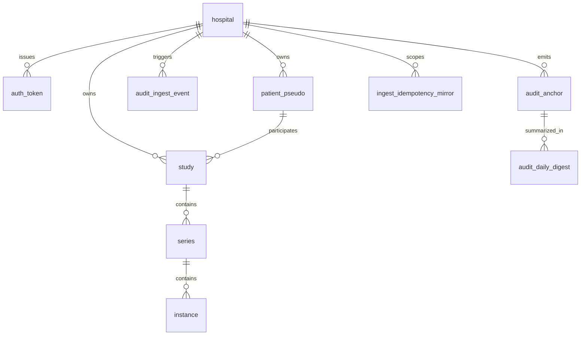

# 개발지시서 — Central Ingest v0.1 MVP

> **Status**: Draft v0.1 · **Feature slug**: `central-ingest` · **Last updated**: 2026-04-22
> **작성자**: @planner · **근거**:
> - [리서치 — Central Ingest 기술 기반](../research/central-ingest-technical-foundations.md)
> - [리서치 — Gateway Agent 기술 기반](../research/gateway-agent-technical-foundations.md)
> - [리서치 — K-MedData 요약](../research/k-meddata-research-summary.md)
> - [PRD §4.2, §4.4, §4.7](../prd.md)
> - [ARCHITECTURE §4 Zone 2](../ARCHITECTURE.md#4-zone-2--중앙-클라우드)
> - [dev-spec-gateway-agent §7.3 (교차 계약)](./dev-spec-gateway-agent.md)
> - `src/radivault_mock_central/` — 현행 FastAPI mock (프로덕션 승격 대상)

---

## 0. 요약 (TL;DR)

RadiVault Zone 2의 첫 프로덕션 구성요소. 병원 on-premise에 배포된 **Gateway Agent v0.1**이 발송하는 익명화된 DICOM 스터디와 감사 로그 앵커를 **단일 HTTPS 진입점**에서 수신하여 (i) S3 호환 객체 스토리지에 저장, (ii) PostgreSQL 메타데이터 인덱스에 정규화 적재, (iii) PostgreSQL append-only 감사 테이블에 WORM 성격으로 보관한다. v0.1 범위는 **Ingest + Anchor + 운영 프로브 5개 엔드포인트**에 한정하며 버이어 검색 API, 주문 Orchestrator, 빌링, 썸네일은 별도 dev-spec으로 분리한다.

현행 `src/radivault_mock_central/`(FastAPI 메모리 mock)는 Gateway 계약 검증용 스텁이다. 본 dev-spec은 이 mock의 **3개 엔드포인트 계약을 깨지 않은 채**(gateway dev-spec §7.3과 100% 호환) 다음을 추가한다: (a) `Idempotency-Key` 헤더 서버측 강제, (b) manifest preflight 사전검증, (c) PostgreSQL + S3 영속화, (d) Redis 기반 쿼터/레이트 리밋, (e) 구조화 로그·Prometheus·OTel 관측성, (f) `/healthz`·`/readyz`·`/v1/version` 운영 프로브, (g) Alembic 마이그레이션, (h) Docker 멀티스테이지 + docker-compose(prod/dev).

**법적 전제**: Central은 Annex E Basic Profile로 **완전 익명화된** 데이터만 수신하며, 업로드 manifest의 `anonymization_flag != "fully_anonymized"`는 서버가 거부한다(국외이전 게이트). 호스팅 리전은 v0.1 **한국 리전 기본**(Kyle 결정 대기).

---

## 1. 기능 개요

Central Ingest는 RadiVault Zone 2의 **첫 네트워크 접점**이다. Gateway Agent는 v0.1에서 이미 `POST /v1/ingest/studies`(multipart) + `POST /v1/audit/anchor`(JSON) 두 엔드포인트에 의존하고 있고, 현재는 `radivault_mock_central`(인메모리 FastAPI)에 연결된다. 본 dev-spec은 그 mock을 **프로덕션 품질의 최소 구현**(PostgreSQL·S3·Redis·컨테이너·관측성)으로 승격한다.

v0.1 스코프의 의도는 **"파일럿 병원 2곳의 실데이터를 상시 수신·안전 보관·감사 가능하게 만드는 최소선"**이다. 구매자 측 기능(코호트 검색 API, 썸네일, 다운로드)은 본 dev-spec에 포함되지 않는다.

---

## 2. 사용자 스토리

- **As a** 병원 IT 관리자, **I want** Gateway Agent가 중앙 서버에 같은 manifest를 재전송해도 중복 적재가 발생하지 않는다, **so that** 네트워크 장애로 인한 재시도가 환자 메타데이터 오염으로 번지지 않는다.
- **As a** RadiVault 운영자(플랫폼팀), **I want** 모든 수신 이벤트가 WORM 성격의 감사 테이블에 기록되고 Gateway가 올린 시간당 앵커와 교차 검증된다, **so that** 규제 감사 시 "언제 누가 어떤 데이터를 보냈는지"를 증명할 수 있다.
- **As a** 병원 데이터 보호 책임자(DPO), **I want** 서버가 `anonymization_flag != fully_anonymized`인 업로드를 사전 거부한다, **so that** 실수로 PHI가 클라우드에 쓰이는 일이 없다.
- **As a** 플랫폼 SRE, **I want** `/healthz`, `/readyz`, `/metrics`, `/v1/version`이 표준 관례대로 동작한다, **so that** ALB/K8s/블루그린 배포 자동화가 가능하다.
- **As a** 보안 엔지니어, **I want** 병원별 Bearer 토큰 외에 `Idempotency-Key` 헤더와 병원별 쿼터·동시성 캡이 적용된다, **so that** 토큰 유출 시 폭주 시나리오를 즉시 차단할 수 있다.
- **As a** 개발자, **I want** `docker-compose up` 한 번으로 PostgreSQL+Redis+MinIO+ingest 전체 스택이 로컬에서 기동된다, **so that** 온보딩 비용 없이 통합 테스트를 돌릴 수 있다.

---

## 3. 범위

### 3.1 포함 (In-scope — v0.1 MVP)

1. **Ingest API** — `POST /v1/ingest/studies` multipart DICOM + manifest.json 적재.
2. **Anchor API** — `POST /v1/audit/anchor` 시간당 head-hash 앵커 수신·검증.
3. **운영 프로브** — `GET /healthz`, `GET /readyz`, `GET /v1/version`.
4. **Bearer 토큰 인증** — 병원별 토큰(DB 저장, `kid` prefix 지원). Gateway `central.upload_token`와 정합.
5. **Idempotency** — `Idempotency-Key` 헤더 서버측 강제. Redis 24h TTL, key+hospital_id 복합 dedup.
6. **Manifest preflight** — pydantic 스키마 검증, anonymization_flag 화이트리스트, ruleset_version 허용목록, gateway_id↔hospital_id 매핑, pseudo_study_uid 중복 거부, total_bytes·n_instances 상한.
7. **객체 스토리지** — S3 호환 추상(boto3). 로컬 dev MinIO, 프로덕션 AWS Seoul 또는 NCP(Kyle 결정). SSE-KMS 기본, 버킷 레이아웃 리서치 §4.3.2.
8. **메타데이터 인덱스** — PostgreSQL 15+. `hospital`, `auth_token`, `patient_pseudo`, `study`, `series`, `instance`, `audit_anchor`, `audit_ingest_event`, `ingest_idempotency_mirror`. Alembic 관리.
9. **감사 로그 append-only** — `audit_ingest_event`, `audit_anchor` 테이블에 app-role GRANT로 `INSERT`만 허용(`UPDATE`/`DELETE` 미부여). 월 파티션.
10. **앵커 검증** — 연속성(prev.hi+1==cur.lo), 단조성, 중복 거부, lag 메트릭.
11. **레이트 리미팅** — slowapi + Redis 백엔드. 병원별·IP별 계층.
12. **관측성** — 구조화 JSON 로그(python-json-logger), `/metrics` Prometheus, OpenTelemetry SDK(exporter=console 기본, 프로덕션 `OTEL_EXPORTER_OTLP_ENDPOINT` 주입).
13. **패키징** — Docker multi-stage 이미지(python:3.11-slim-bookworm, non-root UID 10001). docker-compose 파일 2종(dev: ingest+pg+redis+minio, prod: ingest 다수+외부 pg/redis/s3).
14. **마이그레이션** — Alembic (`alembic upgrade head`). CI에서 `alembic check`.
15. **테스트** — pytest unit(fakes) + httpx AsyncClient 통합 + docker-compose env-gated E2E.
16. **Mock fixtures 호환** — 기존 `src/radivault_mock_central/`의 계약(manifest 필드·응답 JSON shape)과 **breaking change 없이** 확장.

### 3.2 제외 (Out-of-scope — v0.2 이상)

1. **Presigned multipart upload(S3 MPU)** — 500MB 초과 단일 instance 대비. v0.1은 단일 multipart POST만.
2. **mTLS(RFC 8705)** — Bearer만. ALB 클라이언트 인증서 검증은 v0.2 옵션.
3. **버이어 검색 API** — `metadata-index` 별도 dev-spec.
4. **버이어 포털·빌링·수익 분배·썸네일/CDN·Hot Storage·Order Orchestrator** — 각각 별도 dev-spec.
5. **다테넌시 격리** — v0.1은 `hospital_id` 논리 분리만. 물리적 스키마/DB 분리는 향후.
6. **운영 콘솔 UI** — 운영자 대시보드/관리자 페이지 없음. SQL·`kubectl`·`docker compose`로 운영.
7. **NLP 라벨 추출(판독문)** — Phase 2 dev-spec-nlp-label.
8. **데이터 철회권(right to withdraw) 완전 구현** — v0.1은 **스텁 엔드포인트만**(`POST /v1/studies/{pseudo_study_uid}/withdraw-stub` — 501 Not Implemented) 정의. 본격 삭제 파이프라인은 v0.2.
9. **OpenTelemetry exporter 제품 선택** — SigNoz/Tempo/Jaeger 선정은 관측성 dev-spec 별도. v0.1은 OTLP endpoint만 주입 가능하도록 훅만.
10. **자동 토큰 회전** — 수동 회전만 문서화. 자동 회전 채널(Gateway push API)은 v0.2.
11. **DICOM 2차 재검증 워커(pydicom 파싱)** — 리서치 §4.2.5는 비동기 워커를 권고하나, v0.1은 manifest sha256 검증 + anonymization_flag 게이트까지만. DICOM 바이너리 파싱은 **v0.2 별도 워커 컴포넌트**로 분리. v0.1은 `quarantine/` 프리픽스·상태 컬럼만 준비.
12. **Kubernetes Helm chart / 매니페스트** — v0.1은 Docker Compose만.
13. **IP allowlist / WAF** — 상위 인프라 관리자 책임. v0.1은 Bearer+토큰 rotation 문서화만.
14. **Hot Storage / Lifecycle 전환 자동화** — 버킷 lifecycle rule 문서만, 자동 승격 로직은 v0.2.

---

## 4. 기능 요구사항

번호는 feature-slug 내에서 고유. `@qa`는 각 FR을 §10 AC로 매핑 검증한다.

### 4.1 Ingest API

- **FR-1**: 서버는 `POST /v1/ingest/studies`를 multipart/form-data로 수신한다. Part 1 = `manifest`(application/json), Part 2..N = `files`(application/dicom). Gateway dev-spec §7.3.1 multipart 구조와 100% 호환.
- **FR-2**: 성공 응답은 `201 Created` + `{"central_job_id": "ingest_<ulid>", "received_at": "<iso8601>", "object_keys": ["..."]}`. 기존 mock의 `job_id` 필드는 **하위호환 위해 동일 값을 유지**하되 정식 키는 `central_job_id`. (Gateway v0.1은 `job_id`만 읽으므로 무해하며, 차기 Gateway 업그레이드 권고.)
- **FR-3**: `manifest.json` 최대 크기 1MB. 단일 요청 총합 최대 `hospital.max_study_bytes`(기본 20GB). 초과 시 `413 payload_too_large`.
- **FR-4**: manifest의 `files[].sha256`과 수신 바디의 실제 sha256이 모두 일치해야 한다. 하나라도 불일치 → `400 invalid_manifest`(code `ERR_MANIFEST_SHA256`).
- **FR-5**: 수신 바이트는 S3 호환 객체 스토리지에 **스트리밍**으로 직접 쓴다(로컬 디스크 상주 금지). boto3 `upload_fileobj` + multipart threshold 8MB.
- **FR-6**: 스토리지 키 규칙(리서치 §4.3.2):
  ```
  s3://{bucket}/{env}/{hash2}/{hospital_id}/{pseudo_study_uid}/{pseudo_series_uid}/{pseudo_sop_uid}.dcm
  ```
  `hash2 = sha256(pseudo_study_uid)[:2].hex()`. 원본 UID 기반 키 **금지**. manifest 사본도 동일 프리픽스의 `_manifest.json`으로 저장.
- **FR-7**: 서버 측 암호화 기본값 `SSE-KMS`. `aws:SecureTransport` true 강제(비TLS 요청 거부). 퍼블릭 액세스 4대 항목 전부 차단.
- **FR-8**: 트랜잭션 원자성 — DB row 삽입은 단일 PostgreSQL 트랜잭션. S3 PUT 중 하나라도 실패하면 이미 쓴 키를 `DELETE`하고 롤백(best-effort 정리, 실패 시 `orphan_object_keys` 감사 이벤트 기록).
- **FR-9**: `manifest.anonymization_flag != "fully_anonymized"`인 요청은 `403 forbidden`(code `ERR_MANIFEST_ANON`). **국외이전 게이트**(§6.7 법적·보안 고려).

### 4.2 Audit Anchor API

- **FR-10**: 서버는 `POST /v1/audit/anchor`를 JSON(`{"gateway_id","seq_range":[lo,hi],"head_hash","anchored_at"}`)으로 수신한다. Gateway dev-spec §7.3.2 동형.
- **FR-11**: 성공 응답은 `200 OK` + `{"anchor_id":"anc_<ulid>","accepted_at":"<iso8601>"}`. 기존 mock은 `anchor_id`만 반환 → 새 응답은 **supersetting**(하위호환).
- **FR-12**: 서버는 동일 `hospital_id`의 직전 앵커와 연속성을 검증한다. `prev.seq_hi + 1 == cur.seq_lo` 위반 → `400 invalid_range`(code `ERR_ANCHOR_RANGE`). 단, 병원 최초 앵커는 `cur.seq_lo`가 1 이하여야 하며 그 외에는 `ERR_ANCHOR_INITIAL`.
- **FR-13**: 단조성 — `cur.anchored_at > prev.anchored_at`. 위반 → `400 invalid_monotonicity`(code `ERR_ANCHOR_MONO`).
- **FR-14**: 중복 거부 — `UNIQUE(hospital_id, seq_range)`. 재전송 시 `409 already_anchored`(code `ERR_ANCHOR_DUP`).
- **FR-15**: `head_hash` 중복(동일 병원 내 이미 저장된 값 재수신) → `409 already_anchored`(code `ERR_ANCHOR_HASH_DUP`).
- **FR-16**: Lag 메트릭 — `audit_anchor_lag_seconds{hospital_id}` = `now - max(anchored_at)`. Prometheus 노출. 3 × 3600s(3시간) 초과 시 warn 로그.
- **FR-17**: v0.1은 lag 경보 시 **Ingest를 차단하지 않는다**(경보만). 차단 옵션은 v0.2. 해당 결정은 운영 정책 YAML `ops.anchor_lag_block_enabled = false`로 기본값 고정.

### 4.3 운영 프로브

- **FR-18**: `GET /healthz` — 항상 `200 {"status":"ok"}`. DB·Redis·S3 상태와 독립(liveness).
- **FR-19**: `GET /readyz` — PostgreSQL ping + Redis ping + S3 HEAD bucket 3요소 전부 성공 시 `200 {"ready":true,"checks":{...}}`. 하나라도 실패 시 `503 {"ready":false,"checks":{...}}`.
- **FR-20**: `GET /v1/version` — 빌드 정보 `{"version":"0.1.0","git_sha":"...","built_at":"...","api_contract_version":"1"}`. 인증 불필요.
- **FR-21**: `GET /metrics` — Prometheus scrape 전용. 기본 메트릭 + FR-16 + `ingest_requests_total{hospital_id,status}` + `ingest_bytes_total{hospital_id}` + `ingest_duration_seconds{hospital_id}`(히스토그램) + `idempotency_dedup_total{hospital_id}` + `auth_failures_total{reason}`.

### 4.4 인증

- **FR-22**: 모든 `/v1/*` 엔드포인트는 `Authorization: Bearer <token>` 헤더 필수. 미제공 또는 포맷 오류 → `401 unauthorized`(code `ERR_AUTH_MISSING`).
- **FR-23**: 토큰은 `auth_token` 테이블에서 조회(§6.2). `token_kid` prefix(최초 8자) + `token_hash`(argon2id 또는 sha256+per-token salt) 저장. 평문 토큰 DB 저장 금지.
- **FR-24**: 토큰 검증 결과 유효/미유효는 상수 시간(`hmac.compare_digest` 또는 argon2 verify) 비교.
- **FR-25**: 활성 토큰은 `revoked_at IS NULL` 이고 `expires_at IS NULL OR expires_at > now()`. 만료/철회 → `401 unauthorized`(code `ERR_AUTH_EXPIRED`).
- **FR-26**: 토큰은 **한 병원당 여러 개** 허용(병행 수명 회전). 토큰 → `hospital_id` 매핑은 요청 context에 주입되며 이후 모든 manifest 검증에 사용된다.
- **FR-27**: manifest의 `hospital_id`·`gateway_id`가 토큰이 가리키는 `hospital_id`와 불일치 시 `403 forbidden_hospital`(code `ERR_AUTH_MISMATCH`).

### 4.5 Idempotency

- **FR-28**: Ingest·Anchor 엔드포인트는 `Idempotency-Key` 헤더를 **서버측 강제**한다. 미제공 시 `400 idempotency_required`(code `ERR_IDEMP_MISSING`). 헤더 길이 16–128자, `[A-Za-z0-9_.-]` 외 문자 금지.
- **FR-29**: 서버는 Redis `SETNX` 로 `(key, hospital_id)` 복합 dedup. TTL 24h 기본(환경변수 `IDEMPOTENCY_TTL_SECONDS` 오버라이드 가능).
- **FR-30**: 동일 키 재수신 시 **저장된 응답 본문을 그대로 리플레이**한다. 상태 코드 및 본문 sha256 일치. 단, 저장된 응답의 `Idempotency-Replayed: true` 응답 헤더 추가.
- **FR-31**: 다른 hospital_id에서 동일 key가 오면 완전히 별개로 취급(hospital_id 네임스페이스).
- **FR-32**: Redis 장애 시 서비스는 `503 service_unavailable`(code `ERR_IDEMP_UNAVAILABLE`) 반환. **무결성 우선** — 검증 불가 시 수락 금지.
- **FR-33**: DB 보조 미러 — `ingest_idempotency_mirror` 테이블에 `(key, hospital_id, first_seen_at, response_sha256)` 저장. Redis TTL 만료 후 7일까지 유지하여 감사 대조용.

### 4.6 Manifest Preflight

- **FR-34**: manifest JSON은 **§6.5 스키마를 pydantic v2**로 검증한다. 필수 필드 누락·타입 불일치 → `400 invalid_manifest`(code `ERR_MANIFEST_SCHEMA`).
- **FR-35**: `manifest_version == 1`. 그 외 값 → `400 unsupported_manifest_version`(code `ERR_MANIFEST_VERSION`).
- **FR-36**: `deid.ruleset_version`은 서버측 **허용목록**(`hospital.allowed_ruleset_versions` JSON 배열) 내여야 한다. 불일치 → `400 unsupported_ruleset`(code `ERR_MANIFEST_RULESET`).
- **FR-37**: `deid.salt_version`은 `hospital.salt_version_current`와 일치. 불일치 → `400 stale_salt_version`(code `ERR_MANIFEST_SALT`).
- **FR-38**: `deid.method_code_sequence`는 비어있지 않고 최소 `"113100"`(Basic Application Level Confidentiality) 포함. 위반 → `400 deid_method_missing`(code `ERR_MANIFEST_DEID`).
- **FR-39**: **anonymization_flag 게이트** (FR-9 재천명) — `manifest.anonymization_flag == "fully_anonymized"` 만 수락. `pseudonymized`, `partial`, 또는 누락 → `403 forbidden`(code `ERR_MANIFEST_ANON`).
- **FR-40**: `pseudo_study_uid`가 `study.pseudo_study_uid`에 이미 존재하면 `409 duplicate_study`(code `ERR_MANIFEST_DUP`). 단, **같은 Idempotency-Key로 재시도된 경우**에는 FR-30 리플레이 경로로 흘러 409가 나오지 않음에 유의.
- **FR-41**: `files[]` 원소 수 ≤ `hospital.max_instances_per_study`(기본 5000). 초과 → `413`(code `ERR_MANIFEST_TOOMANY`).
- **FR-42**: 모든 preflight 실패는 **스트리밍 파일 바디를 수신하기 전에** 수행한다(DB·Redis lookup만으로 처리).

### 4.7 Rate Limiting & Quotas

- **FR-43**: slowapi + Redis 백엔드. 기본 한도(설정 가능):
  - 병원별 Ingest: `60 req/min`, `2000 req/hour`
  - 병원별 Anchor: `6 req/min`
  - IP별 global: `300 req/min`
  - 동시 업로드 캡: `hospital.max_concurrent_uploads`(기본 4)
- **FR-44**: 한도 초과 → `429 rate_limited` + `Retry-After: <seconds>` 헤더(code `ERR_RATE_LIMITED`). Gateway의 FR-20 재시도 로직과 정합.
- **FR-45**: 쿼터 — `hospital_quotas` Redis 카운터(UTC 자정 롤오버) + 월 단위 PostgreSQL 집계. 일일 상한 초과 → `429`(code `ERR_RATE_QUOTA_DAILY`). 월 상한 초과 → `429`(code `ERR_RATE_QUOTA_MONTHLY`).

### 4.8 Object Storage

- **FR-46**: 스토리지 드라이버는 `radivault_central.storage.ObjectStorage` 프로토콜로 추상화하며, 기본 구현 `S3ObjectStorage(boto3)`. 로컬 dev는 MinIO endpoint 주입.
- **FR-47**: 버킷 lifecycle rule(설정 문서) — `AbortIncompleteMultipartUpload: 1 day`, `ingest/*` 90d→STANDARD_IA, 180d→GLACIER_IR(옵션 v0.2), `quarantine/*` 30d 삭제.
- **FR-48**: 스토리지 쓰기 실패 시 내부 재시도 3회(지수 백오프), 그 이후는 `502 upstream_storage_error`(code `ERR_STORE_WRITE`).
- **FR-49**: 서버는 객체 키를 DB에 저장하되, **presigned URL 발급은 v0.1 범위 외**. 구매자 다운로드 경로는 Order Orchestrator(별도 dev-spec)가 담당.

### 4.9 Metadata Index (PostgreSQL)

- **FR-50**: 모든 스키마 변경은 Alembic 마이그레이션 파일(`alembic/versions/*.py`)로 관리. `alembic upgrade head`가 컨테이너 엔트리포인트의 pre-start hook 또는 `init` 명령에서 실행.
- **FR-51**: 모든 핵심 테이블은 **surrogate BIGINT PK**(`GENERATED ALWAYS AS IDENTITY`). `pseudo_*_uid`는 UNIQUE 제약.
- **FR-52**: §6.3 인덱스를 모두 생성한다(복합 필터, 범위, 병원별 ingested 등).
- **FR-53**: `study.ingested_at` 기준 월 파티셔닝(pg_partman 자동 생성). v0.1 초기 파티션은 배포 당월 ± 2개월을 미리 생성.
- **FR-54**: JSONB `raw_dicom_tags`는 v0.1에서 GIN 인덱스 **생성하지 않는다**(§4.4.3 리서치 근거). 운영 3개월 후 쿼리 프로파일 기반 추가 여부 재평가.

### 4.10 Audit Log & Anchor Persistence

- **FR-55**: `audit_ingest_event` 테이블은 app-role(`central_app`)에 `INSERT`만 GRANT, `UPDATE`/`DELETE` 미부여. 데이터베이스 슈퍼유저는 마이그레이션 시에만 사용한다. 애플리케이션 DSN은 반드시 non-superuser.
- **FR-56**: 모든 Ingest 성공·실패 이벤트는 `audit_ingest_event`에 1 row 기록. 필드는 §6.3. **PHI 미포함** — 원본 UID, 환자 이름, 병원 IP, 실제 파일 내용 금지. 가명 UID·해시만.
- **FR-57**: `audit_anchor` 테이블도 동일 append-only GRANT 정책. `UNIQUE(hospital_id, seq_lo, seq_hi)`.
- **FR-58**: 두 테이블 모두 `ts`(또는 `received_at`) 기준 월 파티션. 5년 보존 후 Glacier Deep Archive 이관(v0.2 백업 job).
- **FR-59**: 일 1회 배치 — 해당 일 `audit_anchor` 파티션의 SHA-256 요약을 `audit_daily_digest` 테이블 + S3 Object Lock(compliance mode) 버킷에 업로드(리서치 §4.5.3). 이는 **백그라운드 워커 작업**으로 v0.1에서 스텁 구현(실제 Object Lock 버킷 생성은 운영 설정 문서에 명시).

### 4.11 Observability

- **FR-60**: 로그는 **구조화 JSON**(python-json-logger) — 필수 필드: `ts`, `level`, `logger`, `msg`, `trace_id`, `request_id`, `hospital_id`(있을 때), `path`, `status`, `duration_ms`. **PHI 금지 필드**: `patient_name`, `original_uid`, `pacs_host` 등 어떠한 원본 식별자도 로그 미기록.
- **FR-61**: OpenTelemetry SDK 초기화는 stdout exporter 기본. `OTEL_EXPORTER_OTLP_ENDPOINT` 환경변수 제공 시 OTLP 송신. span 이름: `ingest.request`, `ingest.manifest.preflight`, `ingest.s3.put`, `ingest.db.insert`, `anchor.validate`, `anchor.db.insert`.
- **FR-62**: `request_id`는 서버에서 ULID 생성 후 응답 헤더 `X-Request-Id`로 반환. 클라이언트가 동일 헤더를 보내면 그 값 사용.
- **FR-63**: Sentry-호환 에러 리포터 훅 제공(환경변수 `SENTRY_DSN` 있으면 활성). v0.1 기본은 비활성.

### 4.12 Packaging & Ops

- **FR-64**: Docker 이미지 multi-stage — builder(`python:3.11-bookworm`) → runtime(`python:3.11-slim-bookworm`). `USER 10001:10001`, `WORKDIR /app`, non-root.
- **FR-65**: `HEALTHCHECK --interval=30s --timeout=5s --start-period=20s CMD curl -fsS http://localhost:8000/healthz`.
- **FR-66**: 엔트리포인트 — `gunicorn radivault_central.asgi:app -k uvicorn.workers.UvicornWorker --workers $WORKERS --bind 0.0.0.0:8000 --timeout 900 --graceful-timeout 120 --max-requests 1000 --max-requests-jitter 100`. 기본 `WORKERS = 2 * vCPU + 1`.
- **FR-67**: `docker-compose.dev.yml` — ingest + postgres:15 + redis:7 + minio 4개 서비스. 볼륨 로컬, 모든 포트 노출.
- **FR-68**: `docker-compose.prod.yml` — ingest 서비스만 정의. DB·Redis·S3 엔드포인트는 환경변수 주입. 볼륨·로그 드라이버는 운영 환경 맞춤. 역프록시(nginx/ALB)는 호스트 레벨에 별도(compose 바깥).
- **FR-69**: SIGTERM 처리 — `/healthz`가 shutdown grace 중 503을 반환하도록 상태 전환(또는 `/readyz`에서만 표현, 선택은 구현자). K8s `terminationGracePeriodSeconds` ≥ 150s 권장 문서화.

### 4.13 Mock Fixtures 호환

- **FR-70**: 기존 `src/radivault_mock_central/`의 응답 JSON shape(`job_id`, `received_at`, `anchor_id`)은 **필드 삭제 없이 superset 확장**. `job_id`는 `central_job_id`와 **동일 값**으로 채워 하위호환.
- **FR-71**: 테스트 하네스에서 mock을 계속 사용할 수 있도록 `docker-compose.dev.yml`에 `mock-central` 프로파일을 유지(opt-in). 실제 ingest 서비스는 `ingest` 프로파일.
- **FR-72**: pytest 통합 테스트는 실제 ingest 서비스를 `testcontainers-python` 또는 `docker compose up -d`로 기동한 뒤 httpx.AsyncClient로 호출한다. 환경변수 `RADIVAULT_INTEGRATION=1`이 없으면 스킵.

### 4.14 Withdraw Stub (향후 법적 요구 대비)

- **FR-73**: `POST /v1/studies/{pseudo_study_uid}/withdraw-stub` 엔드포인트는 `501 Not Implemented` + `{"detail":"withdraw flow deferred to v0.2","docs_url":"..."}`를 반환한다. **v0.1은 스텁만.** 호출 자체는 Bearer 검증하여 감사 로그(`withdraw.stub.invoked`)에 기록.

### 4.15 Migrations & Initialization

- **FR-74**: 애플리케이션 기동 시 `readyz`는 `alembic current == head`를 확인한다. 마이그레이션 미적용 상태에서는 `readyz` 503.
- **FR-75**: `radivault-central init-hospital --hospital-id --name --allowed-ruleset-versions ...`와 `radivault-central issue-token --hospital-id --expires-days ...` CLI를 제공한다. v0.1 토큰 발급은 **수동 CLI만**. 자동 회전은 v0.2.

---

## 5. 비기능 요구사항

| 항목 | 요구 |
|------|------|
| 성능 | 100MB 스터디 단일 업로드 p95 < 30초(서버 내부 메트릭 기준, 네트워크 제외). manifest preflight 단독 p95 < 300ms. `/healthz` p95 < 50ms. `/readyz` p95 < 200ms. |
| 처리량 | 병원당 동시 4 업로드 × 전체 병원 합 동시 64 업로드 기본 상한. 파일럿 2개 병원 일 1,000 스터디/병원(200GB/일) 안정 처리. |
| 가용성 | 99.9% 타깃(v0.1 best-effort, 실제 SLA는 v0.2). 배포 중 롤링 업데이트로 무중단. |
| 확장성 | horizontal scale by gunicorn workers × replicas. PostgreSQL write-amp는 월 파티션 + indices 세트로 1M 스터디까지 단일 노드 가능. 10M+는 read replica + partition prune. |
| 보안 | TLS 1.3 only(전방 nginx/ALB가 종단). `aws:SecureTransport`. 토큰은 argon2id 해시 저장. PHI 로그 금지. 컨테이너 non-root. 이미지 trivy HIGH=0. |
| 로깅·감사 | 모든 Ingest·Anchor 이벤트 `audit_ingest_event`·`audit_anchor` append-only. 5년 보존. PHI 미포함. 일 1회 Object Lock 외부 앵커링(FR-59). |
| 관측성 | JSON 로그 + Prometheus + OTel. 대시보드 지표: `ingest_requests_total`, `ingest_duration_seconds`, `ingest_bytes_total`, `audit_anchor_lag_seconds`, `idempotency_dedup_total`, `auth_failures_total`. |
| 국제화 | 로그·에러 메시지 영어. 응답 본문 영어. 운영 문서는 한국어+영어 병기. |
| 호환성 | Python 3.11, PostgreSQL 15+, Redis 7+, Docker Engine 24+, Compose v2.20+. Ubuntu 22.04 LTS x86_64(프로덕션), macOS/Linux(dev). |
| 백업 정책(v0.1 스텁) | PostgreSQL: 일 1회 pg_basebackup + WAL archive to S3. S3 버킷: 버전관리(Versioning) on. Audit Lock 버킷: cross-region replication v0.2. |
| 규제 적합성 | 개보법 제28조의8 전제 "완전 익명정보". ISMS-P 2.8.1/2.10.5 통제 매핑(§12.3). HIPAA 구매자 대응은 상위 계층 책임. |

---

## 6. 데이터 모델

### 6.1 개요 — 엔티티 관계



### 6.2 PostgreSQL 스키마 — 병원·인증

```sql
CREATE TABLE hospital (
    hospital_pk               BIGINT GENERATED ALWAYS AS IDENTITY PRIMARY KEY,
    hospital_id               TEXT NOT NULL UNIQUE,           -- 외부 식별자 (Gateway manifest와 정합)
    name                      TEXT NOT NULL,
    region                    TEXT NOT NULL DEFAULT 'KR-SE',  -- 수집 리전
    salt_version_current      INTEGER NOT NULL DEFAULT 1,
    allowed_ruleset_versions  JSONB NOT NULL DEFAULT '["v0.1.0"]'::JSONB,
    max_study_bytes           BIGINT NOT NULL DEFAULT 21474836480,   -- 20GB
    max_instances_per_study   INTEGER NOT NULL DEFAULT 5000,
    max_concurrent_uploads    INTEGER NOT NULL DEFAULT 4,
    daily_byte_quota          BIGINT,                              -- NULL = 무제한
    monthly_byte_quota        BIGINT,
    enrolled_at               TIMESTAMPTZ NOT NULL DEFAULT now(),
    active                    BOOLEAN NOT NULL DEFAULT TRUE
);
CREATE INDEX idx_hospital_active ON hospital(active) WHERE active;

CREATE TABLE auth_token (
    token_pk                  BIGINT GENERATED ALWAYS AS IDENTITY PRIMARY KEY,
    hospital_pk               BIGINT NOT NULL REFERENCES hospital(hospital_pk),
    token_kid                 TEXT NOT NULL,            -- 토큰 prefix (첫 8자)
    token_hash                TEXT NOT NULL,            -- argon2id or sha256+salt
    issued_at                 TIMESTAMPTZ NOT NULL DEFAULT now(),
    expires_at                TIMESTAMPTZ,
    revoked_at                TIMESTAMPTZ,
    last_used_at              TIMESTAMPTZ,
    note                      TEXT,
    UNIQUE (token_kid)
);
CREATE INDEX idx_auth_token_hospital_active
  ON auth_token(hospital_pk)
  WHERE revoked_at IS NULL;
```

### 6.3 PostgreSQL 스키마 — 메타데이터 인덱스

```sql
CREATE TABLE patient_pseudo (
    patient_pseudo_pk         BIGINT GENERATED ALWAYS AS IDENTITY PRIMARY KEY,
    hospital_pk               BIGINT NOT NULL REFERENCES hospital(hospital_pk),
    pseudo_patient_key        TEXT NOT NULL,             -- Gateway가 계산한 patient_id_hash
    age_bucket                SMALLINT,                  -- 5년 bin (e.g., 45 => 45-49)
    sex                       CHAR(1),                   -- 'M'|'F'|'O'|NULL
    offset_days_hash          TEXT,                      -- 확인용(원본 미포함)
    first_seen_at             TIMESTAMPTZ NOT NULL DEFAULT now(),
    UNIQUE (hospital_pk, pseudo_patient_key)
);

CREATE TABLE study (
    study_pk                  BIGINT GENERATED ALWAYS AS IDENTITY PRIMARY KEY,
    pseudo_study_uid          TEXT NOT NULL UNIQUE,
    hospital_pk               BIGINT NOT NULL REFERENCES hospital(hospital_pk),
    patient_pseudo_pk         BIGINT REFERENCES patient_pseudo(patient_pseudo_pk),
    modality                  TEXT,                    -- 대표 modality (series 중 최빈)
    body_part                 TEXT,
    study_date_shifted        DATE,
    manufacturer              TEXT,
    model_name                TEXT,
    n_instances               INTEGER NOT NULL,
    n_series                  INTEGER NOT NULL,
    total_bytes               BIGINT NOT NULL,
    ingested_at               TIMESTAMPTZ NOT NULL DEFAULT now(),
    raw_dicom_tags            JSONB,                   -- 화이트리스트 외 추가 태그
    central_job_id            TEXT NOT NULL,
    gateway_id                TEXT NOT NULL
) PARTITION BY RANGE (ingested_at);

-- 파티션 예시 (pg_partman이 월 단위 자동 생성)
CREATE TABLE study_2026_04 PARTITION OF study
    FOR VALUES FROM ('2026-04-01') TO ('2026-05-01');

CREATE INDEX idx_study_filter1 ON study (modality, body_part, age_bucket_placeholder)
  WHERE FALSE;  -- 예시: 실제 인덱스는 아래 series-level이 아닌 study/patient 조인으로 생성
CREATE INDEX idx_study_modality_bodypart ON study (modality, body_part);
CREATE INDEX idx_study_date ON study (study_date_shifted);
CREATE INDEX idx_study_patient ON study (patient_pseudo_pk);
CREATE INDEX idx_study_hospital_ingested ON study (hospital_pk, ingested_at DESC);
CREATE INDEX idx_study_manufacturer ON study (manufacturer);

CREATE TABLE series (
    series_pk                 BIGINT GENERATED ALWAYS AS IDENTITY PRIMARY KEY,
    study_pk                  BIGINT NOT NULL,      -- FK는 partition root에 직접 못 달므로 app-level enforce
    pseudo_series_uid         TEXT NOT NULL UNIQUE,
    modality                  TEXT,
    body_part                 TEXT,
    series_number             INTEGER,
    n_instances               INTEGER NOT NULL,
    raw_dicom_tags            JSONB
);
CREATE INDEX idx_series_study ON series (study_pk);
CREATE INDEX idx_series_modality ON series (modality);

CREATE TABLE instance (
    instance_pk               BIGINT GENERATED ALWAYS AS IDENTITY PRIMARY KEY,
    series_pk                 BIGINT NOT NULL REFERENCES series(series_pk),
    pseudo_sop_uid            TEXT NOT NULL UNIQUE,
    sop_class_uid             TEXT,
    instance_number           INTEGER,
    object_key                TEXT NOT NULL,           -- s3 키
    bytes                     BIGINT NOT NULL,
    sha256                    BYTEA NOT NULL
);
CREATE INDEX idx_instance_series ON instance (series_pk);
```

> **Note**: PostgreSQL의 파티션 테이블에는 인바운드 FK가 제약상 불가(파티션 키 포함 UNIQUE 필요). v0.1에서는 `series.study_pk`는 **애플리케이션 레이어**에서 참조 무결성을 보장하고, 물리적 FK는 생성하지 않는다. 대안으로 `PARTITION BY RANGE (ingested_at)` 대신 `study` non-partitioned + 분기 테이블 패턴도 고려 가능하나, 리서치 §4.4.5 근거로 월 파티션 채택.

### 6.4 PostgreSQL 스키마 — 감사·Idempotency

```sql
CREATE TABLE audit_ingest_event (
    event_pk                  BIGINT GENERATED ALWAYS AS IDENTITY PRIMARY KEY,
    hospital_pk               BIGINT NOT NULL REFERENCES hospital(hospital_pk),
    gateway_id                TEXT NOT NULL,
    central_job_id            TEXT,
    event                     TEXT NOT NULL,       -- 'ingest.accepted'|'ingest.rejected'|'withdraw.stub.invoked' 등
    pseudo_study_uid          TEXT,
    status_code               INTEGER NOT NULL,    -- HTTP 상태
    error_code                TEXT,                -- ERR_* taxonomy
    request_id                TEXT NOT NULL,
    bytes_received            BIGINT,
    duration_ms               INTEGER,
    received_at               TIMESTAMPTZ NOT NULL DEFAULT now()
) PARTITION BY RANGE (received_at);

-- 월 파티션은 pg_partman.
CREATE INDEX idx_aie_hospital_time
  ON audit_ingest_event (hospital_pk, received_at DESC);
CREATE INDEX idx_aie_event ON audit_ingest_event (event);

CREATE TABLE audit_anchor (
    anchor_pk                 BIGINT GENERATED ALWAYS AS IDENTITY PRIMARY KEY,
    hospital_pk               BIGINT NOT NULL REFERENCES hospital(hospital_pk),
    gateway_id                TEXT NOT NULL,
    seq_lo                    BIGINT NOT NULL,
    seq_hi                    BIGINT NOT NULL,
    head_hash                 BYTEA NOT NULL,
    anchored_at               TIMESTAMPTZ NOT NULL,
    received_at               TIMESTAMPTZ NOT NULL DEFAULT now(),
    UNIQUE (hospital_pk, seq_lo, seq_hi),
    UNIQUE (hospital_pk, head_hash),
    CHECK (seq_lo <= seq_hi)
);
CREATE INDEX idx_anchor_hospital_time ON audit_anchor (hospital_pk, anchored_at DESC);

CREATE TABLE audit_daily_digest (
    digest_pk                 BIGINT GENERATED ALWAYS AS IDENTITY PRIMARY KEY,
    digest_date               DATE NOT NULL,
    hospital_pk               BIGINT NOT NULL REFERENCES hospital(hospital_pk),
    anchor_count              INTEGER NOT NULL,
    digest_sha256             BYTEA NOT NULL,
    object_lock_key           TEXT,                    -- S3 Object Lock 외부 앵커
    computed_at               TIMESTAMPTZ NOT NULL DEFAULT now(),
    UNIQUE (digest_date, hospital_pk)
);

CREATE TABLE ingest_idempotency_mirror (
    key                       TEXT NOT NULL,
    hospital_pk               BIGINT NOT NULL REFERENCES hospital(hospital_pk),
    first_seen_at             TIMESTAMPTZ NOT NULL DEFAULT now(),
    response_sha256           BYTEA NOT NULL,
    response_status_code      INTEGER NOT NULL,
    PRIMARY KEY (key, hospital_pk)
);
CREATE INDEX idx_idemp_mirror_time ON ingest_idempotency_mirror (first_seen_at);
```

**GRANT 정책** (Alembic 마이그레이션에서 적용):

```sql
-- 마이그레이션 전용 슈퍼유저 'central_migrator'가 테이블 생성.
-- 런타임 앱 롤 'central_app'은 SELECT + INSERT 만.
REVOKE ALL ON audit_ingest_event FROM PUBLIC;
REVOKE ALL ON audit_anchor       FROM PUBLIC;
GRANT SELECT, INSERT ON audit_ingest_event TO central_app;
GRANT SELECT, INSERT ON audit_anchor       TO central_app;
-- UPDATE/DELETE 미부여
```

### 6.5 Manifest JSON 스키마 (Gateway dev-spec §6.4 정합)

Gateway dev-spec §6.4 원본과 **완전 호환**. Central이 이에 더해 강제하는 필드는 **이탤릭** 표기.

```jsonc
{
  "manifest_version": 1,                          // FR-35
  "gateway_id": "gw_7f3a...",
  "hospital_id": "hosp_abc",                      // FR-27 매칭
  "pseudo_study_uid": "2.25.xxxx",
  "modalities": ["MR"],
  "n_instances": 184,
  "total_bytes": 94321012,
  "deid": {
    "ruleset_version": "v0.1.0",                  // FR-36 허용목록
    "salt_version": 1,                            // FR-37 일치
    "method_code_sequence": ["113100","113107"]   // FR-38 최소 113100
  },
  "anonymization_flag": "fully_anonymized",       // *Central 전용 강제 필드* FR-9, FR-39
  "files": [
    { "filename": "0001.dcm", "sha256": "abcd...", "bytes": 513222 }
  ],
  "generated_at": "2026-04-22T10:20:00Z",
  "audit_ref": { "seq": 12345, "hash": "sha256:c3d4..." }
}
```

**Gateway 계약 델타**: `anonymization_flag`는 v0.1 Gateway manifest에 **현재 존재하지 않는다**(dev-spec-gateway-agent §6.4 확인). 본 필드가 없으면 Central은 FR-9에 따라 403을 반환하므로 **Gateway는 이를 즉시 반영하는 하위 버전 업데이트가 필요**(§13 Annex + NEXT_STEP 참조).

### 6.6 Config YAML 스키마 (서버측)

```yaml
# /etc/radivault-central/ingest.yml
version: 1

app:
  env: "prod"                                     # 'dev'|'stage'|'prod'
  api_contract_version: "1"
  workers: 5                                      # gunicorn

db:
  dsn: "${env:DATABASE_URL}"                      # postgres://central_app:...@pg:5432/central
  migration_dsn: "${env:MIGRATION_DATABASE_URL}"  # central_migrator role
  pool_size: 10
  max_overflow: 10

redis:
  url: "${env:REDIS_URL}"
  idempotency_ttl_seconds: 86400

storage:
  provider: "s3"                                  # 's3'|'minio'
  endpoint_url: "${env:S3_ENDPOINT_URL}"          # MinIO dev 시 http://minio:9000
  region: "ap-northeast-2"
  bucket: "radivault-ingest-prod"
  kms_key_arn: "${env:S3_KMS_KEY_ARN}"
  force_path_style: false                         # MinIO 시 true
  access_key_id: "${env:S3_ACCESS_KEY_ID}"
  secret_access_key: "${env:S3_SECRET_ACCESS_KEY}"

auth:
  hash_algorithm: "argon2id"                      # 'argon2id'|'sha256'
  argon2:
    time_cost: 3
    memory_cost_kib: 65536
    parallelism: 2

rate_limit:
  hospital_ingest_per_min: 60
  hospital_ingest_per_hour: 2000
  hospital_anchor_per_min: 6
  ip_global_per_min: 300
  max_concurrent_uploads_default: 4

observability:
  log_level: "INFO"
  json_logs: true
  otlp_endpoint: "${env:OTEL_EXPORTER_OTLP_ENDPOINT}"
  metrics_path: "/metrics"
  sentry_dsn: "${env:SENTRY_DSN}"

ops:
  anchor_lag_warn_seconds: 10800      # 3h
  anchor_lag_block_enabled: false     # v0.1 경보만
  max_manifest_bytes: 1048576         # 1MB
```

### 6.7 금지 필드 (PHI 오염 방지)

로그·감사 테이블·Prometheus 레이블 어디에서도 다음은 금지:

- 원본 `StudyInstanceUID`, `SeriesInstanceUID`, `SOPInstanceUID`, `FrameOfReferenceUID`.
- 환자 이름·생년월일·주소·전화·주민등록번호 또는 해당 변환 없는 해시.
- 병원 내부 호스트명(`pacs.hospital.local` 등), 내부 IP.
- 토큰 평문, Gateway `/run/credentials/` 경로.

허용: 가명 UID, `hospital_id`(외부 식별자), `gateway_id`, 파일 sha256, 바이트 수, HTTP 상태.

---

## 7. API 계약

OpenAPI 스타일. 모든 `4xx`·`5xx` 오류는 표준 바디:
```jsonc
{ "error": "<code>", "detail": "<human-readable>", "request_id": "01HXX..." }
```

### 7.1 `POST /v1/ingest/studies`

```
Request:
  POST /v1/ingest/studies HTTP/1.1
  Host: ingest.radivault.io
  Authorization: Bearer <token>
  Idempotency-Key: 01HXXXABC...                 # FR-28 필수
  Content-Type: multipart/form-data; boundary=...
  X-Request-Id: <optional>                      # FR-62

  --boundary
  Content-Disposition: form-data; name="manifest"; filename="manifest.json"
  Content-Type: application/json

  { ...§6.5... }
  --boundary
  Content-Disposition: form-data; name="files"; filename="0001.dcm"
  Content-Type: application/dicom

  <binary>
  --boundary--

Response 201 Created:
  {
    "central_job_id": "ingest_01HXXXX",
    "job_id":         "ingest_01HXXXX",          // 하위호환 (FR-70)
    "received_at":    "2026-04-22T10:20:01Z",
    "object_keys": [
      "prod/a1/hosp_abc/2.25.xxxx/2.25.yyyy/2.25.zzzz.dcm"
    ]
  }

Errors:
  400 ERR_MANIFEST_SCHEMA     schema validation failed
  400 ERR_MANIFEST_VERSION    manifest_version != 1
  400 ERR_MANIFEST_SHA256     file sha256 mismatch
  400 ERR_MANIFEST_RULESET    ruleset_version not allowed
  400 ERR_MANIFEST_SALT       salt_version mismatch
  400 ERR_MANIFEST_DEID       method_code_sequence missing 113100
  400 ERR_IDEMP_MISSING       Idempotency-Key header required
  400 ERR_IDEMP_FORMAT        key length/charset invalid
  401 ERR_AUTH_MISSING        Authorization header missing/invalid
  401 ERR_AUTH_EXPIRED        token revoked/expired
  403 ERR_AUTH_MISMATCH       manifest hospital_id != token hospital
  403 ERR_MANIFEST_ANON       anonymization_flag != fully_anonymized
  409 ERR_MANIFEST_DUP        pseudo_study_uid already ingested
  413 ERR_MANIFEST_TOOMANY    n_instances > max_instances_per_study
  413 ERR_MANIFEST_TOOBIG     total_bytes > max_study_bytes
  429 ERR_RATE_LIMITED        per-min or per-hour rate exceeded (Retry-After)
  429 ERR_RATE_QUOTA_DAILY    daily byte quota exceeded
  429 ERR_RATE_QUOTA_MONTHLY  monthly byte quota exceeded
  502 ERR_STORE_WRITE         object storage write failed after retries
  503 ERR_IDEMP_UNAVAILABLE   Redis unavailable
  503 ERR_DB_UNAVAILABLE      Postgres unavailable
  500 ERR_INTERNAL            unexpected
```

**Idempotency 리플레이 시**: 동일 `Idempotency-Key` 재수신 → 저장된 원본 응답 복제 + `Idempotency-Replayed: true` 응답 헤더.

### 7.2 `POST /v1/audit/anchor`

```
Request:
  POST /v1/audit/anchor HTTP/1.1
  Authorization: Bearer <token>
  Idempotency-Key: 01HXXX...
  Content-Type: application/json

  {
    "gateway_id": "gw_7f3a...",
    "seq_range": [12000, 12345],
    "head_hash": "sha256:c3d4...",
    "anchored_at": "2026-04-22T11:00:00Z"
  }

Response 200 OK:
  {
    "anchor_id":   "anc_01HXXXX",
    "accepted_at": "2026-04-22T11:00:01Z"
  }

Errors:
  400 ERR_ANCHOR_SCHEMA       JSON schema violation
  400 ERR_ANCHOR_RANGE        seq_lo != prev.seq_hi + 1
  400 ERR_ANCHOR_INITIAL      first-anchor seq_lo must be 1
  400 ERR_ANCHOR_MONO         anchored_at <= prev.anchored_at
  400 ERR_ANCHOR_ORDER        seq_lo > seq_hi
  401 ERR_AUTH_*              (공통)
  403 ERR_AUTH_MISMATCH       gateway_id not owned by token's hospital
  409 ERR_ANCHOR_DUP          (hospital_id, seq_range) already anchored
  409 ERR_ANCHOR_HASH_DUP     head_hash already recorded
  429 ERR_RATE_LIMITED
  503 ERR_DB_UNAVAILABLE
```

### 7.3 `GET /healthz`

```
Response 200:
  { "status": "ok" }
```

항상 200. 의존성 상태와 독립. Liveness 프로브.

### 7.4 `GET /readyz`

```
Response 200 (ready):
  {
    "ready": true,
    "checks": {
      "db":    "ok",
      "redis": "ok",
      "s3":    "ok",
      "migrations": "head"
    }
  }

Response 503 (not ready):
  {
    "ready": false,
    "checks": {
      "db":    "ok",
      "redis": "timeout",
      "s3":    "ok",
      "migrations": "head"
    }
  }
```

Readiness. 실패 조건: DB ping, Redis PING, S3 HEAD bucket, `alembic current == head` 중 하나라도 실패.

### 7.5 `GET /v1/version`

```
Response 200 (no auth required):
  {
    "version":              "0.1.0",
    "git_sha":              "abc1234",
    "built_at":             "2026-04-22T09:00:00Z",
    "api_contract_version": "1"
  }
```

### 7.6 `POST /v1/studies/{pseudo_study_uid}/withdraw-stub` (v0.1 스텁)

```
Response 501:
  {
    "error":    "ERR_NOT_IMPLEMENTED",
    "detail":   "Withdraw flow deferred to v0.2",
    "request_id": "01HXX..."
  }
```

Bearer 필수. 호출 사실은 감사 로그 `withdraw.stub.invoked`로 기록.

### 7.7 오류 코드 표 (전역 요약)

| Code                        | HTTP | Category  |
|-----------------------------|------|-----------|
| ERR_AUTH_MISSING            | 401  | Auth      |
| ERR_AUTH_EXPIRED            | 401  | Auth      |
| ERR_AUTH_MISMATCH           | 403  | Auth      |
| ERR_IDEMP_MISSING           | 400  | Idemp     |
| ERR_IDEMP_FORMAT            | 400  | Idemp     |
| ERR_IDEMP_UNAVAILABLE       | 503  | Idemp     |
| ERR_MANIFEST_SCHEMA         | 400  | Manifest  |
| ERR_MANIFEST_VERSION        | 400  | Manifest  |
| ERR_MANIFEST_SHA256         | 400  | Manifest  |
| ERR_MANIFEST_RULESET        | 400  | Manifest  |
| ERR_MANIFEST_SALT           | 400  | Manifest  |
| ERR_MANIFEST_DEID           | 400  | Manifest  |
| ERR_MANIFEST_ANON           | 403  | Manifest  |
| ERR_MANIFEST_DUP            | 409  | Manifest  |
| ERR_MANIFEST_TOOMANY        | 413  | Manifest  |
| ERR_MANIFEST_TOOBIG         | 413  | Manifest  |
| ERR_ANCHOR_SCHEMA           | 400  | Anchor    |
| ERR_ANCHOR_RANGE            | 400  | Anchor    |
| ERR_ANCHOR_INITIAL          | 400  | Anchor    |
| ERR_ANCHOR_MONO             | 400  | Anchor    |
| ERR_ANCHOR_ORDER            | 400  | Anchor    |
| ERR_ANCHOR_DUP              | 409  | Anchor    |
| ERR_ANCHOR_HASH_DUP         | 409  | Anchor    |
| ERR_STORE_WRITE             | 502  | Storage   |
| ERR_DB_UNAVAILABLE          | 503  | DB        |
| ERR_RATE_LIMITED            | 429  | Rate      |
| ERR_RATE_QUOTA_DAILY        | 429  | Rate      |
| ERR_RATE_QUOTA_MONTHLY      | 429  | Rate      |
| ERR_NOT_IMPLEMENTED         | 501  | Generic   |
| ERR_INTERNAL                | 500  | Generic   |

---

## 8. 시퀀스·플로우

### 8.1 Ingest 플로우 (성공 경로)

```
[Gateway] POST /v1/ingest/studies (multipart: manifest + N×.dcm)
   |
   v
[Nginx/ALB TLS 종단] → 내부 HTTP → [gunicorn worker]
   |
   v
[Auth middleware]
   - Authorization: Bearer <token>
   - kid lookup in auth_token, argon2 verify
   - attach (hospital_pk, hospital_id) to request context
   |
   v (fail → 401 ERR_AUTH_*)
[Rate limit middleware (slowapi/Redis)]
   - per-hospital / per-IP bucket
   |
   v (fail → 429 ERR_RATE_LIMITED)
[Idempotency middleware]
   - require Idempotency-Key header (400 if missing)
   - Redis SETNX "idem:{hospital_id}:{key}" value=pending TTL 24h
   - if already exists and status == complete → replay response (201 + Idempotency-Replayed: true)
   |
   v
[Parse multipart headers only — do not drain body yet]
   - read manifest part (limit 1MB)
   - pydantic validate (§6.5 schema) → 400 ERR_MANIFEST_SCHEMA
   - validate manifest.hospital_id == request.hospital_id → 403 ERR_AUTH_MISMATCH
   - anonymization_flag == 'fully_anonymized' → 403 ERR_MANIFEST_ANON
   - ruleset_version in allowed set → 400 ERR_MANIFEST_RULESET
   - salt_version == hospital.salt_version_current → 400 ERR_MANIFEST_SALT
   - 113100 in method_code_sequence → 400 ERR_MANIFEST_DEID
   - n_instances <= max; total_bytes <= max → 413 ERR_MANIFEST_TOOMANY/TOOBIG
   - pseudo_study_uid not in study → 409 ERR_MANIFEST_DUP
   |
   v
[Stream file parts → S3]
   For each file part:
     - stream with boto3 upload_fileobj (multipart at 8MB threshold)
     - compute sha256 on the fly
     - compare with manifest.files[].sha256 → 400 ERR_MANIFEST_SHA256 (roll back prior keys)
     - store object_key + bytes in local list
   Upload _manifest.json also.
   |
   v (storage fail × 3 retries → 502 ERR_STORE_WRITE)
[PostgreSQL transaction]
   BEGIN
     upsert patient_pseudo (hospital_pk, pseudo_patient_key)
     insert study (pseudo_study_uid, hospital_pk, patient_pseudo_pk, ...)
     for each series: insert series
     for each instance: insert instance (object_key, sha256, bytes)
     insert audit_ingest_event (event='ingest.accepted', ...)
   COMMIT
   |
   v (tx fail → DELETE uploaded s3 keys; 503 ERR_DB_UNAVAILABLE)
[Idempotency finalize]
   - Redis SET "idem:{hospital_id}:{key}" response_bytes (sha256 mirror to DB table)
   |
   v
[Return 201 Created + central_job_id + object_keys + X-Request-Id]
```

### 8.2 Anchor 플로우

```
[Gateway] POST /v1/audit/anchor (JSON)
   |
   v
[Auth + Rate limit + Idempotency] (동일)
   |
   v
[Validate payload]
   - JSON schema → 400 ERR_ANCHOR_SCHEMA
   - seq_lo <= seq_hi → 400 ERR_ANCHOR_ORDER
   - gateway_id ↔ hospital_id 매핑 확인 → 403 ERR_AUTH_MISMATCH
   |
   v
[Continuity check (SELECT ... FOR UPDATE on last anchor)]
   - prev = latest audit_anchor for hospital_pk
   - if prev NULL: require seq_lo == 1 → 400 ERR_ANCHOR_INITIAL
   - else: require seq_lo == prev.seq_hi + 1 → 400 ERR_ANCHOR_RANGE
   - require anchored_at > prev.anchored_at → 400 ERR_ANCHOR_MONO
   |
   v
[Insert audit_anchor]
   - ON CONFLICT (hospital_pk, seq_lo, seq_hi) → 409 ERR_ANCHOR_DUP
   - ON CONFLICT (hospital_pk, head_hash)      → 409 ERR_ANCHOR_HASH_DUP
   |
   v
[Update metric audit_anchor_lag_seconds gauge]
   |
   v
[Return 200 OK + anchor_id + accepted_at]
```

### 8.3 mermaid 요약

```mermaid
sequenceDiagram
    participant GW as Gateway
    participant LB as Nginx/ALB
    participant APP as gunicorn+uvicorn (FastAPI)
    participant R as Redis
    participant PG as PostgreSQL
    participant S3 as S3/MinIO

    GW->>LB: POST /v1/ingest/studies (TLS1.3, Bearer, Idem-Key)
    LB->>APP: HTTP (proxy)
    APP->>R: auth/ratelimit/idempotency checks
    R-->>APP: ok | replay
    APP->>APP: parse manifest (preflight)
    APP->>PG: SELECT hospital, duplicate check
    PG-->>APP: ok
    loop each file part
        APP->>S3: PUT object (SSE-KMS, streaming)
        S3-->>APP: 200
    end
    APP->>PG: BEGIN; insert study/series/instance + audit_ingest_event; COMMIT
    PG-->>APP: ok
    APP->>R: finalize idempotency
    APP-->>LB: 201 + central_job_id
    LB-->>GW: 201

    Note over GW,APP: Hourly
    GW->>APP: POST /v1/audit/anchor
    APP->>PG: SELECT last anchor FOR UPDATE
    PG-->>APP: prev anchor
    APP->>PG: INSERT audit_anchor
    PG-->>APP: ok
    APP-->>GW: 200 + anchor_id
```

### 8.4 장애 복구 시퀀스

- **S3 쓰기 실패(부분 성공)** — 업로드한 객체 키 리스트를 보관 후 `boto3.delete_objects`로 정리. 정리 실패 시 `audit_ingest_event` 에 `event='storage.orphan'`로 흔적 → 운영자 수동 cleanup.
- **PG 트랜잭션 실패** — S3 키 정리 후 503. Gateway는 Idempotency-Key 유지한 채 재시도.
- **Redis 장애** — 503 ERR_IDEMP_UNAVAILABLE. Gateway는 FR-20 재시도 루프에서 자연 대기.
- **연속 앵커 누락(lag > 3h)** — `audit_anchor_lag_seconds` alert. v0.1은 경보만, Ingest 계속 수락. v0.2 차단 옵션.

---

## 9. 의존성

### 9.1 상위 모듈 / 선행 기능

- **Gateway Agent v0.1** — 본 Central의 유일한 클라이언트. Gateway dev-spec §7.3과 본 dev-spec §7.1–7.2가 교차 계약(§13 Annex).
- **Hospital 온보딩 (운영)** — 파일럿 병원별 `hospital` row 생성 및 `auth_token` 발급은 `radivault-central init-hospital` + `issue-token` CLI로 수동(FR-75). 자동 프로비저닝은 v0.2.

### 9.2 하위 모듈 / 후속 기능

- **metadata-index (검색 API)** — 본 dev-spec이 구축한 PostgreSQL 스키마 위에서 구매자 검색 쿼리 API를 노출. 별도 dev-spec.
- **order-orchestrator** — 구매 확정 → 해당 study object 키를 presigned URL로 서명. 본 dev-spec의 S3 레이아웃에 의존.
- **audit-compliance-worker (v0.2)** — 일 1회 `audit_daily_digest` + S3 Object Lock 외부 앵커링 배치. v0.1은 스텁.
- **withdraw-worker (v0.2)** — FR-73 스텁의 실제 삭제 파이프라인.
- **dicom-async-verifier (v0.2)** — 리서치 §4.2.5 비동기 DICOM 재검증. v0.1 범위 외.

### 9.3 외부 시스템·벤더

- **PostgreSQL 15+** (v0.1 권고 15, 16도 호환). 파일럿 단일 인스턴스, v0.2에 RDS/Aurora 또는 NCP Cloud DB for PostgreSQL 이관 가능.
- **Redis 7+**.
- **S3 호환 객체 스토리지** — 프로덕션: AWS S3 Seoul 또는 NCP Object Storage(Kyle 결정). Dev: MinIO.
- **역프록시/TLS 종단** — nginx / AWS ALB / CloudFront / NCP LB. 본 dev-spec은 `/healthz`·`/readyz`·`Forwarded-for` 존중만 가정.

### 9.4 기술 스택 — 제안 (Kyle 승인 필요 · ARCHITECTURE §9 TBD 해소)

| 영역 | 선정 | 근거 |
|------|------|------|
| 언어·버전 | **Python 3.11** | Gateway와 일치, pydicom 생태계, 리서치 §4.1 |
| 웹 프레임워크 | **FastAPI ≥ 0.110** | Gateway mock 이미 사용, pydantic v2 네이티브 |
| ASGI 서버 | **gunicorn + uvicorn.workers.UvicornWorker** | 리서치 §4.1.1, graceful_timeout·max_requests 튜닝 |
| DB 드라이버 | **SQLAlchemy 2.0 + asyncpg** | async, type-safe, Alembic 연동 |
| 마이그레이션 | **Alembic** | SQLAlchemy 공식 |
| 파티션 자동화 | **pg_partman** | 리서치 §4.4.5 |
| Cache/RateLimit/Idemp | **Redis 7 + slowapi** | 리서치 §4.1.3 |
| 객체 스토리지 SDK | **boto3** | S3 호환 전반 |
| 로깅 | **stdlib logging + python-json-logger** | 외부 의존 최소 |
| 메트릭 | **prometheus_client + prometheus-fastapi-instrumentator** | 리서치 §4.1.5 |
| Tracing | **OpenTelemetry Python SDK + opentelemetry-instrumentation-fastapi** | 공급자 중립, exporter 런타임 주입 |
| 테스트 | **pytest, pytest-asyncio, httpx AsyncClient, testcontainers-python(optional), docker-compose env-gated** | 리서치 §4.5 |
| 해시 | **argon2-cffi** (토큰 해시), stdlib hashlib (sha256) | OWASP 권고 |
| Container base | **python:3.11-slim-bookworm** | Gateway와 일치, non-root UID 10001 |
| 배포 타깃 | **Ubuntu 22.04 LTS + Docker Compose** 프로덕션 단일노드 / **K8s-ready** 매니페스트 v0.2 | 리서치 §4.1 운영 노하우 |

**ARCHITECTURE.md §9 갱신 제안** (Kyle 승인 후 별도 PR로 반영):
- `메타 DB` → "PostgreSQL 15/16 + pg_partman (dev-spec-central-ingest 근거)"
- `객체 스토리지` → "S3 호환 (boto3 추상). 프로덕션 AWS Seoul 또는 NCP, Dev MinIO"
- `메시징` → "Redis 7 (idempotency/rate-limit/quota). 메시지 큐/워커는 v0.2에 별도 결정"
- Zone 2 라인에 "Python 3.11 + FastAPI + gunicorn/uvicorn + SQLAlchemy 2.0 + Alembic + slowapi + prometheus + OpenTelemetry" 추가.

---

## 10. 수용 기준 (Acceptance Criteria)

`@qa`가 라인별 바이너리 검증. 총 **36개**.

### 10.1 Ingest API · Manifest Preflight

- [ ] **AC-1** (FR-1/2): 유효한 Bearer + Idempotency-Key + manifest + 2개 `.dcm` 파일로 `POST /v1/ingest/studies` → `201` + `central_job_id` 및 `job_id` 두 필드 모두 존재 및 동일 값.
- [ ] **AC-2** (FR-4): `files[0].sha256`을 한 글자 수정한 manifest로 요청 → `400 ERR_MANIFEST_SHA256`. S3에 해당 study의 어떤 키도 생성되지 않는다.
- [ ] **AC-3** (FR-5/6): 성공 업로드 후 MinIO/S3에서 `env/{hash2}/{hospital_id}/{pseudo_study_uid}/{pseudo_series_uid}/{pseudo_sop_uid}.dcm`가 실제 존재하고 `_manifest.json`이 함께 저장된다.
- [ ] **AC-4** (FR-7): 버킷 정책 조회 시 `aws:SecureTransport`·퍼블릭 차단 설정이 확인된다. 문서화만 있어도 AC 통과(프로덕션 설치 체크리스트).
- [ ] **AC-5** (FR-8): manifest에 의도적으로 존재하지 않는 3번째 파일을 선언 후 2개만 전송 → 400. DB의 `study` 테이블에 해당 row 없음, S3에 부분 업로드 키가 남지 않음(정리됨) 또는 `storage.orphan` 감사 이벤트가 기록됨.
- [ ] **AC-6** (FR-9/39): `anonymization_flag = "pseudonymized"`로 업로드 → `403 ERR_MANIFEST_ANON`. 감사 이벤트 `ingest.rejected` 기록.
- [ ] **AC-7** (FR-34/35): `manifest_version: 2`로 업로드 → `400 ERR_MANIFEST_VERSION`.
- [ ] **AC-8** (FR-36): `deid.ruleset_version = "v9.9.9"` (허용목록 외) → `400 ERR_MANIFEST_RULESET`.
- [ ] **AC-9** (FR-37): `deid.salt_version = 999` (hospital 현재 1) → `400 ERR_MANIFEST_SALT`.
- [ ] **AC-10** (FR-38): `method_code_sequence: []` → `400 ERR_MANIFEST_DEID`.
- [ ] **AC-11** (FR-40): 동일 `pseudo_study_uid`로 **서로 다른 Idempotency-Key** 두 번 업로드 → 두 번째는 `409 ERR_MANIFEST_DUP`.
- [ ] **AC-12** (FR-41/FR-3): `n_instances = 6000` (기본 상한 5000 초과) → `413 ERR_MANIFEST_TOOMANY`.
- [ ] **AC-13** (FR-42): preflight 실패(예: 스키마 위반) 시 요청 바디 총 바이트 수가 `manifest` 파트 이상으로 읽히지 않는다(스트리밍 카운터 검증). 구현 증적으로 로그 필드 `bytes_consumed_before_reject` 존재.

### 10.2 Auth & Idempotency

- [ ] **AC-14** (FR-22): Bearer 미제공 → `401 ERR_AUTH_MISSING`. `WWW-Authenticate: Bearer` 헤더 포함.
- [ ] **AC-15** (FR-23/24): 잘못된 토큰(무효 kid) 5회 요청 → 상수 시간 응답. 타이밍 측정 Δ < 10ms.
- [ ] **AC-16** (FR-25): `revoked_at`이 설정된 토큰 → `401 ERR_AUTH_EXPIRED`.
- [ ] **AC-17** (FR-27): manifest.hospital_id가 토큰의 hospital과 다르면 `403 ERR_AUTH_MISMATCH`.
- [ ] **AC-18** (FR-28): Idempotency-Key 헤더 미포함 → `400 ERR_IDEMP_MISSING`.
- [ ] **AC-19** (FR-30): 동일 Bearer + 동일 Idempotency-Key로 동일 manifest 재전송 → 두 번째는 `201` + 첫 번째와 동일 `central_job_id` + 응답 헤더 `Idempotency-Replayed: true`. DB에는 study row 1개만.
- [ ] **AC-20** (FR-32): Redis를 중단 후 요청 → `503 ERR_IDEMP_UNAVAILABLE`. 트래픽 전면 수락되지 않음.

### 10.3 Anchor API

- [ ] **AC-21** (FR-10/11): 첫 앵커(`seq_lo=1`) → `200` + `anchor_id` + `accepted_at`. `audit_anchor` row 1개.
- [ ] **AC-22** (FR-12): prev.seq_hi=100 상태에서 `seq_lo=200` → `400 ERR_ANCHOR_RANGE`.
- [ ] **AC-23** (FR-13): 직전보다 오래된 `anchored_at` → `400 ERR_ANCHOR_MONO`.
- [ ] **AC-24** (FR-14/15): 동일 range 재전송 → `409 ERR_ANCHOR_DUP`. 동일 head_hash만 다른 range → `409 ERR_ANCHOR_HASH_DUP`.
- [ ] **AC-25** (FR-16): `/metrics`에 `audit_anchor_lag_seconds{hospital_id="hosp_abc"}`가 노출되고 값이 현재 lag과 ±60s 이내 일치.

### 10.4 운영 프로브 & 관측성

- [ ] **AC-26** (FR-18): `/healthz`는 DB가 중단된 상태에서도 `200 {"status":"ok"}` 반환.
- [ ] **AC-27** (FR-19): DB를 중단하면 `/readyz`가 `503 {"ready":false,"checks":{"db":"timeout",...}}` 반환.
- [ ] **AC-28** (FR-20): `GET /v1/version` 인증 없이 `200` + 4개 필드.
- [ ] **AC-29** (FR-21/60): `/metrics`에 `ingest_requests_total{hospital_id,status}`, `ingest_duration_seconds`, `idempotency_dedup_total` 모두 노출. 로그 레코드는 JSON이며 `trace_id`, `request_id`, `hospital_id` 필드 포함.
- [ ] **AC-30** (FR-60): 구조화 로그를 grep/jq로 파싱 시 `patient_name`, `original_study_uid`, `pacs_host` 키가 **어떤 레코드에도 존재하지 않음**.

### 10.5 Rate Limit & Quotas

- [ ] **AC-31** (FR-43/44): 동일 Bearer로 분당 61회 Ingest 요청 시 61번째는 `429 ERR_RATE_LIMITED` + `Retry-After` 정수 초.
- [ ] **AC-32** (FR-45): 일 쿼터 설정 후 초과 시 `429 ERR_RATE_QUOTA_DAILY`.

### 10.6 DB 감사 · WORM

- [ ] **AC-33** (FR-55): `central_app` 롤로 `DELETE FROM audit_ingest_event WHERE 1=1;` 실행 시 permission denied. `UPDATE` 동일.
- [ ] **AC-34** (FR-56): 성공 Ingest 후 `audit_ingest_event` row 존재, 해당 row의 필드 집합에 PHI 금지 필드(§6.7)가 없음.

### 10.7 Migrations & Packaging

- [ ] **AC-35** (FR-50/65/66): `docker compose -f docker-compose.dev.yml up -d` → 60초 내 `/readyz`가 `200` 반환. 컨테이너 유저 `id -u`는 10001. `docker inspect` healthcheck status=`healthy`.
- [ ] **AC-36** (FR-70/71/72): 기존 `src/radivault_mock_central/`로 통합 테스트 스위트 기동 시 Gateway Agent v0.1 테스트가 계속 녹색(하위호환). 실제 ingest 서비스로 `RADIVAULT_INTEGRATION=1 pytest` 실행 시 동일 Gateway 클라이언트가 `201` 응답을 정상 수신.

---

## 11. 오픈 질문

> Kyle 결정 또는 외부 확인 필요. 본 dev-spec은 답을 단정하지 않는다.

1. **호스팅 리전 확정** — AWS Seoul vs NCP(NAVER Cloud). 리서치 §4.6 권고는 한국 내지만, 파일럿 병원 IT 내규·CSAP 요구에 따라 결정. 결정 시 §6.6 config `storage.region`, `endpoint_url` 디폴트 확정.
2. **객체 스토리지 공급자** — 위 1과 연동. v0.1 boto3로 추상화해 둠.
3. **Gateway manifest에 `anonymization_flag` 필드 추가 일정** — 본 dev-spec 수용 시 Gateway dev-spec §6.4 업데이트 필요. Kyle 승인 → Gateway v0.1.1 이슈 제기.
4. **Idempotency-Key 헤더 Gateway 측 강제 일정** — 현행 Gateway 구현이 이미 헤더를 보내고 있으나 dev-spec §7.3 본문에 명시 필요(§13 Annex 확인). 헤더 정책의 공식화는 Gateway dev-spec 업데이트.
5. **토큰 해시 알고리즘 확정** — argon2id(권고) vs sha256+per-token salt(성능). argon2 검증이 p95 <5ms 이내면 문제 없음. 벤치마크 후 확정.
6. **Anchor lag 차단 정책** — v0.1은 경보만. Kyle 결정 — 어떤 lag 임계(3h? 6h?)에서 해당 병원 Ingest를 자동 보류할지. 기본 `ops.anchor_lag_block_enabled = false`.
7. **DB 롤 분리 전략** — `central_app`(RW SELECT+INSERT) vs `central_migrator`(DDL). 운영 절차에서 `central_migrator` credential을 어떻게 보관하고 배포할지(AWS Secrets Manager? sops?).
8. **초기 ruleset_version 허용목록** — 현재 Gateway v0.1 구현은 `v0.1.0`만 사용. 새 병원 온보딩 시 기본 허용목록을 어떻게 설정할지 정책 필요.
9. **Manifest에 `anonymization_flag` 없이 온 기존 Gateway 호환 기간** — 과도기 정책: (a) 즉시 거부(breaking), (b) 1주일 grace period(warn log + 수락). 본 dev-spec은 (a)를 기본 채택. Kyle 승인 필요.
10. **데이터 철회권(withdraw) v0.2 dev-spec 착수 타이밍** — 법무 자문·병원 계약 요건에 따라 결정.
11. **ObjectLock 버킷(compliance mode) 운영자** — RadiVault 내부 계정 vs 제3자(KISA 연계) 에스크로. 5년 법적 보존 요구.
12. **Sentry 운영 활성 여부** — FR-63 훅만 제공. 프로덕션 활성화 결정·비용은 Kyle.

---

## 12. 변경 이력

| 버전 | 날짜 | 작성자 | 변경 |
|------|------|--------|------|
| 0.1 | 2026-04-22 | @planner (Claude) | 최초 작성. v0.1 MVP 범위 확정. 75 FR, 36 AC. Gateway dev-spec §7.3 계약 호환·확장. §9.4 기술 스택 Python 3.11 + FastAPI + PG 15 + Redis 7 + boto3 제안. |

---

## 13. Annex — Gateway 계약 교차 검증 및 델타

### 13.1 호환 (Zero breaking change 대상)

| 항목 | Gateway 기대 (dev-spec §7.3) | Central 구현 (본 dev-spec) | 호환 |
|------|------------------------------|----------------------------|------|
| Ingest Method/Path | `POST /v1/ingest/studies` | 동일 | ✅ |
| Ingest Content-Type | `multipart/form-data` | 동일 | ✅ |
| Ingest part 1 | form-data name=`manifest`, filename=`manifest.json`, application/json | 동일 | ✅ |
| Ingest part N | form-data name=`files`, filename=`*.dcm`, application/dicom | 동일 | ✅ |
| Ingest 성공 상태 | `202 Accepted` | **`201 Created`** | ⚠ **경미한 차이** |
| Ingest 성공 바디 | `{job_id, received_at}` | `{central_job_id, job_id, received_at, object_keys}` | ✅ superset |
| Anchor Method/Path | `POST /v1/audit/anchor` | 동일 | ✅ |
| Anchor 요청 | `{gateway_id, seq_range, head_hash, anchored_at}` | 동일 | ✅ |
| Anchor 성공 | `200 {anchor_id}` | `200 {anchor_id, accepted_at}` | ✅ superset |
| Auth | `Authorization: Bearer <upload_token>` | 동일 | ✅ |
| 오류 4xx/5xx | Gateway는 `400/401/403/409/413/429/5xx` 처리 | 동일 HTTP, 추가 ERR_* 코드 | ✅ body superset |

### 13.2 델타 (Gateway dev-spec 업데이트 필요)

| # | 항목 | 현 Gateway | 제안 Central | 조치 |
|---|------|-----------|-------------|------|
| D-1 | Ingest 성공 상태 코드 | `202` 문서 | `201` | Gateway는 **현재 2xx를 일괄 성공**으로 처리하므로 기능적 breaking 없음. 다만 Gateway dev-spec §7.3.1 본문 `202`를 `201`로 정정 권고. 또는 Central이 201→202로 양보하는 대안. Kyle 결정. |
| D-2 | `Idempotency-Key` 헤더 | Gateway 실제 구현은 이미 키 송신(구현자 확인 필요). dev-spec §7.3 본문에 **명문화 없음** | **서버측 강제** | Gateway dev-spec §7.3.1 요청 헤더에 `Idempotency-Key: <ulid>` 명기하는 보강 PR 제안. |
| D-3 | `anonymization_flag` manifest 필드 | **현재 manifest §6.4에 부재** | **필수 필드** | Gateway dev-spec §6.4에 `"anonymization_flag": "fully_anonymized"` 추가 필요. Gateway 구현도 해당 필드 작성 로직 추가. v0.1.1 이슈. |
| D-4 | 응답 헤더 `Idempotency-Replayed` | 미정의 | `true/false` (리플레이 시) | Gateway는 로그만 남기고 무시 가능 — 기능적 영향 없음. |
| D-5 | 응답 바디 `object_keys` | 미정의 | 추가 필드 | Gateway는 **무시** 가능. 기능 영향 없음. |
| D-6 | `403 ERR_MANIFEST_ANON` | 미정의 | 도입 | Gateway FR-20 재시도 로직: 403은 재시도 불가능 에러로 처리(이미 그렇게 구현되어 있어야 함 — 검증 필요). |
| D-7 | `413 ERR_MANIFEST_TOOMANY/TOOBIG` | 기존 `413 payload_too_large` 통합 | 세분화 | Gateway는 413 전체를 재시도 금지로 처리하면 됨. 에러 코드 세분화는 **비호환 없음**. |

### 13.3 Gateway dev-spec 보강 권고 PR(별도 트랙)

- 제목: `dev-spec-gateway-agent v0.1.1 — anonymization_flag & Idempotency-Key 명문화`
- 변경 대상:
  - §6.4 Upload Manifest schema → `anonymization_flag` 필수 필드 추가(허용값 `"fully_anonymized"`).
  - §7.3.1 요청 예시 → `Idempotency-Key` 헤더 추가 및 "서버에 의해 강제됨" 명시.
  - §7.3.1 성공 상태 → `202` 또는 `201` 허용(Kyle 결정).
- 본 Central dev-spec은 **`anonymization_flag`가 없는 manifest를 거부**하므로, Gateway 구현이 해당 필드를 쓰기 전까지는 현행 mock central에 한해 테스트가 가능하다. 프로덕션 전환 전 Gateway v0.1.1 필수 선행.

### 13.4 호환 시험 체크리스트 (QA 참고)

- [ ] 기존 Gateway v0.1 구현(claude 브랜치)의 통합 테스트 스위트가 본 Central의 개발 모드에서 녹색.
- [ ] Gateway가 `anonymization_flag`를 보내지 않으면 Central이 `403 ERR_MANIFEST_ANON` 로 응답하며 Gateway 로그에 재시도 불가 에러로 마킹된다.
- [ ] Gateway의 `/v1/audit/anchor` 호출이 시간당 1회 정확히 실제 Central에 도달하고 `200` 응답 수신, lag 메트릭 ≤ 3600s.

---

### NEXT_STEP

- 완료 산출물: `docs/specs/dev-spec-central-ingest.md` (v0.1 Draft)
- 제안 다음 단계: **@designer** — `design-spec-central-ingest.md` 작성.
  - UI 없는 백엔드지만 Gateway Agent와 동일하게 **운영자/개발자-facing UX**(CLI `radivault-central`, config YAML 편집 UX, docker-compose dev 시나리오, `/readyz`·`/metrics` 대시보드 스펙, 에러 응답 포맷, 운영 런북)을 명세할 가치가 있음.
  - 만약 Kyle이 "백엔드 전용 → designer 생략" 결정 시 → **@developer** 바로 착수.
- 아키텍처 영향: **ARCHITECTURE.md §9 갱신 필요**. §9.4 표의 Zone 2 라인과 `메타 DB`/`객체 스토리지`/`메시징` 항목을 본 문서 근거로 대체. Kyle 승인 후 별도 PR.
- PRD 영향: §4.2 "중앙 메타데이터 인덱스"를 본 dev-spec이 **부분 실현**(기반 스키마까지). "코호트 검색 API"는 후속 `metadata-index` dev-spec. §4.7 "감사 & 컴플라이언스"의 WORM 요구는 본 dev-spec의 append-only GRANT + S3 Object Lock 외부 앵커링으로 커버.
- Kyle 결정 필요 사항:
  1. 호스팅 리전·객체 스토리지 공급자 확정(§11 Q1–Q2).
  2. Gateway dev-spec §6.4에 `anonymization_flag` 필수 필드 추가 승인(§13.3).
  3. Gateway dev-spec §7.3.1 `Idempotency-Key` 헤더 명문화 승인(§13.3).
  4. Ingest 성공 상태 코드 `201` vs `202` 통일 결정(§13.2 D-1).
  5. Anchor lag 차단 정책 기본값(§11 Q6).
  6. §9.4 기술 스택 제안 전체 승인 → ARCHITECTURE §9 갱신.
  7. 토큰 해시 알고리즘(argon2id vs sha256+salt) 결정 (§11 Q5).
  8. Manifest `anonymization_flag` 과도기 정책(§11 Q9).
