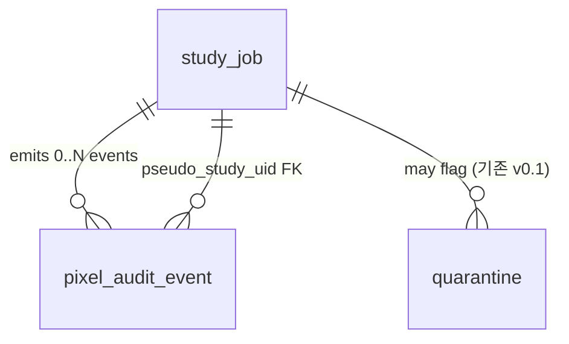
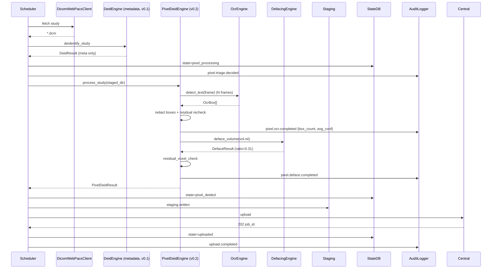
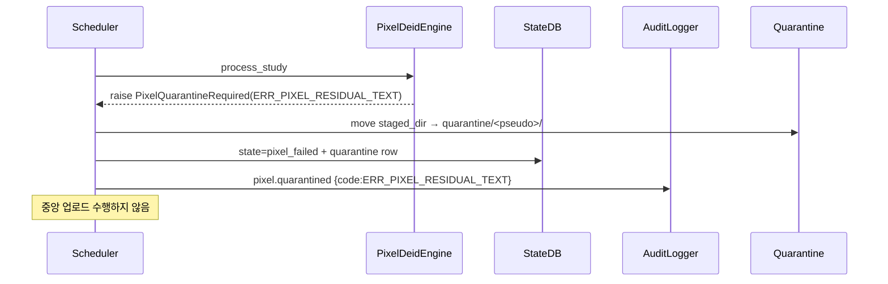

# 개발지시서 — De-ID Pixel v0.1 (번인 OCR 마스킹 + 3D Defacing)

> **Status**: Draft v0.1 · **Feature slug**: `de-id-pixel` · **Last updated**: 2026-04-22
> **작성자**: @planner · **근거**: [리서치 — de-id-pixel 기술 기반](../research/de-id-pixel-technical-foundations.md), [dev-spec-gateway-agent v0.1](./dev-spec-gateway-agent.md), [design-spec-gateway-agent v0.1](./design-spec-gateway-agent.md), [ARCHITECTURE §3.2](../ARCHITECTURE.md)

---

## 0. 요약 (TL;DR)

RadiVault Gateway Agent v0.1은 번인(Burned-in Annotation) 또는 얼굴이 노출된 두경부 영상을 **격리(quarantine) 전용**으로 처리한다. 본 `de-id-pixel` v0.1(= Gateway Agent 전체로는 v0.2)은 격리를 **픽셀 처리로 승격** — Tesseract 5 기반 OCR 번인 마스킹과 `pydeface` 기반 3D defacing을 추가해 그동안 업로드 불가였던 스터디를 익명 데이터로 끌어올린다. 본 기능은 **Gateway 내부 확장**이며 Central Ingest/Metadata Index/구매자 API 계약에는 영향이 없다. 기본값은 **OFF**(opt-in)이고, 실패·저신뢰 시 항상 기존 v0.1 격리 경로로 **fallback**한다. 무거운 의존성(Tesseract 바이너리, Korean language model, FSL/pydeface)은 별도 Docker 태그 `radivault-gateway:0.2.0-pixel`로 분리 배포해 기본 이미지의 slim 속성을 유지한다.

---

## 1. 기능 개요

### 1.1 배경

Gateway Agent v0.1은 DICOM PS3.15 Annex E 메타 De-ID 이후 다음 두 경우를 **중앙 전송 차단 + 격리 디렉터리 이동**으로 처리한다.

- **FR-11(v0.1)**: `(0028,0301) BurnedInAnnotation == YES` 또는 모달리티가 블랙리스트(`SC/US/OT`)인 스터디.
- 암묵적: 두개부 CT/MRI의 얼굴 표면은 **NEJM 2019 Schwarz et al.**이 보고한 face-recognition 기반 재식별 공격에 취약하나 v0.1은 별도 처리 없음.

격리 큐는 수동 QA로 소진되지 않으며 파일럿 병원의 **데이터 공급량을 최대 40%까지 잠재적으로 잠그는** 운영 리스크로 누적된다(리서치 §4.1.2). 본 기능은 "격리 뒤에 있는 실제 픽셀 처리"를 구현해 공급량을 해제한다.

### 1.2 범위 선언 — Gateway Internal Extension

- 본 기능은 **`src/radivault_gateway/deid/` 하위의 신규 서브모듈**(`pixel/`)과 **Orchestrator 파이프라인 1 스테이지 추가**로 구성된다.
- Central Ingest API 계약(`/v1/ingest/studies`, `/v1/audit/anchor`), Metadata Index 저장 스키마, 구매자 API 계약은 **변경 금지**.
- `(0012,0063) DeidentificationMethod` 문자열과 `(0012,0064) DeidentificationMethodCodeSequence`에 신규 코드 값이 **추가만** 되므로 Central 측 파서는 "모르는 코드 허용"이라는 기존 계약(dev-spec-gateway-agent §12)을 그대로 준수하면 된다.
- 본 기능은 **deploy-time opt-in**이며 기본값 OFF. 파일럿 병원이 활성화를 원하지 않으면 기본 Docker 이미지(`radivault-gateway:0.2.0`)만 배포받고 v0.1과 동일하게 동작한다.

### 1.3 용어

- **번인(Burn-in)**: DICOM 픽셀 내부에 인쇄된 환자/검사/장비 텍스트(US 코너 라벨, 뷰어 스크린샷 등). DICOM overlay plane과 구분.
- **Defacing**: 두개부 CT/MRI 볼륨에서 얼굴 피부/근육층 복셀을 제거·왜곡하여 3D 표면 재구성에 의한 재식별을 방해.
- **Residual Recheck**: redaction/defacing 완료 후 동일 영역에 대한 재스캔. 잔여 텍스트/얼굴 복셀 임계 초과 시 실패 처리.
- **Triage**: OCR/defacing을 실제로 실행하기 전에 대상 여부를 판정하는 사전 단계.

---

## 2. 사용자 스토리

- **As a** 병원 DPO, **I want** 번인 텍스트와 얼굴 표면이 자동으로 제거된 데이터만 중앙으로 간다는 것을 **재검증 로그로 확인**하고 싶다, **so that** 격리 큐가 아닌 실제 데이터 공급을 승인할 수 있다.
- **As a** RadiVault 운영 엔지니어, **I want** 픽셀 처리 실패 시 항상 v0.1 격리 경로로 **자동 폴백**되길 원한다, **so that** 픽셀 파이프라인이 데이터 유실 원인이 되지 않는다.
- **As a** 임상자문 방사선과 전문의, **I want** 치과·ENT·안과 등 얼굴 자체가 ROI인 스터디는 **자동 defacing을 하지 않고 사람이 결정**하도록 라우팅되길 원한다, **so that** 과제거로 임상 오진 가능성을 도입하지 않는다.
- **As a** RadiVault 개발자, **I want** OCR/defacing 의존성을 선택적으로만 컨테이너에 포함시킬 수 있길 원한다, **so that** 기본 이미지의 보안 공격 표면이 커지지 않는다.
- **As a** 파일럿 병원 IT 운영자, **I want** 설정 플래그 하나로 픽셀 처리 전체를 켜고 끌 수 있길 원한다, **so that** 기능 문제 시 즉시 v0.1 동작으로 되돌릴 수 있다.

---

## 3. 범위

### 포함 (In-scope — de-id-pixel v0.1 MVP)

1. **번인 트리아지 체인**
   - `(0028,0301) BurnedInAnnotation == YES` → OCR 경로 강제.
   - 모달리티 allowlist(`SC`, `OT`, `US`, `XA`, `MG`) → OCR 경로 강제.
   - `DeidEngine`이 이미 `burnin_quarantine_modalities`로 격리하던 스터디가 OCR 라우팅으로 승격된다(실패 시에만 격리).
   - 휴리스틱 fallback(코너 엣지 밀도 + 히스토그램 이봉성)은 **v0.2.1로 연기** — 본 v0.1 스펙은 설계만 남기고 구현하지 않음.
2. **OCR 엔진 (1차)**
   - Tesseract 5 + `kor.traineddata` + `eng.traineddata`. `pytesseract` 래퍼.
   - OCR 엔진은 `OcrEngine` Protocol 뒤에 숨기며 1차 구현체는 `TesseractOcrEngine`.
3. **OCR 엔진 (선택적 업그레이드)**
   - PaddleOCR을 `PaddleOcrEngine`으로 구현. `deid.pixel.ocr.engine=paddleocr` 설정 시 선택 가능. 기본 아님.
4. **OCR → Redaction 파이프라인**
   - Tesseract `image_to_data` 기반 bounding-box 감지.
   - 신뢰도(conf) ≥ `confidence_threshold`(기본 0.60) 박스만 redaction 적용.
   - 기본 fill: **solid black**(픽셀값 0 또는 `PixelPaddingValue` 설정값). `mean_pixel`/`gaussian_blur`는 config 옵션으로만 허용하되 non-default.
5. **저신뢰·미검출 폴백**
   - 트리아지 양성이지만 OCR 신뢰도 < 임계 또는 박스 0개 → **격리로 폴백**(v0.1 경로 유지).
6. **3D Defacing**
   - 1차: `pydeface` (BSD-유사 라이선스). FSL `flirt` 의존.
   - 폴백: `mridefacer` (BSD-3).
   - **배제**: FreeSurfer `mri_deface` (비상업 라이선스), AFNI `@afni_refacer_run` (의존 폭증).
   - 적용 조건: Modality ∈ `{CT, MR}` AND (`BodyPartExamined` ∈ {`HEAD`, `BRAIN`, `NEURO`, `STROKE`}) AND 의료 제외 리스트 미매칭.
7. **의료 제외 리스트 (StudyDescription 기반)**
   - 치과/ENT/얼굴 외상/부비동/안와/안과/악안면 패턴에 매칭되는 스터디는 **자동 defacing 금지** → 격리로 라우팅(사람 결정).
   - 패턴은 config로 재정의 가능, 한/영 동시 매칭.
8. **재검증 게이트 (Re-verification)**
   - OCR redaction 후: 동일 영역(±padding)에 OCR 재실행. conf ≥ 임계인 텍스트 탐지 시 실패 → 격리.
   - Defacing 후: 잔여 얼굴 복셀 추정. 대략적 anatomical 범위(얼굴 bounding-box)의 복셀 중 제거 예상인 비율이 임계 미만이면 실패 → 격리.
9. **파이프라인 통합**
   - 기존 `DeidEngine`(메타 De-ID) 이후, staging 기록 이전에 `PixelDeidEngine` 호출. config `deid.pixel.enabled=false`이면 완전히 skip(호출 자체 없음).
10. **State DB 확장**
    - `study_job.state` 값 추가: `pixel_processing`, `pixel_deided`, `pixel_failed`.
    - 신규 테이블 `pixel_audit_event`: 픽셀 처리 이벤트(시작/완료/격리/실패) 단위 구조화 기록.
11. **워커 패턴 — 동기 in-process (v0.2 MVP)**
    - 파이프라인 스테이지가 **블로킹** 호출하는 단일 프로세스 구현. 별도 워커 풀 도입은 v0.2.1로 연기.
12. **Config 확장**
    - `deid.pixel.*` 서브트리 추가, 모든 신규 키는 기본 OFF 또는 보수적 기본값.
13. **에러 코드 추가** (§13 Annex에 i18n 포함 전문).
    - `ERR_PIXEL_OCR_LOW_CONFIDENCE`, `ERR_PIXEL_OCR_ENGINE_FAILURE`, `ERR_PIXEL_RESIDUAL_TEXT`,
    - `ERR_PIXEL_DEFACE_LIBRARY_MISSING`, `ERR_PIXEL_DEFACE_FAILURE`, `ERR_PIXEL_RESIDUAL_FACE_VOXELS`,
    - `ERR_PIXEL_MEDICAL_EXCLUSION`, `WARN_PIXEL_HEURISTIC_TRIGGER`.
14. **Docker 이미지 전략**
    - 기본 `radivault-gateway:0.2.0` 은 v0.1 기능 동등(슬림).
    - 픽셀 variant `radivault-gateway:0.2.0-pixel`을 별도 빌드·푸시. 여기에만 `tesseract-ocr-kor`, `tesseract-ocr-eng`, `pydeface`, FSL 런타임이 포함된다.
15. **테스트**
    - 단위: 트리아지 분기, OCR 호출(mocked), redaction fill, defacing 호출(mocked), 의료 제외 매칭, 재검증 로직.
    - 통합: 실제 Tesseract 5로 합성 번인 DICOM 처리, 합성 CT head에 pydeface 실행, end-to-end `Pipeline.run_once` variant(pixel 경로 on/off).
    - 성능: 스터디당 OCR/defacing 벤치마크를 `pytest-benchmark` 또는 수동 측정으로 NFR 범위 검증.

### 제외 (Out-of-scope — v0.2.1 이상)

1. **휴리스틱 기반 번인 탐지**(`BurnedInAnnotation` 태그가 누락된 경우의 엣지 밀도·히스토그램 검사) — 리서치 §4.1.3. v0.2.1에서 구현.
2. **비동기 워커 풀 / 프로세스 풀 최적화** — v0.2.1.
3. **PaddleOCR 기본 엔진화** — v0.2.1 이후 파일럿 벤치마크 결과에 따라 결정.
4. **GPU 가속 defacing** — v0.3 이후.
5. **U-Net 기반 커스텀 얼굴 세그멘테이션** — v1.0+.
6. **의료 영상 inpainting 기반 redaction** — v1.0+.
7. **과거 격리된 스터디의 재처리/재생성** — 별도 스펙 필요(v0.3 이후).
8. **OCR/defacing 모델 자동 업데이트** — v0.3+.
9. **임상의 수동 QA UI** — 파이프라인 v0.2 범위 밖. 별도 `dev-spec-clinician-qa`로 추후.
10. **`(0012,0064)`에 추가할 새로운 DICOM code value 자체 생성·등록** — 표준 CID 7050을 사용하고 "Pixel Data Modified" 류 코드를 활용하되, 미국 DICOM WG 등록이 필요한 신규 코드는 생성하지 않는다.

---

## 4. 기능 요구사항

### 4.1 번인 트리아지 (Triage)

- **FR-1** (근거: 리서치 §4.1.1): `PixelDeidEngine.triage()`는 스터디 단위 입력 DICOM 집합을 받아 다음 값 중 하나를 반환해야 한다: `OCR_REQUIRED`, `OCR_CONDITIONAL`, `SKIP`. `OCR_REQUIRED`는 반드시 OCR이 1회 이상 실행되어야 함을 의미하고, `SKIP`은 픽셀 OCR 스테이지를 건너뜀을 의미한다.
- **FR-2** (근거: 리서치 §4.1.1): 스터디의 **어떤** instance 하나라도 `(0028,0301) BurnedInAnnotation == "YES"`이면 결과는 `OCR_REQUIRED`.
- **FR-3** (근거: 리서치 §4.1.2, config key `deid.pixel.ocr.modality_allowlist`): 스터디의 최고 위험 Modality가 allowlist(`SC/OT/US/XA/MG` 기본)에 있으면 `OCR_REQUIRED`.
- **FR-4**: `BurnedInAnnotation == NO` 이고 Modality가 allowlist 외(`CT/MR/NM/PT/CR/DX` 등)이면 v0.1 스펙에서 `SKIP`을 반환한다. 휴리스틱 fallback은 v0.2.1.
- **FR-5**: 트리아지 결정은 per-study 1회로 캐시되며 동일 study 내 모든 series에 동일 결정을 적용한다.
- **FR-6**: 트리아지 결과는 `pixel_audit_event` 테이블에 `event="triage"`, `decision=<OCR_REQUIRED|OCR_CONDITIONAL|SKIP>`, `reason=<burn_in_tag|modality_allowlist|neither>`로 기록된다.

### 4.2 OCR 엔진 (Abstracted)

- **FR-7** (근거: 리서치 §4.2.1): `OcrEngine` Protocol을 정의한다:
  ```
  class OcrEngine(Protocol):
      def detect_text(self, image: np.ndarray, *, languages: list[str]) -> list[OcrBox]: ...
      def version(self) -> str: ...
  ```
  여기서 `OcrBox = (x, y, w, h, text, confidence)`.
- **FR-8**: 1차 구현체 `TesseractOcrEngine`은 `pytesseract.image_to_data(..., lang='kor+eng')`를 호출해 박스 단위 결과를 반환해야 한다.
- **FR-9**: 2차 구현체 `PaddleOcrEngine`은 동일 Protocol을 충족. config `deid.pixel.ocr.engine=paddleocr`일 때 DI 컨테이너가 이를 선택한다.
- **FR-10** (근거: 리서치 §4.2.2): OCR 언어 설정은 `deid.pixel.ocr.languages`(기본 `["kor","eng"]`)로 주입. 언어 리스트가 빈 배열이면 기동 시 `ERR_CFG_*` 에러로 종료.
- **FR-11**: OCR 엔진 호출은 프레임/슬라이스 단위 2D ndarray를 입력으로 받는다. DICOM → ndarray 변환은 `pydicom`의 `pixel_array` + (필요 시) `apply_voi_lut`을 사용한다.
- **FR-12**: 멀티 프레임 DICOM은 프레임별로 OCR. 3D CT/MR 볼륨은 v0.2에서 **OCR 대상이 아님**(defacing으로만 처리) — 리서치 §4.1.2 참조.
- **FR-13**: OCR 엔진 런타임 예외는 `PixelDeidEngineError(code=ERR_PIXEL_OCR_ENGINE_FAILURE)`로 래핑되어야 한다. 스터디는 격리로 폴백.

### 4.3 OCR → Redaction

- **FR-14**: 감지된 박스 중 `box.confidence >= config.deid.pixel.ocr.confidence_threshold`(기본 0.60) 박스만 redaction 적용 후보이다.
- **FR-15**: 임계 미만 박스가 있고, 동일 프레임에 임계 이상 박스가 하나도 없다면 → **폴백 정책**: `quarantine_on_failure=true`(기본)이면 격리, `false`이면 `WARN_PIXEL_HEURISTIC_TRIGGER` 경고 + 원본 그대로 진행(단, `OCR_REQUIRED` 트리아지에서는 이 경로 금지 — 반드시 격리).
- **FR-16** (근거: 리서치 §4.3.2): 기본 redaction fill은 **solid black**(픽셀값 0). config `deid.pixel.ocr.redaction_fill`이 `mean_pixel` 또는 `gaussian_blur`면 해당 방식 사용. 단 재검증(FR-19)이 통과되는 한에서만 허용 — 재검증이 반복 실패하면 자동으로 `solid_black`으로 fallback한다.
- **FR-17**: 박스는 각 변에 `deid.pixel.ocr.box_padding_px`(기본 2) 픽셀 패딩을 추가해 redaction한다.
- **FR-18**: redaction 완료 후 DICOM 파일에는 `(0012,0064) DeidentificationMethodCodeSequence`에 **"113101 Pixel Data Modified"** 또는 동등 CID 7050 코드(Kyle 확정 필요, 오픈 질문)가 추가되어야 한다. 또한 `(0020,4000) ImageComments`에 평문 `"RadiVault-PixelRedacted"` 태그를 append(기존 ImageComments는 메타 De-ID 단계에서 이미 제거됨).
- **FR-19** (재검증): redaction 완료 이미지에 대해 **동일 영역(±4px)만 crop해서 OCR 재실행**. conf ≥ 임계인 텍스트가 하나라도 감지되면 `ERR_PIXEL_RESIDUAL_TEXT`로 실패 → 격리. config `deid.pixel.ocr.residual_recheck=false`이면 이 단계를 건너뛸 수 있으나 기본 `true`.
- **FR-20**: OCR 재검증을 통과한 스터디만 `pixel_deided` 상태로 전이된다.

### 4.4 3D Defacing

- **FR-21** (근거: 리서치 §4.4.1): `DefacingEngine` Protocol을 정의한다:
  ```
  class DefacingEngine(Protocol):
      def deface_volume(self, volume_path: Path, out_path: Path) -> DefaceResult: ...
      def version(self) -> str: ...
      def is_available(self) -> bool: ...
  ```
- **FR-22**: 1차 구현체 `PydefaceEngine`(pydeface + FSL flirt). 2차 구현체 `MridefacerEngine`. config `deid.pixel.defacing.library`(기본 `pydeface`)가 선택한다.
- **FR-23**: 기동 시 엔진의 `is_available()`이 `False`이면 `ERR_PIXEL_DEFACE_LIBRARY_MISSING`으로 로그 + `deid.pixel.defacing.enabled`를 자동으로 `false`로 다운그레이드하거나(config `deid.pixel.defacing.on_missing=disable`, 기본) 즉시 종료한다(`on_missing=fail_start`).
- **FR-24** (모달리티 게이트): defacing은 Modality ∈ `deid.pixel.defacing.modalities`(기본 `["CT","MR"]`) AND `BodyPartExamined` ∈ `deid.pixel.defacing.body_parts`(기본 `["HEAD","BRAIN","NEURO","STROKE"]`)인 스터디에만 적용한다.
- **FR-25** (의료 제외 리스트 — 근거: 리서치 §4.5.1): `deid.pixel.defacing.exclusion_patterns`(정규식 목록, 기본값 §6.3 config 스키마 참조)에 `StudyDescription`이 매칭되면 defacing을 수행하지 않고 `ERR_PIXEL_MEDICAL_EXCLUSION` 이벤트 + **격리로 라우팅**한다. OCR redaction은 이 경우에도 여전히 시도한다(얼굴 외의 번인 텍스트 존재 가능).
- **FR-26**: 기본 제외 패턴은 다음 정규식을 포함한다(case-insensitive):
  - `(?i)dental`, `(?i)\bENT\b`, `(?i)facial[ _-]?trauma`, `(?i)maxillofacial`, `(?i)sinus`, `(?i)orbit`, `(?i)ophthalm`.
  - 한국어 키워드(치과/부비동/안와 등)는 config 예시에 주석으로 제공되며 파일럿에서 실측 StudyDescription 수집 후 보강한다(오픈 질문).
- **FR-27**: Defacing은 series 단위가 아니라 **study의 관련 series 중 가장 밀도 높은 3D 볼륨 1개**에 대해 실행한다. pydeface가 NIfTI 포맷을 요구하므로 내부적으로 `pydicom → nibabel` 변환 레이어가 필요하며, 변환 산출물은 처리 후 삭제한다.
- **FR-28**: Defacing 산출물은 원본과 같은 SOPInstanceUID를 가진 DICOM으로 다시 인코딩되어 staging 경로에 기록되어야 한다(pseudo UID는 메타 De-ID 단계에서 이미 확정됨).
- **FR-29** (재검증): defacing 완료 볼륨에 대해 얼굴 bounding box 영역(대략 머리 슬라이스의 전면 1/3)의 **제거 복셀 비율**이 `deid.pixel.defacing.min_removed_ratio`(기본 0.05) 미만이면 `ERR_PIXEL_RESIDUAL_FACE_VOXELS`로 실패 → 격리. config `deid.pixel.defacing.residual_voxel_check=false`로 끌 수 있지만 기본 `true`.
- **FR-30**: Defacing 중 pydeface 런타임 예외(FLIRT 수렴 실패 등)는 `ERR_PIXEL_DEFACE_FAILURE`로 래핑 → `MridefacerEngine` fallback 시도(config `deid.pixel.defacing.fallback=true`, 기본 `true`). 폴백도 실패하면 격리.

### 4.5 파이프라인 통합

- **FR-31**: `Pipeline._process_study`는 기존 `DeidEngine.deidentify_study` 호출 이후, staging 이동 직전에 `PixelDeidEngine.process_study(pseudo_study_uid, staging_dir)`를 호출한다. config `deid.pixel.enabled=false`이면 이 호출 블록 자체를 건너뛴다(기존 v0.1 동작 동등).
- **FR-32** (상태 머신): `study_job.state`에 다음 값을 추가한다:
  - `pixel_processing`: `PixelDeidEngine.process_study` 실행 중.
  - `pixel_deided`: OCR/defacing + 재검증 모두 통과. (이후 `uploading`으로 전이)
  - `pixel_failed`: 픽셀 처리 중 실패했으나 격리로 폴백된 상태. 기존 `quarantined`와 구분해 원인을 명확히 함.
- **FR-33**: `PixelDeidEngine`은 다음 예외 체계를 갖는다:
  - `PixelQuarantineRequired(reason, code)` — 격리로 폴백해야 함(트리아지 포기, 재검증 실패, 의료 제외 등).
  - `PixelDeidEngineError(code, message)` — 엔진 내부 오류(OCR crash 등). 호출자는 이를 `PixelQuarantineRequired`로 승격할지 config로 결정(`deid.pixel.quarantine_on_failure=true` 기본).
- **FR-34**: `PixelQuarantineRequired` 발생 시 파이프라인은 v0.1의 `QuarantineRequired` 처리 로직을 재사용해 `quarantine_path`로 이동, `quarantine` 테이블에 이벤트 기록, state=`pixel_failed`(신규)로 설정한다. 중앙 업로드는 차단된다.
- **FR-35**: `PixelDeidEngine.process_study`가 성공 반환 시 파이프라인은 staging 기록 후 기존 업로드 플로우를 그대로 진행한다.
- **FR-36**: 동기 in-process 실행 중 부모 프로세스 크래시 시, 재기동 후 orchestrator는 `pixel_processing` 상태인 study_job을 감지하고 staging 중간 산출물을 삭제 + state를 `deided`로 롤백해 다음 주기에 재시도 큐잉한다.

### 4.6 감사 로그 (Audit)

- **FR-37**: 신규 감사 이벤트(기존 AuditLogger에 추가, v0.1 hash chain 규칙 FR-22~27 준수):
  - `pixel.triage.decided` — 트리아지 결과.
  - `pixel.ocr.started`, `pixel.ocr.completed`, `pixel.ocr.box_count`.
  - `pixel.ocr.residual_check.failed`.
  - `pixel.deface.started`, `pixel.deface.completed`, `pixel.deface.fallback_used`.
  - `pixel.deface.residual_check.failed`.
  - `pixel.skipped` (reason 필드 포함).
  - `pixel.medical_exclusion.matched`.
  - `pixel.quarantined` (reason, code).
- **FR-38** (PHI 로그 오염 금지 — dev-spec-gateway-agent §12.5 준수): OCR로 추출된 텍스트 원문은 audit log/app log에 **절대 기록하지 않는다**. 대신 다음만 기록:
  - `box_count`, `avg_confidence`, `min_confidence`, `max_confidence`.
  - 박스별 `SHA256(text)[:16]` 해시(길이 8바이트). 재식별 불가 고정.
  - 박스 크기·좌표(상대 % 단위만 — 절대 pixel 좌표는 기록 금지).
- **FR-39**: 각 픽셀 단계(시작/완료/실패)는 동시에 `pixel_audit_event` 테이블(§6.2)에 구조화 레코드로 적재되어야 한다. `AuditLogger`의 hash-chained JSON-lines와 DB 레코드는 `seq` 값으로 교차 참조 가능해야 한다.

### 4.7 Config

- **FR-40**: `gateway.yml`의 `deid` 블록에 `pixel:` 서브트리를 추가한다. 기본값과 전체 스키마는 §6.3 참조.
- **FR-41**: `deid.pixel.enabled=false`(기본)이면 `PixelDeidEngine`은 생성조차 되지 않는다(호출 사이트에서 분기). 기존 v0.1 동작과 **비트-동등(bit-equivalent)** 해야 한다(AC-25).
- **FR-42**: `deid.pixel.ocr.engine` 값이 `tesseract` 또는 `paddleocr`이 아니면 `ERR_CFG_*`로 기동 거부. 동일하게 `deid.pixel.defacing.library`는 `pydeface` 또는 `mridefacer`만 허용.
- **FR-43**: 모든 `deid.pixel.*` 키는 `RADIVAULT_DEID_PIXEL_<KEY>` 형식 환경변수로 override 가능해야 한다(dev-spec-gateway-agent FR-35 패턴 준수).
- **FR-44**: `deid.pixel.enabled=true`인데 해당 Docker 이미지가 `-pixel` 변형이 아니면(즉 Tesseract 바이너리가 없음) 기동 시 `ERR_PIXEL_OCR_ENGINE_FAILURE`(변종: `missing_binary`)로 실패 종료한다.

### 4.8 CLI 확장

- **FR-45**: `gateway-agent de-id-test <file.dcm>` 명령에 `--pixel` 플래그를 추가한다. 지정 시 메타 De-ID 이후 PixelDeidEngine까지 실행하며 OCR box count, confidence histogram, defacing 실행 여부(CT/MR HEAD)를 리포트한다. 리포트는 원문 텍스트 포함 금지(해시만).
- **FR-46**: `gateway-agent status` 출력의 `Pipeline (24h)` 섹션에 `pixel_deided` / `pixel_failed` 카운트가 추가되어야 한다. JSON 출력에도 동일.
- **FR-47**: `gateway-agent pixel-selftest` 신규 서브커맨드 — Tesseract 바이너리 + `kor`/`eng` 언어팩 + pydeface 실행 가능 여부를 확인. exit 0(모두 OK)/1(OCR 누락)/2(defacing 누락)/3(둘 다 누락).

---

## 5. 비기능 요구사항

| 항목 | 요구 |
|------|------|
| OCR 성능 | **프레임 1장** OCR 처리 시간 p95 ≤ **3초** (1024×1024 이하, Tesseract + kor+eng, 4 vCPU 호스트 기준). US 50프레임 단일 시리즈 p95 ≤ **60초** (설계 목표). |
| Defacing 성능 | 단일 Head CT(400 슬라이스, 512×512, 16-bit) defacing 처리 시간 p95 ≤ **90초** (pydeface + FSL flirt, 4 vCPU, 8GB RAM). Head MR(200 슬라이스) p95 ≤ **120초**. |
| 메모리 | 단일 워커(스터디 처리 중) 피크 RSS ≤ **2 GB**. 초과 시 `ERR_PIXEL_DEFACE_FAILURE(variant=oom)`로 실패 처리. |
| 파이프라인 지연 (Δ) | OCR+defacing 대상 스터디의 전체 파이프라인 p95는 기존 v0.1 대비 ≤ **+120초**. 비대상 스터디는 지연 추가 없음(1초 이내 triage skip). |
| 처리량 | 단일 호스트에서 일 1,000 스터디 처리 시 pixel-eligible 비율이 20% 이하라면 24시간 내 소진 가능. 초과 시 backpressure 동작 기존 v0.1 그대로. |
| 보안 | 픽셀 산출 텍스트·face voxel·중간 NIfTI 파일은 파이프라인 완료 즉시(`finally` 블록) 삭제. audit log에 평문 OCR 결과 기록 금지. 컨테이너 non-root. |
| 가용성 | 픽셀 엔진 실패가 전체 파이프라인 실패로 전파되지 않아야 한다. 반드시 격리 폴백. |
| 회복 | OCR/defacing 중 프로세스 크래시 시 `pixel_processing` 상태 스터디를 재기동 시 롤백 + 재큐잉(FR-36). |
| 로깅·감사 | 픽셀 이벤트 hash-chained audit log + `pixel_audit_event` DB 레코드(§6.2) 이중 기록. |
| 관측성 | `pixel_audit_event` 테이블이 최근 24h OCR box_count 분포, defacing 성공률, 격리 사유 Top-K를 집계 가능하게 구조화. |
| 라이선스 안전 | FreeSurfer 사용 금지(비상업), GPL 전용 의존 추가 금지. pydeface(BSD-유사), mridefacer(BSD-3), Tesseract(Apache-2.0), PaddleOCR(Apache-2.0), pytesseract(Apache-2.0) 만 허용. |
| 이미지 보안 | `-pixel` variant는 `trivy image` HIGH 0개. FSL 바이너리의 CVE 노출은 재평가 후 파일럿 시작 전 결정. |
| i18n | 에러 메시지 ko+en 이중(§13 Annex). CLI 도움말은 dev-spec-gateway-agent §8 규칙 준수. |

---

## 6. 데이터 모델

### 6.1 State DB — `study_job.state` 확장

v0.1의 `study_job.state` 열거형(dev-spec-gateway-agent §6.1)에 다음 3개 값을 추가한다:

```sql
-- v0.1 (기존): 'queued'|'fetching'|'deided'|'quarantined'|'uploading'|'uploaded'
--              |'failed_fetch'|'failed_deid'|'failed_reverify'|'failed_upload'
-- v0.2 추가:
--   'pixel_processing'  -- PixelDeidEngine running
--   'pixel_deided'      -- pixel OCR/defacing + reverify passed; ready to upload
--   'pixel_failed'      -- pixel pipeline failed; routed to quarantine
```

- SQLite는 enum 강제가 없으므로 마이그레이션은 순수 "코드 레벨에서 새 문자열 값 인정"만 필요하다. 기존 테이블 스키마 변경은 없다.
- `idx_study_job_state` 인덱스는 유지. 새 값이 조회 패턴에 포함된다.
- 상태 전이 다이어그램 (v0.2):

```
queued → fetching → deided →
   ├─ [pixel.enabled=false] → uploading → uploaded
   └─ [pixel.enabled=true]  → pixel_processing →
                                 ├─ pixel_deided → uploading → uploaded
                                 ├─ pixel_failed → quarantined(= 기존 v0.1 격리 큐)
                                 └─ (crash recovery) → deided (재큐잉)
```

### 6.2 신규 테이블 — `pixel_audit_event`

```sql
CREATE TABLE pixel_audit_event (
    id                   INTEGER PRIMARY KEY AUTOINCREMENT,
    pseudo_study_uid     TEXT NOT NULL,
    sop_instance_uid     TEXT,                  -- nullable: OCR은 per-frame,
                                                -- defacing은 per-volume
    op                   TEXT NOT NULL,         -- 'triage' | 'ocr' | 'deface' |
                                                -- 'residual_ocr' | 'residual_face' |
                                                -- 'exclusion'
    outcome              TEXT NOT NULL,         -- 'success' | 'quarantine' | 'failure'
    library              TEXT,                  -- 'tesseract' | 'paddleocr' |
                                                -- 'pydeface' | 'mridefacer' | null
    library_version      TEXT,
    duration_ms          INTEGER,
    box_count            INTEGER,               -- OCR only
    avg_confidence       REAL,                  -- OCR only, 0..1
    min_confidence       REAL,
    max_confidence       REAL,
    removed_voxel_ratio  REAL,                  -- defacing only, 0..1
    reason               TEXT,                  -- error code or skip reason
    audit_seq            INTEGER,               -- cross-ref to audit.log seq
    created_at           TEXT NOT NULL          -- ISO8601 UTC
);
CREATE INDEX idx_pixel_audit_study   ON pixel_audit_event(pseudo_study_uid);
CREATE INDEX idx_pixel_audit_op      ON pixel_audit_event(op);
CREATE INDEX idx_pixel_audit_outcome ON pixel_audit_event(outcome);
CREATE INDEX idx_pixel_audit_created ON pixel_audit_event(created_at);
```

- **금지 컬럼**(PHI 오염 방지): 원본 텍스트, box 절대 pixel 좌표, 원본 SOP UID, 원본 환자 ID.
- **PR 시점 마이그레이션**: `src/radivault_gateway/migrations/0002_pixel_audit.sql` 신규 파일. Alembic은 도입하지 않음(v0.1 state.py가 `CREATE TABLE IF NOT EXISTS` 순차 실행 방식 유지).
- **유지 기간**: `pixel_audit_event`는 `study_job` 레코드와 cascaded 삭제되지 않는다. 운영자가 독립 회전할 수 있도록 `created_at` 기준 90일 이상 레코드는 `gateway-agent pixel-audit prune` CLI(선택, v0.2.1)로 정리한다. 5년 보존 요건은 파일 레벨 audit.log에 의해 이미 충족됨.

### 6.3 Config Schema 추가 — `deid.pixel.*`

```yaml
deid:
  # (기존 v0.1 키들 — ruleset_version, salt, salt_version, burnin_quarantine_modalities,
  #  retain_options 는 그대로)

  pixel:
    enabled: false                               # 마스터 킬 스위치, 기본 OFF (FR-41)
    quarantine_on_failure: true                  # 실패 시 격리 폴백 (v0.1 동등)

    ocr:
      enabled: true                              # pixel.enabled=true 일 때만 유효
      engine: tesseract                          # tesseract | paddleocr
      languages: ["kor", "eng"]
      confidence_threshold: 0.60                 # 0..1
      redaction_fill: solid_black                # solid_black | mean_pixel | gaussian_blur
      box_padding_px: 2
      residual_recheck: true
      modality_allowlist: ["SC", "OT", "US", "XA", "MG"]

    defacing:
      enabled: true                              # pixel.enabled=true 일 때만 유효
      library: pydeface                          # pydeface | mridefacer
      fallback: true                             # pydeface 실패 시 mridefacer 시도
      on_missing: disable                        # disable | fail_start
      modalities: ["CT", "MR"]
      body_parts: ["HEAD", "BRAIN", "NEURO", "STROKE"]
      exclusion_patterns:                        # StudyDescription regex → 제외 + 격리
        - "(?i)dental"
        - "(?i)\\bENT\\b"
        - "(?i)facial[ _-]?trauma"
        - "(?i)maxillofacial"
        - "(?i)sinus"
        - "(?i)orbit"
        - "(?i)ophthalm"
        # 한국어 추가 권장 (파일럿에서 실측 수집 후 보강):
        # - "치과"
        # - "부비동"
        # - "안와"
      min_removed_ratio: 0.05                    # 재검증 — 제거 복셀 비율 하한
      residual_voxel_check: true
```

- Pydantic v2 모델 신규: `PixelDeidConfig`, `PixelOcrConfig`, `PixelDefacingConfig`. v0.1의 `DeidConfig`에 `pixel: PixelDeidConfig = PixelDeidConfig()` 필드 추가.
- `PixelDeidConfig.enabled=False`가 기본. 나머지 필드는 "활성화 시 디폴트"이며 validation은 `enabled=true`일 때만 engine/library 문자열 허용값 검사.

### 6.4 DICOM 태그 효과

- `(0012,0063) DeidentificationMethod` 문자열은 다음 suffix를 추가한다(pixel stage 실행 시):
  - `... Annex E Basic + options + PixelRedacted[+Defaced]`.
- `(0012,0064) DeidentificationMethodCodeSequence`에 다음 코드를 **append**(기존 v0.1 코드에 추가):
  - OCR redaction 실행 시: `("113101", "Pixel Data Modified", "DCM")` (Kyle 확정 필요 — CID 7050의 정확한 코드 값; 오픈 질문).
  - Defacing 실행 시: 표준에 정확한 매칭 코드가 부재 → v0.2는 private code `("RV_DEFACE_01", "3D Face Surface Defaced", "RADIVAULT")` 사용 제안(오픈 질문).
- `(0020,4000) ImageComments`에 `"RadiVault-PixelRedacted"` 또는 `"RadiVault-Defaced"` 문자열 append. 원본 ImageComments는 메타 De-ID 단계(Annex A)에서 이미 `X`(제거)되어 있으므로 항상 신규 기록이다.

### 6.5 Manifest 영향

- `manifest.json`의 `deid.method_code_sequence` 배열에 위 추가 코드들이 자연스럽게 포함된다(기존 v0.1 dev-spec §6.4 동일 스키마, 값만 추가).
- `manifest.json`에 **신규 필드 추가 없음** — Central 계약 불변성 유지. 픽셀 처리 적용 여부는 DICOM 태그 내부에서만 표현된다.

### 6.6 ER 다이어그램 (mermaid)



---

## 7. 내부 API 계약 (Python Protocol)

### 7.1 `PixelDeidEngine`

```python
from typing import Protocol
from pathlib import Path
from dataclasses import dataclass

@dataclass(frozen=True)
class PixelDeidResult:
    pseudo_study_uid: str
    ocr_applied: bool
    defacing_applied: bool
    n_frames_ocr: int
    n_boxes_redacted: int
    n_volumes_defaced: int
    ocr_duration_ms: int
    deface_duration_ms: int
    library_ocr: str | None           # 'tesseract' | 'paddleocr' | None
    library_deface: str | None        # 'pydeface' | 'mridefacer' | None

class PixelQuarantineRequired(Exception):
    code: str                         # ERR_PIXEL_* (§13)
    reason: str
    offending_sops: list[str]

class PixelDeidEngineError(Exception):
    code: str
    message: str

class PixelDeidEngine(Protocol):
    def process_study(
        self,
        staged_dir: Path,             # v0.1 DeidEngine이 이미 메타 De-ID 완료한 staging
        *,
        pseudo_study_uid: str,
        study_description: str,
        modality_set: set[str],
        body_part: str | None,
    ) -> PixelDeidResult:
        """OCR redaction + 3D defacing with re-verification gates.

        Mutates files under ``staged_dir`` in-place.
        Raises PixelQuarantineRequired on any re-verification failure or
        medical exclusion match (caller moves to quarantine).
        Raises PixelDeidEngineError on OCR/defacing engine runtime errors;
        the caller decides whether to escalate to quarantine based on
        config.deid.pixel.quarantine_on_failure.
        """

    def triage(
        self,
        staged_dir: Path,
        *,
        modality_set: set[str],
    ) -> "TriageDecision": ...        # OCR_REQUIRED | OCR_CONDITIONAL | SKIP
```

### 7.2 `OcrEngine`

```python
import numpy as np
from dataclasses import dataclass

@dataclass(frozen=True)
class OcrBox:
    x: int
    y: int
    w: int
    h: int
    text: str                # engine-internal only; MUST NOT be logged as plaintext
    confidence: float        # 0.0..1.0

class OcrEngine(Protocol):
    def detect_text(
        self, image: np.ndarray, *, languages: list[str]
    ) -> list[OcrBox]: ...

    def version(self) -> str: ...

    @property
    def engine_name(self) -> str: ...   # 'tesseract' | 'paddleocr'
```

구현체:
- `TesseractOcrEngine` — `pytesseract.image_to_data(pil_image, lang='+'.join(languages), output_type=DICT)` 래핑.
- `PaddleOcrEngine` — `paddleocr.PaddleOCR(lang='korean', use_angle_cls=False, use_gpu=False).ocr(...)`.

### 7.3 `DefacingEngine`

```python
@dataclass(frozen=True)
class DefaceResult:
    success: bool
    out_volume_path: Path
    removed_voxel_ratio: float         # 0..1 (얼굴 bbox 영역 내 제거 비율)
    duration_ms: int

class DefacingEngine(Protocol):
    def deface_volume(self, volume_path: Path, out_path: Path) -> DefaceResult: ...
    def is_available(self) -> bool: ...
    def version(self) -> str: ...
    @property
    def engine_name(self) -> str: ...  # 'pydeface' | 'mridefacer'
```

구현체:
- `PydefaceEngine` — `pydeface.utils.deface_image(...)` 호출. 내부에서 DICOM → NIfTI (`dcm2niix` or `nibabel`) 변환, deface, NIfTI → DICOM 역변환.
- `MridefacerEngine` — CLI 래핑 (`mridefacer <in> <out>`).

### 7.4 Dependency Injection

- `src/radivault_gateway/deid/pixel/engine.py`에 `build_pixel_deid_engine(cfg: PixelDeidConfig, state_db: StateDB, audit: AuditLogger) -> PixelDeidEngine | None` 팩토리를 정의. `cfg.enabled=False`면 `None` 반환.
- Orchestrator(`pipeline.py`)는 `if self._pixel is not None:` 분기로 호출.

### 7.5 외부 API (변경 없음)

- Central Ingest `POST /v1/ingest/studies` — **계약 동일**. FR-5.
- Central Audit anchor `POST /v1/audit/anchor` — **계약 동일**.
- Metadata Index의 저장 계약 — **계약 동일**.
- 구매자 포털/Search API — **계약 동일**.

---

## 8. 시퀀스·플로우

### 8.1 픽셀 스테이지 포함 전체 파이프라인

```
[Scheduler tick]
        |
        v
[QIDO-RS → WADO-RS fetch]  (v0.1 동일)
        |
        v
[DeidEngine — Annex E metadata + UID/date pseudonymisation]
        |  quarantine (BurnedInAnnotation=YES or blacklist modality)
        |    └─ v0.2부터는 pixel.enabled=true 시 "격리 대신 pixel 경로로 재라우팅"
        |       (§8.3 참조)
        v
[pixel.enabled? ── false ──────────────────┐
        |                                   |
        |  true                             |
        v                                   |
[PixelDeidEngine.triage(staged_dir)]         |
        |                                   |
   ┌────┴────┐                              |
   | SKIP    |→ (OCR/defacing 모두 skip) ───┤
   |         |                              |
   | OCR_REQ |                              |
   v         v                              |
[OCR frame loop]                             |
   each frame:                               |
     engine.detect_text()                    |
     filter confidence ≥ threshold           |
     redact boxes (solid_black default)      |
     residual_recheck crop → re-OCR          |
        └─ FAIL → PixelQuarantineRequired → quarantine (v0.1 경로)
        |
        v
[Modality/body_part match?]
   yes:
     [Medical exclusion pattern match?]
       yes → PixelQuarantineRequired(ERR_PIXEL_MEDICAL_EXCLUSION) → quarantine
       no  →
         [DefacingEngine.deface_volume()]
            FAIL → fallback engine → FAIL again → PixelQuarantineRequired → quarantine
         [Residual voxel check]
            FAIL → PixelQuarantineRequired(ERR_PIXEL_RESIDUAL_FACE_VOXELS) → quarantine
   no: skip defacing
        |                                   |
        v                                   |
[Add DICOM method codes (113101 + RV_DEFACE_01 if applied)]
        |                                   |
        v                                   |
[staging.written] ←──────────────────────────┘
        |
        v
[Upload — central /v1/ingest/studies]     (v0.1 동일)
        |
        v
[Audit — hash-chained local + hourly anchor]  (v0.1 동일)
        |
        v
[Cleanup staging]
```

### 8.2 mermaid 시퀀스 (정상 경로)



### 8.3 폴백 시퀀스 (픽셀 실패 → 격리)



### 8.4 의료 제외 시퀀스

```
StudyDescription="Dental CBCT maxilla"
→ pixel.triage = OCR_REQUIRED (모달리티는 CT 기본 skip이나 description이 dental)
→ OCR 수행 (번인 텍스트 제거 목적)
→ [exclusion pattern match: dental]
→ skip defacing
→ PixelQuarantineRequired(ERR_PIXEL_MEDICAL_EXCLUSION)
→ 격리 큐로 이동, 사람이 결정
```

---

## 9. 의존성 및 기술 스택

### 9.1 상위 모듈

- `radivault_gateway.deid.engine.DeidEngine` (v0.1) — 메타 De-ID 선행. pixel 스테이지 입력은 이 모듈의 출력 staging_dir.
- `radivault_gateway.orchestrator.pipeline.Pipeline` — 픽셀 호출 지점 주입.
- `radivault_gateway.audit.AuditLogger` — hash-chained audit. 신규 이벤트 추가 소비.
- `radivault_gateway.state.StateDB` — `pixel_audit_event` 테이블 소유, state enum 확장.
- `radivault_gateway.config.GatewayConfig` — `deid.pixel` 서브트리.

### 9.2 하위 모듈 (신규)

- `radivault_gateway.deid.pixel.engine.PixelDeidEngineImpl` — 메인 오케스트레이션.
- `radivault_gateway.deid.pixel.triage.TriageEvaluator`.
- `radivault_gateway.deid.pixel.ocr.tesseract.TesseractOcrEngine`.
- `radivault_gateway.deid.pixel.ocr.paddle.PaddleOcrEngine` (optional extras).
- `radivault_gateway.deid.pixel.defacing.pydeface_engine.PydefaceEngine`.
- `radivault_gateway.deid.pixel.defacing.mridefacer_engine.MridefacerEngine`.
- `radivault_gateway.deid.pixel.conversion.dicom_nifti` — DICOM ↔ NIfTI 변환 유틸.

### 9.3 외부 시스템·벤더

- **Tesseract 5** (apt: `tesseract-ocr`, `tesseract-ocr-kor`, `tesseract-ocr-eng`). Apache-2.0.
- **PaddleOCR** (optional, Python: `paddleocr` + `paddlepaddle`). Apache-2.0.
- **pydeface** (Python). BSD-유사(NIPY).
- **FSL** (런타임 바이너리, pydeface가 호출). **라이선스 주의** — 학술/비상업 FSL 라이선스와 RadiVault 상업 목적 사용의 충돌 가능성 → **법무 자문 필수**(§12.1, §11-Open-Q).
- **mridefacer** — BSD-3.
- **nibabel**, **dcm2niix** — BSD / public domain. DICOM↔NIfTI 변환.
- **numpy**, **Pillow**, **opencv-python-headless** — 픽셀 ndarray 조작.

### 9.4 선행 기능

- Gateway Agent v0.1(`dev-spec-gateway-agent.md`)이 **배포 완료** 상태여야 함. 본 스펙은 v0.1의 orchestrator/deid/audit 모듈을 확장한다.
- Central Ingest v0.1(`dev-spec-central-ingest.md`) — 본 스펙은 Central 계약을 변경하지 않으므로 병렬 진행 가능.
- Metadata Index(`dev-spec-metadata-index.md`) — 계약 미변경, 병렬 무관.

### 9.5 pyproject.toml 추가 (제안)

```toml
[project.optional-dependencies]
pixel = [
  "pytesseract>=0.3.13",
  "pydeface>=2.0",
  "nibabel>=5.2",
  "numpy>=1.26",
  "Pillow>=10.3",
  "opencv-python-headless>=4.9",
]

pixel-paddle = [
  "paddleocr>=2.7",
  "paddlepaddle>=2.6",
]
```

- 기본 `pip install radivault-gateway`는 pixel 의존성 없음.
- `pip install radivault-gateway[pixel]`은 Tesseract + pydeface 경로.
- `pip install radivault-gateway[pixel,pixel-paddle]`은 PaddleOCR까지.

### 9.6 Docker 이미지 변형 (Tag Strategy)

- **`radivault-gateway:0.2.0`** (기본, 슬림)
  - Python 3.11-slim-bookworm.
  - `radivault-gateway` + `radivault-gateway[]` (no extras).
  - v0.1 기능 동등 + v0.2의 pixel-off 동등 동작.
  - `deid.pixel.enabled=true`로 기동 시 FR-44에 따라 `ERR_PIXEL_OCR_ENGINE_FAILURE`로 즉시 종료.
- **`radivault-gateway:0.2.0-pixel`** (픽셀 포함)
  - 동일 베이스에 apt 추가: `tesseract-ocr`, `tesseract-ocr-kor`, `tesseract-ocr-eng`, `fsl-core` (또는 pydeface 요구 FSL 서브셋), `dcm2niix`.
  - pip extras: `[pixel]`.
  - 이미지 크기 추정 750MB~1.2GB (v0.1 기본이 약 150MB).
- **`radivault-gateway:0.2.0-pixel-paddle`** (선택, PaddleOCR 포함)
  - 위에 `[pixel,pixel-paddle]`. 이미지 2GB+ 예상. 초기 파일럿은 빌드만 하고 배포 보류.
- **빌드 플랜**:
  - `Dockerfile` (기본) + `Dockerfile.pixel` 두 개 관리.
  - GitHub Actions에서 태그 푸시 시 두 이미지 모두 빌드, registry에 개별 태그 푸시.
  - `trivy image` HIGH 0개 게이트는 두 이미지 모두 통과해야 CI 통과.

### 9.7 ARCHITECTURE 갱신 제안

- `docs/ARCHITECTURE.md §3.2`에서 "번인 OCR" 및 "3D defacing"을 언급 중 — v0.2 분리 완료로 각주 추가: `→ docs/specs/dev-spec-de-id-pixel.md`.
- §9 기술 스택 표: Gateway Agent 라인에 "(+ optional: Tesseract 5, pydeface — pixel variant only)" 주석 추가 제안.
- Kyle 승인 후 별도 PR로 반영. 본 dev-spec이 직접 수정하지 않음.

---

## 10. 수용 기준 (Acceptance Criteria)

`@qa`가 라인별로 검증한다. 모든 항목은 **바이너리(통과/미통과)** 검증 가능하다.

### 10.1 트리아지·OCR 기능 AC

- [ ] **AC-1** (FR-2): `BurnedInAnnotation=YES`인 합성 DICOM을 입력하면 `PixelDeidEngine.triage()`가 `OCR_REQUIRED`를 반환한다.
- [ ] **AC-2** (FR-3): Modality=`US`인 스터디는 `OCR_REQUIRED`를 반환한다(`BurnedInAnnotation` 값과 무관).
- [ ] **AC-3** (FR-4): Modality=`CT`, `BurnedInAnnotation=NO` 또는 누락인 입력은 `SKIP`을 반환한다.
- [ ] **AC-4** (FR-8): `TesseractOcrEngine.detect_text()`가 합성 한/영 혼용 번인 영상(512×512 PNG, 사전 작성)에서 ≥ 1개 박스를 conf ≥ 0.6으로 감지한다.
- [ ] **AC-5** (FR-14~17): 감지된 박스가 기본 `solid_black` fill로 채워지며, 원본 이미지 대비 해당 bbox 내부 모든 픽셀이 0이다.
- [ ] **AC-6** (FR-19): redaction 후 동일 bbox에 대한 재OCR이 conf ≥ 0.6 텍스트를 0개 반환한다(PASS). 의도적으로 fill을 disable한 테스트 케이스에서는 재검증이 FAIL하고 `ERR_PIXEL_RESIDUAL_TEXT`를 발생한다.
- [ ] **AC-7** (FR-13): Tesseract 바이너리를 런타임에 제거한 상태에서 엔진 호출 시 `PixelDeidEngineError(code=ERR_PIXEL_OCR_ENGINE_FAILURE)`가 발생하고, 해당 스터디는 격리(state=`pixel_failed`)로 전이한다.

### 10.2 Defacing AC

- [ ] **AC-8** (FR-22, FR-23): `is_available()=false`(pydeface 미설치)에서 `on_missing=disable` 시 defacing이 자동 OFF 되고 기동은 계속된다. `on_missing=fail_start` 시 exit 64로 종료한다.
- [ ] **AC-9** (FR-24): `Modality=CT`, `BodyPartExamined=HEAD` 스터디는 defacing 경로에 진입한다. `BodyPartExamined=CHEST` 스터디는 defacing을 건너뛴다.
- [ ] **AC-10** (FR-25, FR-26): `StudyDescription="DENTAL CBCT"` 스터디는 `ERR_PIXEL_MEDICAL_EXCLUSION`으로 격리된다. `StudyDescription="Brain MRI"`는 defacing 경로 진입.
- [ ] **AC-11** (FR-26): 한국어 `"치과 CBCT"` 테스트 입력은 파일럿 수집 전까지 기본 패턴으로 매칭되지 않아 defacing 경로 진입한다 — 이 경우 **defacing 결과가 임상 오진을 유발할 가능성**을 수용 기준 주석으로 남기고, 파일럿 수집 후 패턴 보강을 **v0.2.1 필수 작업**으로 플래그한다(AC 자체는 매칭되지 않음 확인).
- [ ] **AC-12** (FR-29): 합성 CT head(얼굴 표면 명시 포함)에 대해 `pydeface`를 실행한 결과의 `removed_voxel_ratio > 0.05`이다.
- [ ] **AC-13** (FR-29): 의도적으로 defacing 없이 원본을 반환하는 stub 엔진으로 실행하면 `removed_voxel_ratio=0.0` → `ERR_PIXEL_RESIDUAL_FACE_VOXELS`로 격리된다.
- [ ] **AC-14** (FR-30): pydeface가 런타임 실패를 raise하도록 mock한 경우, `mridefacer`로 fallback 시도가 발생하고 감사 로그에 `pixel.deface.fallback_used` 이벤트가 기록된다.

### 10.3 파이프라인·상태머신 AC

- [ ] **AC-15** (FR-31, FR-41): `deid.pixel.enabled=false`로 실행된 end-to-end 파이프라인은 v0.1 통합 테스트의 결과와 **바이트 단위로 동일한** DICOM을 staging에 생성한다(regression guard).
- [ ] **AC-16** (FR-32): 성공 경로 study_job.state 전이가 `queued → fetching → deided → pixel_processing → pixel_deided → uploading → uploaded` 순서로 audit.log에서 관찰된다.
- [ ] **AC-17** (FR-34): Pixel 실패 study_job.state 전이가 `... → pixel_processing → pixel_failed` 이고, `quarantine` 테이블에 reason=`pixel_residual_text` 등 신규 reason 값으로 row가 존재한다.
- [ ] **AC-18** (FR-36): `pixel_processing` 상태인 study_job이 DB에 남아있는 상태에서 프로세스를 강제 kill 후 재기동하면, 해당 row의 state가 `deided`로 롤백되고 재시도 큐에 들어간다.

### 10.4 감사 로그·DB AC

- [ ] **AC-19** (FR-37): 정상 pixel 처리 1건 수행 후 audit.log에 `pixel.triage.decided`, `pixel.ocr.started`, `pixel.ocr.completed`, `pixel.deface.started`, `pixel.deface.completed` 이벤트가 시퀀셜 seq로 존재한다.
- [ ] **AC-20** (FR-38): audit.log와 app.log 어디에도 OCR로 감지된 텍스트 원문이 문자열로 존재하지 않는다(grep 검증 — "PATIENT", 임의 환자명 문자열 부재).
- [ ] **AC-21** (FR-39): `pixel_audit_event` 테이블에 해당 study의 OCR, Defacing op 각각 1행 이상 존재하고 `audit_seq` 값이 audit.log seq와 일치한다.
- [ ] **AC-22**: `pixel_audit_event` 테이블의 인덱스 3종(study, op, outcome)이 `CREATE INDEX` 되어 있다(PRAGMA index_list 확인).

### 10.5 Config AC

- [ ] **AC-23** (FR-41): `deid.pixel.enabled` 키가 config에 없으면 기본값 `false`가 적용된다.
- [ ] **AC-24** (FR-42): `deid.pixel.ocr.engine: invalid_value`로 기동하면 exit 64(`ERR_CFG_*`)로 종료한다.
- [ ] **AC-25** (FR-43): 환경변수 `RADIVAULT_DEID_PIXEL_ENABLED=true` 설정이 YAML의 `false`를 override한다.
- [ ] **AC-26** (FR-44): 기본 slim 이미지(`radivault-gateway:0.2.0`)에서 `deid.pixel.enabled=true`로 기동하면 `ERR_PIXEL_OCR_ENGINE_FAILURE`로 exit.

### 10.6 DICOM 태그 AC

- [ ] **AC-27** (FR-18, §6.4): pixel OCR redaction 적용된 DICOM의 `(0012,0063)` 문자열에 `PixelRedacted` 서브스트링이 포함되어 있고, `(0012,0064)`에 `113101` (또는 Kyle 확정 코드) 코드가 **추가로** 존재한다(v0.1 코드는 그대로 유지).
- [ ] **AC-28** (§6.4): defacing 적용된 DICOM의 `(0012,0063)`에 `Defaced` 서브스트링, `(0012,0064)`에 `RV_DEFACE_01` 코드가 존재한다.

### 10.7 비기능·성능 AC

- [ ] **AC-29** (NFR 성능): 벤치마크 스위트(4 vCPU, 8GB RAM) — 합성 US 50프레임 시리즈 1개 OCR p95 ≤ 60초, Head CT 400슬라이스 defacing p95 ≤ 90초.
- [ ] **AC-30** (NFR 메모리): 단일 스터디 처리 중 워커 프로세스 RSS 피크 ≤ 2 GB (resource.getrusage 측정).
- [ ] **AC-31** (NFR 파이프라인 지연): pixel-eligible 스터디의 E2E p95는 v0.1 대비 +120초 이내. pixel-skip 스터디는 +1초 이내(`pixel.enabled=true`, triage=SKIP).

### 10.8 호환성 AC

- [ ] **AC-32**: Central Ingest mock는 v0.1과 동일한 스키마로 요청을 수신·검증한다(manifest.json 신규 필드 없음 확인).
- [ ] **AC-33**: Metadata Index v0.1 통합 테스트는 pixel-on 데이터에서도 회귀 없이 통과한다.

### 10.9 Docker 변형 AC

- [ ] **AC-34**: `radivault-gateway:0.2.0-pixel` 이미지에서 `gateway-agent pixel-selftest` 실행 결과 exit 0.
- [ ] **AC-35**: `radivault-gateway:0.2.0` (기본) 이미지에서 동일 명령 exit 3(모두 누락).

---

## 11. 오픈 질문 (Kyle 결정 필요 — 최대 12개)

1. **DICOM 메서드 코드 값 확정**: `(0012,0064)`에 추가할 Pixel Data Modified 코드가 CID 7050에 `113101`로 존재하는지 DICOM PS3.16 최종 확인 필요. 없다면 private code `RV_PIXEL_01` 사용 승인 요청.
2. **Defacing용 private code 사용 승인**: `("RV_DEFACE_01", "3D Face Surface Defaced", "RADIVAULT")` 사용 시 Central Ingest/Metadata Index 측에서 무해한 pass-through로 처리되는지 확인 및 Kyle 승인.
3. **FSL 라이선스 — 상업 사용 재확인**: pydeface가 호출하는 FSL(FMRIB Software Library)의 학술 라이선스와 RadiVault 상업 목적 충돌 가능성. **법무 자문 필수**. 대안: mridefacer 단독 사용으로 v0.2 시작할지.
4. **의료 제외 패턴 한국어 보강**: 파일럿 병원 StudyDescription 수집 완료 전까지 한국어 키워드를 기본에 포함할지, 영어만으로 시작할지. 제안: 영어만 기본, 한국어는 `extra_patterns`로 병원별 덮어쓰기.
5. **`quarantine_on_failure=false` 사용 허용 여부**: 엔진 실패 시 격리 대신 "원본 그대로 업로드"를 허용하는 경로를 완전히 삭제할지(안전) 또는 개발자 디버그 전용으로 남길지.
6. **PaddleOCR 별도 이미지 빌드 여부**: `radivault-gateway:0.2.0-pixel-paddle` 이미지를 v0.2 배포 범위에 포함할지, 내부 실험용으로만 남길지.
7. **`pixel-selftest` 서브커맨드 네임스페이스**: `gateway-agent pixel-selftest` vs `gateway-agent selftest --pixel`. 기존 CLI 관례(`audit verify` 같은 하위 그룹)와 정합 점검.
8. **Residual face voxel 임계값**: 기본 0.05는 리서치 §4.7.2의 경험값. 파일럿 측정 후 상향/하향 조정 절차.
9. **재처리 정책**: 과거 v0.1에서 격리된 스터디를 v0.2 활성화 후 자동 재처리할지, 수동 CLI(`gateway-agent pixel-reprocess --quarantine`)로만 허용할지. 본 스펙은 Out-of-scope로 분류했으나 영업상 요구 있을 수 있음.
10. **임상 리뷰 샘플링 비율**: 리서치 §4.7.3 초기 10–20% 권고. Gateway 측에서 `sample_for_clinician_review` 플래그를 `pixel_audit_event`에 심을지, Central 측에서 샘플링할지.
11. **CT에 대한 defacing 기본 OFF 유지 여부**: pydeface의 MRI 템플릿이 CT 비강·부비동에 부정합 위험(리서치 §4.4.2). 기본 `modalities: ["CT","MR"]`을 `["MR"]`로 보수화해 시작할지.
12. **Over-redaction 책임 경계**: 과redaction으로 임상 오진 유발 시 판매 계약 면책 조항 — 법무 + 영업팀 합의 필요. **외부 법무 자문 필수 플래그**.

---

## 12. 법적·의료 안전 고려 (planner.md §6 + 스펙 요구사항 §6.x 준수)

### 12.1 PHI 처리 — 픽셀 레벨

- **pixel De-ID의 법적 위치**: DICOM 픽셀 내부 번인 텍스트는 메타 De-ID(Annex E)로 제거되지 않는다. 번인 PHI가 한 글자라도 잔존한 상태로 중앙·국외로 송출되면 "완전 익명정보" 성립이 깨지고 개인정보보호법 §28조의8 국외이전 제약에 저촉될 리스크가 있다(리서치 §4.3.3, dev-spec-gateway-agent §12.1 참조).
- **본 스펙의 접근**: (a) OCR로 재현율 극대화, (b) 재검증으로 false negative 감소, (c) 불확실 시 무조건 격리(수동 QA). 이 3단 방어는 "완전 익명" 주장을 **기술적으로 뒷받침**하지만 **법무 자문은 여전히 필수**(오픈 질문 #12).

### 12.2 Over-Redaction / Over-Defacing 리스크

- **Over-redaction**: US caliper, Doppler 값 등 진단적 텍스트를 가릴 경우 임상 오진 위험. 리서치 §4.3.3의 비대칭 리스크 참고.
- **Over-defacing**: pydeface 정합 실패 시 안와·전두엽 조직까지 제거(리서치 §4.4.2).
- **완화책(본 스펙 반영)**:
  - 의료 제외 리스트(§4.25–26) — 얼굴 ROI 스터디 자동 제외.
  - 재검증 임계(`min_removed_ratio`) — 과제거뿐 아니라 "너무 안 제거됨"도 별도로 감지.
  - 기본 보수적 설정 + quarantine fallback.
- **임상 리뷰 요구**: 프로덕션 배포 전 **최소 1명의 방사선과 전문의가 파일럿 병원 샘플 50건 이상을 검토**하고 과제거 사례가 허용 범위인지 서명한 문서를 확보해야 한다. **외부 임상 자문 필수 플래그**(본 스펙이 결정하지 않음).

### 12.3 OCR 결과물의 로그 오염 금지

- OCR로 추출된 텍스트는 **정의상 PHI 가능성이 높다**. 따라서:
  - audit.log에 평문 저장 금지(FR-38).
  - app.log `DEBUG` 레벨에도 저장 금지.
  - 박스별 `SHA256(text)[:16]` 해시만 기록 가능(충돌·역산 무시 가능 수준).
  - CLI `de-id-test --pixel --show-diff`는 **개발자 로컬 검증 전용**이며 원문 일부를 화면에만 출력(파일/audit 기록 금지).

### 12.4 3D 얼굴 재식별 공격 컨텍스트

- **Schwarz CG et al., NEJM 2019** — MRI face-recognition 기반 식별 공격은 **defacing 없이** 70%+ 식별률을 보였다. 본 v0.2는 이 공격 표면을 **defacing으로 완화**한다.
- 단, 의료 제외 리스트에 해당하는 스터디(치과·ENT·안과 등)는 defacing이 금지되므로 **재식별 위험이 남는다**. 본 v0.2는 이들 스터디를 **격리로 라우팅**(FR-25)하고 판매 여부는 사람이 결정하도록 한다. 최종 판매 정책은 법무·임상·영업 3자 협의 필수 — 본 스펙이 결정하지 않음.

### 12.5 라이선스

- **FSL**: 학술/비상업 라이선스. pydeface 간접 의존이지만 런타임에 호출됨 → RadiVault 상업 서비스에서 사용 가능 여부 **법무 재확인 필수**(오픈 질문 #3). 확인 전까지 파일럿 환경에만 배포, 상업 배포는 보류.
- **FreeSurfer**: 비상업 라이선스 — 본 스펙에서 **사용 금지** 명시(§3 제외).
- 나머지(Tesseract, PaddleOCR, pydeface, mridefacer, nibabel) — Apache-2.0 / BSD로 상업 사용 문제 없음.

### 12.6 변조 방지·감사

- 기존 v0.1 audit chain이 pixel 이벤트도 포함. `pixel_audit_event` DB는 secondary bookkeeping으로만 사용되며 법적 증거는 hash-chained audit.log에서 온다.
- 픽셀 처리 실패 레코드는 격리된 원본 DICOM과 교차 참조 가능해야 하므로 `quarantine.reason`에 `ERR_PIXEL_*` 코드를 그대로 기록한다(FR-34).

### 12.7 교차-기능 호환성 영향

- **Central Ingest 계약**: 변경 없음. manifest.json 필드 불변.
- **Metadata Index**: 변경 없음. 픽셀 처리 적용 여부는 DICOM 내부 `(0012,0063/0064)` 태그에만 반영되며, Metadata Index가 이미 이 태그를 파싱한다(dev-spec-metadata-index §3 가정).
- **구매자 Search API**: 변경 없음. 단, 향후 "pixel-redacted 여부" 필터를 추가한다면 별도 dev-spec.
- **회귀 테스트 필수 지점**:
  - Central Ingest E2E 테스트에 `pixel.enabled=true` 분기 추가.
  - Metadata Index 파싱 테스트에 `(0012,0064)` 신규 코드 포함 시 크래시 없음 검증.
  - v0.1 통합 테스트 전부를 `pixel.enabled=false`로 재실행해 **비트-동등**(AC-15) 검증.

---

## 13. Annex — 에러 코드 (ko + en, @designer 전달 레디)

아래 코드는 디자인 명세(dev-spec-gateway-agent 디자인 명세 §5.5 템플릿)에 **즉시 주입 가능**한 포맷이다. `/docs/gateway-agent/errors/<CODE>` 라우트에 동일한 내용이 확장 문서로 기재되어야 한다.

### 13.1 ERR_PIXEL_OCR_LOW_CONFIDENCE
- **한국어**: OCR 신뢰도가 임계값 미만입니다. 스터디를 격리합니다.
- **English**: OCR confidence below threshold; study routed to quarantine.
- **수정 / Fix**: 입력 영상 해상도 확인. 필요 시 `deid.pixel.ocr.confidence_threshold`를 낮추거나 PaddleOCR 엔진으로 전환 검토.
- **Doc**: `/gateway-agent/errors/ERR_PIXEL_OCR_LOW_CONFIDENCE`

### 13.2 ERR_PIXEL_OCR_ENGINE_FAILURE
- **한국어**: OCR 엔진 실행 중 내부 오류가 발생했습니다.
- **English**: OCR engine internal failure.
- **수정 / Fix**: `gateway-agent pixel-selftest` 실행으로 바이너리·언어팩 설치 확인. `radivault-gateway:*-pixel` 이미지 사용 확인.
- **Doc**: `/gateway-agent/errors/ERR_PIXEL_OCR_ENGINE_FAILURE`

### 13.3 ERR_PIXEL_RESIDUAL_TEXT
- **한국어**: 마스킹 후 잔여 텍스트가 탐지되어 스터디를 격리합니다.
- **English**: Residual text detected after redaction; study quarantined.
- **수정 / Fix**: `redaction_fill`을 `solid_black`으로 확인. `box_padding_px` 상향(2→4) 고려. 반복 발생 시 해당 모달리티 샘플을 지원팀에 송부.
- **Doc**: `/gateway-agent/errors/ERR_PIXEL_RESIDUAL_TEXT`

### 13.4 ERR_PIXEL_DEFACE_LIBRARY_MISSING
- **한국어**: Defacing 라이브러리(pydeface)를 찾을 수 없습니다.
- **English**: Defacing library (pydeface) not available.
- **수정 / Fix**: `-pixel` 이미지 사용 확인 또는 `deid.pixel.defacing.enabled=false`로 비활성. `on_missing=disable`(기본)이면 자동 다운그레이드됩니다.
- **Doc**: `/gateway-agent/errors/ERR_PIXEL_DEFACE_LIBRARY_MISSING`

### 13.5 ERR_PIXEL_DEFACE_FAILURE
- **한국어**: Defacing 처리 중 런타임 오류가 발생했습니다.
- **English**: Defacing runtime error.
- **수정 / Fix**: `deid.pixel.defacing.fallback=true`로 mridefacer 폴백 허용. 반복 발생 시 원본 스터디를 지원팀에 송부(가능한 경우 파일럿 병원 DPO 승인 후).
- **Doc**: `/gateway-agent/errors/ERR_PIXEL_DEFACE_FAILURE`

### 13.6 ERR_PIXEL_RESIDUAL_FACE_VOXELS
- **한국어**: Defacing 후 얼굴 복셀이 임계 이상 잔존하여 격리합니다.
- **English**: Residual face voxels exceed threshold after defacing; quarantined.
- **수정 / Fix**: `deid.pixel.defacing.min_removed_ratio` 기본값(0.05) 재평가. 반복 발생 시 해당 모달리티/시리즈를 폴백 엔진으로 재시도.
- **Doc**: `/gateway-agent/errors/ERR_PIXEL_RESIDUAL_FACE_VOXELS`

### 13.7 ERR_PIXEL_MEDICAL_EXCLUSION
- **한국어**: 의료 제외 리스트(치과/ENT/안과 등)에 해당하는 스터디로 자동 defacing을 건너뛰고 격리합니다.
- **English**: Study matches medical exclusion list; automatic defacing skipped, routed to quarantine.
- **수정 / Fix**: 임상 자문 후 사람이 업로드 여부 결정. 패턴 오탐이면 `deid.pixel.defacing.exclusion_patterns`를 조정.
- **Doc**: `/gateway-agent/errors/ERR_PIXEL_MEDICAL_EXCLUSION`

### 13.8 WARN_PIXEL_HEURISTIC_TRIGGER
- **한국어**: 휴리스틱 사전검사가 번인 가능성을 감지했습니다(v0.2.1에서 활성).
- **English**: Heuristic pre-scan suggests burn-in (enabled in v0.2.1).
- **수정 / Fix**: v0.2에서는 No-op 경고. v0.2.1에서 실제 구현.
- **Doc**: `/gateway-agent/errors/WARN_PIXEL_HEURISTIC_TRIGGER`

### 13.9 코드 → 상태·로그 레벨 매핑

| Code | Log Level | state 전이 | 파이프라인 결과 |
|------|-----------|-----------|----------------|
| `ERR_PIXEL_OCR_LOW_CONFIDENCE` | WARN | `pixel_failed` | 격리 |
| `ERR_PIXEL_OCR_ENGINE_FAILURE` | ERROR | `pixel_failed` (config에 따라) | 격리 or 업로드 거부 |
| `ERR_PIXEL_RESIDUAL_TEXT` | ERROR | `pixel_failed` | 격리 |
| `ERR_PIXEL_DEFACE_LIBRARY_MISSING` | WARN or ERROR | 기동 자동 다운그레이드 or 기동 실패 | 정책 의존 |
| `ERR_PIXEL_DEFACE_FAILURE` | WARN → ERROR(폴백도 실패 시) | `pixel_failed`(폴백 실패 시) | 격리 |
| `ERR_PIXEL_RESIDUAL_FACE_VOXELS` | ERROR | `pixel_failed` | 격리 |
| `ERR_PIXEL_MEDICAL_EXCLUSION` | INFO (정책적 격리) | `pixel_failed` | 격리 |
| `WARN_PIXEL_HEURISTIC_TRIGGER` | WARN | 상태 무변경(v0.2) | 정보성 |

---

## 14. 테스트 계획 요약 (개발자 참고)

### 14.1 단위 테스트 (pytest)

- `test_triage_evaluator.py`:
  - `BurnedInAnnotation=YES` → `OCR_REQUIRED`.
  - Modality=`US/SC/OT/XA/MG` → `OCR_REQUIRED`.
  - Modality=`CT` + `BurnedInAnnotation=NO` → `SKIP`.
- `test_tesseract_ocr_engine.py`:
  - Mocked `pytesseract.image_to_data` → `OcrBox[]` 매핑 정확성.
  - `languages` 파라미터 전달 검증.
  - 예외 래핑 검증(`PixelDeidEngineError`).
- `test_redaction_fill.py`:
  - `solid_black` → 해당 bbox 픽셀 모두 0.
  - `mean_pixel` → 해당 bbox 픽셀 변이도 낮음 + 평균과 근사.
- `test_defacing_engine.py` (pydeface mocked):
  - `is_available()=False` → engine 선택 실패 경로.
  - Fallback engine switch 검증.
- `test_medical_exclusion.py`:
  - 정규식 패턴 매트릭스 (dental, ENT, sinus, orbit, ophthalm, facial trauma, maxillofacial).
  - 한국어 키워드는 기본 패턴에 없음 확인(AC-11 반영).
- `test_residual_recheck.py`:
  - 인위적으로 텍스트 잔존 → 실패.
  - 완전 redacted → 통과.

### 14.2 통합 테스트

- `test_pixel_pipeline_integration.py`:
  - 합성 번인 DICOM (synthesize_burnin.py 픽스처) + 실제 Tesseract 5 → staging 내 파일 확인 + audit 이벤트 존재.
  - 합성 CT head (nibabel로 MNI 템플릿 기반 생성) + pydeface → 얼굴 복셀 제거 비율 측정.
  - `deid.pixel.enabled=false` 회귀 경로 → v0.1 테스트 결과와 바이트 단위 동일(AC-15).
  - Central mock 수신 manifest가 v0.1과 스키마 동일(AC-32).

### 14.3 성능 테스트

- `bench_ocr.py`: 50프레임 US × 10 샘플 → p95 측정.
- `bench_defacing.py`: 400슬라이스 CT × 5 샘플 → p95 측정.
- CI에서는 smoke 수준(샘플 1개)만 돌리고 로컬/staging에서 전체 벤치마크.

### 14.4 회귀·크로스-피처 테스트

- v0.1 gateway-agent 통합 테스트 스위트 전체를 `pixel.enabled=false`로 재실행해 회귀 없음.
- Central Ingest mock 수신 페이로드를 v0.1 vs v0.2(pixel-on) 비교 → method_code_sequence만 차이.
- Metadata Index 파싱 테스트를 신규 DICOM 태그 코드 포함 시 crash 없음 확인.

---

## 15. 변경 이력

| 버전 | 날짜 | 작성자 | 변경 |
|------|------|--------|------|
| 0.1 | 2026-04-22 | @planner (Claude) | 최초 작성. de-id-pixel v0.1 (= Gateway Agent v0.2) 범위 확정. 번인 트리아지 + Tesseract OCR + solid_black redaction + pydeface defacing + 의료 제외 리스트 + 재검증 게이트 + `pixel_audit_event` 테이블 + Docker `-pixel` 태그 전략. Central/Metadata Index 계약 미변경. 옵트인 플래그 기본 OFF. 47 FR, 35 AC, 12 오픈 질문. |

---

### NEXT_STEP
- 완료 산출물: `docs/specs/dev-spec-de-id-pixel.md` (v0.1 Draft, 47 FR / 35 AC)
- 제안 다음 단계:
  - **@designer** — `design-spec-de-id-pixel.md` 작성. 본 스펙의 §4.8 CLI 확장(`de-id-test --pixel`, `pixel-selftest`), §6.3 Config 신규 `deid.pixel.*` 주석 UX, §13 에러 코드(ko+en) 전문 및 문서 링크, `gateway-agent status` 출력의 `pixel_deided`/`pixel_failed` 카운트 라인, Docker 변형 태그 전환 온보딩 워크스루를 디자인 대상으로 전개. (기존 gateway-agent design-spec의 §5.5 에러 템플릿과 §6 status ASCII 레이아웃 규칙 준수 — 본 스펙 13절이 그대로 삽입 가능.)
  - **@developer 병렬 진행 금지**: design-spec 완료 후 착수. 단, 본 스펙은 백엔드 위주이므로 design-spec가 **CLI/Config/Log 표면만** 다루는 경량 문서가 되어도 무방하다(gateway-agent design-spec와 동일 구조 권장).
- 아키텍처 영향: `docs/ARCHITECTURE.md §3.2` 각주 추가 필요(de-id-pixel v0.2 분리). §9 Gateway Agent 라인에 pixel variant 주석. Kyle 승인 후 별도 PR.
- PRD 영향: PRD §4.1(De-ID Phase 1/2 설명)에 "번인 OCR·3D defacing은 v0.2에서 opt-in 기능으로 분리" 문장 추가 권장.
- Kyle 결정 필요 사항: §11 오픈 질문 12개 참조.
  - 긴급(디자인 착수 전 결정 필요): #1 DICOM 코드 값, #2 private code 승인, #3 FSL 라이선스 법무, #4 한국어 패턴 정책, #11 CT defacing 기본 OFF.
  - 선택(파일럿 이후 결정): #5 quarantine_on_failure, #6 PaddleOCR 이미지, #7 CLI 네이밍, #8 residual 임계, #9 재처리, #10 샘플링.
  - 외부 자문: #3 (법무), #12 (법무+임상).
