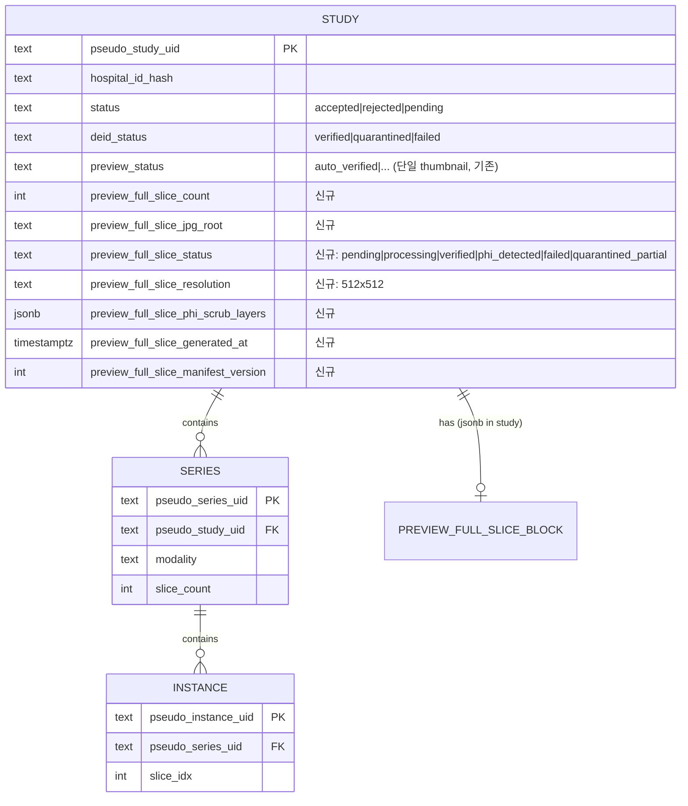

# 개발지시서 — Full-Slice Preview JPG (전체 슬라이스 미리보기)

> **Status**: Draft v0.1 · **Feature slug**: `full-slice-preview-jpg` · **Last updated**: 2026-04-26
> **작성자**: @planner · **근거**:
> - [리서치 — Full-Slice JPG Preview](../research/full-slice-jpg-preview-research.md) (§4 PHI 8-layer / §5 UX / §6 windowing matrix)
> - [dev-spec-de-id-pixel v0.1](./dev-spec-de-id-pixel.md) (현 1-슬라이스 OCR + pydeface 가정의 확장 base)
> - [dev-spec-metadata-thumbnail-ingest v0.1](./dev-spec-metadata-thumbnail-ingest.md) (현 단일 256×256 JPEG 썸네일 1장 → 전체 슬라이스 확장)
> - [dev-spec-gateway-agent](./dev-spec-gateway-agent.md) (manifest v2 / outbound-only 계약)
> - [PRD §4.3 썸네일 미리보기](../prd.md), [ARCHITECTURE §3.2 De-ID, §4.3 Thumbnail Cache+CDN](../ARCHITECTURE.md)
>
> **Kyle 결정 (이미 확정 — 2026-04-26)**:
> 1. PHI 스크럽 = 리서치 §4.3의 **L1–L8 풀 스택** 모두 적용 (현 데모 데이터에 high-risk MG/MR brain/CT 모두 포함).
> 2. Preview 해상도 = **512×512 JPEG quality 85** (lossless 불필요).
> 3. Viewer = **Cornerstone3D 직접 통합** (OHIF wrapper 비채택 — v3 design 좌측 facet 와 충돌).
> 4. Cine animation = **Phase 2 deferred** (Phase 1 = StackScroll only).
> 5. Pillow-SIMD = **production scale 까지 deferred** (Phase 1 = stock Pillow + 8 worker).

---

## 0. 요약 (TL;DR)

야간 배치 sync 윈도우에서 **모든 DICOM 슬라이스를 modality-aware windowing 으로 8-bit 변환 후 512×512 q85 JPEG 으로 인코딩**하고, **8-layer PHI 스크럽을 통과한 슬라이스만** Central MinIO 의 `previews/{pseudo_study_uid}/{slice_idx:04d}.jpg` 경로에 적재한다. Buyer Portal 의 study detail 화면은 기존 단일 썸네일 자리를 **Cornerstone3D StackViewport** 로 교체해 마우스 휠/키보드/슬라이더로 슬라이스 navigation 이 가능하다. Phase 1 은 D-13+30 (2026-06-08 ~ 6월 중순) 에 250 demo study × 평균 700 슬라이스 ≈ 175,000 JPG 를 backfill + 새 study 자동 처리. Cine·Pillow-SIMD·다중 hospital 확장은 Phase 2 (D-13+90), AI-curated key images 는 Phase 3 (D-13+180). **D-13 (2026-05-08) 데모에는 미포함** — 현 1-thumbnail flow 유지.

본 dev-spec 은 `dev-spec-de-id-pixel` 의 1-슬라이스 OCR/defacing 가정을 확장하지 않고 **별도 파이프라인 stage 로 추가**한다. 기존 `study.preview_status` (단일 thumbnail 용) 와 별도로 **신규 컬럼군** (`preview_full_slice_*`) 을 추가해 호환성을 유지하며, **feature flag `PREVIEW_FULL_SLICE_ENABLED`** 로 즉시 1-thumbnail mode 회귀가 가능하다.

---

## 1. 기능 개요

### 1.1 배경

- 현 RadiVault 는 (a) ingest-time 단일 256×256 썸네일 1장 (`dev-spec-metadata-thumbnail-ingest`), (b) `dev-spec-de-id-pixel` 의 중간 슬라이스 OCR + pydeface 1회 만으로 buyer 에게 study 를 노출한다.
- Buyer (글로벌 AI 회사) 입장에서 1장의 썸네일로는 **시리즈의 임상 적합성 판단이 불가능** — segmed/openda·TCIA·IDC 모두 cine 또는 stack scroll viewer 를 표준 UX 로 제공한다.
- 야간 sync 윈도우에 전체 슬라이스를 미리 JPG 로 변환·적재해 두면, buyer 브라우저는 DICOM 디코더 (Cornerstone WADO-RS) 의 무거운 부담 없이 **소프트한 스크롤 latency** 로 study 를 미리볼 수 있다.

### 1.2 RadiVault 차별화 포인트 (vs Segmed/OpenDA, TCIA, MD.ai)

본 기능은 viewer 자체로는 산업 표준 (Cornerstone3D) 을 채택하므로 차별점은 viewer 위 wrapper 와 데이터 품질에 있다:

1. **per-hospital provenance stamp** — 각 슬라이스 viewport 좌상단에 De-ID Chain (병원 ID hash → 익명 study UID → scrub layer pass 결과) 표시.
2. **PHI scrub status indicator** — 슬라이스별 8-layer 통과 여부를 thumbnail strip 위 작은 dot 으로 시각화 (Segmed/openda 미제공).
3. **KCD ontology 결합** — viewport 옆에 KCD-7 진단 코드 + 한국어 진단명 동시 표시 (Pretendard 폰트 적용).
4. **modality-aware windowing 자동화** — buyer 가 W/L 슬라이더 조작 없이도 임상적으로 의미 있는 preview 를 첫 화면에서 확인.

### 1.3 용어

- **Full-Slice Preview**: 한 series 내 모든 instance (slice) 에 대해 사전 생성된 8-bit JPG 시퀀스. 원본 DICOM 의 다운샘플 (512×512) + windowing + PHI 스크럽 적용.
- **Stack Scroll**: Cornerstone3D `StackScrollTool` 기반 navigation. 마우스 휠 / 키보드 ↑↓ / 슬라이더로 `viewport.setImageIdIndex(N)` 호출.
- **Scrub Layer**: 리서치 §4.3 의 L1–L8. L1–L7 은 서버 측 (Gateway / Central), L8 은 viewer 측 가드.
- **Backfill**: 기존 250 demo study 에 대해 1회성 야간 sync 로 전 슬라이스 JPG 를 일괄 생성하는 작업.
- **Auto-process**: 신규 study ingest 후 야간 batch trigger 시 자동으로 전 슬라이스 JPG 를 생성하는 정상 플로우.

---

## 2. 사용자 스토리

- **As a** buyer (글로벌 AI 회사 데이터 엔지니어), **I want** study detail 페이지에서 마우스 휠로 모든 슬라이스를 빠르게 스크롤하고 싶다, **so that** 시리즈의 진단 가치·아티팩트·라벨 적합성을 구매 전 검증할 수 있다.
- **As a** buyer, **I want** 슬라이스마다 modality-aware windowing 이 이미 적용된 화면을 보고 싶다, **so that** CT 흉부가 "검은 화면" 이거나 MR 이 너무 어두워 진단이 안 보이는 일이 없다.
- **As a** Kyle (CEO/DPO), **I want** 모든 슬라이스가 8-layer PHI 스크럽을 통과한 것만 buyer 에게 노출되도록 보장하고 싶다, **so that** PIPA 위반·face reconstruction 공격으로 회사가 매장되지 않는다.
- **As a** RadiVault 운영 엔지니어, **I want** PHI scrub false negative 0건 보장이 어려운 만큼 feature flag 로 즉시 1-thumbnail mode 로 회귀 가능하길 원한다, **so that** 사고 발생 시 1분 내 데이터 노출을 멈출 수 있다.
- **As a** RadiVault 임상자문, **I want** 250 study 중 5% 샘플은 임상의가 spot-check 해 PHI 잔존 여부를 확인하길 원한다, **so that** 자동 검출이 놓친 케이스를 사람이 잡을 수 있다.
- **As a** Buyer Portal 개발자, **I want** Cornerstone3D StackViewport 가 BFF presigned URL 만으로 슬라이스를 lazy-load 하길 원한다, **so that** 브라우저 메모리가 1 GB 를 넘지 않는다.

---

## 3. 범위

### 포함 (In-scope — Phase 1, D-13+30)

1. **Gateway 측 인코딩 파이프라인**:
   - 야간 batch trigger (cron / Gateway Orchestrator 신규 stage) 로 ingest 완료된 모든 series 의 전 instance 에 대해 modality-aware windowing → 16→8bit → Pillow 512×512 q85 JPG 인코딩.
   - 기존 `dev-spec-de-id-pixel` 파이프라인의 OCR 결과를 **모든 슬라이스로 확장 적용** (frame-단위 재평가).
   - 8-layer PHI scrub 결과를 per-slice 단위로 manifest 에 첨부.
2. **Central 측 신규 endpoint + 저장**:
   - `POST /v1/preview/slices` (multipart bulk upload, study 단위) 로 Gateway → Central JPG 적재.
   - MinIO bucket 구조: `previews/{pseudo_study_uid}/{series_idx:02d}/{slice_idx:04d}.jpg`.
   - `study` 테이블에 `preview_full_slice_*` 컬럼군 추가 (Alembic migration).
3. **Buyer Portal (BFF + UI)**:
   - BFF `/api/studies/[uid]/slices` (count + jpg root + scrub status), `/api/studies/[uid]/slices/[idx]` (presigned URL 발급).
   - Study detail 페이지의 기존 thumbnail 자리를 Cornerstone3D StackViewport 로 교체.
   - Series 가 여러 개일 때 우측 series-level thumbnail strip (8–16 키프레임).
   - De-ID Chain stamp + PHI scrub status indicator (RadiVault 차별화).
4. **Backfill CLI**:
   - `radivault-gateway preview-backfill --study-uid <pseudo_uid>` 단일 study 재처리.
   - `radivault-gateway preview-backfill --all` 전체 250 study 일괄.
   - Idempotent — 재실행 시 기존 JPG 가 정상 (scrub passed) 이면 skip.
5. **신규 study auto-process**:
   - Ingest 완료 후 야간 batch window 진입 시 자동 trigger.
   - 인덱싱·검색 노출은 preview 생성 완료 + scrub passed 후로 게이팅.
6. **Feature flag**:
   - `PREVIEW_FULL_SLICE_ENABLED=true|false` (Central + BFF 양측). false 시 BFF 는 1-thumbnail 응답으로 회귀.
7. **모니터링·감사**:
   - 슬라이스별 scrub 결과 영구 로그 (jsonb).
   - 일일 요약 metric: `preview.slices_generated`, `preview.scrub_phi_detected`, `preview.failed`.

### 제외 (Out-of-scope — Phase 1)

- **Cine animation (GIF/WebM 합성)** — Phase 2 (D-13+90).
- **Pillow-SIMD 도입** — Phase 2 (production scale 까지 stock Pillow + 8 worker 충분, 리서치 §6.2).
- **다중 hospital 확장** — Phase 1 은 1 hospital (현 demo 환경) 시범.
- **AI-curated key images / KCD-별 대표 슬라이스 라이브러리** — Phase 3 (D-13+180).
- **Buyer 가 직접 W/L 조작하는 UI** — Phase 1 은 자동 windowing 결과만 노출. manual W/L slider 는 v0.2.
- **3D MPR / Volume Rendering** — viewer 측 disable (L8 scrub 정책). Phase 2 에서도 download 권한 별도.
- **buyer 별 differential resolution** (계약된 buyer 만 1024×1024 액세스) — Phase 2.
- **D-13 (2026-05-08) 데모 적용** — 데모는 현 1-thumbnail flow 그대로 유지. 본 기능은 D-13 후 작업.
- **Mobile/lite-tier viewer** — Phase 2 cine fallback 으로 처리.
- **PIPA §28-8 법률 자문 응답 반영** — 별도 트랙. Phase 1 은 DPO 사내 검토만.

---

## 4. 기능 요구사항

번호 표기: `FR-FSP-<n>` (Full-Slice Preview). 각 FR 은 리서치 §·테이블 또는 코드 줄 번호 근거.

### 4.1 Gateway 측 — 인코딩 + Scrub

#### FR-FSP-1 — 야간 Batch Trigger Stage 추가
- **모듈**: `src/radivault_gateway/orchestrator/stages/preview_full_slice.py` 신규.
- **트리거**: cron (병원별 설정 가능, 기본 `0 2 * * *` = 매일 02:00 KST) 또는 manual CLI invocation.
- **선행 조건**: 해당 study 가 ingest 완료 (`study.status='accepted'`) + de-id-pixel L1–L7 통과 (`study.deid_status='verified'`) + manifest v2 생성됨 (`metadata-thumbnail-ingest` 완료).
- **차단**: `PREVIEW_FULL_SLICE_ENABLED=false` 시 stage 자체 skip + log warn.
- **근거**: 리서치 §6.5 Phase 1 인프라 권고.

#### FR-FSP-2 — Modality-Aware Windowing
- **모듈**: `src/radivault_gateway/preview/windowing.py` 신규.
- **시그니처**: `apply_windowing(ds: pydicom.Dataset, pixel_array: np.ndarray) -> np.ndarray` (output: uint8 0–255).
- **알고리즘 매트릭스** (리서치 §6.4 Table 그대로):

| Modality | 1순위 | 2순위 | 3순위 | 비고 |
|----------|-------|-------|-------|------|
| **CT** | `(0028,1050) WindowCenter` + `(0028,1051) WindowWidth` 첫 값 → `(0028,1052) RescaleIntercept` / `(0028,1053) RescaleSlope` 로 HU 변환 | StudyDescription/SeriesDescription 키워드 매칭 → preset (lung -600/1500, abdomen 50/400, bone 400/2000, brain 40/80) | 전체 percentile 1–99% | 단순 percentile 시 "검은 화면" 빈출 → preset 필수 |
| **MR** | WindowCenter/Width 첫 값 | series 별 percentile 1–99% | per-image percentile | vendor 별 절대값 의미 약함 |
| **MG** | `(0028,3010) VOILUTSequence` (tabular LUT) | WindowCenter/Width | percentile 0.5–99.5% | `PhotometricInterpretation = MONOCHROME1` 자동 invert |
| **CR/DX** | VOILUTSequence | WindowCenter/Width | percentile 0.5–99.5% | MONOCHROME1 자동 invert |
| **US** | pass-through (이미 8-bit RGB/YBR) | n/a | n/a | windowing 불필요 |
| **PT** | SUV 변환 → SUV 0–10 fixed range | percentile | n/a | rainbow color map 별도 |
| **NM/SPECT** | percentile 1–99% | n/a | n/a | counts sparse |

- **manual override hook**: `manifest.preview_windowing_override: {series_uid: {wc, ww, invert}}` (v0.2 예비, Phase 1 미구현 - schema 만 reservation).
- **단위 테스트** (`tests/gateway/test_windowing.py`): CT lung/abdomen/bone/brain 4 preset, MR percentile fallback, MG VOI LUT, MONOCHROME1 invert, US pass-through.
- **근거**: 리서치 §6.4.

#### FR-FSP-3 — JPEG 인코딩
- **라이브러리**: stock `Pillow >= 10.0` + libjpeg-turbo (시스템 의존). Pillow-SIMD 미채택 (Kyle 결정 5).
- **출력 사양**: 512×512, JPEG, quality=85, optimize=True, progressive=False.
- **리사이즈 알고리즘**: `Image.LANCZOS` (downsample) — 원본이 512 미만이면 `Image.NEAREST` 로 upsample 금지 (원본 해상도 유지 + 우측/하단 zero-pad).
- **단일 슬라이스 처리 시간 목표**: ≤ 25 ms (리서치 §6.2 stock Pillow 512×512 q85 단일 스레드 ~15–25 ms).
- **워커 수**: Phase 1 = 8 worker (multiprocessing). 175k 슬라이스 / 8 worker = 약 6–10 분 (PHI scrub 미포함 순수 인코딩).
- **출력 메타**: 각 JPG byte 와 sha256 산출.

#### FR-FSP-4 — 8-Layer PHI Scrub 적용 (확장)
- **모듈**: `src/radivault_gateway/deid/pixel/full_slice_scrub.py` 신규.
- **L1–L8 매트릭스**: 본 dev-spec §4.3 (PHI 스크럽 8-layer 매트릭스) 참조. 리서치 §4.3 Table 기반.
- **per-slice 결과 기록**: 슬라이스마다 `{layer_id: "L1", verdict: "passed"|"failed"|"skipped", confidence: 0.97, processing_ms: 12}` 리스트 생성.
- **격리 정책**:
  - L1, L2, L4, L5, L6 중 1개라도 `failed` → 해당 **slice 단위로 quarantine** (study 전체 격리 아님).
  - 같은 series 내 quarantine slice 비율 > 5% 시 **해당 series 전체 manual review queue 로 라우팅**.
  - L7 (해상도) 은 항상 적용 (FR-FSP-3 = 512×512 강제).
  - L8 (viewer 측 3D 차단) 은 BFF 응답 헤더에 `X-RadiVault-Preview-3D: disabled` 명시 + 클라이언트 sanity check.
- **근거**: 리서치 §4.3, §4.4.

#### FR-FSP-5 — Manifest v2 확장 (preview block)
- **모듈**: `src/radivault_gateway/manifest/v2.py` (기존 schema 확장).
- **신규 필드** (study root):
  ```jsonc
  "preview_full_slice": {
    "enabled": true,
    "slice_count": 712,
    "jpg_format": "JPEG",
    "jpg_resolution": [512, 512],
    "jpg_quality": 85,
    "scrub_layers_summary": {
      "L1_bia_triage": {"passed": 712, "failed": 0, "skipped": 0},
      "L2_ocr": {"passed": 710, "failed": 2, "skipped": 0},
      "L3_defacing": {"passed": 712, "failed": 0, "skipped": 0},
      "L4_modality_exclusion": {"applied": false},
      "L5_implant_detection": {"passed": 712, "failed": 0},
      "L6_reverify": {"passed": 712, "failed": 0},
      "L7_resolution_clamp": {"applied": true, "max_dim": 512}
    },
    "series": [
      {"pseudo_series_uid": "<uid>", "slice_count": 256, "windowing_method": "ct_preset_brain", "scrub_pass_rate": 1.0}
    ]
  }
  ```
- **DeidentificationMethodCodeSequence (0012,0064)** 에 추가 코드: `113102` (Clean Recognizable Visual Features Option) — defacing 적용된 study 한정.

#### FR-FSP-6 — Outbound 업로드
- **모듈**: `src/radivault_gateway/outbound/preview_uploader.py` 신규.
- **계약**: `POST /v1/preview/slices` (Central, FR-FSP-9 참조). multipart bulk (study 단위, 최대 1000 slice/batch — 1 study 가 1000 초과면 분할).
- **재시도 정책**: 4xx → fail (manifest 에 기록 후 stage 종료), 5xx → exponential backoff 3회.
- **TLS / 인증**: 기존 Gateway → Central mTLS + API key (gateway-agent 계약 준수).

### 4.2 Central 측 — 수신 + 저장

#### FR-FSP-7 — Alembic Migration (study 테이블)
- **모듈**: `src/radivault_central/migrations/versions/<timestamp>_add_preview_full_slice.py` 신규.
- **추가 컬럼** (모두 nullable, 기존 `preview_status` 와 별도):
  | 컬럼 | 타입 | 인덱스 | 설명 |
  |------|------|--------|------|
  | `preview_full_slice_count` | `int` | — | 해당 study 의 적재된 JPG 개수. 0 = 미생성, NULL = pending. |
  | `preview_full_slice_jpg_root` | `text` | — | MinIO key prefix (예: `previews/1.2.840.123.../`). |
  | `preview_full_slice_status` | `text` | btree | enum-like: `pending`, `processing`, `verified`, `phi_detected`, `failed`, `quarantined_partial`. |
  | `preview_full_slice_resolution` | `text` | — | "512x512" 등. 추후 다중 해상도 대응. |
  | `preview_full_slice_phi_scrub_layers` | `jsonb` | gin (선택) | 슬라이스별 L1–L8 결과 + summary. |
  | `preview_full_slice_generated_at` | `timestamptz` | — | 마지막 적재 시각 (idempotency 판정용). |
  | `preview_full_slice_manifest_version` | `int` | — | 본 기능 manifest 버전 (Phase 1 = 1). |
- **호환성**: 기존 `preview_status` (단일 thumbnail enum: `auto_verified`, ...) 컬럼 **변경 금지**. BFF 가 두 값을 모두 읽어 응답 분기.

#### FR-FSP-8 — MinIO Bucket 구조
- **bucket**: 기존 `radivault-previews` 재사용.
- **key 구조**: `previews/{pseudo_study_uid}/{series_idx:02d}/{slice_idx:04d}.jpg`
  - `pseudo_study_uid` = manifest 의 익명 study UID.
  - `series_idx` = manifest 내 series 배열 순서 (0-base, 2자리 zero-pad).
  - `slice_idx` = series 내 instance 순서 (0-base, 4자리 zero-pad — 9999 슬라이스까지).
- **lifecycle policy** (Phase 1 = 미적용, Phase 2 권고): 90일 미접근 시 STANDARD_IA tier 이동.
- **server-side encryption**: SSE-S3 (MinIO `sse-s3`) 활성. PHI 잔존 0% 보장 어려운 만큼 at-rest 암호화 의무.
- **public ACL**: 절대 금지. presigned URL only (FR-FSP-13).

#### FR-FSP-9 — Central 수신 Endpoint
- **계약**: 본 dev-spec §7 (API 계약) 참조.
- **검증**:
  1. 호출자 Gateway API key + mTLS.
  2. multipart 첫 part = manifest preview block (JSON), 나머지 = JPG bytes (`Content-Disposition: form-data; name="slice_<idx>"`).
  3. 각 JPG 의 sha256 = manifest 의 `slice_sha256[idx]` 일치 확인.
  4. JPG 크기 ≤ 200 KB/장 (cap; 초과 시 reject + log).
  5. study 의 `preview_full_slice_status` 가 `processing` 또는 `verified` 이고 GENERATED_AT 이 manifest 보다 새로우면 **idempotent skip + 200 OK**.
- **DB write** (트랜잭션):
  - `study.preview_full_slice_count` = 수신 슬라이스 수.
  - `study.preview_full_slice_jpg_root` = key prefix.
  - `study.preview_full_slice_status` = scrub_layers_summary 가 모두 passed 면 `verified`, 일부 quarantined 면 `quarantined_partial`, L1/L2/L5 failed 가 있으면 `phi_detected`.
  - `study.preview_full_slice_phi_scrub_layers` = manifest 의 scrub block 그대로 jsonb 저장.
  - `study.preview_full_slice_generated_at` = `now()`.
- **MinIO write**: 각 slice byte → key 적재. 트랜잭션은 DB 만, MinIO 는 best-effort + 사후 reconcile job (Phase 2).

### 4.3 Buyer Portal (BFF + UI)

#### FR-FSP-10 — BFF: Slice 목록 endpoint
- **계약**: `GET /api/studies/[uid]/slices`
- **응답**:
  ```jsonc
  {
    "study_uid_pseudo": "1.2.840.123...",
    "preview_full_slice_enabled": true,
    "slice_count": 712,
    "resolution": "512x512",
    "scrub_status": "verified",
    "scrub_layers_summary": { /* L1–L7 요약 */ },
    "series": [
      {"series_idx": 0, "pseudo_series_uid": "...", "slice_count": 256, "key_frame_indices": [0, 32, 64, 96, 128, 160, 192, 224, 255]}
    ]
  }
  ```
- **feature flag 분기**: `PREVIEW_FULL_SLICE_ENABLED=false` 또는 study `preview_full_slice_status != 'verified'` 시 응답 `preview_full_slice_enabled=false` + `slice_count=0` → UI 가 1-thumbnail 모드로 fallback.
- **권한**: 로그인 buyer 만. 비로그인은 facet aggregate count 만 (리서치 §5.3 매트릭스 준수).

#### FR-FSP-11 — BFF: 단일 Slice endpoint (presigned URL 또는 proxy)
- **계약**: `GET /api/studies/[uid]/slices/[idx]`
- **두 모드** (Phase 1 = mode A, Phase 2 = mode B):
  - **Mode A (presigned URL)**: 응답 = 302 redirect to MinIO presigned GET (TTL 5분). `Cache-Control: private, max-age=300`. CDN 미경유 (Phase 1).
  - **Mode B (proxy stream)**: BFF 가 MinIO 에서 byte 스트림을 받아 buyer 에 직접 전달. `Content-Type: image/jpeg`. CDN 경유 가능. Phase 2 production.
- **rate limit**: buyer 당 600 req/min (현 search rate limit 와 동일 — 1 study 700 슬라이스 lazy load 시 충분).
- **응답 헤더**: `X-RadiVault-Preview-3D: disabled` (FR-FSP-4 L8 가드).
- **에러**:
  - 404: study 없음 또는 idx 범위 초과.
  - 451: study `preview_full_slice_status='phi_detected'` (PHI 잔존 → 노출 금지).
  - 503: feature flag off 또는 status `pending`/`processing`.

#### FR-FSP-12 — UI: Cornerstone3D StackViewport 통합
- **위치**: 기존 study detail 페이지의 thumbnail 자리 (현 단일 256×256 카드).
- **의존성**: `@cornerstonejs/core@^1.x`, `@cornerstonejs/tools@^1.x`. WebGL 2.0 필수 (Chrome 90+, Safari 15+, Firefox 90+).
- **컴포넌트** (디자인 명세 위임):
  - 메인 viewport: 단일 StackViewport, `viewport.setStack(imageIds)` 로 슬라이스 array 등록, `viewport.setImageIdIndex(N)` 으로 navigation.
  - **컨트롤**:
    - 마우스 휠 → `StackScrollTool` ±1 slice.
    - 키보드 ↑/↓ → ±1, PageUp/PageDown → ±10, Home/End → 첫/마지막.
    - 하단 슬라이더 → continuous scroll.
    - 슬라이스 인덱스 표시 ("Slice 142 / 850").
  - **우측 series-level thumbnail strip** (series 가 ≥ 2 개일 때만): `key_frame_indices` 의 8–16 키프레임만 표시, click → 해당 series 첫 슬라이스로 jump.
  - **좌상단 De-ID Chain stamp**: 병원 hash + study UID 끝 6자리 + scrub layer pass 결과 dot (RadiVault 차별화).
  - **PHI scrub status indicator**: thumbnail strip 위 작은 색상 dot (green=passed, yellow=partial, red=phi_detected — red 는 해당 슬라이스 자체 미노출).
  - **모바일/lite-tier**: viewport 비활성 + cine fallback (Phase 2).
- **이미지 로더**: Cornerstone WADO-image-loader 우회. **신규 RadiVault loader** = BFF endpoint 직접 호출 (`xhr-loader` 기반). DICOM 디코딩 불필요 (이미 JPG).
- **lazy load**: 현재 인덱스 ±5 슬라이스만 prefetch. 메모리 cap = 100 슬라이스 (LRU). 브라우저 메모리 < 500 MB 목표.
- **3D/MPR 토글 강제 disable** (L8 가드): `viewport.setVolume()` API 호출 차단 + UI 버튼 자체 미렌더.

#### FR-FSP-13 — Presigned URL 발급 + 만료
- BFF 가 MinIO `presigned_get_object` 호출, TTL 300초 (5분).
- Buyer 가 URL 을 외부 공유해도 5분 후 자동 만료. URL 에 hospital ID 노출 없음 (key path = `previews/{pseudo_uid}/...`).
- 발급 시마다 `audit_log` 에 `event_type='preview_slice_url_issued', buyer_id, study_uid_pseudo, slice_idx` 기록.

### 4.4 Backfill + 운영

#### FR-FSP-14 — Backfill CLI
- **모듈**: `src/radivault_gateway/cli/preview_backfill.py` 신규.
- **명령**:
  - `radivault-gateway preview-backfill --study-uid <pseudo>` — 단일 study.
  - `radivault-gateway preview-backfill --all` — DB 의 `preview_full_slice_status IN (NULL, 'pending', 'failed')` 인 모든 study.
  - `radivault-gateway preview-backfill --reprocess --study-uid <pseudo>` — 강제 재생성 (idempotency 우회).
- **idempotency**: `--reprocess` 미지정 시 `preview_full_slice_status='verified'` 인 study 는 skip + log info.
- **출력**: 진행률 bar + 종료 시 요약 (성공/실패/skip 카운트).

#### FR-FSP-15 — 새 Study Auto-Process
- 기존 ingest pipeline 의 `study.status = 'accepted'` 전환 시 **메시지 큐 (gateway 내부 redis or asyncio queue)** 에 study UID push.
- 야간 batch worker 가 큐에서 pull → FR-FSP-1 stage 실행.
- 큐 backlog 모니터링 metric: `preview.backlog_size`. 임계 (1000 study) 초과 시 alert.

#### FR-FSP-16 — 실패 격리 정책
- **slice-level failure** (encoding error, scrub L2/L5 failed): 해당 slice JPG 미적재 + manifest 에 `failed` 기록. study 는 다른 슬라이스로 progress.
- **series-level failure** (slice failure rate > 5%): 해당 series 전체 manual review queue (`/admin/preview-quarantine` UI, Phase 2 추가).
- **study-level failure** (manifest 생성 실패, MinIO 업로드 5xx 3회 모두 실패): `preview_full_slice_status='failed'`. Backfill CLI 재실행으로 복구.
- **phi_detected 격리**: 절대 buyer 노출 금지. BFF 가 451 반환. Kyle 알림 (slack webhook, Phase 1 manual).

#### FR-FSP-17 — Feature Flag
- **환경변수**: `PREVIEW_FULL_SLICE_ENABLED` (Central + Gateway + BFF 3곳 모두 설정).
- **default**: Phase 1 시점 = `false`. Kyle 결정 후 `true` 전환.
- **off → on 전환**: 기존 250 study 는 backfill CLI 로 적재 후 활성. UI 는 즉시 viewport 모드로 전환.
- **on → off 전환** (롤백): BFF 가 즉시 1-thumbnail 응답으로 회귀. MinIO 의 JPG 는 삭제하지 않음 (재활성 시 재사용).

---

## 5. 비기능 요구사항

| 항목 | 요구 |
|------|------|
| **성능 — 인코딩 throughput** | 250 study × 700 slice = 175k slice 야간 batch 30분 윈도우 내 완료. (= 8.6 slice/sec/worker × 8 worker. stock Pillow 기준 충분.) |
| **성능 — 첫 슬라이스 로드 latency** | Buyer 브라우저 study detail 진입 → 첫 슬라이스 viewport 표시 ≤ 500ms (Mode A presigned + 50ms 네트워크 + 200ms JPG decode 가정). |
| **성능 — 스크롤 latency** | 마우스 휠 1 tick → 다음 슬라이스 표시 ≤ 100ms (prefetch 된 ±5 슬라이스 한정). |
| **저장소** | Phase 1 = 250 study 약 10.5 GB (512×512 q85, 리서치 §6.1 추정). MinIO 자체 호스팅 가능. Phase 2 production 추정 4.2 TB. |
| **PHI 정확도 — false negative** | L1 (BIA triage) FN ≤ 0.1% (slice 1000장당 1장 미만 잔존), L2 (OCR) FN ≤ 0.5%, L5 (implant) FN ≤ 1% (manual review queue 비율 ≤ 5%). 임상의 spot-check 5% 의무. |
| **PHI 정확도 — false positive** | L2 OCR FP ≤ 5% (정상 슬라이스를 quarantine 하는 비율). FP 가 5% 초과 시 quality 조정. |
| **보안 — at-rest** | MinIO SSE-S3 활성. presigned URL TTL 300초. public ACL 절대 금지. |
| **보안 — in-transit** | TLS 1.3 only. Gateway → Central mTLS. BFF → buyer HTTPS. |
| **보안 — viewer 가드** | L8 (3D/MPR disable) 강제. 응답 헤더 `X-RadiVault-Preview-3D: disabled`. |
| **가용성** | 야간 batch 실패 시 재시도 3회 + 다음 야간 재실행. buyer-facing endpoint 가용성 99.9% (Mode A presigned 구조라 MinIO 가용성에 종속). |
| **로깅·감사** | (a) 슬라이스별 scrub 결과 영구 저장 (jsonb), (b) presigned URL 발급마다 audit_log 기록, (c) backfill CLI 실행 로그 stdout + log file, (d) PHI detected 시 Kyle 즉시 알림. |
| **모니터링 metric** | `preview.slices_generated{hospital_id, modality}`, `preview.scrub_phi_detected{layer}`, `preview.failed{reason}`, `preview.backlog_size`, `preview.url_issued_total`, `preview.encoding_duration_ms`. |
| **국제화** | UI 라벨 ko/en (Pretendard 폰트). 슬라이스 인덱스 표시 ("Slice 142 / 850" / "슬라이스 142 / 850"). De-ID Chain stamp 영문 hash. |
| **접근성** | 키보드 navigation (↑↓/PgUp/PgDn/Home/End) 의무. screen reader 용 aria-label "Slice 142 of 850". |
| **브라우저 호환** | Chrome 90+, Safari 15+, Firefox 90+ (WebGL 2.0). Edge 90+. IE 미지원. |
| **메모리 제한** | 브라우저 viewport 메모리 < 500 MB (Mac/Windows 기본 상정). Safari iPad < 200 MB (Phase 2 cine fallback). |

---

## 6. 데이터 모델

### 6.1 ER 다이어그램 (mermaid)



### 6.2 study 테이블 — 추가 컬럼 DDL (참고; Alembic migration 생성)

```sql
ALTER TABLE study
  ADD COLUMN preview_full_slice_count int,
  ADD COLUMN preview_full_slice_jpg_root text,
  ADD COLUMN preview_full_slice_status text,
  ADD COLUMN preview_full_slice_resolution text,
  ADD COLUMN preview_full_slice_phi_scrub_layers jsonb,
  ADD COLUMN preview_full_slice_generated_at timestamptz,
  ADD COLUMN preview_full_slice_manifest_version int;

CREATE INDEX idx_study_preview_full_slice_status
  ON study (preview_full_slice_status)
  WHERE preview_full_slice_status IS NOT NULL;

-- jsonb gin 인덱스 (선택; Phase 1 미생성 — 250 study 규모에서 불필요)
-- CREATE INDEX idx_study_preview_full_slice_layers
--   ON study USING GIN (preview_full_slice_phi_scrub_layers);
```

### 6.3 audit_log 추가 이벤트

```sql
-- 기존 audit_log 테이블 재사용 (스키마 변경 없음).
-- event_type 값 추가: 'preview_slice_url_issued', 'preview_full_slice_generated', 'preview_phi_detected'
-- payload jsonb 예:
-- {"study_uid_pseudo": "...", "slice_idx": 142, "buyer_id": 17, "presigned_ttl_sec": 300}
```

### 6.4 PHI Scrub Layer 결과 JSON 스키마

```jsonc
{
  "summary": {
    "L1_bia_triage": {"passed": 712, "failed": 0, "skipped": 0, "fn_estimate": 0.001},
    "L2_ocr": {"passed": 710, "failed": 2, "skipped": 0, "engine": "tesseract-5"},
    "L3_defacing": {"passed": 712, "failed": 0, "engine": "pydeface", "applied_to_modality": ["MR"]},
    "L4_modality_exclusion": {"applied": false, "reason": null},
    "L5_implant_detection": {"passed": 712, "failed": 0, "method": "manual_review_routing"},
    "L6_reverify": {"passed": 712, "failed": 0},
    "L7_resolution_clamp": {"applied": true, "max_dim": 512},
    "L8_viewer_3d_block": {"applied": true, "header": "X-RadiVault-Preview-3D: disabled"}
  },
  "per_slice_failures": [
    {"slice_idx": 47, "layer": "L2_ocr", "reason": "burnin_text_detected", "ocr_text_redacted_hash": "sha256:..."},
    {"slice_idx": 138, "layer": "L2_ocr", "reason": "burnin_text_detected", "ocr_text_redacted_hash": "sha256:..."}
  ]
}
```

> 실제 OCR 검출 텍스트 자체는 PHI 이므로 **저장 금지**. sha256 해시만 저장 (원본 복원 불가).

---

## 7. API 계약

### 7.1 Gateway → Central: Preview Slice Bulk Upload

```
POST /v1/preview/slices
Host: central.radivault.kr
Content-Type: multipart/form-data; boundary=...
Authorization: Bearer <gateway_api_key>
X-Gateway-Hospital-Id: <hospital_id_hash>
X-Manifest-Version: 2

Multipart parts:
  - name="manifest", Content-Type: application/json
    Body: { "pseudo_study_uid": "...", "preview_full_slice": { ... FR-FSP-5 schema ... } }
  - name="slice_0000", Content-Type: image/jpeg
    Body: <JPG bytes>
  - name="slice_0001", Content-Type: image/jpeg
    Body: <JPG bytes>
  - ... (최대 1000 part / batch)

Response (200 OK):
  {
    "study_uid_pseudo": "...",
    "slices_received": 712,
    "slices_persisted": 710,
    "slices_rejected": [
      {"slice_idx": 47, "reason": "phi_detected_l2"},
      {"slice_idx": 138, "reason": "phi_detected_l2"}
    ],
    "preview_full_slice_status": "quarantined_partial"
  }

Errors:
  400 — manifest invalid / sha256 mismatch / JPG > 200KB
  401 — gateway api key invalid
  409 — idempotent skip (study already processed with newer or equal manifest_version + generated_at)
  413 — multipart payload > 250MB (1000 slice × 250KB cap)
  503 — central MinIO unavailable
```

### 7.2 Buyer Portal BFF → Buyer Frontend

#### 7.2.1 Slice Index endpoint

```
GET /api/studies/{pseudo_study_uid}/slices
Authorization: Bearer <buyer_session_token>

Response (200 OK):
  {
    "study_uid_pseudo": "1.2.840.123...",
    "preview_full_slice_enabled": true,
    "slice_count": 712,
    "resolution": "512x512",
    "scrub_status": "verified",
    "scrub_layers_summary": { ... FR-FSP-5 summary ... },
    "series": [
      {
        "series_idx": 0,
        "pseudo_series_uid": "1.2.840.456...",
        "modality": "CT",
        "slice_count": 256,
        "key_frame_indices": [0, 32, 64, 96, 128, 160, 192, 224, 255]
      }
    ]
  }

Response (200 OK, fallback to thumbnail):
  {
    "preview_full_slice_enabled": false,
    "thumbnail_url": "/api/studies/{uid}/thumbnail",
    "slice_count": 0
  }

Errors:
  401 — unauthorized (비로그인 또는 session 만료)
  403 — study 가 buyer 의 권한 범위 밖
  404 — study 미존재
  451 — preview_full_slice_status='phi_detected' (노출 차단)
```

#### 7.2.2 Single Slice endpoint (Mode A: presigned redirect)

```
GET /api/studies/{pseudo_study_uid}/slices/{slice_idx}
Authorization: Bearer <buyer_session_token>

Response (302 Found):
  Location: https://minio.radivault.kr/radivault-previews/previews/{uid}/00/0142.jpg?X-Amz-Signature=...&X-Amz-Expires=300
  Cache-Control: private, max-age=300
  X-RadiVault-Preview-3D: disabled

Errors:
  401, 403, 404, 451 — 위와 동일
  416 — slice_idx >= slice_count
  503 — feature flag off OR preview_full_slice_status IN ('pending', 'processing')
```

### 7.3 OpenAPI 스니펫 (참고용; 실 구현 시 swagger.yaml 추가)

```yaml
paths:
  /v1/preview/slices:
    post:
      summary: Bulk upload preview JPG slices for a study
      security: [{ gatewayApiKey: [] }]
      requestBody:
        content:
          multipart/form-data:
            schema:
              type: object
              properties:
                manifest: { type: string, format: binary }
                slice_NNNN: { type: string, format: binary }
      responses:
        '200': { description: All or partial slices persisted }
        '400': { description: manifest or sha256 invalid }
        '409': { description: idempotent skip }
  /api/studies/{uid}/slices:
    get: ...
  /api/studies/{uid}/slices/{idx}:
    get: ...
```

---

## 8. 시퀀스·플로우

### 8.1 야간 Batch — Auto-Process (신규 study)

```
[Gateway Orchestrator]
    │ ① ingest 완료 study.status = 'accepted', deid_status = 'verified'
    ▼
[preview_full_slice queue (asyncio/redis)]
    │ ② push pseudo_study_uid
    ▼
[야간 batch worker × 8] @ 02:00 KST
    │ ③ pull from queue
    ▼
[stages/preview_full_slice.py]
    │ ④ for each series, for each instance:
    │     a. pydicom load (stop_before_pixels=False)
    │     b. apply_windowing(ds, pixel_array)  ← FR-FSP-2
    │     c. PIL.Image.fromarray + resize 512x512 + JPEG q85  ← FR-FSP-3
    │     d. 8-layer PHI scrub  ← FR-FSP-4
    │        - L1 BIA triage (frame 단위)
    │        - L2 OCR re-scan (Tesseract, US/SC/MG/CR/XA/OT 만)
    │        - L3 defacing 결과 검증 (이미 적용됨)
    │        - L4 modality exclusion check
    │        - L5 implant detection (정형 CT)
    │        - L6 re-verify (BIA 잔존 자동 탐지)
    │        - L7 resolution clamp (512×512 강제)
    │     e. 통과 시 byte 누적, 실패 시 격리 list 추가
    │ ⑤ manifest preview block 작성
    ▼
[outbound/preview_uploader.py]
    │ ⑥ POST /v1/preview/slices (multipart bulk)
    ▼
[Central /v1/preview/slices]
    │ ⑦ validate (sha256, size, gateway api key)
    │ ⑧ for each slice → MinIO PUT previews/{uid}/{series:02d}/{idx:04d}.jpg
    │ ⑨ DB UPDATE study SET preview_full_slice_* ...
    │ ⑩ return 200 with slices_received/persisted/rejected
    ▼
[Gateway]
    │ ⑪ log result, mark queue item done
    │ ⑫ (실패 시) exponential backoff retry × 3
```

### 8.2 Buyer Browse — Study Detail 진입

```
[Buyer Frontend]
    │ ① user clicks search result card (study_uid)
    ▼
[Study Detail Page]
    │ ② useEffect: fetch /api/studies/{uid}/slices
    ▼
[BFF /api/studies/[uid]/slices]
    │ ③ DB SELECT preview_full_slice_status, slice_count, jpg_root, scrub_summary
    │ ④ if status='verified' → return enabled=true with slice_count
    │    if status='phi_detected' → return 451
    │    if status='pending'/'processing' → return 503 (UI 폴링 또는 fallback)
    │    if feature flag off → return enabled=false (thumbnail fallback)
    ▼
[Frontend]
    │ ⑤ if enabled=true:
    │      mount Cornerstone3D StackViewport
    │      build imageIds = Array.from({length: slice_count}, (_,i) =>
    │          `radivault-jpeg:/api/studies/${uid}/slices/${i}`)
    │      viewport.setStack(imageIds, 0)  ← initial slice = 0
    │      lazy-load cornerstone loader fetches first slice
    ▼
[BFF /api/studies/[uid]/slices/0]
    │ ⑥ MinIO presigned_get_object(key="previews/{uid}/00/0000.jpg", ttl=300)
    │ ⑦ return 302 redirect with presigned URL
    │ ⑧ audit_log INSERT event_type='preview_slice_url_issued'
    ▼
[Browser]
    │ ⑨ follow redirect, fetch JPG from MinIO
    │ ⑩ Cornerstone3D decodes JPG → render to canvas
    │ ⑪ user scrolls wheel → StackScrollTool → setImageIdIndex(1)
    │ ⑫ prefetch ±5 slices
```

### 8.3 PHI 격리 플로우

```
[L2 OCR detects burnin text on slice 47]
    │ ① log to manifest.per_slice_failures
    │ ② JPG bytes 폐기 (Central 으로 미전송)
    │ ③ slice 47 의 series 의 fail rate 계산
    ▼
[fail rate ≤ 5%]
    │ ④ slice 47 만 격리, 나머지 슬라이스 정상 진행
    │ ⑤ DB study.preview_full_slice_status = 'quarantined_partial'
    │ ⑥ BFF GET /slices/47 → 404 (해당 idx 미존재)
    │    BFF GET /slices?include_failures=true → failures list 포함 (admin only)
    ▼
[fail rate > 5%]
    │ ④' 해당 series 전체 manual review queue 적재
    │ ⑤' study.preview_full_slice_status = 'phi_detected'
    │ ⑥' BFF 모든 GET 451 반환
    │ ⑦' Kyle slack alert (Phase 1 manual)
```

---

## 9. 의존성

### 9.1 상위 모듈 (선행 완료 필수)

- `dev-spec-gateway-agent` v0.1+ — outbound mTLS + manifest schema base.
- `dev-spec-de-id-pixel` v0.1 — L1 BIA triage / L2 OCR / L3 pydeface 의 단일 슬라이스 구현 완료. 본 dev-spec 은 그것을 **frame-단위 / 시리즈-단위로 확장 호출**.
- `dev-spec-metadata-thumbnail-ingest` v0.1 — manifest schema v2 + study 테이블 base.

### 9.2 하위 모듈 / 신규 컴포넌트

- `src/radivault_gateway/preview/` 신규 디렉토리 — windowing, encoder, scrub orchestrator, uploader.
- `src/radivault_gateway/cli/preview_backfill.py` 신규.
- `src/radivault_central/api/preview.py` 신규 endpoint handler.
- `src/radivault_central/migrations/versions/<ts>_add_preview_full_slice.py` 신규.
- `src/radivault_buyer_portal/bff/api/studies/[uid]/slices/...` 신규 BFF route.
- `src/radivault_buyer_portal/components/StudyViewer/` 신규 React 컴포넌트 (디자인 명세 위임).

### 9.3 외부 라이브러리 (제안 — Kyle 승인 필요 시 표기)

- **Pillow** ≥ 10.0 (stock — Pillow-SIMD 미채택, Kyle 결정 5)
- **pydicom** ≥ 2.4
- **pylibjpeg** ≥ 2.0 + `pylibjpeg-libjpeg`, `pylibjpeg-openjpeg` (compressed transfer syntax 디코딩)
- **numpy** ≥ 1.24
- **pytesseract** + Tesseract 5 + `kor.traineddata`/`eng.traineddata` (de-id-pixel 와 공유)
- **pydeface** + FSL flirt (de-id-pixel 와 공유)
- **@cornerstonejs/core** ^1.x (frontend, **신규 의존성** — Kyle 승인 필요)
- **@cornerstonejs/tools** ^1.x (frontend, 신규)

> **Kyle 승인 필요**: Cornerstone3D 패키지군 추가는 buyer portal frontend bundle 에 약 1.5–2 MB gzip 추가. v3 design 의 Pretendard + Tailwind base bundle (현 ~600 KB gzip 추정) 위로 viewer 페이지 진입 시 lazy chunk 로 격리 권고.

### 9.4 외부 시스템

- **MinIO** (Central) — 기존 인프라. SSE-S3 활성 필요 (현재 활성 여부 확인 필요).
- **Cornerstone3D 내부 image loader** — RadiVault 신규 loader 등록 필요.
- **brower WebGL 2.0** — Cornerstone3D 의무 요구.

### 9.5 ARCHITECTURE.md 영향 (제안만, 직접 수정 금지)

- §3.2 De-ID Engine 책임에 "**전체-슬라이스 픽셀 PHI 스캔** (단일 슬라이스 OCR 의 N 배 비용)" 명시 권고.
- §4.3 Thumbnail Cache + CDN 항목명을 "**Thumbnail + Full-Slice Preview Store**" 로 확장 권고. (CDN 은 Phase 2.)
- §9 TBD 항목 중 "Frontend viewer 라이브러리" 항목이 있으면 **Cornerstone3D 직접 통합** 으로 결정 명시.

### 9.6 PRD.md 영향 (제안만)

- §4.3 "썸네일 미리보기" 섹션을 **"단일 썸네일 + 전체 슬라이스 preview (옵션)"** 으로 분리 권고.

---

## 10. 수용 기준 (Acceptance Criteria)

`@qa` 가 이 체크리스트를 기준으로 검수한다. 자동화 가능 항목은 SQL/스크립트로, 그 외는 수동 확인.

### 10.1 인코딩 + 적재

- [ ] **AC-1**: 250 demo study 모두 `study.preview_full_slice_count > 0`. SQL: `SELECT count(*) FROM study WHERE preview_full_slice_count IS NULL OR preview_full_slice_count = 0;` → 0.
- [ ] **AC-2**: `preview_full_slice_status` 분포 — `verified` ≥ 95%, `quarantined_partial` ≤ 4%, `phi_detected` + `failed` 합계 ≤ 1%. SQL: `SELECT preview_full_slice_status, count(*) FROM study GROUP BY 1;`.
- [ ] **AC-3**: MinIO `previews/` prefix 의 총 객체 수 = `SUM(preview_full_slice_count)`. (250 study × 평균 700 = ~175,000 ± rejected count).
- [ ] **AC-4**: 임의 slice 의 JPG 다운 후 `identify` 결과 = 512×512, JPEG, quality 80–90 범위. 평균 byte ≤ 80 KB.
- [ ] **AC-5**: 야간 batch 30분 윈도우 내 250 study backfill 완료. CLI 종료 시 stdout `total_duration_sec < 1800`.

### 10.2 PHI 스크럽

- [ ] **AC-6**: 임상의 spot-check 5% (12–13 study) 에서 PHI 잔존 0건. 각 study 임의 10 슬라이스 육안 확인.
- [ ] **AC-7**: L2 OCR false negative 측정 — 의도적 BIA 텍스트 5장 합성 슬라이스 주입 → 5장 모두 `quarantined`. (FN ≤ 0.5% 검증용 micro test).
- [ ] **AC-8**: L4 modality exclusion — 치과/ENT/안와 study description 패턴 study 가 자동으로 `quarantined_partial` 또는 `phi_detected` 로 라우팅. SQL: `SELECT pseudo_study_uid, preview_full_slice_status FROM study WHERE study_description ILIKE ANY (ARRAY['%치과%', '%dental%', '%ENT%', '%orbital%']);` → status NOT IN ('verified').
- [ ] **AC-9**: `preview_full_slice_phi_scrub_layers` jsonb 가 모든 verified study 에 정상 schema 로 적재. JSON validator 통과.
- [ ] **AC-10**: `phi_detected` study 는 BFF GET 451 반환. e2e: curl 로 직접 확인.

### 10.3 BFF + UI

- [ ] **AC-11**: Buyer Portal study detail 진입 → 첫 슬라이스 viewport 렌더링 ≤ 500ms (Chrome DevTools Performance, Fast 3G throttle 미적용 / WiFi).
- [ ] **AC-12**: 마우스 휠 1 tick → 다음 슬라이스 표시 ≤ 100ms (prefetch ±5 hit 시).
- [ ] **AC-13**: 키보드 ↑/↓ navigation 동작. PgUp/PgDn ±10. Home/End 첫/마지막.
- [ ] **AC-14**: 슬라이스 인덱스 표시 ("Slice N / Total") 정확. 마지막 슬라이스에서 ↓ 입력 시 더 진행 안 함.
- [ ] **AC-15**: 우측 series-level thumbnail strip — series ≥ 2개일 때만 표시, click 시 해당 series 첫 슬라이스로 jump.
- [ ] **AC-16**: 좌상단 De-ID Chain stamp 표시 (병원 hash + study UID 끝 6자리 + scrub dot).
- [ ] **AC-17**: 응답 헤더 `X-RadiVault-Preview-3D: disabled` 모든 slice endpoint 응답에 포함. curl -I 확인.
- [ ] **AC-18**: viewport 에서 3D/MPR 토글 UI 미렌더 (DOM inspection).
- [ ] **AC-19**: 브라우저 메모리 (Chrome DevTools Memory) — 850 슬라이스 study 전체 navigation 후 < 500 MB heap.

### 10.4 Idempotency + 재실행

- [ ] **AC-20**: Backfill CLI 동일 study 2회 실행 시 2회차는 skip. SQL: `SELECT preview_full_slice_generated_at FROM study WHERE pseudo_study_uid='<uid>';` → 1회차와 2회차 동일 timestamp.
- [ ] **AC-21**: `--reprocess` 플래그 시 강제 재생성. timestamp 갱신.
- [ ] **AC-22**: Central 동일 manifest 2회 POST 시 2회차는 200 with `slices_persisted: 0` (idempotent skip).

### 10.5 Feature Flag + Rollback

- [ ] **AC-23**: `PREVIEW_FULL_SLICE_ENABLED=false` 시 BFF GET /api/studies/{uid}/slices → `enabled=false` + thumbnail fallback URL. UI 가 1-thumbnail 카드로 회귀.
- [ ] **AC-24**: off 후 다시 on 전환 — 기존 MinIO JPG 그대로 재사용, backfill 재실행 불필요.

### 10.6 감사 로그

- [ ] **AC-25**: presigned URL 발급마다 `audit_log` row 생성. SQL: `SELECT count(*) FROM audit_log WHERE event_type='preview_slice_url_issued' AND created_at > now() - interval '1 hour';` → 양수.
- [ ] **AC-26**: PHI detected 이벤트 기록. SQL: `SELECT * FROM audit_log WHERE event_type='preview_phi_detected';`.

---

## 11. 위험 / 롤백 / 단계적 배포

### 11.1 위험 매트릭스

| # | 위험 | 영향 | 가능성 | Mitigation |
|---|------|------|--------|------------|
| **R-1** | PHI scrub false negative → 환자 정보 노출 → PIPA 위반 → 회사 매장 | 치명 | 중 | (a) 8-layer 다중 방어, (b) 슬라이스별 scrub 결과 영구 로그, (c) 임상의 5% spot-check 의무, (d) viewer 측 disclaimer "Preview — Not for diagnostic use", (e) 즉시 feature flag off. |
| **R-2** | face reconstruction (CT/MR thin-slice 두경부) → buyer 가 client-side reconstruction → 재식별 | 치명 | 저-중 | L3 pydeface 강제, L4 두경부 study 자동 격리, L8 viewer 측 3D/MPR disable, 응답 헤더 차단 시그널. |
| **R-3** | implant fingerprint (정형 CT) → manufacturer DB cross-ref → patient ID | 고 | 저 | L5 implant detection → manual review queue 라우팅 (Phase 1 = 정형 CT 자동 격리 권고). |
| **R-4** | 인코딩 batch 30분 윈도우 초과 → 다음 야간으로 이월 → buyer 미노출 | 중 | 저 | (a) Phase 1 250 study 는 8 worker 로 충분, (b) backlog metric alert, (c) Phase 2 worker 수평 확장. |
| **R-5** | MinIO 저장소 폭증 (production scale 4 TB+) | 중 | 중 | (a) Phase 2 lifecycle policy (90일 미접근 archive), (b) production scale 진입 시 multi-resolution tiering. |
| **R-6** | Cornerstone3D 브라우저 메모리 누수 → 850 슬라이스 study 에서 탭 crash | 중 | 중 | LRU eviction (max 100 slice 메모리), prefetch ±5 만, 페이지 unmount 시 viewport.dispose() 호출. |
| **R-7** | presigned URL 외부 공유 → TTL 5분 내 무권한 접근 | 저 | 중 | TTL 300초 강제, audit log 발급마다 기록, buyer 별 rate limit. |
| **R-8** | 신규 의존성 (Cornerstone3D) bundle size 증가 → buyer portal 초기 로드 latency ↑ | 저 | 고 | viewer 페이지만 lazy chunk 격리 (Next.js `dynamic import`). |
| **R-9** | DICOM windowing 자동화 실패 → "검은 화면" preview → buyer 신뢰 하락 | 중 | 저-중 | modality-aware preset 매트릭스 + percentile fallback chain + manual override hook (v0.2 예약). |
| **R-10** | de-id-pixel v0.1 (1-슬라이스 OCR) 가 N-슬라이스로 확장 시 OCR 처리 시간 폭증 | 중 | 중 | (a) US/SC/MG/CR/XA/OT 만 OCR (CT/MR/PT 는 코너 ROI 만), (b) 야간 batch 라 timeline 여유, (c) Phase 2 PaddleOCR GPU 도입. |

### 11.2 롤백 절차

1. **즉시 차단** (PHI 사고 또는 critical bug): 환경변수 `PREVIEW_FULL_SLICE_ENABLED=false` + BFF/Central restart. 약 30초 내 1-thumbnail 모드 회귀.
2. **부분 차단** (특정 study 만 문제): `UPDATE study SET preview_full_slice_status='phi_detected' WHERE pseudo_study_uid IN (...);` → BFF 451 반환.
3. **데이터 정리** (사고 후): MinIO `previews/` prefix 의 해당 study 객체 삭제 (수동). DB row 는 유지 (감사 목적).

### 11.3 Phase 별 배포 계획

| Phase | 시점 | 범위 | 추가 산출물 |
|-------|------|------|-------------|
| **Phase 1** | D-13+30 (2026-06-08 ~ 6월 중순, 6주 작업 윈도우) | 250 demo study backfill + 새 study auto-process. Cornerstone3D StackScrollTool. 1 hospital 시범. stock Pillow + 8 worker. mode A presigned. | 본 dev-spec, design-spec-full-slice-preview-jpg, qa-report-full-slice-preview-jpg |
| **Phase 2** | D-13+90 (2026-08 초중순) | (a) Cine animation (TCIA-style WebM), (b) Pillow-SIMD 도입, (c) 다중 hospital 확장, (d) MinIO lifecycle policy, (e) BFF Mode B (CDN proxy), (f) PaddleOCR GPU OCR, (g) 모바일/lite-tier cine fallback, (h) admin manual review UI. | 별도 dev-spec |
| **Phase 3** | D-13+180 (2026-10 중순) | AI-curated key images (series 당 자동 8–16 키프레임 선정), KCD-별 대표 슬라이스 라이브러리, buyer 별 differential resolution (1024×1024), per-buyer audit log + DRM watermark. | 별도 dev-spec |

---

## 12. 법적·보안 고려

### 12.1 PHI 처리 — PIPA / HIPAA / DICOM PS3.15 매핑

- **DICOM PS3.15 Annex E 코드** (manifest 의 `(0012,0064) DeidentificationMethodCodeSequence` 에 추가):
  - `113100` Basic Application Confidentiality Profile (기존)
  - `113101` Clean Pixel Data Option (기존)
  - `113102` Clean Recognizable Visual Features Option **(신규 — defacing 적용 study 한정)**
  - `113103` Clean Graphics Option (기존)
- **PIPA**:
  - 제28조의2 가명정보 / 제28조의8 국외이전 의 "완전 익명정보" 예외 활용 시 **face reconstruction 가능한 thin-slice CT 두경부 노출 = 위반 가능성** (리서치 §4.5). L3 defacing + L4 modality exclusion 으로 차단.
  - 변호사 자문 별도 트랙. 본 dev-spec 은 기술적 가드만 명시.
- **HIPAA Safe Harbor**: 18개 PHI 식별자 중 본 기능과 관련된 항목 = (B) Geographic data (overlay), (P) Full face photographs (defacing 대상). 두 항목 모두 L1–L7 로 처리.
- **법률 자문 면책**: 본 dev-spec 은 법률 자문이 아니다. PIPA/HIPAA 적용 최종 판단은 변호사 자문 필수.

### 12.2 데이터 흐름의 보안 경계

- **at-rest**: MinIO SSE-S3 활성. presigned URL TTL 300초.
- **in-transit**: TLS 1.3. Gateway → Central mTLS. BFF → buyer HTTPS only.
- **access control**: 비로그인 0 슬라이스, 로그인 buyer 만 preview, 다운로드 권한은 별도 계약 단계 (리서치 §5.3 매트릭스).
- **audit**: 모든 presigned URL 발급 + PHI detected 이벤트 영구 로그.

### 12.3 viewer 측 가드 (L8)

- `viewport.setVolume()` API 호출 차단 (RadiVault wrapper 에서 throw).
- 3D/MPR/VolView 관련 UI 컴포넌트 미렌더.
- 응답 헤더 `X-RadiVault-Preview-3D: disabled` (클라이언트 sanity check).
- viewport 좌하단 "Preview only — Not for diagnostic use" disclaimer 의무 표시.

### 12.4 사고 대응 플로우

1. PHI 잔존 발견 (임상의 spot-check 또는 buyer report) → Kyle 즉시 알림.
2. 30초 내 `PREVIEW_FULL_SLICE_ENABLED=false` 적용.
3. 영향 study 식별 → MinIO 객체 삭제 + DB status 업데이트.
4. 24시간 내 PIPA 신고 검토 (변호사 자문).
5. 7일 내 재발 방지 대책 + scrub layer 보강 + 임상의 spot-check 비율 ↑.

---

## 13. 오픈 질문 / Kyle 결정 필요 사항

1. **Q-1 (운영)**: Phase 1 임상의 spot-check 5% 의 인건비 / 외주 vs 내부 — 누가 실행? (Kyle 결정 필요)
2. **Q-2 (인프라)**: MinIO SSE-S3 가 현재 활성화되어 있는가? 미활성 시 활성화 작업 별도. (Devops 확인 필요)
3. **Q-3 (운영)**: PHI detected 알림 채널 — Phase 1 = manual slack? email? (Kyle 결정)
4. **Q-4 (frontend)**: Cornerstone3D 의존성 추가 (~1.5–2 MB gzip lazy chunk) — 승인? (Kyle 결정)
5. **Q-5 (정책)**: 정형 CT (implant 위험) 의 Phase 1 처리 — 자동 격리 vs manual review queue? (현 spec 은 manual review 권고)
6. **Q-6 (법률)**: PIPA §28-8 "완전 익명정보" 해석 변호사 자문 — 어느 시점? (Phase 1 GA 전 권고)
7. **Q-7 (성능)**: BFF Mode A presigned vs Mode B proxy 의 production 선택 — Phase 2 결정 시 CDN 도입 여부.

---

## 14. 다음 에이전트 작업 (NEXT_STEP)

### NEXT_STEP

- **완료 산출물**: `docs/specs/dev-spec-full-slice-preview-jpg.md` (Draft v0.1, 본 문서)
- **제안 다음 단계**:
  - **@designer** — `docs/specs/design-spec-full-slice-preview-jpg.md` 작성. 본 dev-spec §4.3 (FR-FSP-12) UI 요구를 입력으로:
    - Cornerstone3D StackViewport 레이아웃 (study detail 페이지 thumbnail 자리)
    - 우측 series-level thumbnail strip (series ≥ 2개)
    - 좌상단 De-ID Chain stamp + 우상단 PHI scrub status indicator
    - 하단 슬라이스 슬라이더 + 인덱스 표시
    - 키보드 navigation 시각 피드백
    - 접근성 (aria-label, 키보드 focus ring)
    - Pretendard 폰트 + v3 design 토큰 정합
    - 모바일/lite-tier 빈 상태 (Phase 2 cine 자리만 reservation)
  - **@developer** (design-spec 확정 후) — claude 브랜치에서 6주 일정으로 구현:
    - W1: Alembic migration + Central endpoint + MinIO bucket 구조
    - W2: Gateway windowing + JPEG encoder + 8-worker batch
    - W3: 8-layer scrub 확장 (L1/L2 frame-단위, L4/L5 분류기, L6/L7 enforcement)
    - W4: BFF endpoints + presigned URL + audit log
    - W5: Cornerstone3D loader + StackViewport 컴포넌트 + UI 통합
    - W6: backfill CLI + e2e + 임상의 spot-check 준비
  - **@qa** (구현 완료 후) — `docs/qa/qa-report-full-slice-preview-jpg.md`. 본 dev-spec §10 AC-1 ~ AC-26 체크리스트 + PHI scrub false negative 측정 + 250 study e2e + 브라우저 메모리/latency 측정.
- **아키텍처 영향**: ARCHITECTURE.md §3.2, §4.3, §9 갱신 권고 (본 dev-spec §9.5).
- **PRD 영향**: PRD §4.3 "썸네일 미리보기" → "단일 썸네일 + 전체 슬라이스 preview" 분리 권고.
- **Kyle 결정 필요 사항**: 본 dev-spec §13 의 Q-1 ~ Q-7 7개.

---

## 15. 변경 이력

| 버전 | 날짜 | 작성자 | 변경 |
|------|------|--------|------|
| 0.1 | 2026-04-26 | @planner (Claude Opus 4.7 [1M]) | 최초 작성. Kyle 결정 5개 (PHI 8-layer / 512×512 q85 / Cornerstone3D 직접 / Cine deferred / Pillow-SIMD deferred) 반영. Phase 1 = D-13+30, Phase 2 = D-13+90, Phase 3 = D-13+180. 250 demo study × ~700 slice ≈ 175k JPG 가정. AC 26개. 위험 R1–R10. |
