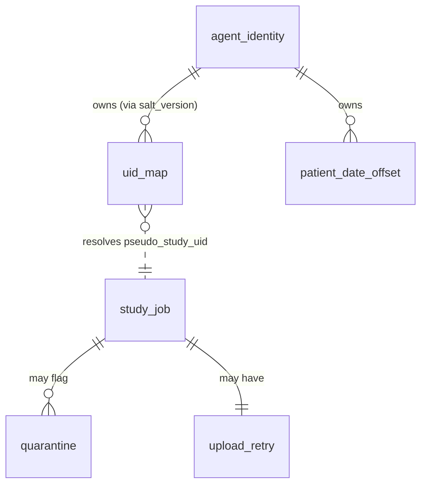
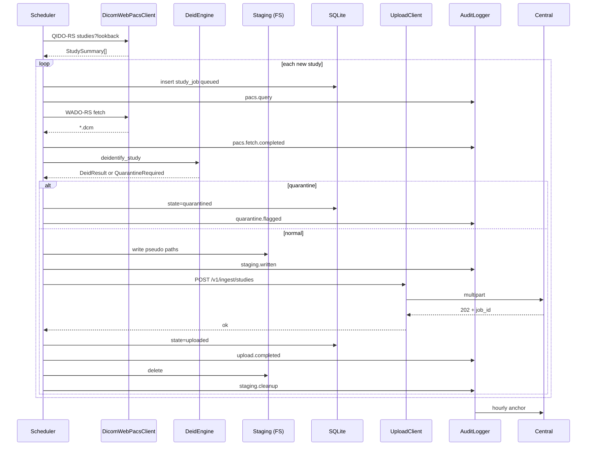

# 개발지시서 — Gateway Agent v0.1 MVP

> **Status**: Draft v0.1 · **Feature slug**: `gateway-agent` · **Last updated**: 2026-04-22
> **작성자**: @planner · **근거**: [리서치 — 기술 기반](../research/gateway-agent-technical-foundations.md), [리서치 — K-MedData 요약 §6](../research/k-meddata-research-summary.md#6-플랫폼-아키텍처--model-3-hybrid), [PRD §4.1](../prd.md), [ARCHITECTURE §3](../ARCHITECTURE.md)

---

## 0. 요약 (TL;DR)

RadiVault Zone 1의 on-premise 에이전트. Ubuntu 22.04 + Docker Compose로 병원 전산망 내부에 배포되어, **PACS → 익명화(De-ID) → 중앙 클라우드 업로드**의 파이프라인을 자동 수행한다. v0.1 MVP는 **DICOMweb(QIDO/WADO) 수집 + DICOM PS3.15 Annex E Basic Profile 메타데이터 익명화 + hash-chained 감사 로그 + HTTPS 아웃바운드 업로드**만 포함한다. DIMSE, 번인 픽셀 OCR, 3D defacing, HL7/FHIR, k-익명성 검증, UI는 모두 후속 버전으로 분리.

---

## 1. 기능 개요

Gateway Agent는 병원 내부 네트워크에서 PACS와 RadiVault 중앙 클라우드를 잇는 **유일한 접점(single choke-point)** 이다. 병원 데이터 주권을 유지하면서(원본은 내부 잔존), 완전 익명화된 영상·메타데이터만을 아웃바운드 HTTPS로 중앙에 전송한다. 이 설계가 개인정보보호법 제28조의8 국외이전 제한을 회피하기 위한 RadiVault의 법적 전제이자, 병원과의 신뢰·lock-in 근거이다.

본 dev-spec은 **v0.1 MVP** — 파일럿 병원 1–2곳 배포를 목표로 한 최소 기능셋을 규정한다.

---

## 2. 사용자 스토리

- **As a** 병원 IT 관리자, **I want** Docker Compose 한 줄로 Gateway Agent를 설치·기동하고 싶다, **so that** 별도 PACS 수정 없이 RadiVault 파일럿에 참여할 수 있다.
- **As a** RadiVault 운영자, **I want** 각 병원 Gateway에서 수행된 모든 De-ID 작업이 변조 방지 감사 로그로 중앙 앵커된다, **so that** 규제 감사 및 병원·구매자 분쟁 시 증빙을 제시할 수 있다.
- **As a** 병원 데이터 보호 책임자(DPO), **I want** PHI 태그가 하나라도 남은 영상은 중앙으로 절대 전송되지 않는다는 보장을 받고 싶다, **so that** 개인정보보호법 국외이전 리스크 없이 데이터 공급을 승인할 수 있다.
- **As a** RadiVault 개발자, **I want** CI에서 실제 DICOMweb 서버(Orthanc)에 대해 E2E 테스트를 돌릴 수 있다, **so that** 리팩터링 시 회귀를 즉시 탐지할 수 있다.
- **As a** 운영팀 엔지니어, **I want** `systemctl` 한 줄로 에이전트를 재기동·중단하고 journald로 로그를 확인할 수 있다, **so that** 원격 지원이 가능하다.

---

## 3. 범위

### 포함 (In-scope — v0.1 MVP)

1. **PACS Connector (DICOMweb)**: QIDO-RS(검색), WADO-RS(가져오기) HTTPS 클라이언트. Bearer 또는 Basic 인증. STOW-RS는 스텁(후속).
2. **De-ID Engine**: DICOM PS3.15 Annex E **Basic Application Level Confidentiality Profile** 메타데이터 처리. `pydicom/deid` YAML 레시피 기반. 결정적 UID 가명화(SHA-256 + per-hospital salt). 환자별 고정 날짜 오프셋 시프트.
3. **Burn-in Quarantine**: `(0028,0301) BurnedInAnnotation == YES` 또는 의심 모달리티(Secondary Capture, US 일부, 스크린샷) → 자동 격리 큐로 이동, 중앙 전송 차단. OCR은 v0.2로 분리.
4. **Staging Storage**: 로컬 FS 임시 저장. 설정 가능 retention. 업로드 성공 시 즉시 삭제.
5. **Upload Client**: HTTPS POST (multipart/form-data) → 중앙 업로드 엔드포인트. 지수 백오프 재시도. 중앙은 아직 미구현 → v0.1은 **FastAPI mock central**로 계약 검증.
6. **Audit Log**: JSON-lines, SHA-256 hash chain (prev_hash + canonicalize). 시간당 head-hash anchoring → 중앙(스텁).
7. **CLI**: Click 기반. `start`(daemon), `sync-once`, `status`, `de-id-test`, `version`, `audit verify`.
8. **Config**: YAML + 환경 변수 override. Pydantic v2 검증.
9. **Packaging**: Docker multi-stage 이미지(python:3.11-slim-bookworm → non-root runtime), docker-compose.yml, systemd unit example, logrotate.d 예시.
10. **Local State DB**: SQLite (UID 매핑, 처리 상태, 재시도 큐).
11. **Tests**: pytest 단위 + Orthanc(Docker) 통합 + FastAPI mock central.

### 제외 (Out-of-scope — v0.2+로 분리)

1. **DIMSE 폴백**: C-FIND/C-MOVE/C-STORE는 v0.2. 어댑터 인터페이스만 설계해 두고 구현체는 `DicomWebPacsClient` 하나만.
2. **번인 텍스트 픽셀 OCR 마스킹**: v0.1은 격리만. OCR(Tesseract+EAST)은 v0.2.
3. **3D defacing (pydeface, mri_deface)**: 두개부 CT/MRI 얼굴 제거. v0.2+. 척추 중심 Kyle 도메인 우선.
4. **HL7 v2 / FHIR 연동**: RIS/EMR 판독문 수집. Phase 2.
5. **DICOM SR 판독문 파싱**: DICOM SR이 PACS 내 존재하는 경우에도 v0.1은 수집 범위 밖.
6. **k-익명성·l-다양성 정량 검증**: 희귀질환 자동 제외. v0.2+ 또는 중앙 레벨 구현.
7. **Kubernetes / Helm chart**: 단일 호스트 Docker Compose만.
8. **Auto-update 메커니즘**: 이미지 갱신은 수동 `docker compose pull && up -d`.
9. **Web UI / 대시보드**: CLI + journald 로그만.
10. **실시간 PACS Push 수신 (SCP listener)**: v0.1은 풀(pull) 전용 스케줄 구동.
11. **salt 자동 회전**: 수동 회전 프로시저만 문서화, 자동화는 v0.2+.

---

## 4. 기능 요구사항

### 4.1 PACS Connector

- **FR-1**: `DicomWebPacsClient`는 QIDO-RS `GET /studies` 쿼리를 지원해야 한다. 지원 파라미터: `StudyDate`(범위 `YYYYMMDD-YYYYMMDD`), `ModalitiesInStudy`, `limit`, `offset`. (근거: 리서치 §4.1, PRD §4.1)
- **FR-2**: `DicomWebPacsClient`는 WADO-RS `GET /studies/{study_uid}` 및 `GET /studies/{study_uid}/series/{series_uid}/instances/{sop_uid}` 요청으로 instance-level DICOM Part 10 바이너리를 수신해야 한다. `Accept: multipart/related; type=application/dicom` 헤더 사용.
- **FR-3**: 인증은 설정에 따라 **Bearer token** 또는 **Basic(username/password)** 중 하나. TLS 검증은 기본 on, 자가서명 인증서 신뢰는 `pacs.ca_bundle` 경로 지정으로만 허용.
- **FR-4**: 연결 실패 시 최대 5회 지수 백오프 재시도(initial 1s, factor 2, jitter ±20%, cap 60s). 이후 에러 → 감사 로그 기록 + 해당 스터디 상태 `failed`.
- **FR-5**: 동시 WADO-RS 페치 수는 `pacs.max_concurrency`(기본 4). 병원 PACS 부하 배려.

### 4.2 De-ID Engine

- **FR-6**: **DICOM PS3.15 Annex E Basic Profile**의 모든 태그를 처리한다. 규칙 매트릭스는 본 문서 **부록 A**(Annex E Table E.1-1 vs pydicom/deid YAML 1:1 대응)에 정의. (근거: 리서치 §4.2)
- **FR-7**: Annex E 옵션 적용 — `Retain Longitudinal Temporal Info with Modified Dates`(유지), `Retain Patient Characteristics Option`(연령은 5년 bin, DoB는 연도만), `Clean Descriptors Option`(병용), `Clean Graphics Option`(유지). `Retain Safe Private Option`·`Retain UIDs Option`·`Retain Institution Identity Option`은 **제외**.
- **FR-8**: UID 가명화는 결정적이어야 한다. 식:
  ```
  pseudo_uid = ORG_ROOT + "." + decimal_truncate(SHA256(salt || original_uid), 40)
  ```
  결과 UID는 DICOM UID 64자 제한 이내. 동일 원본 UID → 동일 가명 UID (종단적 일관성).
- **FR-9**: UID 매핑은 로컬 SQLite `uid_map` 테이블에만 저장. **중앙 업로드 페이로드에 원본 UID 또는 매핑 포함 금지**.
- **FR-10**: 날짜 시프트는 **환자별 고정 오프셋**:
  ```
  offset_days = (int.from_bytes(SHA256(salt || patient_id)[:4], "big") % 3650) - 1825
  ```
  범위 ±5년. 동일 환자의 모든 Study/Series/Acquisition/Content Date는 동일 오프셋 적용. 시각(Time)은 분 단위까지만 유지, 초·밀리초 0으로 마스크.
- **FR-11**: `(0028,0301) BurnedInAnnotation == "YES"` 이거나 모달리티가 quarantine 블랙리스트(설정: `deid.burnin_quarantine_modalities`, 기본 `["SC","US","OT"]`)에 속하면 **중앙 전송 차단**하고 `quarantine/` 디렉터리로 이동, DB 상태 `quarantined`로 마킹.
- **FR-12**: De-ID 완료 영상에 `(0012,0062) PatientIdentityRemoved = "YES"`, `(0012,0063) DeidentificationMethod = "RadiVault v<version> Annex E Basic + options"`, `(0012,0064) DeidentificationMethodCodeSequence`(DCM 113100, 113107, 113108 등 적용 옵션 코드)를 기록한다.
- **FR-13**: De-ID 후 **자동 재검증**: 블랙리스트 태그 잔존 여부 재스캔. 하나라도 남으면 업로드 차단 + 감사 로그 `deid.reverify_failed` 기록 + DB 상태 `failed_reverify`.

### 4.3 Staging Storage

- **FR-14**: 익명화 산출물은 `${staging.root}/{pseudo_study_uid}/{pseudo_series_uid}/{pseudo_sop_uid}.dcm` 경로로 저장. `${staging.root}` 기본 `/var/lib/radivault/staging` (컨테이너 볼륨 마운트).
- **FR-15**: 업로드 성공(central 2xx 수신) 즉시 삭제. 삭제 실패 시 감사 로그 `staging.cleanup_failed` 기록.
- **FR-16**: 업로드 미완료 항목은 `staging.retention_hours`(기본 72시간) 초과 시 경고 로그 + 수동 개입 트리거. 자동 삭제하지 않음.
- **FR-17**: `staging.root` 디스크 사용률 `staging.max_disk_pct`(기본 80%) 초과 시 신규 페치 일시 중단(backpressure).

### 4.4 Upload Client

- **FR-18**: `POST https://{central_host}/v1/ingest/studies` (multipart/form-data; part1 = `manifest.json`, part2..N = `*.dcm`). 응답 202 Accepted + `{"job_id": "..."}`.
- **FR-19**: TLS 1.3 필수. 서버 인증서 검증 필수. `Authorization: Bearer {upload_token}` 헤더.
- **FR-20**: 업로드 실패(4xx/5xx, 네트워크 에러) 시 재시도: 지수 백오프 10회, 최대 1시간. 모든 재시도 실패 시 DB `upload_failed`로 마킹하고 운영자 개입 대기.
- **FR-21**: 아웃바운드 HTTP(S) 프록시 지원 — `HTTP_PROXY`, `HTTPS_PROXY`, `NO_PROXY` 환경변수 준수.

### 4.5 Audit Log

- **FR-22**: 로컬 감사 로그는 `${audit.path}/audit.log` JSON-lines 파일. 각 라인은 §6.3의 스키마를 준수.
- **FR-23**: 각 라인의 `hash = "sha256:" + hex(SHA256(canonicalize(record_without_hash_field)))`. canonicalize = `json.dumps(..., sort_keys=True, separators=(",",":"), ensure_ascii=False)`. 첫 라인(seq=0)의 `prev_hash = "sha256:" + "0"*64`.
- **FR-24**: 감사 이벤트는 최소 다음 포인트에서 append: `pacs.query`, `pacs.fetch.completed`, `deid.started`, `deid.completed`, `deid.reverify_failed`, `quarantine.flagged`, `staging.written`, `upload.started`, `upload.completed`, `upload.failed`, `staging.cleanup`, `audit.anchor.uploaded`.
- **FR-25**: 시간당 1회 head anchor: `POST /v1/audit/anchor` body `{"gateway_id", "seq_range":[lo,hi], "head_hash", "anchored_at"}`. 실패 시 다음 주기에 merged range로 재시도.
- **FR-26**: `radivault-gateway audit verify <path>` 명령은 전체 파일을 라인별 재해싱해 체인 무결성 검증 후 OK/FAIL 반환(exit 0/1). 불일치 시 첫 불일치 seq 리포트.
- **FR-27**: 감사 로그 파일은 `chmod 0600`, owner=`gateway` uid. 회전은 logrotate 사용 시 **copy-truncate 금지** — 회전 순간 head_hash를 파일명에 포함(`audit.log.2026-04-22T00Z.<head_hash8>`)하고 새 파일의 genesis를 이전 파일 head_hash로 체인.

### 4.6 CLI

- **FR-28**: `radivault-gateway start` — foreground 데몬. 스케줄러(`schedule` 라이브러리 또는 asyncio loop)로 `pacs.poll_interval_seconds`(기본 300)마다 증분 동기화.
- **FR-29**: `radivault-gateway sync-once [--since YYYY-MM-DD] [--until YYYY-MM-DD]` — 1회성 수동 실행.
- **FR-30**: `radivault-gateway status` — 지난 24h 처리 통계(처리 성공/격리/실패 수, 업로드 지연 중간값, staging 사용률, 최근 에러 5건, 체인 head seq+hash).
- **FR-31**: `radivault-gateway de-id-test <input.dcm> [--output <path>]` — 단일 파일 드라이런. PHI 잔존 스캔 결과 리포트.
- **FR-32**: `radivault-gateway version` — 에이전트 버전, De-ID ruleset 버전, 빌드 커밋 SHA 출력.
- **FR-33**: `radivault-gateway audit verify <path>` — FR-26 구현.

### 4.7 Config

- **FR-34**: YAML 설정 파일 기본 경로 `/etc/radivault/gateway.yml`. `RADIVAULT_CONFIG` 환경변수로 override.
- **FR-35**: 모든 설정 키는 `RADIVAULT_<SECTION>_<KEY>` 형식 환경변수로 오버라이드 가능(예: `RADIVAULT_PACS_BASE_URL`).
- **FR-36**: 시크릿(upload_token, pacs password, salt)은 파일 경로 참조 지원 — `${file:/run/credentials/salt}` 구문. systemd `LoadCredential=`과 연동.
- **FR-37**: Pydantic v2 모델로 스키마 검증. 기동 시 필수 키 누락·타입 오류 → 즉시 종료 + 감사 로그 기록 없이 stderr 에러.

### 4.8 Packaging & Ops

- **FR-38**: Docker 이미지는 multi-stage: builder(`python:3.11-bookworm` + build-essential) → runtime(`python:3.11-slim-bookworm`). `USER 10001:10001` non-root.
- **FR-39**: `HEALTHCHECK --interval=30s --timeout=5s CMD python -m radivault_gateway.health`. health 엔드포인트는 SQLite ping + staging FS write check.
- **FR-40**: `docker-compose.yml` 예시 제공 — 볼륨: `/var/lib/radivault` (state+staging), `/etc/radivault` (config, read-only), `/var/log/radivault` (audit log). 네트워크: 기본 bridge, outbound-only.
- **FR-41**: systemd unit 예시 (`radivault-gateway.service`) 제공 — `Type=oneshot + RemainAfterExit=yes`, `ExecStart=/usr/bin/docker compose up -d`, `LoadCredential=salt:/etc/radivault/credentials/salt`, `Restart=on-failure`.
- **FR-42**: logrotate.d 예시 (`/etc/logrotate.d/radivault`) 제공 — audit.log는 FR-27 규칙 준수, 일반 app.log는 일반 회전.

### 4.9 Mock Central Server (개발 편의)

- **FR-43**: 별도 디렉터리 `mock-central/`에 FastAPI 앱 제공. 엔드포인트: `POST /v1/ingest/studies`(202 + job_id), `POST /v1/audit/anchor`(200), `GET /healthz`. v0.1 개발·통합 테스트 전용, 프로덕션 사용 금지.
- **FR-44**: Mock은 수신 페이로드를 `/tmp/mock-central/` 아래에 덤프하여 테스트 검증 가능하게 한다. 인증 스텁은 고정 토큰 비교.

---

## 5. 비기능 요구사항

| 항목 | 요구 |
|------|------|
| 성능 | 단일 Gateway 호스트(4 vCPU / 8GB RAM / SSD)에서 평균 스터디(200 instances, 100MB) 기준 **스터디당 End-to-End < 30초** (PACS 페치 포함, 업로드 제외). De-ID 단계만 단독 측정 시 **스터디당 < 5초**. |
| 처리량 | 파일럿 기준 일 1,000 스터디(≈100GB) 처리 가능. 동시 처리 concurrency 기본 4. |
| 보안 | TLS 1.3 outbound-only. inbound 포트 미개방(healthcheck는 localhost only). non-root 컨테이너. 시크릿은 systemd credentials 또는 `chmod 600` 파일. PHI 태그 재검증 실패 시 업로드 차단. |
| 가용성 | 99% best-effort (v0.1은 SLA 없음). PACS 단절·중앙 단절 모두 장애 허용: 재시도 큐로 자동 복구. |
| 로깅·감사 | §4.5 hash-chained JSON-lines. 시간당 중앙 anchor. 최소 5년 로컬 보존(회전 파일 포함). |
| 국제화 | 로그 메시지 영어. 설정 파일 주석 한국어 병기 허용. UI 없음. |
| 관측성 | Structured JSON 로그(app.log) + audit.log 분리. 기본 Prometheus metrics exporter는 v0.2(v0.1은 `status` CLI로 갈음). |
| 호환성 | Ubuntu 22.04 LTS x86_64, Docker Engine 24+ / Compose v2.20+. Python 3.11 인터프리터. |

---

## 6. 데이터 모델

### 6.1 로컬 상태 DB — SQLite

파일 경로: `${state.db_path}` 기본 `/var/lib/radivault/state.sqlite3`. WAL 모드, `chmod 600`.

```sql
-- 병원·에이전트 식별 (single-row 테이블)
CREATE TABLE agent_identity (
    gateway_id     TEXT PRIMARY KEY,          -- 중앙이 발급한 고유 ID (UUID)
    hospital_id    TEXT NOT NULL,             -- 중앙 등록된 병원 해시 ID
    org_root_oid   TEXT NOT NULL,             -- UID 가명화 root (e.g. 2.25.xxx)
    salt_version   INTEGER NOT NULL DEFAULT 1,-- salt 회전 세대
    created_at     TEXT NOT NULL              -- ISO8601 UTC
);

-- UID 가명화 매핑 (중앙 업로드 페이로드에 포함 금지)
CREATE TABLE uid_map (
    original_uid   TEXT PRIMARY KEY,
    pseudo_uid     TEXT NOT NULL UNIQUE,
    uid_kind       TEXT NOT NULL,             -- 'study' | 'series' | 'sop' | 'frame_of_ref'
    salt_version   INTEGER NOT NULL,
    created_at     TEXT NOT NULL
);
CREATE INDEX idx_uid_map_pseudo ON uid_map(pseudo_uid);

-- 환자별 날짜 오프셋 (원본 patient_id 해시만 저장, 평문 저장 금지)
CREATE TABLE patient_date_offset (
    patient_id_hash TEXT PRIMARY KEY,        -- SHA256(salt||patient_id) hex
    offset_days     INTEGER NOT NULL,        -- -1825..+1824
    salt_version    INTEGER NOT NULL,
    created_at      TEXT NOT NULL
);

-- 처리 작업 추적 (Study 단위)
CREATE TABLE study_job (
    pseudo_study_uid  TEXT PRIMARY KEY,
    state             TEXT NOT NULL,         -- 'queued'|'fetching'|'deided'|'quarantined'
                                             -- |'uploading'|'uploaded'|'failed_fetch'
                                             -- |'failed_deid'|'failed_reverify'|'failed_upload'
    modalities        TEXT,                  -- comma-separated
    n_instances       INTEGER,
    n_bytes           INTEGER,
    first_seen_at     TEXT NOT NULL,
    deided_at         TEXT,
    uploaded_at       TEXT,
    last_error        TEXT,
    retry_count       INTEGER NOT NULL DEFAULT 0,
    central_job_id    TEXT                   -- central이 발급한 job id
);
CREATE INDEX idx_study_job_state ON study_job(state);
CREATE INDEX idx_study_job_first_seen ON study_job(first_seen_at);

-- 격리 큐 (수동 QA 대상)
CREATE TABLE quarantine (
    id                INTEGER PRIMARY KEY AUTOINCREMENT,
    pseudo_study_uid  TEXT NOT NULL,
    pseudo_sop_uid    TEXT,                  -- instance 단위 격리 시
    reason            TEXT NOT NULL,         -- 'burned_in_yes'|'blacklist_modality'|'manual'
    payload_path      TEXT NOT NULL,         -- quarantine/ 경로
    flagged_at        TEXT NOT NULL,
    reviewed          INTEGER NOT NULL DEFAULT 0,
    reviewer_note     TEXT
);

-- 업로드 재시도 큐 (study_job.state != 'uploaded' 인 항목 지수 백오프 스케줄)
CREATE TABLE upload_retry (
    pseudo_study_uid  TEXT PRIMARY KEY REFERENCES study_job(pseudo_study_uid),
    next_attempt_at   TEXT NOT NULL,
    attempt_count     INTEGER NOT NULL DEFAULT 0
);
```

### 6.2 Config YAML 스키마

```yaml
# /etc/radivault/gateway.yml
version: 1

agent:
  gateway_id: "${file:/run/credentials/gateway_id}"
  hospital_id: "hosp_abc"
  org_root_oid: "2.25.140737488355328"        # RadiVault 전용 root (중앙이 발급)

pacs:
  base_url: "https://pacs.hospital.local/dicom-web"
  auth:
    type: "bearer"                             # 'bearer' | 'basic'
    token: "${file:/run/credentials/pacs_token}"
    # username/password 는 basic 일 때만
  ca_bundle: "/etc/radivault/ca.pem"           # 옵션
  max_concurrency: 4
  poll_interval_seconds: 300
  query:
    modalities: ["CR","CT","MR","DX"]          # ModalitiesInStudy 필터
    lookback_days: 7                           # 첫 동기화 범위

deid:
  ruleset_version: "v0.1.0"
  salt: "${file:/run/credentials/salt}"
  salt_version: 1
  burnin_quarantine_modalities: ["SC","US","OT"]
  retain_options:
    longitudinal_dates: true
    patient_characteristics: true
    clean_descriptors: true
    clean_graphics: true
    safe_private: false
    uids: false
    institution_identity: false
    device_identity: "partial"                  # 'full'|'partial'|'none'

staging:
  root: "/var/lib/radivault/staging"
  retention_hours: 72
  max_disk_pct: 80

state:
  db_path: "/var/lib/radivault/state.sqlite3"

audit:
  path: "/var/log/radivault/audit.log"
  anchor_interval_seconds: 3600

central:
  base_url: "https://ingest.radivault.io"
  upload_token: "${file:/run/credentials/upload_token}"
  upload_timeout_seconds: 600
  max_upload_retries: 10

logging:
  level: "INFO"
  json: true
```

### 6.3 Audit Log 레코드 스키마

```json
{
  "seq": 12345,
  "ts": "2026-04-22T10:15:03.412Z",
  "gateway_id": "gw_7f3a...",
  "actor": "gateway",
  "event": "deid.completed",
  "target": {
    "pseudo_study_uid": "2.25.xxxx",
    "pseudo_series_uid": "2.25.yyyy",
    "pseudo_sop_uid": null
  },
  "meta": {
    "n_instances": 184,
    "ruleset_version": "v0.1.0",
    "salt_version": 1,
    "duration_ms": 4123
  },
  "prev_hash": "sha256:a1b2...",
  "hash":      "sha256:c3d4..."
}
```

금지 필드: 원본 UID, 평문 patient_id, 환자 이름, 병원 IP, PACS URL. 모두 가명·해시·생략.

### 6.4 중앙 Upload Manifest 스키마 (multipart의 manifest.json)

```json
{
  "manifest_version": 1,
  "gateway_id": "gw_7f3a...",
  "hospital_id": "hosp_abc",
  "pseudo_study_uid": "2.25.xxxx",
  "modalities": ["MR"],
  "n_instances": 184,
  "total_bytes": 94321012,
  "deid": {
    "ruleset_version": "v0.1.0",
    "salt_version": 1,
    "method_code_sequence": ["113100","113107","113108","113111"]
  },
  "files": [
    { "filename": "0001.dcm", "sha256": "abcd...", "bytes": 513222 }
  ],
  "generated_at": "2026-04-22T10:20:00Z",
  "audit_ref": { "seq": 12345, "hash": "sha256:c3d4..." }
}
```

### 6.5 ER 다이어그램 (mermaid)



---

## 7. API 계약

### 7.1 PACS Connector (내부 Python 인터페이스)

```python
class PacsClient(Protocol):
    async def query_studies(
        self,
        study_date_from: date,
        study_date_to: date,
        modalities: Sequence[str] | None = None,
        limit: int = 100,
        offset: int = 0,
    ) -> list[StudySummary]:
        """QIDO-RS. Returns study-level metadata only."""

    async def fetch_study(
        self,
        study_instance_uid: str,
        out_dir: Path,
    ) -> FetchResult:
        """WADO-RS per-instance. Writes *.dcm to out_dir."""

    async def health_check(self) -> bool: ...


@dataclass(frozen=True)
class StudySummary:
    study_instance_uid: str
    patient_id: str
    study_date: str          # YYYYMMDD raw
    modalities_in_study: list[str]
    num_instances: int | None

@dataclass(frozen=True)
class FetchResult:
    study_instance_uid: str
    instance_paths: list[Path]
    bytes_total: int
    duration_ms: int
```

v0.1 유일 구현체: `DicomWebPacsClient(httpx.AsyncClient 기반)`. `DimsePacsClient`는 v0.2.

### 7.2 De-ID Engine (내부 Python 인터페이스)

```python
class DeidEngine(Protocol):
    def deidentify_study(
        self,
        input_dir: Path,
        output_dir: Path,
    ) -> DeidResult:
        """Applies Annex E Basic Profile + options + UID/date transforms.
        Writes pseudo-UID-named files to output_dir.
        Raises QuarantineRequired if burn-in detected."""

    def reverify(self, deided_dir: Path) -> ReverifyResult: ...


@dataclass(frozen=True)
class DeidResult:
    pseudo_study_uid: str
    pseudo_series_uids: list[str]
    n_instances: int
    n_bytes: int
    patient_offset_days: int   # 로그용, 중앙 미전송
    duration_ms: int

class QuarantineRequired(Exception):
    reason: str          # 'burned_in_yes' | 'blacklist_modality'
    offending_sops: list[str]
```

### 7.3 Central Upload API (중앙 — Gateway 계약)

#### 7.3.1 Ingest

```
POST /v1/ingest/studies
Host: ingest.radivault.io
Authorization: Bearer <upload_token>
Content-Type: multipart/form-data; boundary=...

--boundary
Content-Disposition: form-data; name="manifest"; filename="manifest.json"
Content-Type: application/json

{... §6.4 스키마 ...}
--boundary
Content-Disposition: form-data; name="files"; filename="0001.dcm"
Content-Type: application/dicom

<binary>
--boundary--

Response 202 Accepted:
{
  "job_id": "ingest_01HXXXX",
  "received_at": "2026-04-22T10:20:01Z"
}

Errors:
  400  invalid_manifest       schema violation or sha256 mismatch
  401  unauthorized           token missing/invalid
  403  forbidden_hospital     gateway_id/hospital_id mismatch
  409  duplicate_study        pseudo_study_uid already ingested
  413  payload_too_large      exceeds central limit
  429  rate_limited           Retry-After seconds
  5xx  server_error           gateway retries with backoff
```

#### 7.3.2 Audit Anchor

```
POST /v1/audit/anchor
Authorization: Bearer <upload_token>
Content-Type: application/json

{
  "gateway_id": "gw_7f3a...",
  "seq_range": [12000, 12345],
  "head_hash": "sha256:c3d4...",
  "anchored_at": "2026-04-22T11:00:00Z"
}

Response 200:
{ "anchor_id": "anc_01HXXXX" }

Errors:
  400 invalid_range           lo > hi or gap from previous anchor
  401 unauthorized
  409 already_anchored        seq_range overlaps existing anchor
```

### 7.4 CLI 인터페이스 요약

| Command | Exit 0 | Exit ≠0 |
|---------|--------|---------|
| `start` | 정상 종료 (SIGTERM) | 설정 오류, PACS 초기 health check 실패(선택) |
| `sync-once [--since] [--until]` | 전체 성공 | 하나 이상 실패(세부는 status 참조) |
| `status` | 항상 0 (조회만) | DB 접근 불가 시 1 |
| `de-id-test <in> [--output]` | 통과 | PHI 잔존 탐지 시 2, 파일 오류 시 1 |
| `audit verify <path>` | 체인 OK | 체인 불일치 1, 파일 없음 2 |
| `version` | 항상 0 | — |

---

## 8. 시퀀스·플로우

### 8.1 표준 동기화 사이클 (Flow A — 상시 메타·영상 수집)

```
[Scheduler tick every poll_interval_seconds]
        |
        v
[QIDO-RS query studies (lookback_days, modalities)]
        |
        v
[For each new study not in study_job]
        |  - insert study_job(state='queued')
        |  - audit: pacs.query
        v
[WADO-RS fetch study → /tmp/fetch/<orig_study_uid>/]
        |  - study_job.state := 'fetching'
        |  - audit: pacs.fetch.completed
        v
[Validate DICOM (pydicom.dcmread each instance)]
        |  - invalid → move to quarantine('malformed')
        v
[De-ID Engine run]
        |  - metadata Annex E rules
        |  - UID pseudo (SHA256 + salt)
        |  - date shift per-patient
        |  - reverify
        |  - audit: deid.started, deid.completed
        |  - BurnedIn? → QuarantineRequired
        |                 study_job.state := 'quarantined'
        |                 audit: quarantine.flagged
        |                 STOP (no upload)
        v
[Write to staging/{pseudo_study_uid}/]
        |  - study_job.state := 'deided'
        |  - audit: staging.written
        v
[Build manifest.json + compute file sha256]
        |
        v
[POST /v1/ingest/studies (multipart)]
        |  - study_job.state := 'uploading'
        |  - audit: upload.started
        |  - retries per FR-20
        v
[Verify 202 OK + job_id persisted]
        |  - study_job.state := 'uploaded'
        |  - central_job_id saved
        |  - audit: upload.completed
        v
[Delete staging dir + /tmp/fetch dir]
        |  - audit: staging.cleanup
        v
[Hourly: anchor audit head to central]
        |  - POST /v1/audit/anchor
        |  - audit: audit.anchor.uploaded
```

### 8.2 실패 복구 시퀀스

```
Fetch 실패:
  retry ≤5 (지수 백오프) → 실패 시 study_job.state='failed_fetch', retry_count++
  다음 주기 시작 시 state in ('failed_fetch') AND retry_count<10 인 항목 재큐잉

De-ID 재검증 실패:
  study_job.state='failed_reverify'
  staging 에 남겨두지 않음(quarantine/으로 이동)
  운영자 수동 개입 필요 (audit: deid.reverify_failed)

Upload 실패:
  upload_retry 테이블에 next_attempt_at 기록(지수 백오프)
  별도 워커가 주기적 폴링 → 재시도
  10회 실패 시 state='failed_upload' + 알람 로그

중앙 단절:
  upload_retry 큐가 계속 쌓이지만 staging 은 보존됨(FR-16 경고 임계치까지)
  연결 복구 시 자동 drain
```

### 8.3 mermaid 요약



---

## 9. 의존성

### 9.1 상위 모듈·선행 기능

- **RadiVault 중앙 업로드 엔드포인트**: `/v1/ingest/studies`, `/v1/audit/anchor`. **v0.1 시점에는 미구현** → `mock-central/` FastAPI로 계약 검증. 실제 중앙 구현은 별도 dev-spec(`dev-spec-central-ingest`)로 분리 필요.
- **중앙 Gateway 등록 시스템**: gateway_id / upload_token 발급 경로. v0.1은 수동 발급(운영자가 `/run/credentials/`에 배치) → 추후 `dev-spec-gateway-provisioning`로 분리.
- **Org Root OID 관리**: RadiVault 전용 OID root. IANA 등록 또는 UUID→OID(`2.25.x`) 방식. Kyle 결정 필요(§11 오픈).

### 9.2 하위 모듈

없음 (Gateway Agent는 본 dev-spec 완결).

### 9.3 외부 시스템·벤더

- **병원 PACS**: DICOMweb(QIDO-RS + WADO-RS) 지원 필수. 파일럿 병원별 conformance statement 확보 필요 (리서치 §4.1.4).
- **OS**: Ubuntu 22.04 LTS x86_64. ARM은 v0.2+.
- **컨테이너 런타임**: Docker Engine 24+ / Compose v2.20+.
- **Python 라이브러리**(§9.4 기술 스택 참조).

### 9.4 기술 스택 — **제안 (Kyle 승인 필요)**

본 dev-spec은 ARCHITECTURE.md §9 TBD 항목 중 "Gateway Agent — 언어, 컨테이너 런타임, PACS 라이브러리"를 다음으로 해소할 것을 제안:

| 영역 | 선정 | 근거 |
|------|------|------|
| 언어 | Python 3.11 | pydicom 생태계 집중, 리서치 §4.2.6 |
| HTTP 클라이언트 | `httpx >= 0.27` (async) | asyncio PACS 병렬 페치 지원 |
| DICOM 파싱 | `pydicom >= 2.4` | 사실상 표준 |
| De-ID 규칙 엔진 | `pydicom/deid` (YAML recipe) | 리서치 §4.2.6 권고, salt·hash hook 내장 |
| DICOMweb 클라이언트 | 자체 얇은 httpx 래퍼 또는 `dicomweb-client` | 의존 최소화 위해 자체 래퍼 우선 검토 |
| CLI | `click >= 8` | 파이썬 표준 |
| 설정 | `pyyaml` + `pydantic v2` | 강타입 검증 |
| 스케줄 | `apscheduler` 또는 asyncio loop | 외부 의존 최소화 시 asyncio |
| 로깅 | stdlib `logging` + 커스텀 JSON 핸들러 + hash chain writer | 외부 의존 불필요 |
| 패키징 | `pyproject.toml` (PEP 621, hatchling) | 현대 표준 |
| 컨테이너 베이스 | `python:3.11-slim-bookworm` | 리서치 §4.3.1 권고 (파일럿 디버깅) |
| 테스트 | `pytest`, `pytest-asyncio`, Orthanc Docker | 리서치 §4.5 |
| Mock central | `fastapi` + `uvicorn` | 경량, OpenAPI |

**ARCHITECTURE.md 갱신 제안**: §9 표의 Gateway Agent 라인을 "Python 3.11 + Docker Compose (systemd 래핑) + pydicom + pydicom/deid + httpx + click (dev-spec-gateway-agent §9.4 근거)"로 대체. @planner는 직접 수정하지 않고 Kyle 승인 후 별도 PR로 반영.

---

## 10. 수용 기준 (Acceptance Criteria)

`@qa`가 이 체크리스트를 라인별 검증한다. 모든 항목은 **바이너리(통과/미통과)** 검증 가능.

### 10.1 기능 AC

- [ ] **AC-1** (FR-1/2): Orthanc DICOMweb 서버에 시드된 공개 DICOM 10스터디를 대상으로 `sync-once`를 실행하면, 예상된 10개 study_job 레코드가 state=`uploaded`로 전이한다.
- [ ] **AC-2** (FR-3): `pacs.auth.type=bearer`로 설정 후 잘못된 토큰을 사용하면 HTTP 401을 받고 study_job이 생성되지 않는다. 감사 로그에 `pacs.query.failed`가 기록된다.
- [ ] **AC-3** (FR-4): Orthanc를 의도적으로 중단 후 `sync-once`를 실행하면 지수 백오프로 5회 재시도 후 실패하며, 총 경과 시간이 60s 이하가 아니다(≥ ~30s, jitter 감안).
- [ ] **AC-4** (FR-6/부록 A): 부록 A의 Annex E 태그 매트릭스에 따라, 테스트 DICOM의 `PatientName`, `PatientID`, `InstitutionName`, `ReferringPhysicianName`, `AccessionNumber`는 출력에서 모두 제거 또는 더미 값이다.
- [ ] **AC-5** (FR-8): 동일 `original_uid`를 두 번 De-ID하면 동일 `pseudo_uid`가 반환된다(결정적). 서로 다른 salt_version에서 생성된 경우에는 `uid_map` 행이 별도로 추가된다(회전 지원).
- [ ] **AC-6** (FR-9): 업로드 manifest.json 및 \*.dcm 내부에 원본 StudyInstanceUID/SeriesInstanceUID/SOPInstanceUID/PatientID 문자열이 grep으로 검출되지 않는다(모든 태그 + DICOM 파일 이진 검색).
- [ ] **AC-7** (FR-10): 동일 patient_id의 2개 스터디는 동일 offset_days가 적용되어 StudyDate 간 일수 차이가 원본과 동일하다. 서로 다른 patient의 offset은 독립이다.
- [ ] **AC-8** (FR-11): `(0028,0301)=YES`인 테스트 DICOM은 staging/에 기록되지 않고 quarantine/에만 존재한다. study_job.state=`quarantined`, audit `quarantine.flagged` 로그 존재.
- [ ] **AC-9** (FR-12): De-ID 출력 DICOM에 `(0012,0062)=YES`, `(0012,0063)`에 "RadiVault" 및 ruleset_version 포함, `(0012,0064)` 시퀀스 존재.
- [ ] **AC-10** (FR-13): `PatientName`이 의도적으로 제거되지 않도록 수정된 악성 ruleset으로 실행 시, 재검증이 실패하고 업로드가 발생하지 않는다(central mock 수신 0건). state=`failed_reverify`.
- [ ] **AC-11** (FR-14/15): 정상 처리된 스터디의 staging 디렉터리는 central 2xx 응답 수신 후 1초 이내에 존재하지 않는다.
- [ ] **AC-12** (FR-16): staging에 `retention_hours+1`시간 이상 잔존한 파일이 있으면 `status` 출력 및 audit 로그에 경고가 기록되며, 자동 삭제되지 않는다.
- [ ] **AC-13** (FR-17): staging 디스크가 85% 찬 상태에서 `start`를 실행하면 신규 PACS 페치가 수행되지 않고 backpressure 로그가 기록된다.
- [ ] **AC-14** (FR-18/19): Mock central은 multipart 페이로드를 수신하고 manifest.json의 sha256과 실제 파일 sha256이 일치한다.
- [ ] **AC-15** (FR-20): Mock central이 500을 반환하도록 설정하면 10회 재시도 후 upload_retry 테이블에 entry가 남고 state=`failed_upload`.
- [ ] **AC-16** (FR-21): `HTTPS_PROXY=http://proxy:3128`로 환경 설정 후 업로드 시 프록시 접근 로그가 확인된다.
- [ ] **AC-17** (FR-22/23): audit.log 첫 라인의 `prev_hash == "sha256:" + "0"*64`. 임의 라인의 `hash`는 해당 라인의 다른 필드에 대한 SHA256과 정확히 일치한다(독립 검증 스크립트로 재계산).
- [ ] **AC-18** (FR-24): 표준 사이클 1건 실행 후 audit.log에 `pacs.query`, `pacs.fetch.completed`, `deid.started`, `deid.completed`, `staging.written`, `upload.started`, `upload.completed`, `staging.cleanup` 순서로 8개 이벤트가 시퀀셜 seq로 존재한다.
- [ ] **AC-19** (FR-25): 1시간 경과 후 mock central의 `/v1/audit/anchor`에 최소 1건의 POST가 도달한다.
- [ ] **AC-20** (FR-26): audit.log의 중간 라인 1개를 수동 변조하면 `audit verify` 명령이 exit 1 및 첫 불일치 seq를 출력한다.
- [ ] **AC-21** (FR-27): audit.log 파일의 권한이 `0600`이다(ls -l).
- [ ] **AC-22** (FR-28~33): 모든 CLI 명령이 §7.4 exit code 규칙대로 동작한다.
- [ ] **AC-23** (FR-37): 필수 config 키(예: `pacs.base_url`) 누락 시 에이전트가 10초 이내 종료되고 stderr에 필드 경로 오류가 인쇄된다.
- [ ] **AC-24** (FR-38): docker image 실행 시 `id -u`가 10001이다(non-root 확인).
- [ ] **AC-25** (FR-39): `docker inspect`에서 healthcheck가 `healthy`로 보고된다(SQLite + staging 쓰기 OK 시).

### 10.2 비기능 AC

- [ ] **AC-26**: 벤치마크 데이터셋(평균 200 instances, 100MB study)으로 De-ID 단독 P50 < 5초, P95 < 15초. 측정은 테스트 스위트에 포함.
- [ ] **AC-27**: 1,000 스터디 연속 처리 시 state DB 에러, audit 체인 불일치, staging 누수 없음.
- [ ] **AC-28**: 전체 통합 테스트 스위트(Orthanc + mock central)는 GitHub Actions에서 15분 이내 완료.
- [ ] **AC-29**: 이미지 CVE 스캔(`trivy image`) 결과 HIGH 이상 취약점 0개(docs/qa 시점).
- [ ] **AC-30**: DICOMweb 서버의 자가서명 인증서 + `pacs.ca_bundle` 미지정 시 연결이 거부된다(보안 기본값).

### 10.3 문서·운영 AC

- [ ] **AC-31**: `README.md`(구현 산출물) 또는 `docs/runbooks/gateway-agent.md`에 설치·기동·로그 위치·장애 대응·salt 회전 절차가 포함.
- [ ] **AC-32**: 부록 A 태그 매트릭스가 구현체의 `pydicom/deid` YAML과 1:1 일치한다(테스트로 교차 검증).

---

## 11. 오픈 질문

> Kyle 결정 또는 외부 확인 필요. 본 문서는 답을 단정하지 않는다.

1. **Org Root OID**: RadiVault 전용 UID root를 (a) IANA 공식 등록 OID로 받을지, (b) UUID → `2.25.<UUID decimal>` 관례를 쓸지. 전자는 영구 고유성, 후자는 즉시 사용 가능.
2. **per-hospital salt 배포/회전 책임**: 플랫폼 운영팀이 발급·배포할지, 병원 IT가 로컬 생성할지. 회전 주기(연 1회? 병원 요청 시?)와 회전 시 기존 uid_map 호환(복수 salt_version 병존) 정책.
3. **번인 OCR v0.2 분리 승인**: 본 dev-spec은 v0.1에서 격리+수동 QA만 수행. Kyle 승인 필요.
4. **법무 자문 타이밍**: dev-spec 초안 완성 직후에 자문 의뢰 여부. 자문 항목: (a) UID 매핑·날짜 오프셋이 병원에만 잔존 시 "완전 익명정보" 성립성, (b) Annex E Basic Profile만으로 개인정보보호법상 익명처리 충족 여부, (c) 구매자(해외) 수령 시 국외이전 해당성 확정 판단.
5. **파일럿 병원 PACS 실장 확인**: INFINITT 외 벤더의 DICOMweb 지원 버전·엔드포인트. 파일럿 대상 병원이 확정되면 즉시 conformance statement 요청.
6. **Staging 용량 산정 기준**: "1주치 주문량"의 실제 수치 가정이 없음. 파일럿 측정 전까지는 200GB 권장값을 문서화하되 FR 수치로는 박지 않음.
7. **Device identity 옵션의 `partial` 정의**: 제조사·모델은 유지, 시리얼·MAC은 제거. 정확한 태그 리스트를 부록 A의 `device_identity` 섹션에 확정 필요 (현 초안은 Manufacturer/ManufacturerModelName 유지, DeviceSerialNumber/StationName 제거로 기재).
8. **중앙 Ingest API 계약 확정 주체**: 본 dev-spec은 Gateway 기준에서 제안. 실제 확정은 `dev-spec-central-ingest`가 오는 대로 교차 검증 필요. 본 dev-spec의 §7.3은 **제안 계약**으로 간주.
9. **감사 앵커 주기 3600초 적정성**: 너무 길면 공격 윈도, 너무 짧으면 중앙 부하. 파일럿에서 실측 후 조정.

---

## 12. 법적·보안 고려 (planner.md §6 준수)

### 12.1 개인정보 / PHI 처리

- **처리 대상**: DICOM 영상 + 메타데이터는 일반적으로 **개인정보(건강정보, 민감정보)** 에 해당 (개인정보보호법 §23, 보건의료데이터 활용 가이드라인 2024.12).
- **익명화 책임**: 본 Gateway가 **병원 내부에서** DICOM PS3.15 Annex E Basic Profile + 옵션(§4.2) 기반 익명화를 완료하고, 재검증 통과한 데이터만 중앙·해외로 전송한다. **원본 및 매핑 테이블(원본↔가명 UID, 환자별 날짜 오프셋)은 병원 내부에만 잔존**하며 중앙·국외 전송 금지 (FR-9).
- **한계**: Annex E 자체는 "익명정보" 판단의 **기술적 최소선**. 한국법상 "완전 익명정보" 성립(국외이전 규제 제외)은 **법무법인 자문 확정 필요** (오픈 질문 #4). 본 dev-spec은 자문 결과가 재식별 리스크 제거 추가 요구를 낸다면 v0.2 이상에서 반영한다.
- **HIPAA**: 구매자가 미국 소재일 경우 Safe Harbor 18 식별자 기준 충족 목표. Annex E Basic + 옵션 조합이 Safe Harbor를 포괄하도록 부록 A가 설계되어 있음.
- **처리 근거 문서화**: Gateway는 모든 De-ID 적용 사실을 `(0012,0062/0063/0064)` 및 감사 로그에 기록 (FR-12, FR-24). 병원 DPO가 언제든 검증할 수 있다.

### 12.2 무결성·변조 방지

- 감사 로그 hash chain + 시간당 중앙 anchor(§4.5)로 로컬 단독 변조 탐지. 추가 WORM 저장소는 중앙 Audit Log 측에서 제공(ARCHITECTURE §4.7).
- 매핑 DB(SQLite)는 `chmod 600`, 컨테이너 외부 볼륨에 저장되며 호스트 `salt` 자체가 없으면 매핑만으로는 원본 UID 복원 불가(SHA-256).

### 12.3 네트워크 경계

- Outbound-only TLS 1.3. inbound 포트 미개방. 병원 방화벽 입장에서 요구 규칙은 단일 아웃바운드 HTTPS(443) → `central.base_url` 도메인.
- 시크릿은 systemd credentials + `chmod 600` 파일. 환경변수 평문 저장 최소화 (FR-36).

### 12.4 감사 추적 / 보존

- 감사 이벤트 보존 최소 5년(회전 포함). ARCHITECTURE §4.7의 정책과 정렬.
- 병원별 철회권(right to withdraw) — PRD §4.7 — 은 중앙 단의 Delete API 설계에 의존. Gateway는 중앙으로부터 `DELETE` 명령을 받으면 로컬 `uid_map`·`patient_date_offset`에서도 해당 레코드를 제거할 수 있어야 함(v0.2에서 구현 예정; v0.1은 수동 SQL).

### 12.5 로그 PHI 오염 금지

- app.log 및 audit.log 필드는 모두 가명 UID·해시·수치만 포함. 원본 UID, 환자 이름, PACS URL(내부 호스트명)의 로그 기록은 **금지** (FR-24 주석, §6.3 금지 필드).
- 테스트 픽스처는 TCIA 공개 샘플 또는 pydicom 내장 데이터셋만 사용 (FR 부록 A 주석).

---

## 13. 부록 A — Annex E 태그 매트릭스 (핵심 발췌)

> 전체 Table E.1-1은 수백 태그에 이르므로 본 부록은 **v0.1에서 구현·테스트가 필수인 대표 태그**를 정의한다. 구현 `pydicom/deid` YAML은 본 매트릭스를 정확히 반영해야 한다(AC-32). 미포함 태그는 Annex E Basic의 기본 action을 따라 pydicom/deid 공식 recipe `dicom.deid` 상속.

| Tag | Name | Action | RadiVault 처리 |
|-----|------|--------|----------------|
| (0010,0010) | PatientName | Z/D | empty string 또는 "ANON" |
| (0010,0020) | PatientID | D | pseudo = truncate(SHA256(salt\|\|orig), 16) hex |
| (0010,0021) | IssuerOfPatientID | X | 제거 |
| (0010,0030) | PatientBirthDate | D | 연도만 유지 `YYYY0101` |
| (0010,0040) | PatientSex | K | 유지 (학습 변수) |
| (0010,1010) | PatientAge | K or D | 5년 bin으로 변환 (`055Y`→`055Y`) |
| (0010,1040) | PatientAddress | X | 제거 |
| (0010,2154) | PatientTelephoneNumbers | X | 제거 |
| (0008,0050) | AccessionNumber | Z | empty |
| (0008,0080) | InstitutionName | X | 제거 (Retain Institution Identity 제외) |
| (0008,0081) | InstitutionAddress | X | 제거 |
| (0008,0090) | ReferringPhysicianName | Z | empty |
| (0008,1050) | PerformingPhysicianName | X | 제거 |
| (0008,1060) | NameOfPhysiciansReadingStudy | X | 제거 |
| (0008,1070) | OperatorsName | X | 제거 |
| (0020,0010) | StudyID | Z | empty |
| (0020,000D) | StudyInstanceUID | U | pseudo_uid (FR-8) |
| (0020,000E) | SeriesInstanceUID | U | pseudo_uid |
| (0008,0018) | SOPInstanceUID | U | pseudo_uid |
| (0020,0052) | FrameOfReferenceUID | U | pseudo_uid |
| (0020,0200) | SynchronizationFrameOfReferenceUID | U | pseudo_uid |
| (0008,0020) | StudyDate | D | shift(offset_days) |
| (0008,0021) | SeriesDate | D | shift(offset_days) |
| (0008,0022) | AcquisitionDate | D | shift(offset_days) |
| (0008,0023) | ContentDate | D | shift(offset_days) |
| (0008,0030) | StudyTime | D | 분 단위만 유지 |
| (0008,0031) | SeriesTime | D | 분 단위만 유지 |
| (0008,0032) | AcquisitionTime | D | 분 단위만 유지 |
| (0008,0033) | ContentTime | D | 분 단위만 유지 |
| (0008,1030) | StudyDescription | C (Clean Descriptors) | 화이트리스트 매칭, 불일치 시 제거 |
| (0008,103E) | SeriesDescription | C | 동상 |
| (0020,4000) | ImageComments | X | 제거 |
| (0032,4000) | StudyComments | X | 제거 |
| (0040,1400) | RequestedProcedureComments | X | 제거 |
| (0008,0070) | Manufacturer | K | 유지 (device partial) |
| (0008,1090) | ManufacturerModelName | K | 유지 |
| (0018,1000) | DeviceSerialNumber | X | 제거 |
| (0008,1010) | StationName | X | 제거 |
| (0028,0301) | BurnedInAnnotation | K | 유지 (값이 YES면 FR-11 격리) |
| (0012,0062) | PatientIdentityRemoved | — | "YES" 설정 |
| (0012,0063) | DeidentificationMethod | — | "RadiVault v<version> Annex E Basic + options" |
| (0012,0064) | DeidentificationMethodCodeSequence | — | DCM 113100(Basic), 113107(Longitudinal Dates), 113108(Patient Char), 113111(Clean Descriptors) 등 해당 옵션 |
| (0040,A124) | UID in SR content | U | pseudo_uid (v0.1 범위는 SR 미수집이나 스캐너는 처리) |
| 모든 private tags | (FFFE,...) 외 모든 private group | X | 제거 (Retain Safe Private Option 미적용) |
| SpecificCharacterSet (0008,0005) | — | K | 유지 (한국어 `ISO_IR 149` 보존) |

**AC-32 교차 검증 방식**: 테스트에서 위 표를 YAML로 직렬화 → 구현의 실제 recipe YAML 로드 → tag별 action 비교. 불일치 시 CI 실패.

---

## 14. 부록 B — 설치·배포 레이아웃 (참고)

```
/opt/radivault/
├── docker-compose.yml
├── .env                               # non-secret
└── ...

/etc/radivault/
├── gateway.yml                        # config
├── ca.pem                             # PACS self-signed (optional)
└── credentials/                       # 0700
    ├── salt                           # 0600
    ├── pacs_token                     # 0600
    ├── upload_token                   # 0600
    └── gateway_id                     # 0600

/var/lib/radivault/                    # docker volume
├── state.sqlite3
├── staging/
│   └── <pseudo_study_uid>/...
└── quarantine/
    └── <pseudo_study_uid>/...

/var/log/radivault/                    # docker volume
├── audit.log                          # 0600, hash-chained
├── audit.log.2026-04-22T00Z.<head8>   # rotated
└── app.log                            # stdout mirror

/etc/systemd/system/
└── radivault-gateway.service

/etc/logrotate.d/
└── radivault
```

---

## 15. 변경 이력

| 버전 | 날짜 | 작성자 | 변경 |
|------|------|--------|------|
| 0.1 | 2026-04-22 | @planner (Claude) | 최초 작성. v0.1 MVP 범위 확정. Annex E 부록 A 포함. 기술 스택 Python 3.11 + pydicom + httpx + Docker 제안. |

---

### NEXT_STEP
- 완료 산출물: `docs/specs/dev-spec-gateway-agent.md` (v0.1 Draft)
- 제안 다음 단계:
  - 본 기능은 **UI 없음(백엔드/CLI 전용)** → `@designer` 생략 가능. **`@developer`가 `claude` 브랜치에서 구현 착수**.
  - 병렬 제안: `dev-spec-central-ingest.md` (중앙 `/v1/ingest/studies`, `/v1/audit/anchor` 계약 확정용) 작성을 **@planner 재호출**로 진행.
- 아키텍처 영향: **ARCHITECTURE.md §9 갱신 필요**. Gateway Agent 라인을 "Python 3.11 + Docker Compose(systemd 래핑) + pydicom + pydicom/deid + httpx + click" 로 대체(§9.4 근거). Kyle 승인 후 별도 PR.
- PRD 영향: **§4.1 부분 반영 필요**. "번인 텍스트 OCR 마스킹, 3D defacing"을 v0.1에서 v0.2로 이동한다는 결정을 PRD Phase 1 설명에 명시 권장.
- Kyle 결정 필요 사항:
  1. Org Root OID 확보 방식(IANA 등록 vs UUID→2.25.x).
  2. per-hospital salt 발급·배포·회전 책임 주체 및 주기.
  3. 번인 OCR v0.2 분리 공식 승인.
  4. 법무 자문 의뢰 타이밍(dev-spec 초안 직후 권장) 및 자문 질의 3개 항목 확정.
  5. Staging 권장 용량 산정(파일럿 실측 전 임시값 200GB 승인).
  6. §9.4 기술 스택 제안 전체 승인 → ARCHITECTURE.md §9 갱신.
  7. Device identity partial 옵션의 정확한 태그 리스트 최종 확정.
