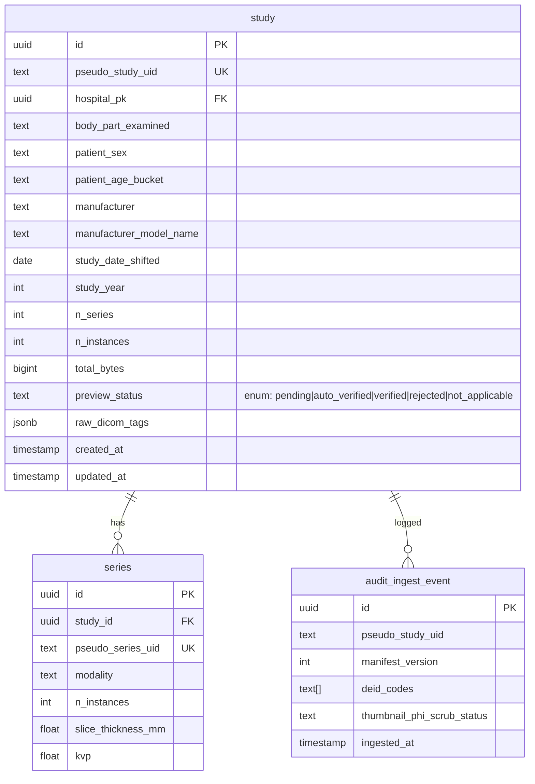
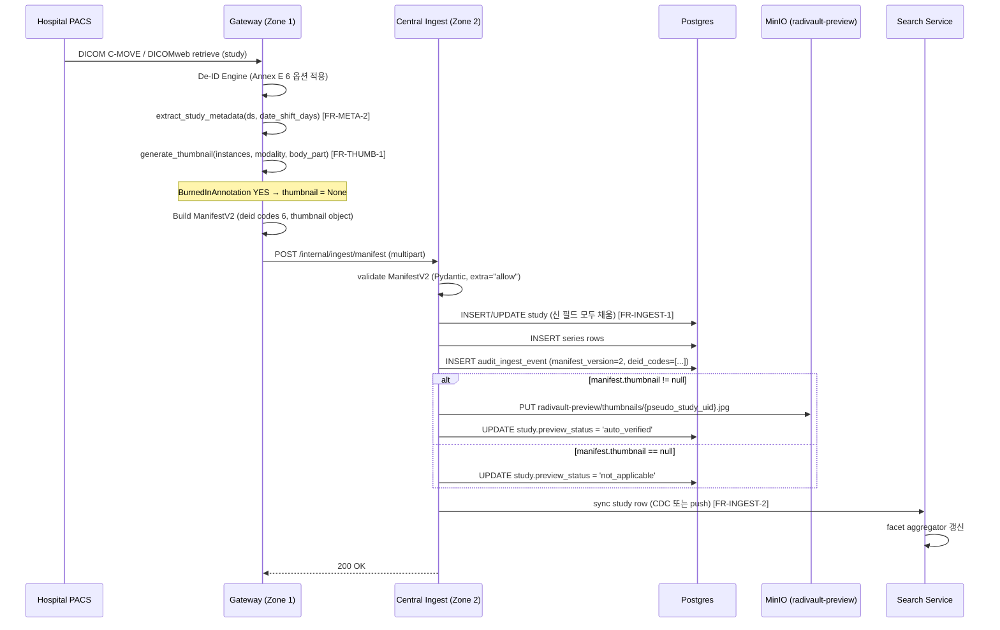
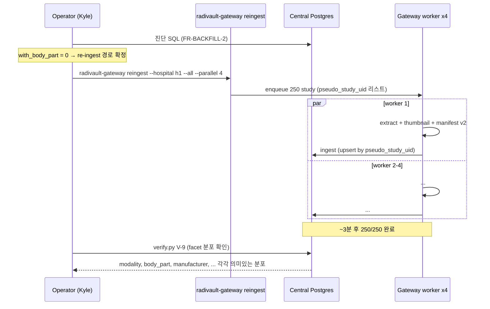
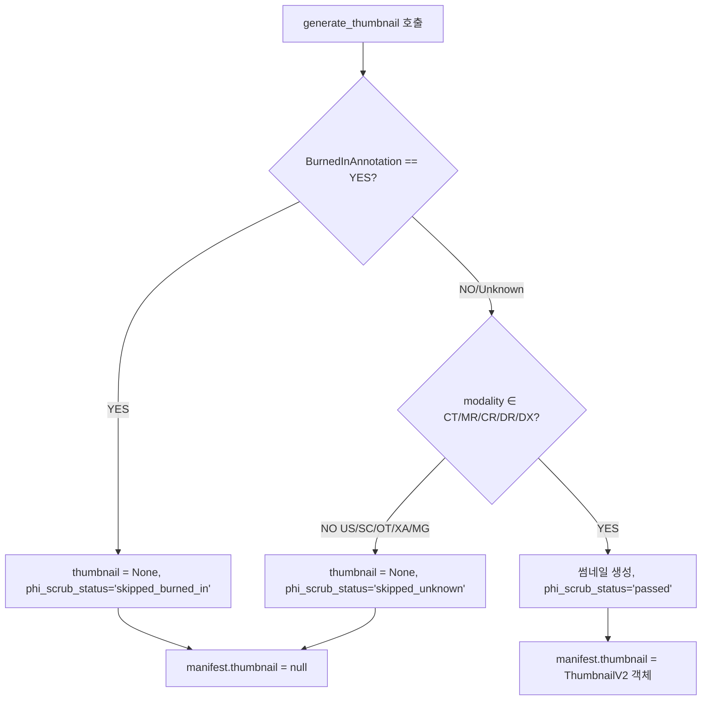

# 개발지시서 — Metadata Extraction + Ingest-time Thumbnail

> **Status**: Draft v0.1 · **Feature slug**: `metadata-thumbnail-ingest` · **Last updated**: 2026-04-25
> **작성자**: @planner · **근거**: [리서치 §5.1–§5.5](../research/metadata-extraction-and-thumbnail.md) · [PRD §4.1, §4.2, §4.3](../prd.md) · [ARCHITECTURE §3.2, §4.1, §4.3](../ARCHITECTURE.md)
> **트리거**: D-13 (2026-05-08) CEO 데모 BLOCKER. 250 study 모두 `body_part`/`age_bucket`/`sex`/`manufacturer`/`model_name`/`study_date_shifted`/`n_series`/`total_bytes` null. facet `null:250`. 썸네일 0.

---

## 1. 기능 개요

Gateway 의 De-ID Engine 이 manifest 생성과 동시에 (a) buyer-search facet 12 필드를 DICOM 헤더에서 추출하고 (b) 256×256 JPEG 썸네일 1장을 생성하여, manifest v2 payload 에 포함시켜 Central 로 outbound 송신한다. Central ingest 는 신 필드를 study row 에 persist 하고 thumbnail 을 MinIO 에 업로드한다. 결과적으로 buyer 포털 `/search` 가 250 study 모두에 대해 8 facet 분포 + 썸네일 카드를 표시하는 D-13 데모 차단 BLOCKER 를 해소한다.

이 dev-spec 은 **manifest schema v1 → v2 bump** 와 **Thumbnail Option A (Gateway ingest 동시 생성)** 을 확정한다.

## 2. 사용자 스토리

- **As a** buyer (글로벌 AI 회사 데이터 엔지니어), **I want** /search 결과 카드에서 modality/body_part/manufacturer/age 등 6+ facet 으로 코호트 필터링하고 썸네일로 시리즈 적합성을 빠르게 판단하고 싶다, **so that** 구매 전 코호트 품질·다양성을 검증할 수 있다.
- **As a** Kyle (D-13 데모 운영자), **I want** 250 study 모두 facet/thumbnail 이 채워진 상태로 데모하고 싶다, **so that** "facet 패널은 modality 외 모두 비어있고 카드에 썸네일이 없다" 라는 사고를 피한다.
- **As a** Gateway 운영자 (병원 IT), **I want** ingest 시 썸네일을 함께 생성·송신하고 싶다, **so that** 별도 backfill worker 운영 / 첫 조회 latency / 픽셀을 두 번 OCR 하는 위험을 모두 제거한다.
- **As a** Compliance/RA, **I want** DeidentificationMethodCodeSequence 에 채택 옵션 6 코드가 모두 기록되길 원한다, **so that** PIPA/HIPAA 감사 시 익명화 절차 입증이 가능하다.

## 3. 범위

### 포함 (In-scope)
- Gateway 의 manifest schema v1 → v2 bump (study 7 신규 + series 6 신규 + thumbnail 1 신규).
- Gateway 의 DICOM 헤더 → 12 MVP 필드 추출 (modality 이미 + 11 신규).
- Gateway 의 ingest-time 썸네일 1장 생성 (study-level representative, 256×256 JPEG, BurnedInAnnotation gate).
- Central ingest 의 신 필드 persist (L.212, L.236-239 의 None 하드코딩 제거).
- Central 의 썸네일 MinIO 업로드 + `study.preview_status` enum `auto_verified` 추가.
- Search service 동기화 (study mirror 신 필드 propagate).
- 250 study 일괄 재처리 CLI (`radivault-gateway reingest`).
- Facet aggregator 8 필드 확장 (model_name 추가; contrast_used 는 v0.1.5 stub).
- 데모 시나리오 D-13 통합 (Scene 4 `/search` 가 250 study facet/썸네일 동작).

### 제외 (Out-of-scope)
- 자유 텍스트 (StudyDescription/SeriesDescription/ProtocolName) 보존 — Clean Descriptors Option (Q-1 default NO, v0.1.5 별도 dev-spec).
- v0.1.5 추가 6 필드 (PixelSpacing/TubeCurrent/MagneticFieldStrength/TR/TE/ContrastBolus) — series 추출 schema 만 v2 에 reservation, MVP 미추출.
- NLP Label Engine (StudyDescription → ICD-10/RadLex) — v0.2.
- Series-level 썸네일 (series 당 1장) — MVP 는 study-level 1장만, v0.1.5 검토.
- 3D defacing (pydeface) — 별도 de-id-pixel dev-spec 영역.
- Microsoft Presidio OCR 자동화 — MVP 는 BurnedInAnnotation tag gate 만, OCR 자동화는 v0.1.5.
- k-익명성 측정 / 법률 자문 (Q-6, Q-7 default D-13 후).
- Thumbnail 만료/cleanup 정책 — v1.0.

## 4. 기능 요구사항

번호 표기: `FR-<영역>-<n>`. 각 FR 은 리서치/코드 줄 번호 근거.

### FR-META-1 — Manifest Schema v2 정의
- **모듈**: `src/radivault_gateway/manifest/v2.py` 신규 (또는 기존 manifest 모델 v2 필드 확장).
- **manifest_version**: `int = 2`. v1 도 `extra="allow"` 로 backward-compatible 수신.
- **Study root 추가 필드** (모두 Optional 외 명시):
  - `body_part_examined: str | None` — 대문자 정규화. 빈 값 시 None (placeholder string 사용 금지).
  - `patient_sex: Literal["M","F","O"] | None`.
  - `patient_age_bucket: str | None` — 5년 bucket 라벨 ("00-04", "30-34", "85-89", "90+").
  - `manufacturer: str | None` — trim, max 64 char.
  - `manufacturer_model_name: str | None` — trim, max 128 char.
  - `study_date_shifted: date | None` — date shift 적용 후 (YYYY-MM-DD).
  - `study_year: int | None` — `study_date_shifted.year`.
  - `n_series: int` — non-null, derived count.
  - `n_instances: int` — non-null, derived count.
  - `total_bytes: int` — non-null, derived sum.
- **Series array 신규 필드** (per-series):
  - `pseudo_series_uid: str`
  - `modality: str`
  - `series_description_clean: str | None` — MVP 는 None (Clean Descriptors v0.1.5 까지 미처리)
  - `n_instances: int`
  - `slice_thickness_mm: float | None` — CT/MR
  - `kvp: float | None` — CT only
- **Thumbnail 객체** (study-level, optional):
  ```jsonc
  "thumbnail": {
    "sha256": "<hex>",
    "bytes": 18432,
    "format": "JPEG",
    "width": 256,
    "height": 256,
    "source_instance_uid_pseudo": "<pseudo>",
    "slice_index": 110,
    "slice_count": 220,
    "phi_scrub_status": "passed" | "skipped_burned_in" | "skipped_unknown",
    "phi_scrub_method": "burned_in_tag_gate"
  }
  ```
  - 빈 thumbnail (BurnedInAnnotation YES / 생성 실패) → `thumbnail: null` (manifest 에 키 자체 None).
- **DeidentificationMethodCodeSequence (0012,0064)** 에 코드 6개 기록: 113100, 113101, 113103, 113106, 113109, 113111 (FR-META-3 참조).
- **근거**: 리서치 §4.3.5, §5.1, §5.3.

### FR-META-2 — Gateway DICOM 헤더 추출
- **모듈**: `src/radivault_gateway/extract.py` 신규.
- **시그니처**: `extract_study_metadata(ds: pydicom.Dataset, *, date_shift_days: int) -> StudyMetadata`.
- **multi-instance**: 동일 study 의 첫 instance 의 study/patient/manufacturer 필드 사용 (DICOM 표준 — 동일 study 내 일관성 가정).
- **필드별 파싱 규칙**:
  | 필드 | DICOM tag | 파싱 규칙 |
  |------|-----------|----------|
  | patient_sex | (0010,0040) | 'M'/'F'/'O' 만 허용. 그 외 None. |
  | patient_age_bucket | (0010,1010) PatientAge 우선; (0010,0030) PatientBirthDate fallback (StudyDate - DOB → years) | "030Y" → 30 → bucket = floor(30/5)*5 → "30-34". 90 이상 → "90+" 단일. |
  | study_date_shifted | (0008,0020) StudyDate + `date_shift_days` (per-patient/per-hospital scope, 1–365 정수) | `date(yyyy,mm,dd) + timedelta(days=shift)`. 결과 YYYY-MM-DD. |
  | study_year | derived | `study_date_shifted.year`. |
  | body_part_examined | (0018,0015) BodyPartExamined | 대문자 strip. 빈 값 → None. |
  | manufacturer | (0008,0070) Manufacturer | strip, max 64 char (truncate with warning log). |
  | manufacturer_model_name | (0008,1090) ManufacturerModelName | strip, max 128 char. |
  | slice_thickness_mm | (0018,0050) SliceThickness | float (CT/MR). 0 이하 → None. |
  | kvp | (0018,0060) KVP | float (CT only — modality == "CT" 일 때만). |
  | n_series, n_instances, total_bytes | derived | series 분류 후 카운트/합. |
- **빈 값 처리**: 모두 None (NULL). placeholder string ("Unknown") 금지. UI 레이어가 "Unknown" 라벨 처리.
- **단위 테스트** (pytest, `tests/gateway/test_extract.py`): 각 modality (CT/MR/CR) sample DICOM 으로 추출 결과 검증. PatientAge "030Y" → "30-34", "095Y" → "90+", 빈 BodyPart → None, 다중 instance 일관성, modality 가 CT 가 아닐 때 KVP 무시.
- **근거**: 리서치 §4.2.1–§4.2.4, §5.1.

### FR-META-3 — De-id Annex E 옵션 명시
- Gateway De-ID Engine 이 다음 옵션 조합으로 동작하고, **DeidentificationMethodCodeSequence (0012,0064)** 에 6 코드 기록:
  | DCM 코드 | 옵션 |
  |----------|------|
  | 113100 | Basic Application Confidentiality Profile |
  | 113101 | Clean Pixel Data Option |
  | 113103 | Clean Graphics Option |
  | 113106 | Retain Longitudinal Modified Dates Option |
  | 113109 | Retain Device Identity Option |
  | 113111 | Retain Patient Characteristics Option |
- **DeviceSerialNumber (0018,1000)** 는 Retain Device Identity Option 상에서 X 선택 → **제거** (HIPAA #M).
- **근거**: 리서치 §4.4.4, §5.1.

### FR-THUMB-1 — Ingest-time 썸네일 생성 (Option A)
- **모듈**: `src/radivault_gateway/thumbnail.py` 신규.
- **시그니처**: `generate_thumbnail(instances: list[Path], *, modality: str, body_part: str | None) -> ThumbnailResult | None`.
- **ThumbnailResult**: `{bytes: bytes, sha256: str, source_instance_uid_pseudo: str, slice_index: int, slice_count: int, width: 256, height: 256, format: "JPEG"}`.
- **알고리즘**:
  1. Instance 정렬: `InstanceNumber` (0020,0013) ASC. None/누락 시 SOPInstanceUID lexical sort fallback.
  2. 중간 인덱스: `idx = len(sorted) // 2`.
  3. multi-frame DICOM (NumberOfFrames > 1): `frame_idx = NumberOfFrames // 2`, 그렇지 않으면 0.
  4. 픽셀 변환: `pydicom.pixel_data_handlers.apply_modality_lut(arr, ds)` → `apply_voi_lut(arr, ds)` → numpy.
  5. modality 별 windowing (VOI LUT 부재 시 fallback):
     - **CT**: WindowCenter/Width DICOM tag 우선 → 없으면 BodyPartExamined 기반:
       - HEAD/BRAIN: W=80, L=40
       - CHEST: W=1500, L=-600
       - ABDOMEN/PELVIS: W=400, L=50
       - 그 외: W=400, L=40 default
     - **MR**: percentile p1 ~ p99 normalize.
     - **CR/DR/DX/MG**: VOI LUT 가정. 없으면 percentile p1-p99 fallback.
     - **US**: passthrough (이미 8-bit display-ready).
     - **PT**: percentile p1-p99 fallback (SUV scaling 은 v0.2).
  6. 16-bit → 8-bit: `np.clip((arr - low) / (high - low) * 255, 0, 255).astype(np.uint8)`.
  7. PIL.Image.fromarray → `image.thumbnail((256, 256), Image.LANCZOS)` (aspect ratio 유지, letterbox 없이 ratio 그대로).
  8. JPEG save quality=85, ICC profile 미포함, EXIF strip.
- **PHI scrub** (MVP):
  - **(0028,0301) BurnedInAnnotation == "YES"** → thumbnail 생성 skip → manifest.thumbnail = null, `phi_scrub_status="skipped_burned_in"`.
  - tag 부재/Unknown → modality ∈ {CT, MR, CR, DR, DX} 안전군은 생성 진행, manifest.thumbnail.phi_scrub_status = "passed". 그 외 (US, SC, OT, XA, MG) 는 **skip + flag** (`phi_scrub_status="skipped_unknown"`) 으로 보수적 처리.
  - 운영자 수동 검증 후 Central DB 의 `study.preview_status` 를 `verified` 로 승격하는 별도 워크플로 (이전 `seed_preview_samples.py` 와 동일 패턴).
  - v0.1.5: Microsoft Presidio DicomImageRedactorEngine 자동 OCR (별도 dev-spec).
- **단위 테스트**: CT/MR/CR/US sample 로 thumbnail 생성, multi-frame 시 frame_idx 정확, BurnedInAnnotation YES 시 None 반환, modality CT chest 시 W/L=1500/-600 적용, modality MR 시 percentile 동작.
- **근거**: 리서치 §4.3.2, §4.3.3, §4.3.4, §5.3.

### FR-THUMB-2 — Manifest + Outbound 통합
- thumbnail JPEG bytes 를 manifest v2 payload 에 포함하여 outbound 송신 (별도 storage round-trip 없음).
- Storage key (Central 측 업로드 후): `radivault-preview/thumbnails/{pseudo_study_uid}.jpg` (이전 `seed_preview_samples.py` 와 동일 키 — backward-compat).
- manifest 의 `thumbnail` 객체가 first-class field (FR-META-1 schema).
- 빈 thumbnail (생성 skip): `manifest.thumbnail = null` → Central 측은 업로드 skip 하고 `study.preview_status = 'not_applicable'`.
- **근거**: 리서치 §4.3.5, §5.3 FR-THUMB-4/5.

### FR-INGEST-1 — Central Ingest 신 필드 Persist
- **수정 파일**: `src/radivault_central/routers/ingest.py`
  - L.212 `series_entry["body_part"]` → manifest v2 `series[i].body_part` (또는 study root) 로부터 채움. 기존 None 하드코딩 제거.
  - L.236-239 `body_part=None, manufacturer=None, manufacturer_model_name=None, ...` → manifest v2 의 study root 필드로 채움.
- **수정 파일**: `src/radivault_central/db/repository.py` `insert_study_full(...)` 시그니처 확장 — 신 필드 모두 입력.
- **Thumbnail 업로드**:
  - manifest.thumbnail != null → `radivault-preview/thumbnails/{pseudo_study_uid}.jpg` 로 PUT (MinIO).
  - Content-Type: `image/jpeg`. Cache-Control: `public, max-age=86400`.
- **`study.preview_status` 매핑**:
  | 조건 | preview_status |
  |------|---------------|
  | thumbnail 있음 + manifest.thumbnail.phi_scrub_status == "passed" | `auto_verified` (신 enum) |
  | thumbnail 있음 + phi_scrub_status == "skipped_unknown" | `pending` |
  | thumbnail 없음 (생성 skip 또는 BurnedInAnnotation YES) | `not_applicable` |
  | 기존 'verified' (수동 검증 끝남) | 보존 — 덮어쓰지 않음 (멱등성) |
- **DB schema 변경** (alembic migration 1건):
  - `study.preview_status` enum 에 `'auto_verified'` value 추가. ALTER TYPE.
  - 그 외 컬럼 변경 0 (이미 schema 가 컬럼 가지고 있음 — null 값만 채우면 됨).
- **raw_dicom_tags JSONB**: manifest v2 의 study/series 블록 그대로 보존 (감사 추적).
- **근거**: §6 데이터 모델 + 리서치 §5.1 FR-META-4.

### FR-INGEST-2 — Search Service 동기화
- Central → Search 동기화 path (FR-INF-3 기존) 가 신 필드 모두 propagate.
- `src/radivault_search/db/models.py` 의 study mirror schema 확인: 컬럼 존재 시 변경 0. 부재 시 alembic migration 으로 컬럼 추가 (개발자 작업 시 코드 base 확인 후 결정).
- Search facet aggregator 가 신 컬럼 자동 인지 (FR-FACET-1).
- **근거**: 입력 명세, 리서치 §5.5.

### FR-BACKFILL-1 — 250 Study 일괄 재처리 CLI
- **CLI**: `radivault-gateway reingest --hospital {id} [--since {YYYY-MM-DD}] [--all] [--parallel 4] [--dry-run]`.
- **멱등성**: `pseudo_study_uid` 기준 upsert (Central 의 study row 중복 unique 제약 보존). `audit_ingest_event` 의 unique 제약은 본 dev-spec 점검 항목으로 추가:
  - **점검 SQL**: `\d audit_ingest_event` 으로 unique constraint 확인. `(pseudo_study_uid, ingest_attempt_no)` 형태가 아니면 동일 study 의 2회 ingest 가 unique violation 일으키는지 확인. → 개발자가 점검 후 필요 시 attempt_no 컬럼 추가 또는 unique 완화.
- **실행 주체**: D-day 직전 운영자 (Kyle).
- **시간 추정**: study 당 ingest p95 ~3초 × 250 / 4 worker = **~190초 (~3분)**. 리서치 §4.3.6 의 1.5초/study 보다 보수적 (manifest 송신 + central persist 포함).
- **선결 진단 SQL** (FR-BACKFILL-2 와 묶음):
  ```sql
  SELECT
    COUNT(*) AS total,
    COUNT(raw_dicom_tags) AS with_raw_tags,
    COUNT(raw_dicom_tags->>'(0018,0015)') AS with_body_part,
    COUNT(raw_dicom_tags->>'(0008,0070)') AS with_manufacturer,
    COUNT(raw_dicom_tags->>'(0008,1090)') AS with_model
  FROM study;
  ```
  - `with_body_part = 250` → SQL backfill 가능 (re-ingest 회피, 13초).
  - `with_body_part = 0` → re-ingest 만 가능 (~3분).
  - 두 결과 모두 250 정상 facet 분포로 회복.
- **Fallback**: D-13 차단 시 5–10 study 만 manual re-ingest (~2.5분).
- **근거**: 리서치 §4.5, §5.4. Kyle 결정 default Q-5 = "D-13 직전 1회 일괄 re-ingest, Option A".

### FR-BACKFILL-2 — raw_dicom_tags 진단
- 개발자는 Backfill 실행 전 위 SQL 을 stage DB 에서 1회 실행하고 결과를 progress.txt 로 메인 세션에 보고.
- 결과 → backfill 경로 결정 (SQL vs re-ingest).

### FR-FACET-1 — Facet 8개 확장
- 기존 facet (modality, body_part, sex, age_bucket, manufacturer, year — 6).
- **신규 추가**: `model_name` (study.manufacturer_model_name 기반), `contrast_used` (v0.1.5 stub — MVP 는 항상 null bucket 표시 OK).
- BFF facets endpoint (`GET /api/v1/facets` 또는 `POST /api/v1/search`) 가 이미 사용 중 — 신 컬럼 자동 인지. 코드 확인 후 변경 0 또는 minimal SELECT 절 확장.
- 응답 schema (예시):
  ```jsonc
  {
    "modality": {"CT": 130, "MR": 80, "CR": 40},
    "body_part": {"CHEST": 90, "ABDOMEN": 60, "HEAD": 50, "SPINE": 30, "UNKNOWN": 20},
    "sex": {"M": 140, "F": 108, "O": 2},
    "age_bucket": {"30-34": 12, "55-59": 28, "70-74": 35, "85-89": 18, "90+": 5, "Unknown": 8},
    "manufacturer": {"GE Medical Systems": 110, "Siemens": 85, "Philips": 35, "Canon": 20},
    "model_name": {"Revolution CT": 60, "SOMATOM Force": 40, "Ingenuity Core": 30, ...},
    "year": {"2022": 30, "2023": 80, "2024": 100, "2025": 40},
    "contrast_used": {"null": 250}  // v0.1.5 까지 stub
  }
  ```
- **근거**: 리서치 §5.5.

## 5. 비기능 요구사항

| 항목 | 요구 |
|------|------|
| 성능 | (NFR-PERF-1) Gateway ingest 추가 부담: 단일 study p95 < 3초 (기존 1초 + 메타 추출 ~1초 + 썸네일 ~1초). 250 study 일괄: 4 worker 병렬 ~3분. (NFR-PERF-2) Gateway 호스트 메모리 +500MB (numpy + PIL). (NFR-PERF-3) Central ingest 추가 latency 무시 가능 (단순 컬럼 채움). (NFR-PERF-4) Facet 응답 p95 < 200ms (기존 인덱스 활용, 컬럼 추가만). |
| 보안 | (NFR-SEC-1) burned-in PHI 의 thumbnail leak 0 — BurnedInAnnotation tag gate + modality whitelist (CT/MR/CR/DR/DX 만 통과). (NFR-SEC-2) DeidentificationMethodCodeSequence 6 코드 모두 audit_ingest_event 에 기록. (NFR-SEC-3) DeviceSerialNumber 보존 금지 (HIPAA #M). (NFR-SEC-4) thumbnail JPEG 의 EXIF strip + ICC profile 미포함 (geographical/device leak 방지). |
| 가용성 | (NFR-AVAIL-1) Gateway 가 thumbnail 생성 실패 시 manifest.thumbnail=null 로 graceful degradation, ingest 자체 fail 금지. (NFR-AVAIL-2) Central 가 신 필드 누락 (v1 manifest) 수신 시 기존 동작 (null 채움) 유지 — manifest_version 분기 처리. |
| 로깅·감사 | (NFR-LOG-1) audit_ingest_event 에 manifest_version, deid_codes (6개), thumbnail.phi_scrub_status 기록. (NFR-LOG-2) 추출 실패한 필드 (예: BodyPartExamined 빈값) 는 WARN 레벨 로그 + 카운터. (NFR-LOG-3) BurnedInAnnotation YES 이벤트는 INFO 로 quarantine 카운터 증가 + 운영자 알림 큐 (D-13 후 Slack 알람 dev-spec 별도). |
| 국제화 | N/A — 본 dev-spec 은 백엔드. UI 의 "Unknown" 라벨은 design-spec-portal-redesign 영역. |
| Backward compat | (NFR-DATA-1) manifest v1 수신 가능. v1 study 는 facet null bucket 으로 표시되며, FR-BACKFILL-1 으로 v2 재처리 의무. (NFR-DATA-2) `study.preview_status='verified'` (수동 검증 완료) 는 ingest 가 덮어쓰지 않음. |

## 6. 데이터 모델

### 6.1 Manifest v1 vs v2 Diff (Pydantic)

```python
# src/radivault_gateway/manifest/v2.py (신규)

from datetime import date
from typing import Literal, Optional
from pydantic import BaseModel, Field

class ThumbnailV2(BaseModel):
    sha256: str
    bytes: int  # JPEG payload size
    format: Literal["JPEG"] = "JPEG"
    width: int = 256
    height: int = 256
    source_instance_uid_pseudo: str
    slice_index: int
    slice_count: int
    phi_scrub_status: Literal["passed", "skipped_burned_in", "skipped_unknown"]
    phi_scrub_method: str = "burned_in_tag_gate"

class SeriesEntryV2(BaseModel):
    pseudo_series_uid: str
    modality: str
    series_description_clean: Optional[str] = None  # v0.1.5
    n_instances: int
    slice_thickness_mm: Optional[float] = None
    kvp: Optional[float] = None  # CT only

class ManifestV2(BaseModel):
    manifest_version: Literal[2] = 2
    gateway_id: str
    hospital_id: str
    pseudo_study_uid: str

    # === v1 보존 ===
    modalities: list[str]
    files: list[dict]
    generated_at: str
    audit_ref: dict
    deid: dict  # DeidentificationMethodCodeSequence 6 코드 포함
    anonymization_flag: Literal["FULL", "PARTIAL"] = "FULL"

    # === v2 신규 (study root) ===
    body_part_examined: Optional[str] = None
    patient_sex: Optional[Literal["M", "F", "O"]] = None
    patient_age_bucket: Optional[str] = None  # "30-34", "90+"
    manufacturer: Optional[str] = Field(None, max_length=64)
    manufacturer_model_name: Optional[str] = Field(None, max_length=128)
    study_date_shifted: Optional[date] = None
    study_year: Optional[int] = None
    n_series: int  # non-null
    n_instances: int  # non-null
    total_bytes: int  # non-null

    # === v2 신규 (series array) ===
    series: list[SeriesEntryV2] = []

    # === v2 신규 (thumbnail) ===
    thumbnail: Optional[ThumbnailV2] = None

    class Config:
        extra = "allow"  # v1 backward-compat
```

**v1 → v2 추가 필드 카운트**: study root 10 + series array 1 (신규) + thumbnail 1 = **총 12 신규 필드 그룹**.

### 6.2 DB Schema 변경 (alembic)

```python
# alembic/versions/<rev>_add_auto_verified_preview_status.py
def upgrade():
    # study.preview_status enum 에 'auto_verified' 추가
    op.execute("ALTER TYPE preview_status_enum ADD VALUE IF NOT EXISTS 'auto_verified'")

def downgrade():
    # PostgreSQL 은 enum value 제거가 직접 불가 — 새 enum 만들어 swap (생략, 운영 정책)
    pass
```

**총 ALTER**: 1건 (enum value 추가).
**추가 컬럼**: 0건 — `study.body_part_examined`, `study.manufacturer`, `study.manufacturer_model_name`, `study.patient_sex`, `study.patient_age_bucket`, `study.study_date_shifted`, `study.study_year`, `study.n_series`, `study.n_instances`, `study.total_bytes` 모두 이미 schema 에 존재 (이전 dev-spec-central-ingest 가 컬럼 정의함, 단지 채움이 안 된 상태). **개발자가 코드 base 확인하여 미존재 시 ADD COLUMN migration 추가**.

### 6.3 Study Row ER (mermaid)



## 7. API 계약

본 dev-spec 은 신규 외부 API 엔드포인트를 추가하지 않는다 (기존 ingest endpoint 가 manifest payload 만 수신하는 구조). 변경은 **manifest payload schema** + **/search facet 응답 컬럼 추가** 2건.

### 7.1 Ingest Endpoint (변경 — payload schema)
```
POST /internal/ingest/manifest
Headers:
  Content-Type: multipart/form-data
  X-Gateway-ID: <gateway uuid>
  Authorization: Bearer <gateway-jwt>
Body (multipart):
  - manifest: application/json (ManifestV2 schema, v1 도 수신 가능)
  - thumbnail: image/jpeg (optional, manifest.thumbnail != null 일 때만)
  - dicom_files[]: application/dicom (옵션, 별도 transfer)

Response 200:
  { "study_pk": "...", "preview_status": "auto_verified" | ..., "ingested_at": "..." }

Errors:
  400 — manifest schema invalid (Pydantic ValidationError)
  409 — pseudo_study_uid 중복 (idempotent → 200 + replaced=true 도 가능, 정책 결정 필요)
  413 — thumbnail bytes > 1MB (안전선)
  415 — thumbnail Content-Type != image/jpeg
```

### 7.2 Facet Endpoint (변경 — 응답 컬럼)
```
GET /api/v1/facets?dataset_id=<>
Response 200:
  {
    "modality": {<bucket>: <count>, ...},
    "body_part": {...},        // 신규 활성
    "sex": {...},              // 신규 활성
    "age_bucket": {...},       // 신규 활성
    "manufacturer": {...},     // 신규 활성
    "model_name": {...},       // 신규 추가 (8번째)
    "year": {...},             // 신규 활성
    "contrast_used": {...}     // v0.1.5 stub (MVP 는 null:N)
  }
```

## 8. 시퀀스·플로우

### 8.1 Ingest-time Metadata + Thumbnail (Gateway → Central)



### 8.2 Backfill 플로우 (250 Study, D-day 직전)



### 8.3 BurnedInAnnotation Quarantine (예외)



## 9. 의존성

### 상위 모듈
- `dev-spec-gateway-agent.md` — manifest 송신 base 동작.
- `dev-spec-central-ingest.md` — study/series/audit 테이블 정의.
- `dev-spec-buyer-browse-preview.md` — buyer-facing 썸네일 표시.
- `design-spec-portal-redesign.md` — facet 패널 UI.

### 하위 모듈 / 영향
- `src/radivault_gateway/cli/main.py` — ingest path 에 extract + thumbnail 호출 통합.
- `src/radivault_gateway/deid/engine.py` — Annex E 옵션 6 코드 기록.
- `src/radivault_central/routers/ingest.py` (L.212, L.236-239) — 신 필드 persist.
- `src/radivault_central/db/repository.py` `insert_study_full` — 시그니처 확장.
- `src/radivault_central/db/models.py` — preview_status enum 'auto_verified' 추가, (필요 시) study 컬럼 검증.
- `src/radivault_search/db/models.py` — study mirror 컬럼 검증 / propagate.
- `scripts/demo_seed/seed_preview_samples.py` — 본 작업으로 deprecated. 이전 verified flag 보존 정책만 유지.

### 외부 시스템
- pydicom 3.x (이미 사용 중) — `apply_voi_lut`, `apply_modality_lut`, `pixel_array`.
- Pillow (PIL) — JPEG 인코딩 (gateway requirements 추가 — 미존재 시).
- numpy — 픽셀 변환.
- MinIO (Central S3 호환) — `radivault-preview/thumbnails/`.

### 선행 조건
- buyer-auth 완료 (이미 — FR-INF-3).
- buyer-browse-preview 완료 (이미 — facet endpoint 가 컬럼 SELECT 준비됨).
- Central DB 의 study 컬럼 13개 존재 (코드 base 확인 후 부재 시 ADD COLUMN 추가).

## 10. 수용 기준 (Acceptance Criteria)

`@qa` 가 이 기준으로 검수. 자동화 가능한 항목은 `[Auto]`, 수동 검증은 `[Manual]` 표기.

### Metadata 추출 (FR-META-*)
- [ ] **AC-META-1.1** [Auto]: CT sample DICOM 입력 시 `extract_study_metadata` 가 modality="CT", body_part_examined="CHEST" (대문자), manufacturer="GE Medical Systems", manufacturer_model_name="Revolution CT", patient_sex="M", patient_age_bucket="55-59", study_year=2024, n_series=4, n_instances=220, total_bytes>0, slice_thickness_mm=1.25, kvp=120 반환.
- [ ] **AC-META-1.2** [Auto]: MR sample 시 modality="MR", kvp=None (MR 은 미추출).
- [ ] **AC-META-1.3** [Auto]: CR sample 시 modality="CR", slice_thickness_mm=None.
- [ ] **AC-META-2.1** [Auto]: PatientAge "030Y" → patient_age_bucket="30-34". "095Y" → "90+". 빈 PatientAge + PatientBirthDate 1955-03-15 + StudyDate 2024-03-20 → "65-69".
- [ ] **AC-META-2.2** [Auto]: PatientSex "U" 또는 빈 값 → None.
- [ ] **AC-META-3.1** [Auto]: BodyPartExamined "chest" → "CHEST" 대문자 정규화.
- [ ] **AC-META-3.2** [Auto]: BodyPartExamined 빈 값 → None (placeholder string 사용 0).
- [ ] **AC-META-4.1** [Auto]: Manufacturer 65 자 이상 입력 시 64 자로 truncate + WARN 로그.
- [ ] **AC-META-4.2** [Auto]: Manufacturer 앞뒤 공백 strip.
- [ ] **AC-META-5.1** [Auto]: StudyDate 20240315 + date_shift=42 → study_date_shifted=2024-04-26, study_year=2024.
- [ ] **AC-META-5.2** [Auto]: study_date_shifted.year == study_year (consistency invariant).
- [ ] **AC-META-6.1** [Auto]: manifest_version=2, deid 객체에 코드 113100, 113101, 113103, 113106, 113109, 113111 모두 포함.
- [ ] **AC-META-6.2** [Auto]: DeviceSerialNumber 가 manifest 또는 출력 DICOM 어디에도 포함되지 않음 (HIPAA #M).

### Thumbnail (FR-THUMB-*)
- [ ] **AC-THUMB-1.1** [Auto]: 220 instance series 입력 시 slice_index=110 (220//2), slice_count=220.
- [ ] **AC-THUMB-1.2** [Auto]: InstanceNumber 누락 + 5 instance + SOPInstanceUID 알파벳순 sorted → middle index 2.
- [ ] **AC-THUMB-1.3** [Auto]: NumberOfFrames=10 multi-frame DICOM → frame_idx=5.
- [ ] **AC-THUMB-2.1** [Auto]: 출력 JPEG width <= 256, height <= 256, aspect ratio 보존 (letterbox 없음).
- [ ] **AC-THUMB-2.2** [Auto]: JPEG payload bytes < 50KB (quality 85, 256×256 grayscale).
- [ ] **AC-THUMB-2.3** [Auto]: 출력 JPEG 의 EXIF + ICC profile 부재.
- [ ] **AC-THUMB-3.1** [Auto]: BurnedInAnnotation == "YES" 입력 시 generate_thumbnail 반환 None, manifest.thumbnail = null.
- [ ] **AC-THUMB-3.2** [Auto]: modality="US" + BurnedInAnnotation 부재 시 generate_thumbnail 반환 None (보수적 skip), phi_scrub_status="skipped_unknown".
- [ ] **AC-THUMB-3.3** [Auto]: modality="CT" + BurnedInAnnotation 부재 시 thumbnail 생성, phi_scrub_status="passed".
- [ ] **AC-THUMB-4.1** [Auto]: CT chest sample 입력 시 W=1500/L=-600 windowing 적용 (출력 픽셀 분포 검증).
- [ ] **AC-THUMB-4.2** [Auto]: MR sample 입력 시 percentile p1-p99 normalize 적용.
- [ ] **AC-THUMB-4.3** [Auto]: CR sample 시 VOI LUT 우선, 부재 시 percentile fallback.

### Central Ingest (FR-INGEST-*)
- [ ] **AC-INGEST-1.1** [Auto]: ManifestV2 수신 후 study row 의 body_part_examined, manufacturer, manufacturer_model_name, patient_sex, patient_age_bucket, study_date_shifted, study_year, n_series, n_instances, total_bytes 모두 non-null (manifest 가 채워준 값 그대로).
- [ ] **AC-INGEST-1.2** [Auto]: routers/ingest.py L.212 + L.236-239 에서 None 하드코딩 0건 (grep으로 검증).
- [ ] **AC-INGEST-2.1** [Auto]: thumbnail bytes 수신 후 MinIO `radivault-preview/thumbnails/{pseudo_study_uid}.jpg` 에 PUT 완료, Content-Type=image/jpeg.
- [ ] **AC-INGEST-2.2** [Auto]: study.preview_status = "auto_verified" (phi_scrub_status="passed" 시).
- [ ] **AC-INGEST-2.3** [Auto]: manifest.thumbnail=null 시 study.preview_status="not_applicable", MinIO PUT skip.
- [ ] **AC-INGEST-2.4** [Auto]: 기존 study.preview_status="verified" (수동 검증 끝남) 는 ingest 가 덮어쓰지 않음 (멱등성).
- [ ] **AC-INGEST-3.1** [Auto]: alembic upgrade 후 `SELECT unnest(enum_range(NULL::preview_status_enum))` 결과에 'auto_verified' 포함.
- [ ] **AC-INGEST-4.1** [Auto]: manifest v1 (manifest_version=1 또는 부재) 수신 시 기존 동작 (신 필드 null) 유지, ingest 자체는 200.

### Backfill (FR-BACKFILL-*)
- [ ] **AC-BACKFILL-1.1** [Manual]: 250 study 일괄 reingest 후 facet 분포 검증 — modality, body_part, sex, age_bucket, manufacturer 각각 null bucket 비율 < 10% (한국 PACS BodyPart 빈값 한계 인정).
- [ ] **AC-BACKFILL-1.2** [Auto]: 동일 pseudo_study_uid 2회 ingest 시 study row count 변화 0 (멱등성).
- [ ] **AC-BACKFILL-1.3** [Auto]: 4 worker 병렬 250 study reingest 완료 시간 < 5분 (NFR-PERF 여유 포함).
- [ ] **AC-BACKFILL-2.1** [Manual]: 진단 SQL 실행 후 결과를 progress.txt 또는 메인 세션에 기록.

### Facet (FR-FACET-*)
- [ ] **AC-FACET-1.1** [Auto]: GET /api/v1/facets 응답에 modality, body_part, sex, age_bucket, manufacturer, model_name, year, contrast_used 8개 키 모두 포함.
- [ ] **AC-FACET-1.2** [Auto]: Backfill 후 facet 응답에서 modality 외 facet 도 의미있는 분포 (`null:250` 단일 bucket 0건).

### 데모 (D-13)
- [ ] **AC-DEMO-1.1** [Manual]: D-13 시연 시 buyer 포털 /search 페이지에서 250 study 카드 모두 썸네일 표시 (단, BurnedInAnnotation YES 인 study 는 placeholder OK).
- [ ] **AC-DEMO-1.2** [Manual]: 좌측 facet 패널에서 5개 이상 facet (modality, body_part, sex, age_bucket, manufacturer) 선택 가능 + 각 클릭 시 결과 카운트 즉시 갱신.
- [ ] **AC-DEMO-1.3** [Manual]: 운영자 SOP `docs/ops/demo-day-runbook.md` 의 T-60min "Backfill 250 study" 단계 추가 + 명령 (`radivault-gateway reingest --all --parallel 4`) 검증.

## 11. 오픈 질문

Kyle 결정 default 적용 (입력 명시):
- **Q-1**: v0.1.5 자유텍스트 보존 (StudyDescription/SeriesDescription/ProtocolName + Clean Descriptors Option) — **default NO** (D-13 후 별도 dev-spec).
- **Q-2**: MVP 에 CT/MR-only 필드 (slice_thickness_mm, kvp) 포함 — **default YES**.
- **Q-3**: Thumbnail Option A (Gateway ingest 동시) — **확정**.
- **Q-4**: 중간 슬라이스 정렬 — InstanceNumber ASC, fallback SOPInstanceUID lexical — **확정**.
- **Q-5**: 250 study backfill 시점 — D-13 직전 1회 일괄 re-ingest (Option A, 4 worker 병렬) — **확정**.
- **Q-6**: 법률 자문 (Annex E 옵션 조합 PIPA 합치) — **D-13 후**.
- **Q-7**: k-익명성 측정 (Manufacturer + Model + Hospital + Date + Age + Sex 조합) — **D-13 후 (v0.1.5)**.
- **Q-8**: BurnedInAnnotation 부재 + 안전 modality (CT/MR/CR/DR/DX) → 자동 'auto_verified' 승급 — **default YES**.
- **Q-9**: 한국 PACS 의 BodyPartExamined 빈 비율 — 빈 값 None 처리 (placeholder 금지). StudyDescription NLP backfill 은 v0.1.5.

추가 점검 항목 (개발자 작업 시 확인):
- **Q-10**: `audit_ingest_event` 의 unique 제약 형태 — 동일 pseudo_study_uid 2회 ingest 시 violation 인지 점검. 필요 시 `(pseudo_study_uid, attempt_no)` 형태로 완화.
- **Q-11**: `study` 테이블에 13 컬럼 (body_part_examined 등) 모두 이미 존재하는지 코드 base 확인. 부재 시 ADD COLUMN migration 추가.
- **Q-12**: `radivault_search/db/models.py` 의 study mirror schema 가 신 컬럼 가지는지 확인. 부재 시 migration 추가.
- **Q-13**: VOI LUT default windowing (CT chest W:1500 L:-600 등) 의 한국 영상의학과 선호 windowing 과의 일치 — Kyle 도메인 지식 적용 후 v0.1.5 조정.

## 12. 법적·보안 고려

- **PHI 보호**:
  - 픽셀 burned-in PHI 의 thumbnail leak 0 — BurnedInAnnotation tag gate (FR-THUMB-1) + modality whitelist.
  - DeviceSerialNumber 는 보존 금지 (HIPAA #M, 45 CFR §164.514(b)(2)(i)). Manufacturer/Model 만 Retain Device Identity Option 으로 보존.
  - PatientName, PatientID raw, AccessionNumber, Referring/Performing Physician, Operator, InstitutionName(raw), InstitutionAddress, AdditionalPatientHistory, ImageComments 모두 제거 (Annex E Basic Profile 113100).
  - PatientAge 90+ 단일 bucket (HIPAA Safe Harbor "all elements of dates ... ages over 89").
  - StudyDate 는 per-patient date shift (Retain Longitudinal Modified Dates Option 113106).
- **PIPA 28-8**: 가명정보 처리 기준 적용. Manufacturer + Model + Hospital + Date + Age + Sex 조합의 재식별 가능성 평가는 **Q-7 default 적용으로 D-13 후 v0.1.5**. 본 dev-spec 은 PIPA 합치 입증을 위한 audit 기록 (DeidentificationMethodCodeSequence 6 코드) 의무화로 대비.
- **Audit**: audit_ingest_event 에 manifest_version, deid_codes, thumbnail_phi_scrub_status 기록 (NFR-LOG-1) → 감사 시 익명화 절차 입증.
- **법률 자문 면책**: 본 dev-spec 은 법률 자문이 아니다. PIPA/HIPAA 결론은 변호사·RaQA 자문 필수 (Q-6, D-13 후).

## 13. 기술 스택 결정

본 dev-spec 은 신규 기술 스택 확정 0건. 기존 스택 (pydicom 3.x, Pillow, numpy, FastAPI, Postgres, MinIO) 그대로 활용. 단, Gateway requirements.txt 에 **Pillow** 가 미존재 시 추가 필요 (개발자 점검 항목).

ARCHITECTURE.md §9 TBD 해소: 0건. (썸네일 생성 위치 = Gateway 결정은 §3.2 De-ID Engine 책임 확장으로 ARCHITECTURE.md 갱신 제안 — §14 참조).

## 14. PRD/ARCHITECTURE 갱신 제안

(본 dev-spec 이 직접 수정 X. 메인 세션이 PR 또는 Kyle 결정 받아 적용.)

1. **PRD §4.1 (Gateway)**: "DICOM 메타데이터 익명화" → "**+ buyer-search facet 12 필드 추출 + 256×256 thumbnail ingest-time 생성**" 보강.
2. **PRD §4.2 (Metadata Index)**: "코호트 검색 API: modality, body part, 연령대, 성별, 진단명, 장비 제조사, 촬영 연도" → "장비 제조사 = Manufacturer + ManufacturerModelName 두 facet" 명시.
3. **PRD §4.3 (구매자 포털)**: "썸네일 미리보기" → "**ingest-time 자동 생성, 운영자 수동 작업 불요**" 명시.
4. **ARCHITECTURE §3.2 (De-ID Engine 책임)**: "buyer-facet 화이트리스트 필드 추출 + thumbnail 생성 (256×256 JPEG, Sup 203 spec)" 항목 추가.
5. **ARCHITECTURE §4.3 (Thumbnail Cache + CDN)**: "썸네일은 Zone 1 gateway 가 ingest-time 에 생성하여 Zone 2 로 outbound payload 에 포함시켜 송신. Zone 2 는 수신·캐시·CDN 분배만 담당" 명문화.

## 15. 운영 SOP (D-13 데모)

`docs/ops/demo-day-runbook.md` 갱신 제안 (별도 PR — @developer 작업):

```
T-60min: 250 study Backfill
  명령: radivault-gateway reingest --all --parallel 4
  진행 모니터링: docker logs -f gateway-worker
  검증: python scripts/verify.py V-9  (facet 분포 250/250 + 썸네일 카운트)
  Fallback: 시간 부족 시 manual 5-10 study 만 (--limit 10)
```

## 16. 변경 이력

| 버전 | 날짜 | 작성자 | 변경 |
|------|------|--------|------|
| 0.1 | 2026-04-25 | @planner (Claude Opus 4.7 [1M]) | 최초 작성. D-13 BLOCKER 대응 — Manifest v1→v2 + 12 MVP 필드 추출 + Thumbnail Option A + Annex E 6 옵션 + Backfill 전략 + Facet 8개 확장. Kyle 결정 default Q-1~Q-9 적용. |
