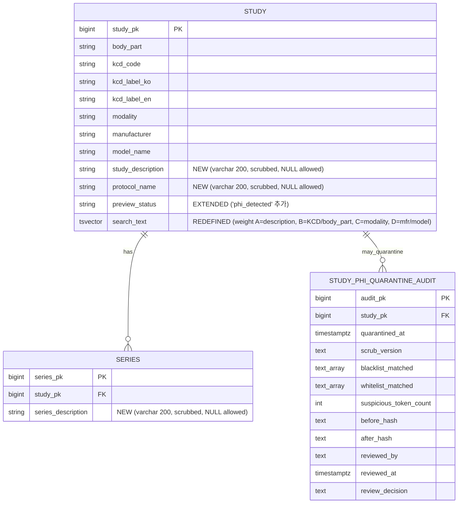
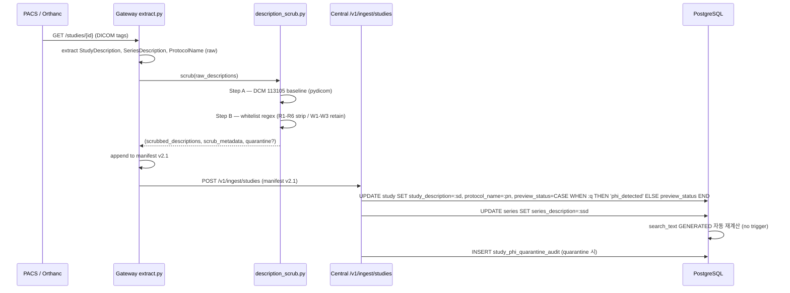
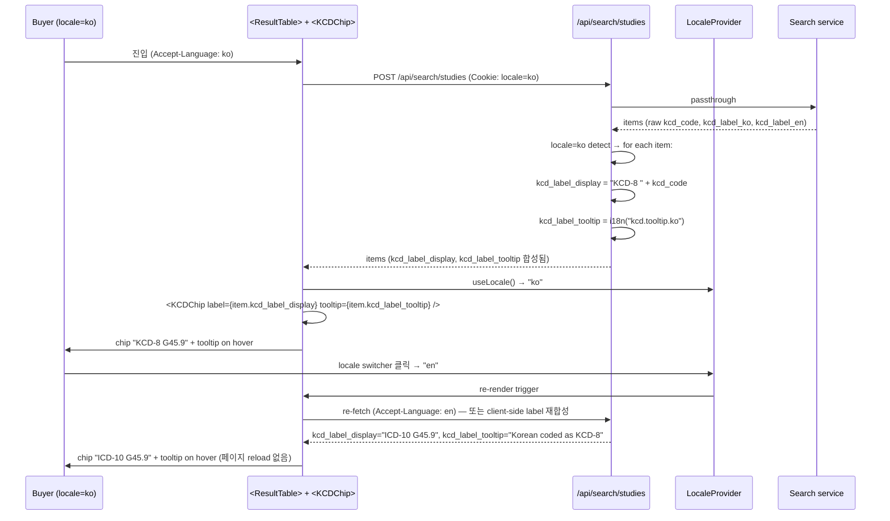
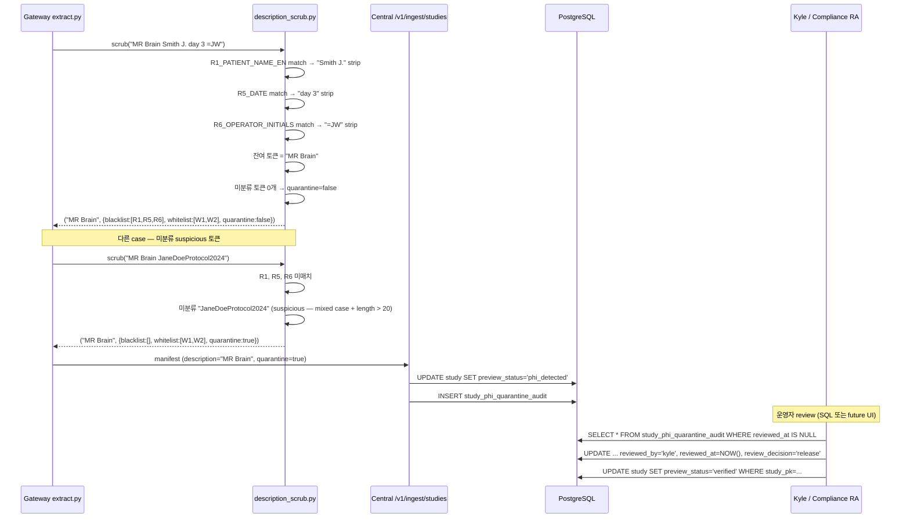
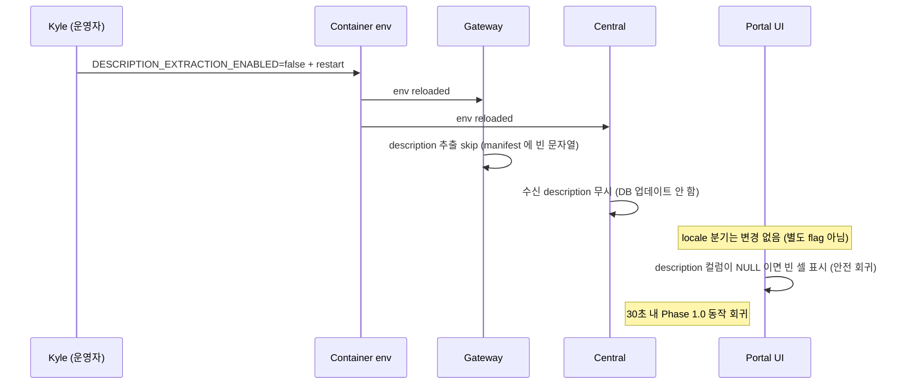

# 개발지시서 — Text Search Phase 1.5 (Description Extraction + Locale-Aware ICD-10/KCD-8 Labelling)

> **Status**: Draft v0.1 · **Feature slug**: `text-search-description-phase15` · **Last updated**: 2026-04-26
> **작성자**: @planner (Claude Opus 4.7 [1M])
>
> **본 문서가 갱신/보완**:
> - `dev-spec-text-search-description.md` (Phase 1.0, ship 완료) — `study.search_text` tsvector 정의 확장 (`study_description` / `protocol_name` / `series_description_concat` 추가, weight 재배치). additive 변경, 기존 동작 회귀 없음.
> - `dev-spec-buyer-search-v3.md` — `StudyItem` 응답에 `study_description`, `protocol_name`, `series_descriptions[]` 필드 추가 + `kcd_label_display` (locale-resolved label) 노출. 기존 `kcd_label_ko` / `kcd_label_en` 은 호환 유지.
> - `dev-spec-portal-redesign.md` — `<ResultTable>` 셀에 description 표시 영역 추가 + KCD chip 라벨이 `LocaleProvider` 의 locale 에 따라 분기. `LocaleProvider` 자체는 v3 에서 이미 존재 (재사용).
> - `docs/ARCHITECTURE.md` §3.2 (De-ID Engine) — Gateway extract.py 가 description 3 필드를 새로 추출함을 명시. DCM 113105 (Clean Descriptors Option) 적용 시점/위치 추가. **별도 PR**.
> - `docs/ARCHITECTURE.md` §4.1 (Metadata Index DB) — search_text tsvector 의 weight 재배치 (A=description, B=KCD/body_part, C=modality) 명시. **별도 PR**.
> - `docs/prd.md` §4.2 — "자유 텍스트 검색" 의 cover 범위가 description 으로 확장됨을 명시 + ICD-10/KCD-8 locale 정책 명시. **별도 PR**.
>
> **근거**:
> - 선행 spec: [`dev-spec-text-search-description.md`](./dev-spec-text-search-description.md) (Phase 1.0, ship 완료, 700 라인). FR-TS-1 ~ FR-TS-14, AC-TS-* 50+, PHI scrub 7 패턴.
> - 리서치: [`docs/research/text-search-postgres-fts-research.md`](../research/text-search-postgres-fts-research.md) — Q1 (PHI 위험 매트릭스 8 패턴 A~H), §1.2 (DCM 113xxx 코드표), §1.4 (113105 한계 — default empty + whitelist restore 2단), §1.5 (CTP/RSNA 정규식), §4.1 (250 backfill 패턴), §4.2 (Gateway extract.py manifest schema bump).
> - PRD: [`prd.md`](../prd.md) §4.2 (코호트 검색), §4.3 (구매자 포털).
> - ARCHITECTURE: [`ARCHITECTURE.md`](../ARCHITECTURE.md) §3.2 (De-ID Engine), §4.1 (Metadata Index DB).
>
> **Kyle 결정 (이미 내려진, 2026-04-26)**:
> 1. **Phase 1.5 + Locale 묶음 처리** — description 추출 (A) 과 ICD-10/KCD-8 locale 라벨링 (B) 동시 ship. 별도 phase 분리 안 함.
> 2. **Locale 정책 = 옵션 B** — locale=en buyer: "ICD-10 I20.9" prominent + "KCD-8" footnote / locale=ko buyer: "KCD-8 I20.9" prominent + "Korean adaptation of ICD-10" footnote. 옵션 A (단순 — 단일 라벨), C (트리플 동시 노출), D (KCD 완전 숨김) 모두 비채택.
> 3. **코드 자체는 동일** — KCD-8 는 ICD-10 의 95% 동일. I20.9, G45.9 같은 코드 string 그대로. 라벨 prominence 만 locale 별 분기. **새 DB 컬럼 추가 불필요** (기존 `kcd_code`, `kcd_label_ko`, `kcd_label_en` 그대로 활용).
> 4. **SNOMED CT / RadLex 매핑은 Phase 2 deferred** — 별도 mapping table 필요. 본 dev-spec 영역 외.
> 5. **타임라인** — D-13+30 ship (≈2026-06-07). 현재 D-13 까지 11일 남음, Phase 1.5 ship = 5월 말 ~ 6월 초.
> 6. **D-13 데모 일정 영향 금지** — 본 phase 는 Phase 1.0 ship (D-13+15) 이후에 stack. D-13 데모 자체에 영향 0.

---

## 1. 기능 개요

### 1.1 한 줄 요약

RadiVault buyer portal 자유 텍스트 검색 Phase 1.5 — (A) Gateway extract.py 가 DICOM `StudyDescription` / `SeriesDescription` / `ProtocolName` 3 필드를 추출 (DCM 113105 Clean Descriptors Option + 추가 영문/한글 PHI 정규식 whitelist 적용) 후 central `study` / `series` 테이블에 저장, search_text tsvector 의 weight A 로 재배치한다. (B) 동시에 ICD-10/KCD-8 라벨이 buyer locale (en/ko) 에 따라 prominent 라벨 + provenance footnote 가 분기되도록 BFF/UI 에서 처리한다.

### 1.2 배경 — Phase 1.0 ship 후 user feedback

- **Phase 1.0 (ship 완료)**: safe 필드만 (body_part / kcd_label_ko / kcd_label_en / modality / manufacturer / model_name) 으로 tsvector 구축. PHI 위험을 회피하기 위해 description 3 필드 추출 보류.
- **Kyle 검증**: "MR Brain" 검색바, prefix matching (`brian` → `brain`), 하이라이트 (`<mark>`) 모두 동작. **개선 요청**:
  - "knee scanogram" 같은 free text protocol 명을 검색해도 매치되지 않음 (description 미인덱싱).
  - "STUDY DESCRIPTION" 컬럼이 result table 에 비어있어 buyer 가 protocol identification 어려움.
  - 한국 buyer 데모 시 "KCD-8" 라벨이 글로벌 buyer 에게 친숙하지 않은 것 vs 영어 데모 시 "ICD-10" 라벨이 한국 customer 에게 어색한 것 — locale 분기 필요.
- **Phase 1.5 결론**: description 3 필드 추출을 안전하게 풀고 (DCM 113105 + whitelist 정규식), search recall 을 끌어올리고, locale-aware KCD chip 으로 양 시장 모두 자연스럽게 표시.

### 1.3 Phase 정의 (본 dev-spec 의 위치)

| Phase | 일정 | 범위 | 본 dev-spec |
|-------|------|------|-------------|
| Phase 1.0 | D-13+15 (≈2026-05-23), ship 완료 | 검색바 UI + safe-field tsvector + autocomplete + search_audit PHI scrub | 별도 ([`dev-spec-text-search-description.md`](./dev-spec-text-search-description.md)) |
| **Phase 1.5** | **D-13+30 (≈2026-06-07), 2주** | **description 추출 (113105 + whitelist regex) + locale-aware KCD/ICD-10 label 분기** | **본 dev-spec** |
| Phase 2 | D-13+90 (≈2026-08-06) | 한국어 형태소 분석기 (mecab-ko/nori) + whitelist 정교화 + popular_queries materialized view + SNOMED CT/RadLex 매핑 table | 별도 dev-spec |
| Phase 3 | trigger-driven (30만 study 또는 p95 > 500ms) | Elasticsearch / OpenSearch 전환 | 별도 dev-spec |

### 1.4 D-13+30 ship 가능성

- 250 study scale 에서 description 추출 backfill < 5분, GIN 인덱스 reindex < 30초.
- locale 분기는 BFF/UI 단의 i18n 키 추가 + 컴포넌트 분기 (10-15 키, 1-2 컴포넌트 변경).
- critical path: §11 단계적 배포 표 참조. PHI 정규식 whitelist 합의 (W1 첫 2일) 가 critical path.

---

## 2. 사용자 스토리

- **As a** buyer (글로벌 AI 회사 데이터 엔지니어, locale=en), **I want** 검색바에 `"knee scanogram"` 입력 시 protocol_name 에 "Knee Scanogram" 이 들어있는 study 가 매치되길 원한다, **so that** safe 필드 (body_part=KNEE, modality=CR) 만으로는 못 잡던 protocol-specific 검색이 가능해진다.
- **As a** buyer (locale=en), **I want** 검색 결과 KCD chip 이 `"ICD-10 G45.9"` 로 표시되고 hover 시 `"Korean coded as KCD-8"` 툴팁이 뜨길 원한다, **so that** 글로벌 표준 코드로 즉시 인식하면서도 한국 데이터 출처를 알 수 있다.
- **As a** buyer (한국 AI 회사 데이터 엔지니어, locale=ko), **I want** 검색 결과 KCD chip 이 `"KCD-8 G45.9"` 로 표시되고 hover 시 `"WHO ICD-10 호환 (95% 동일)"` 툴팁이 뜨길 원한다, **so that** 한국 의료 코드 친숙도를 유지하면서도 글로벌 호환성을 알 수 있다.
- **As a** buyer, **I want** Study Detail 페이지에서 study_description / protocol_name / series_descriptions 가 metadata grid 의 한 행으로 표시되길 원한다, **so that** preview 다운로드 전에 protocol identification 이 가능하다.
- **As a** Compliance/RA, **I want** description 추출이 DCM 113105 (Clean Descriptors Option) 와 whitelist 정규식 양쪽을 통과한 토큰만 저장하고, 미통과 description 은 study 가 `preview_status='phi_detected'` 로 격리되며 audit log 에 기록되길 원한다, **so that** 250 sample 수동 검증으로 PHI false-negative < 1% 보증할 수 있다.
- **As a** Kyle (운영자), **I want** description 추출이 `DESCRIPTION_EXTRACTION_ENABLED=false` 환경변수로 즉시 회귀 가능하길 원한다 (locale 분기는 그와 별개로 항상 ON), **so that** description 측 사고 발생 시 Phase 1.0 동작으로 즉시 되돌릴 수 있고, 동시에 locale UX 개선은 유지된다.

---

## 3. 범위

### 3.1 포함 (In-scope)

**A. Description 추출**
- Gateway `extract.py` 가 DICOM `StudyDescription (0008,1030)` / `SeriesDescription (0008,103E)` / `ProtocolName (0018,1030)` 3 필드 추출.
- DCM 113105 Annex E §E.3.5 Clean Descriptors Option 적용 (DICOM 표준 위임 — pydicom 또는 자체 구현).
- 추가 PHI 정규식 whitelist (영문 환자명, 한글 이름, 의사명 prefix, 기관 식별자, operator initials, 날짜, ID).
- 길이 200자 cap (over → truncate + 로그).
- Gateway → central manifest schema v2.1 (additive — 3 필드 추가).
- Central `/v1/ingest/studies` 가 description 받아서 `study.study_description`, `study.protocol_name`, `series.series_description` 에 저장.
- `study.search_text` tsvector 재정의 — weight A=study_description/protocol_name, B=body_part/KCD label, C=series_description/modality, D=manufacturer/model_name.
- 신규 GIN 인덱스 reindex (`CREATE INDEX CONCURRENTLY` 사용).
- 250 demo study backfill 스크립트 (`scripts/demo_seed/backfill_description_phase15.py`).
- 격리된 description 은 `study.preview_status='phi_detected'` + audit log.

**B. Locale-aware ICD-10/KCD-8 라벨링**
- BFF 가 `Accept-Language` 또는 `LocaleProvider` 의 locale 을 KCD chip render 시 활용.
- `StudyItem.kcd_label_display: str` 응답 필드 추가 (BFF 에서 locale 에 따라 resolved). 기존 `kcd_label_ko` / `kcd_label_en` 은 호환 유지 (raw 필드).
- locale=en: chip 라벨 `"ICD-10 {code}"` + tooltip `"Korean coded as KCD-8"`.
- locale=ko: chip 라벨 `"KCD-8 {code}"` + tooltip `"WHO ICD-10 호환 (95% 동일)"`.
- 검색 query 동작은 locale 무관 동일 (`I20.9`, `G45` 검색 모두 양 locale 같은 결과).
- 검색바 placeholder 도 locale 반영 (en: `"... 'I20.9' or 'angina'"` / ko: `"... 'I20.9' 또는 '협심증'"`).
- i18n 키 추가 (10-15 키 — chip label, tooltip, placeholder, footer note).

**C. 공통**
- Feature flag `DESCRIPTION_EXTRACTION_ENABLED` (description 만 toggle. locale 변경은 무조건 ship).
- PHI false-negative 측정 — 250 sample 수동 audit + 자동 sanity check (`scripts/audit/scan_description_phi.py`).
- search_audit query PHI scrub 은 Phase 1.0 의 7 패턴 그대로 (변경 없음).
- highlight UX 변경 없음 — Phase 1.0 의 prefix highlight 가 description 필드에도 자동 적용 (ts_headline 의 SELECT 컬럼만 확장).

### 3.2 제외 (Out-of-scope) — 명확히 하지 않을 것 (8개+)

1. **한국어 형태소 분석기** (mecab-ko / nori / unaccent 한국어 stemmer) — Phase 2 영역. 본 phase 는 `english` analyzer 단일 유지. 한국어 description 토큰은 raw lexeme 으로 그대로 통과 (검색 시 정확 일치만 가능).
2. **SNOMED CT 매핑** — 별도 mapping table (`kcd_to_snomed`) 필요. Phase 2 영역.
3. **RadLex 매핑** — 별도 mapping table 필요. Phase 2 영역.
4. **KCD-8 의 한국 확장 5% 별도 라벨링** — 영상의학 빈도 거의 0. Phase 2 검토.
5. **popular_queries materialized view + 인기순 ranking** — Phase 2 영역.
6. **description 의 NLP 기반 진단명 추출** (`dev-spec-kcd-nlp-mapping.md` 영역) — 본 phase 는 description 텍스트 raw 인덱싱만.
7. **description history / 변경 추적** — 본 phase 는 latest 만. Phase 2+ 백로그.
8. **description-based facet 자동 생성** (예: protocol family 자동 grouping) — Phase 2+ 백로그.
9. **WHO ICD-11 전환** — KCD-8 의 ICD-10 base 가 변경되지 않는 한 deferred.
10. **buyer tier 별 description 노출 차등** (예: preview tier 는 description hidden) — Phase 2 검토.
11. **search_audit PHI scrub 정규식 추가/변경** — Phase 1.0 의 7 패턴 그대로 사용 (KOREAN_NAME, ENGLISH_NAME, RRN, MRN, PHONE, EMAIL, LONG_DIGIT). 본 phase 는 description 필드 측 PHI 만 다룸.

---

## 4. 기능 요구사항

번호 표기: `FR-TS15-<n>`. 모든 FR 은 리서치 / Kyle 결정 / Phase 1.0 dev-spec 줄 번호 근거. AC 는 §10 에서 1:1 매핑.

### 4.A Description 추출 (FR-TS15-1 ~ FR-TS15-10)

#### FR-TS15-1 — Gateway extract.py 가 description 3 필드 추출

- **모듈**: `src/radivault_gateway/dicom/extract.py` (Phase 1.0 까지는 description 필드 미추출).
- **추출 대상 DICOM 태그**:
  - `(0008,1030)` StudyDescription (VR=LO, max 64 chars).
  - `(0008,103E)` SeriesDescription (VR=LO, max 64 chars).
  - `(0018,1030)` ProtocolName (VR=LO, max 64 chars).
- **호출 위치**: study 전체 가져온 직후, scrub 적용 전. raw 값은 메모리 안에서만 잠시 보유 후 즉시 scrub → manifest 첨부.
- **다중 series**: SeriesDescription 은 series 단위. 본 phase 는 study.series 배열 각각에 추출 + 별도 저장 (FR-TS15-6 참조).
- **누락 시**: 태그 부재 → 빈 문자열 (`""`). manifest 에 `null` 이 아닌 `""` 으로 직렬화 (downstream NULL coalesce 단순화).
- **근거**: 리서치 §1.1 (description 자유 텍스트 성격), §4.2 (Gateway extract.py 변경 안내).

#### FR-TS15-2 — DCM 113105 Annex E §E.3.5 Clean Descriptors Option 적용

- **표준**: DICOM PS3.15 Annex E §E.3.5 — "All instances of Person Names, Patient ID, ... that may be embedded in free-text description fields shall be removed."
- **구현 위치**: Gateway extract.py 의 scrub stage (RSNA Anonymizer / pydicom dataset filter 또는 자체 정규식 모듈).
- **정책**: **default-strip + whitelist-restore 2단** (리서치 §1.4 권장).
  1. **Step A — DCM 113105 baseline strip**: pydicom 또는 RSNA anonymizer 가 표준에 따라 description 필드 처리. 표준 자체가 "어떻게 식별" 을 위임하므로 baseline 만으로는 충분치 않음 → Step B 필수.
  2. **Step B — whitelist-restore**: FR-TS15-3 의 정규식 whitelist 통과한 토큰만 복원.
- **결과**: scrub 후 description 은 (a) 빈 문자열 (모든 토큰 미통과), (b) 부분 텍스트 (일부 통과), (c) 원본 (모든 토큰 통과) 셋 중 하나.
- **로깅**: scrub 전후 비교 hash (SHA256) 를 audit log 에 기록 (PHI 자체 미보존, 차이 발생 여부만).
- **근거**: 리서치 §1.2 (DCM 113105 정정), §1.4 (default empty + whitelist 2단).

#### FR-TS15-3 — 추가 PHI 정규식 Whitelist (영문 환자명, 한글 이름, 의사명, 기관 식별자, operator initials)

- **모듈**: `src/radivault_gateway/dicom/description_scrub.py` (신규).
- **블랙리스트 정규식 7 카테고리** (리서치 §1.3 R1-R6 + §1.5 패턴 기반):

| 카테고리 코드 | 정규식 | 매치 예시 | 처리 |
|---|---|---|---|
| `R1_PATIENT_NAME_EN` | `\b[A-Z][a-z]+(?:\s+[A-Z]\.?){1,3}\b` | `Smith J`, `Doe J. M.` | 토큰 제거 |
| `R1_PATIENT_NAME_KO` | `[가-힣]{2,4}(?=[\s,]|$)` | `김민수`, `홍길동` | 토큰 제거 (단, kcd_label_ko 사전 매치 토큰은 보존 — Phase 2 정교화 영역, 본 phase 는 over-redaction 허용) |
| `R2_PHYSICIAN_PREFIX` | `\b(Dr\.?\|by\|MD\|PhD)\s+[A-Za-z]{2,}\b` | `Dr Lee`, `by jhc`, `MD Smith` | 토큰 제거 |
| `R3_INSTITUTION` | `\b(YONSEI\|MGH\|HOSP\|세브란스\|아산\|삼성서울)\b` (사전 매치) | `YONSEI 7T`, `세브란스 5T` | 토큰 제거 + 기관명 사전은 별도 YAML (`config/institution_blacklist.yaml`) |
| `R4_PATIENT_ID` | `\b(MRN\|PT\|ID)[\s:]?\d{4,}\b` 또는 `\b\d{7,}\b` | `MRN 12345`, `1234567` | 토큰 제거 |
| `R5_DATE` | `\b\d{8}\b` 또는 `\b\d{4}[-/]\d{1,2}[-/]\d{1,2}\b` 또는 `\bday[\s-]?\d+\b` 또는 `\b\d+\s?(y\|yr\|yrs)\b` | `20240115`, `2024-01-15`, `day 3`, `5y` | 토큰 제거 |
| `R6_OPERATOR_INITIALS` | `[=_/]\s?[A-Z]{2,4}\b` | `=AB`, `_jw`, `/RT` | 토큰 제거 |

- **whitelist 정규식 (보존 패턴)**:
  - **W1_MEDICAL_TERM**: `\b(MR\|MRI\|CT\|US\|XR\|PT\|MG\|PET\|DX\|CR\|NM)\b` — modality 약어.
  - **W2_ANATOMY_EN**: `\b(BRAIN\|CHEST\|ABDOMEN\|HEAD\|NECK\|SPINE\|KNEE\|HIP\|SHOULDER\|PELVIS\|HEART\|LUNG\|LIVER\|KIDNEY\|BREAST\|THORAX\|LUMBAR\|CERVICAL\|THORACIC)\b` — 영문 anatomy. (확장 사전 별도 YAML — `config/anatomy_whitelist.yaml`)
  - **W3_PROTOCOL_KEYWORD**: `\b(SCANOGRAM\|SCOUT\|LOCALIZER\|T1\|T2\|FLAIR\|DWI\|ADC\|CONTRAST\|NONCON\|WO\|WC\|PRE\|POST\|AXIAL\|SAGITTAL\|CORONAL\|3D\|4D)\b` — protocol 키워드.
- **결합 로직**:
  ```
  for token in description.split():
      if matches_any(token, blacklist_R1_R6):
          continue  # 토큰 제거
      elif matches_any(token, whitelist_W1_W3):
          retain(token)
      else:
          # 미분류 토큰 — 안전 정책: 보존 (medical 영어 free text 가능성)
          # 단, length > 20 자 또는 mixed-case proper noun 이면 격리 트리거 (FR-TS15-10)
          if suspicious(token):
              quarantine = True
          else:
              retain(token)
  ```
- **격리 트리거**: 미분류 토큰 중 1개 이상이 `suspicious()` 통과 시 → 해당 study 를 `preview_status='phi_detected'` 로 격리 (FR-TS15-10).
- **사전 YAML**: `config/institution_blacklist.yaml`, `config/anatomy_whitelist.yaml`, `config/protocol_keyword_whitelist.yaml`. 운영 중 확장 가능 (코드 변경 없이 hot-reload).
- **근거**: 리서치 §1.3 (R1-R6 위험 카테고리), §1.5 (CTP/RSNA 정규식 세트).

#### FR-TS15-4 — 길이 200자 Cap

- **정책**: scrub 후 description 이 200자 초과 시 → 200자 truncate + 로그 (`description_truncated_count` metric).
- **이유**: DICOM 표준 LO=64 chars 이지만, 일부 PACS 가 표준 위반 입력 허용 → 방어적 cap.
- **저장 컬럼**: `varchar(200)` (FR-TS15-5 참조).

#### FR-TS15-5 — Manifest Schema v2.1 (Additive)

- **현재**: manifest schema v2.0 (Phase 1.0 ship 시점).
- **신규 필드** (additive, backward compatible):
  ```jsonc
  {
    "study_pk_temp": "...",
    // ... 기존 필드 ...
    "study_description": "Knee Scanogram",      // NEW (scrubbed, max 200 chars, "" if missing/all-stripped)
    "protocol_name": "AX T1 FLAIR",              // NEW (scrubbed, max 200 chars)
    "series_descriptions": [                     // NEW (array, per-series, scrubbed)
      "AX T1 FLAIR",
      "SAG T2",
      "COR FLAIR"
    ],
    "description_scrub_metadata": {              // NEW (audit only, no PHI)
      "scrub_version": "1.5.0",
      "blacklist_matched": ["R5_DATE", "R6_OPERATOR_INITIALS"],
      "whitelist_matched": ["W1_MEDICAL_TERM", "W2_ANATOMY_EN"],
      "quarantine": false,
      "truncated": false,
      "before_hash": "sha256:abc...",            // raw description SHA256 (PHI 자체 미보존)
      "after_hash": "sha256:def..."              // scrubbed description SHA256
    }
  }
  ```
- **schema version bump**: `v2.0` → `v2.1`. central 의 `IngestRequest` Pydantic 모델은 신규 필드 모두 `Optional` (None 허용 — Gateway 가 구버전인 경우).
- **근거**: 리서치 §4.2 (manifest schema bump 패턴).

#### FR-TS15-6 — Central /v1/ingest/studies 가 Description 받아 저장

- **central endpoint**: 기존 `POST /v1/ingest/studies` (변경 없이 신규 필드만 수용).
- **DB 저장**:
  - `study.study_description varchar(200) NULL`
  - `study.protocol_name varchar(200) NULL`
  - `series.series_description varchar(200) NULL` (series 단위)
- **NULL semantics**:
  - 필드 미수신 (구버전 Gateway) → NULL.
  - 필드 수신 + 빈 문자열 (모든 토큰 stripped) → 빈 문자열 `""` 저장 (NULL 아님 — "추출 시도했으나 모두 stripped" 와 "추출 미수행" 구분).
- **격리 처리**: `description_scrub_metadata.quarantine == true` 면 `study.preview_status = 'phi_detected'` 로 마킹 + audit log (FR-TS15-10).
- **idempotency**: 동일 study_pk 재수신 시 description 만 UPDATE (기존 dev-spec-buyer-search-v3 의 ingest UPSERT 패턴 답습).
- **검증 SQL**:
  ```sql
  SELECT study_pk, study_description, protocol_name FROM study WHERE preview_status = 'phi_detected';
  ```

#### FR-TS15-7 — search_text tsvector 재정의 (Weight 재배치)

- **DB 변경** (alembic migration `0009_text_search_description_phase15`):
  ```sql
  -- 1. 신규 컬럼 추가 (구 search_text 컬럼 DROP 전에 미리)
  ALTER TABLE study ADD COLUMN study_description varchar(200) NULL;
  ALTER TABLE study ADD COLUMN protocol_name varchar(200) NULL;
  ALTER TABLE series ADD COLUMN series_description varchar(200) NULL;

  -- 2. 구 search_text DROP (Phase 1.0 정의)
  DROP INDEX IF EXISTS idx_study_search_text;
  ALTER TABLE study DROP COLUMN search_text;

  -- 3. 신 search_text — 재정의 (weight A 에 description 추가)
  ALTER TABLE study ADD COLUMN search_text tsvector
    GENERATED ALWAYS AS (
      setweight(to_tsvector('english', coalesce(study_description, '')), 'A') ||
      setweight(to_tsvector('english', coalesce(protocol_name, '')), 'A') ||
      setweight(to_tsvector('english', coalesce(body_part, '')), 'B') ||
      setweight(to_tsvector('english', coalesce(kcd_label_en, '')), 'B') ||
      setweight(to_tsvector('english', coalesce(kcd_label_ko, '')), 'C') ||
      setweight(to_tsvector('english', coalesce(modality, '')), 'C') ||
      setweight(to_tsvector('english', coalesce(manufacturer, '')), 'D') ||
      setweight(to_tsvector('english', coalesce(model_name, '')), 'D')
    ) STORED;

  -- 4. GIN 인덱스 재빌드 (CONCURRENTLY)
  CREATE INDEX CONCURRENTLY idx_study_search_text ON study USING GIN(search_text);

  -- 5. trigram GIN 도 description 토큰 포함하도록 재정의
  DROP INDEX IF EXISTS idx_study_search_trgm;
  CREATE INDEX CONCURRENTLY idx_study_search_trgm ON study USING GIN(
    (coalesce(study_description,'') || ' ' ||
     coalesce(protocol_name,'') || ' ' ||
     coalesce(body_part,'') || ' ' ||
     coalesce(kcd_label_en,'') || ' ' ||
     coalesce(kcd_label_ko,'')) gin_trgm_ops
  );
  ```
- **weight 재배치 이유**:
  | 필드 | Phase 1.0 weight | Phase 1.5 weight | 사유 |
  |---|---|---|---|
  | study_description | (인덱싱 안 함) | A | study-level 메인 메타, buyer 검색 의도 직접 매치 빈도 매우 높음 |
  | protocol_name | (인덱싱 안 함) | A | protocol-specific 검색 (`AX T1`, `scanogram`) 의 직접 매치 |
  | body_part | A | B | description 보다는 보조 |
  | kcd_label_en | B | B | 동일 |
  | kcd_label_ko | B | C | 한국어 stemmer 미지원 (Phase 2 까지) — 정확 매치만 가능하므로 weight 낮춤 |
  | modality | C | C | 동일 |
  | manufacturer | D | D | 동일 |
  | model_name | D | D | 동일 |
- **series_description 인덱싱 위치**:
  - 본 phase 는 `series.series_description` 을 study 단위로 concat 하지 않음 (대신 series 단위 인덱싱 deferred Phase 2). 이유: study 1개에 series 10+ 인 케이스에서 noise 증가.
  - **단**, study detail 페이지에서는 series_description 표시 (FR-TS15-25 / 디자인 영역).
- **근거**: 리서치 §2.4 (GENERATED ALWAYS 권장), §2.5 (weight 전략).

#### FR-TS15-8 — 신규 GIN 인덱스 Reindex (CONCURRENTLY)

- **방법**: `CREATE INDEX CONCURRENTLY` (FR-TS15-7 참조). 쓰기 차단 회피 — production 운영 중에도 안전.
- **빌드 시간 추정** (리서치 §4.4):
  | scale | 빌드 시간 |
  |---|---|
  | 250 | < 30초 |
  | 5만 | ~30초 |
  | 100k | ~8 시간 (description 토큰 추가로 인덱스 entry 증가) |
  | 30만 | ~3-4 시간 (maintenance_work_mem 256MB+ 시) |
- **maintenance_work_mem**: production 마이그레이션 시 256MB+ 권장 (리서치 §4.4 — CYBERTEC).
- **alembic op**: `op.execute("CREATE INDEX CONCURRENTLY ...")` (transaction 외부 — `op.with_variant` 또는 `op.run_async` 패턴).

#### FR-TS15-9 — 250 Demo Study Backfill 스크립트

- **모듈**: `scripts/demo_seed/backfill_description_phase15.py` (신규).
- **패턴**: 기존 `scripts/demo_seed/backfill_v2_metadata.py` 답습 (dev-spec-buyer-search-v3 에서 검증된 패턴).
- **동작 시퀀스**:
  1. Orthanc REST `GET /studies/{id}` → DICOM tags JSON (StudyDescription, SeriesDescription, ProtocolName 추출).
  2. Gateway 의 `description_scrub.py` 모듈 import 또는 동등 로직 inline.
  3. 250 study 각각에 scrub 적용 → manifest schema v2.1 형식으로 직렬화.
  4. central `/v1/ingest/studies` 또는 직접 DB UPDATE (개발용 단축):
     ```sql
     UPDATE study SET
       study_description = :sd,
       protocol_name = :pn,
       preview_status = CASE WHEN :quarantine THEN 'phi_detected' ELSE preview_status END
     WHERE study_pk = :pk;

     UPDATE series SET series_description = :ssd WHERE series_pk = :spk;
     ```
  5. dry-run 옵션 (`--dry-run`) — DB UPDATE 없이 scrub 결과만 stdout 출력.
  6. 멱등성 — 재실행 시 동일 결과 (UPSERT 패턴).
- **CLI**:
  ```
  python scripts/demo_seed/backfill_description_phase15.py [--dry-run] [--limit N] [--report-csv path]
  ```
- **출력**: 250 study scrub 결과 CSV (study_pk, scrub_version, blacklist_matched, whitelist_matched, quarantine, truncated, before/after lengths). PHI 자체는 미저장 (hash 만).
- **소요 시간 추정**: 250 study 직렬 처리 시 < 5분.

#### FR-TS15-10 — 격리 처리 + Audit Log

- **트리거**: FR-TS15-3 의 `suspicious()` 함수 또는 운영자 수동 flag.
- **DB 처리**: `study.preview_status = 'phi_detected'` (기존 enum 에 추가 필요 시 alembic migration 에 enum 확장).
- **Audit log 컬럼** (기존 audit table 또는 신규):
  ```sql
  -- audit log 별도 테이블 (이미 존재 가정, 없으면 신규)
  CREATE TABLE IF NOT EXISTS study_phi_quarantine_audit (
    audit_pk bigserial PRIMARY KEY,
    study_pk bigint NOT NULL REFERENCES study(study_pk),
    quarantined_at timestamptz NOT NULL DEFAULT NOW(),
    scrub_version text NOT NULL,
    blacklist_matched text[] NOT NULL,
    suspicious_token_count int NOT NULL,
    before_hash text NOT NULL,
    after_hash text NOT NULL,
    reviewed_by text NULL,
    reviewed_at timestamptz NULL,
    review_decision text NULL CHECK (review_decision IN (NULL, 'release', 'redact', 'delete'))
  );
  ```
- **운영자 review flow**: Kyle 또는 Compliance/RA 가 격리된 study 를 spot-check → release / redact / delete 결정. UI 영역은 Phase 2 (Phase 1.5 는 SQL 직접 review).
- **검색 결과 노출**: `preview_status='phi_detected'` 인 study 는 buyer search 결과에서 제외 (기존 dev-spec-buyer-search-v3 의 preview_status 필터 답습).

### 4.B Locale-aware ICD-10/KCD-8 라벨링 (FR-TS15-11 ~ FR-TS15-15)

#### FR-TS15-11 — KCD Label 표시 정책 (locale 별 분기)

- **정책**:
  | Locale | Chip 라벨 (prominent) | Tooltip / Footnote (provenance) |
  |---|---|---|
  | `en` | `"ICD-10 {code}"` (e.g. `"ICD-10 G45.9"`) | `"Korean coded as KCD-8 (95% identical to WHO ICD-10)"` |
  | `ko` | `"KCD-8 {code}"` (e.g. `"KCD-8 G45.9"`) | `"WHO ICD-10 호환 (95% 동일)"` |
- **default locale**: `Accept-Language` 헤더 부재 또는 미지원 locale → `en` (글로벌 buyer 가 다수 가정).
- **locale resolution 위치**: BFF 의 response transformer. 서버 search 서비스는 raw 필드 (`kcd_code`, `kcd_label_ko`, `kcd_label_en`) 만 반환, BFF 가 `kcd_label_display` 합성.
- **이유**: search 서비스는 locale-agnostic (cache 친화). locale 분기는 BFF/UI 단에서 처리 (Phase 2 의 locale 추가 시 search 서비스 변경 불필요).
- **근거**: Kyle 결정 옵션 B (입력 컨텍스트).

#### FR-TS15-12 — Tooltip / Footer Note

- **위치**:
  - **Tooltip**: KCD chip hover 시 (≥1024px 데스크톱) 또는 long-press (모바일).
  - **Footer note**: study detail 페이지 metadata grid 의 KCD 행 하단에 항상 노출 (small caption).
- **i18n 키**:
  | 키 | en | ko |
  |---|---|---|
  | `kcd.tooltip.en` | `"Korean coded as KCD-8 (95% identical to WHO ICD-10)"` | (en locale 시 사용) |
  | `kcd.tooltip.ko` | (ko locale 시 사용) | `"WHO ICD-10 호환 (95% 동일)"` |
  | `kcd.footer.note.en` | `"Provenance: Korean Standard Classification of Diseases v8 (KCD-8)"` | — |
  | `kcd.footer.note.ko` | — | `"출처: 한국표준질병사인분류 8차 (KCD-8)"` |
- **digital design**: design-spec-text-search-description-phase15 위임.

#### FR-TS15-13 — 검색 Query 동작 변화 없음

- **명세**: locale 무관 동일 결과.
  - `q="I20.9"` → en/ko 양쪽 동일 row set.
  - `q="G45"` → en/ko 양쪽 동일 row set (prefix matching, Phase 1.0 동작 유지).
- **이유**: 검색 인덱스는 raw kcd_code + kcd_label_en + kcd_label_ko 모두 포함 (FR-TS15-7 의 search_text). locale 은 표시 단계에서만 적용.
- **검증**: AC-TS15-9 — 동일 q 로 locale 만 변경 후 row 순서/개수/내용 모두 byte-identical.

#### FR-TS15-14 — i18n 키 추가 (10-15 키)

- **신규 키 목록** (portal 의 `web/portal/src/i18n/{en,ko}.json`):
  | 키 | en | ko |
  |---|---|---|
  | `kcd.chip.label_prefix` | `"ICD-10"` | `"KCD-8"` |
  | `kcd.tooltip` | `"Korean coded as KCD-8 (95% identical to WHO ICD-10)"` | `"WHO ICD-10 호환 (95% 동일)"` |
  | `kcd.footer.note` | `"Provenance: Korean Standard Classification of Diseases v8"` | `"출처: 한국표준질병사인분류 8차"` |
  | `search.bar.placeholder` | `"Search by body part, modality, KCD code... (e.g. 'MR brain', 'I20.9' or 'angina')"` | `"부위·모달리티·KCD 코드로 검색 (예: 'MR brain', 'I20.9' 또는 '협심증')"` |
  | `search.result.column.description` | `"Study Description"` | `"검사 설명"` |
  | `search.result.column.protocol` | `"Protocol"` | `"프로토콜"` |
  | `study.detail.metadata.description` | `"Study Description"` | `"검사 설명"` |
  | `study.detail.metadata.protocol` | `"Protocol Name"` | `"프로토콜 명"` |
  | `study.detail.metadata.series_descriptions` | `"Series Descriptions"` | `"시리즈 설명"` |
  | `study.detail.metadata.phi_pending` | `"PHI verification pending"` | `"PHI 검증 대기 중"` |
  | `kcd.chip.aria_label` | `"Diagnosis code {code}, ICD-10 standard"` | `"진단 코드 {code}, KCD-8 기준"` |

- **추가 ko 영문 코드 hint**: `(예: 'I20.9' 또는 '협심증')` — 한국 buyer 가 영문 KCD 코드 자체는 그대로 친숙. 한국어 진단명도 검색 가능 (기존 `kcd_label_ko` 인덱싱).

#### FR-TS15-15 — Search Bar Placeholder Locale 반영

- **변경**: Phase 1.0 의 placeholder 를 locale 별로 분기.
- **en**: `"Search by body part, modality, KCD code... (e.g. 'MR brain', 'I20.9' or 'angina')"` — `'angina'` 이 영어 진단명 예시.
- **ko**: `"부위·모달리티·KCD 코드로 검색 (예: 'MR brain', 'I20.9' 또는 '협심증')"` — `'협심증'` 이 한국어 진단명 예시.
- **i18n 키**: `search.bar.placeholder` (FR-TS15-14).
- **변경 위치**: `web/portal/src/components/buyer/SearchBar.tsx` (Phase 1.0 컴포넌트, placeholder prop 만 i18n 키로 교체).

### 4.C 공통 (FR-TS15-16 ~ FR-TS15-19)

#### FR-TS15-16 — Feature Flag `DESCRIPTION_EXTRACTION_ENABLED`

- **환경변수**: `DESCRIPTION_EXTRACTION_ENABLED` (default `true`).
- **scope**:
  - **Gateway**: `false` 시 description 3 필드 추출 skip → manifest 에 빈 문자열로 직렬화.
  - **Central ingest**: `false` 시 수신 description 무시 (DB UPDATE 안 함, 기존 NULL 유지).
  - **Search service**: 변경 없음 — search_text tsvector 가 GENERATED 이므로 자동 동기화. description NULL 이면 weight A 만 비어있음 (search 동작 영향 없음).
  - **Portal UI**: description 표시 영역은 column 자체는 항상 노출, 데이터가 NULL 이면 빈 셀 (또는 `<em>—</em>`).
- **목적**: description 추출 측 사고 발생 시 (PHI false-negative 발견, scrub 모듈 버그 등) 즉시 회귀.
- **locale 분리 정책**: locale 변경 (FR-TS15-11~15) 은 본 flag 와 **무관** — 항상 ON (UX 개선이라 회귀 필요 없음).
- **별도 환경변수**: 본 phase 는 단일 flag. locale 만 끄기는 비대상 (별도 환경변수 추가 시 NEXT_STEP).

#### FR-TS15-17 — PHI False-Negative 측정 (250 Sample 수동 Audit)

- **모듈**: `scripts/audit/scan_description_phi.py` (신규, dev-spec-text-search-description Phase 1.0 의 NEXT_STEP 으로 이미 예정).
- **프로토콜** (리서치 §1.6 답습):
  1. 250 study Orthanc 에서 description 3 필드 추출 (scrub 전 raw).
  2. CSV export (study_pk, raw_study_desc, raw_protocol, raw_series_desc).
  3. Kyle 또는 Compliance/RA 가 spot-check — PHI 의심 행 manual flag.
  4. scrub 적용 후 동일 250 sample 에 위 정규식 dry-run, 남아있는 PHI 후보 행 카운트.
  5. **목표**: false-negative < 1% (250 sample 에서 PHI 잔존 ≤ 2건).
  6. 실패 시: 정규식 강화 + 사전 (institution_blacklist.yaml, anatomy_whitelist.yaml) 갱신 후 재측정.
- **자동 sanity check**: scrub 결과를 정규식으로 재스캔 → false-negative 자동 카운트. CI 통합 (PR 마다 250 sample 자동 검증).
- **문서 산출**: `docs/qa/phi-false-negative-report-phase15.md` (250 sample 결과 + 운영자 review 결과 + 정규식/사전 변경 이력).

#### FR-TS15-18 — search_audit Query PHI Scrub (Phase 1.0 그대로)

- **변경 없음** — Phase 1.0 의 7 패턴 (KOREAN_NAME, ENGLISH_NAME, RRN, MRN, PHONE, EMAIL, LONG_DIGIT) 그대로 사용.
- **이유**: 본 phase 는 description 필드 측 PHI 만 추가 다룸. buyer 검색바 입력 측 PHI 는 Phase 1.0 에서 이미 처리.
- **검증**: AC-TS15-22 — Phase 1.0 의 search_audit AC 가 본 phase 에서도 회귀 없이 통과.

#### FR-TS15-19 — Highlight UX 변경 없음 (Phase 1.0 자동 적용)

- **명세**: Phase 1.0 의 `ts_headline` 기반 highlight 가 description 토큰에도 자동 적용.
- **변경 위치**: `executor.py` 의 `ts_headline` 호출에 description 컬럼 추가:
  ```sql
  ts_headline('english',
    coalesce(study_description, '') || ' ' ||
    coalesce(protocol_name, '') || ' ' ||
    coalesce(body_part, '') || ' ' ||
    coalesce(kcd_label_en, '') || ' ' ||
    coalesce(kcd_label_ko, ''),
    websearch_to_tsquery('english', :q),
    'MaxFragments=1, MaxWords=10, MinWords=3, StartSel=<mark>, StopSel=</mark>'
  )
  ```
- **client 변경 없음** — `<HighlightedText>` 컴포넌트 (Phase 1.0 신규) 가 그대로 동작.

---

## 5. 비기능 요구사항

| 항목 | 코드 | 요구 |
|------|------|------|
| **성능** | NFR-TS15-PERF-1 | Gateway extract.py description 추출 + scrub: 1 study < 50ms (gateway 부담 minimal). |
| **성능** | NFR-TS15-PERF-2 | Central ingest description 저장: 추가 부하 < 5ms/study (3 컬럼 UPDATE). |
| **성능** | NFR-TS15-PERF-3 | Search latency 회귀 없음 — Phase 1.0 의 < 5ms p95 유지 (description 토큰 추가에도). |
| **성능** | NFR-TS15-PERF-4 | 250 study backfill < 5분, 100k study reindex < 8시간 (CONCURRENTLY, maintenance_work_mem 256MB+). |
| **성능** | NFR-TS15-PERF-5 | search latency p95 < 200ms (description 추가해도 Phase 1.0 NFR-TS-PERF-1 유지). |
| **보안 / PHI** | NFR-TS15-SEC-1 | description PHI false-negative < 1% (250 sample 수동 audit 기준, FR-TS15-17). |
| **보안 / PHI** | NFR-TS15-SEC-2 | scrub 전 raw description 은 RadiVault DB 에 절대 미저장. Gateway extract.py 의 scrub 함수 통과 후만 manifest 에 포함 (ARCHITECTURE.md §3.2 De-ID Engine 원칙). |
| **보안 / PHI** | NFR-TS15-SEC-3 | scrub 정규식 모듈 단위 테스트 100% — 7 카테고리 R1-R6 + W1-W3 각 5개 이상 fixture (총 60+ 테스트). |
| **컴플라이언스** | NFR-TS15-COMPLIANCE-1 | DCM 113105 적용 명시 — Gateway extract.py 의 scrub 함수에 DICOM PS3.15 Annex E §E.3.5 reference 코멘트. |
| **컴플라이언스** | NFR-TS15-COMPLIANCE-2 | 격리된 study (`preview_status='phi_detected'`) 는 buyer search 결과에서 제외. AC-TS15-12 검증. |
| **가용성** | NFR-TS15-AVAIL-1 | `DESCRIPTION_EXTRACTION_ENABLED=false` 시 30초 내 Phase 1.0 동작 회귀. |
| **가용성** | NFR-TS15-AVAIL-2 | locale 변경 시 페이지 reload 불필요 (LocaleProvider 의 React state change 만으로 chip/placeholder/tooltip 즉시 갱신). |
| **로깅·감사** | NFR-TS15-AUDIT-1 | description scrub 시 `description_scrub_metadata` (blacklist/whitelist matched, quarantine, before/after hash) 가 manifest 에 포함. central audit log 에 study 단위로 보존. |
| **로깅·감사** | NFR-TS15-AUDIT-2 | 격리 study 는 `study_phi_quarantine_audit` 테이블에 기록 (FR-TS15-10). |
| **국제화** | NFR-TS15-I18N-1 | KCD chip 라벨, tooltip, placeholder, footer note 모두 ko/en 양쪽 제공 (i18n 키 10-15개, FR-TS15-14). |
| **국제화** | NFR-TS15-I18N-2 | 미지원 locale 또는 Accept-Language 부재 시 default `en`. |
| **접근성** | NFR-TS15-A11Y-1 | KCD chip 의 `aria-label` 이 locale 에 따라 분기 (`"Diagnosis code G45.9, ICD-10 standard"` / `"진단 코드 G45.9, KCD-8 기준"`). |
| **접근성** | NFR-TS15-A11Y-2 | Tooltip 키보드 focus 가능 (Tab 으로 chip 도달 → focus 시 tooltip 자동 표시 또는 Enter/Space 토글). |
| **호환성** | NFR-TS15-COMPAT-1 | manifest schema v2.1 backward compatible — 구버전 Gateway 의 v2.0 manifest 도 central 에서 정상 처리 (description 필드 NULL 으로 저장). |
| **호환성** | NFR-TS15-COMPAT-2 | 기존 buyer 클라이언트 (locale 미지정) 가 break 없이 동작. 기존 `kcd_label_ko` / `kcd_label_en` raw 필드 보존. |
| **회귀** | NFR-TS15-REGRESSION-1 | `DESCRIPTION_EXTRACTION_ENABLED=false` + locale=en 시 응답이 Phase 1.0 응답과 byte-identical (kcd_label_display 만 추가 차이). |

---

## 6. 데이터 모델

### 6.1 Alembic Migration `0009_text_search_description_phase15`

```sql
-- 1. 신규 컬럼 추가 (description 3 필드)
ALTER TABLE study ADD COLUMN study_description varchar(200) NULL;
ALTER TABLE study ADD COLUMN protocol_name varchar(200) NULL;
ALTER TABLE series ADD COLUMN series_description varchar(200) NULL;

-- 2. 구 search_text 컬럼 + 인덱스 DROP (Phase 1.0 정의)
DROP INDEX IF EXISTS idx_study_search_text;
ALTER TABLE study DROP COLUMN search_text;

-- 3. 신 search_text — weight 재배치 (A=description/protocol, B=KCD/body_part, C=modality/kcd_ko, D=manufacturer/model)
ALTER TABLE study ADD COLUMN search_text tsvector
  GENERATED ALWAYS AS (
    setweight(to_tsvector('english', coalesce(study_description, '')), 'A') ||
    setweight(to_tsvector('english', coalesce(protocol_name, '')), 'A') ||
    setweight(to_tsvector('english', coalesce(body_part, '')), 'B') ||
    setweight(to_tsvector('english', coalesce(kcd_label_en, '')), 'B') ||
    setweight(to_tsvector('english', coalesce(kcd_label_ko, '')), 'C') ||
    setweight(to_tsvector('english', coalesce(modality, '')), 'C') ||
    setweight(to_tsvector('english', coalesce(manufacturer, '')), 'D') ||
    setweight(to_tsvector('english', coalesce(model_name, '')), 'D')
  ) STORED;

-- 4. GIN 인덱스 재빌드 (CONCURRENTLY)
CREATE INDEX CONCURRENTLY idx_study_search_text ON study USING GIN(search_text);

-- 5. trigram GIN 도 description 토큰 포함하도록 재정의
DROP INDEX IF EXISTS idx_study_search_trgm;
CREATE INDEX CONCURRENTLY idx_study_search_trgm ON study USING GIN(
  (coalesce(study_description,'') || ' ' ||
   coalesce(protocol_name,'') || ' ' ||
   coalesce(body_part,'') || ' ' ||
   coalesce(kcd_label_en,'') || ' ' ||
   coalesce(kcd_label_ko,'')) gin_trgm_ops
);

-- 6. preview_status enum 확장 (이미 'phi_detected' 가 있는 경우 skip)
-- ALTER TYPE preview_status_enum ADD VALUE IF NOT EXISTS 'phi_detected';
-- (현행 schema 가 enum 이 아닌 text + check constraint 라면 check 갱신)

-- 7. 격리 audit 테이블 (신규)
CREATE TABLE IF NOT EXISTS study_phi_quarantine_audit (
  audit_pk bigserial PRIMARY KEY,
  study_pk bigint NOT NULL REFERENCES study(study_pk),
  quarantined_at timestamptz NOT NULL DEFAULT NOW(),
  scrub_version text NOT NULL,
  blacklist_matched text[] NOT NULL DEFAULT ARRAY[]::text[],
  whitelist_matched text[] NOT NULL DEFAULT ARRAY[]::text[],
  suspicious_token_count int NOT NULL DEFAULT 0,
  before_hash text NOT NULL,
  after_hash text NOT NULL,
  reviewed_by text NULL,
  reviewed_at timestamptz NULL,
  review_decision text NULL CHECK (review_decision IS NULL OR review_decision IN ('release', 'redact', 'delete'))
);
CREATE INDEX idx_phi_quarantine_study_pk ON study_phi_quarantine_audit (study_pk);
CREATE INDEX idx_phi_quarantine_unreviewed ON study_phi_quarantine_audit (quarantined_at) WHERE reviewed_at IS NULL;
```

### 6.2 Downgrade

```sql
DROP INDEX IF EXISTS idx_phi_quarantine_unreviewed;
DROP INDEX IF EXISTS idx_phi_quarantine_study_pk;
DROP TABLE IF EXISTS study_phi_quarantine_audit;
DROP INDEX IF EXISTS idx_study_search_trgm;
DROP INDEX IF EXISTS idx_study_search_text;
ALTER TABLE study DROP COLUMN IF EXISTS search_text;
-- search_text Phase 1.0 정의로 복원
ALTER TABLE study ADD COLUMN search_text tsvector
  GENERATED ALWAYS AS (
    setweight(to_tsvector('english', coalesce(body_part, '')), 'A') ||
    setweight(to_tsvector('english', coalesce(kcd_label_ko, '')), 'B') ||
    setweight(to_tsvector('english', coalesce(kcd_label_en, '')), 'B') ||
    setweight(to_tsvector('english', coalesce(modality, '')), 'C') ||
    setweight(to_tsvector('english', coalesce(manufacturer, '')), 'D') ||
    setweight(to_tsvector('english', coalesce(model_name, '')), 'D')
  ) STORED;
CREATE INDEX idx_study_search_text ON study USING GIN(search_text);
CREATE INDEX idx_study_search_trgm ON study USING GIN(
  (coalesce(body_part,'') || ' ' || coalesce(kcd_label_en,'') || ' ' || coalesce(kcd_label_ko,'')) gin_trgm_ops
);
ALTER TABLE series DROP COLUMN IF EXISTS series_description;
ALTER TABLE study DROP COLUMN IF EXISTS protocol_name;
ALTER TABLE study DROP COLUMN IF EXISTS study_description;
```

**선행 조건**: `0004_text_search_safe_fields` (Phase 1.0) 적용 완료.

### 6.3 ER 변경 (mermaid)



### 6.4 PHI Scrub 매트릭스 (Description 텍스트)

리서치 §1.3-1.5 의 6 위험 R1-R6 + 본 dev-spec 의 W1-W3 whitelist:

| 코드 | 카테고리 | 정규식 | 처리 | False-Negative 임계 |
|---|---|---|---|---|
| R1_PATIENT_NAME_EN | 환자명 (영문) | `\b[A-Z][a-z]+(?:\s+[A-Z]\.?){1,3}\b` | strip | < 1% (over-redaction 허용) |
| R1_PATIENT_NAME_KO | 환자명 (한글) | `[가-힣]{2,4}(?=[\s,]|$)` | strip | < 1% |
| R2_PHYSICIAN_PREFIX | 의사명 prefix | `\b(Dr\.?\|by\|MD\|PhD)\s+[A-Za-z]{2,}\b` | strip | < 1% |
| R3_INSTITUTION | 기관명 | YAML 사전 매치 (`config/institution_blacklist.yaml`) | strip | < 1% |
| R4_PATIENT_ID | 환자 ID | `\b(MRN\|PT\|ID)[\s:]?\d{4,}\b` 또는 `\b\d{7,}\b` | strip | 0% (정확 매치) |
| R5_DATE | 날짜 | `\b\d{8}\b` 외 5 패턴 (리서치 §1.5) | strip | 0% |
| R6_OPERATOR_INITIALS | operator initials | `[=_/]\s?[A-Z]{2,4}\b` | strip | < 5% (false positive 위험) |
| W1_MEDICAL_TERM | modality 약어 | `\b(MR\|MRI\|CT\|...)\b` | retain | — |
| W2_ANATOMY_EN | 영문 anatomy | YAML 사전 매치 | retain | — |
| W3_PROTOCOL_KEYWORD | protocol 키워드 | `\b(SCANOGRAM\|SCOUT\|T1\|T2\|...)\b` | retain | — |

**한계 명시 (Phase 2 정교화 영역)**:
- `R1_PATIENT_NAME_KO` 가 진단명 (`심장`, `폐렴`) 도 false positive — `kcd_label_ko` 사전 화이트리스트 (Phase 2).
- `R2_PHYSICIAN_PREFIX` 가 anatomy `Dr. Hand` (해부학 hand) 같은 medical term 과 충돌 가능 — RadLex 사전 (Phase 2).
- `W2_ANATOMY_EN` 사전 외 anatomy 약어 (`Lt`, `Rt`) 는 미통과 — Phase 2 확장.
- 한국어 description 빈도가 250 sample 에서 매우 낮으면 R1_PATIENT_NAME_KO 영구 deferred 가능 (실측 후 결정).

### 6.5 데이터 흐름 — Description 추출 + tsvector 자동 동기화

- Gateway 야간 sync → DICOM tag extract → DCM 113105 + 정규식 scrub → manifest schema v2.1 첨부.
- Central `/v1/ingest/studies` → DB INSERT/UPDATE study_description, protocol_name, series_description.
- search_text 는 GENERATED ALWAYS — 자동 재계산 (`ts_rank_cd` 자동 매치).
- Buyer search → tsvector 매치 → ts_rank_cd → ts_headline 하이라이트 (Phase 1.0 동작 자동).

---

## 7. API 계약

### 7.1 Gateway → Central Manifest (v2.1, additive)

기존 manifest 에 신규 필드 추가:

```jsonc
{
  "manifest_version": "2.1",                  // CHANGED v2.0 → v2.1
  "study_pk_temp": "...",
  // ... 기존 필드 ...
  "study_description": "Knee Scanogram",      // NEW
  "protocol_name": "AX T1 FLAIR",              // NEW
  "series_descriptions": [                     // NEW (per-series array)
    {"series_pk_temp": "s1", "description": "AX T1 FLAIR"},
    {"series_pk_temp": "s2", "description": "SAG T2"}
  ],
  "description_scrub_metadata": {              // NEW
    "scrub_version": "1.5.0",
    "blacklist_matched": ["R5_DATE"],
    "whitelist_matched": ["W1_MEDICAL_TERM", "W2_ANATOMY_EN"],
    "quarantine": false,
    "truncated": false,
    "before_hash": "sha256:abc...",
    "after_hash": "sha256:def..."
  }
}
```

### 7.2 POST `/v1/ingest/studies` (Central — 변경)

- **변경**: 신규 description 필드 수용 (모두 Optional, NULL 허용).
- **격리**: `description_scrub_metadata.quarantine == true` 면 `study.preview_status = 'phi_detected'` 마킹 + `study_phi_quarantine_audit` insert.
- **idempotency**: 동일 study_pk_temp 재수신 시 description UPDATE.

### 7.3 POST `/v1/search/studies` (Search service — 응답 확장)

**Request**: 변경 없음 (Phase 1.0 그대로).

**Response** (신규 필드 굵게):

```jsonc
{
  "items": [
    {
      "pseudo_study_uid": "...",
      "modality": "MR",
      "body_part": "BRAIN",
      // ... 기존 필드 ...
      "kcd_code": "G45.9",
      "kcd_label_ko": "일과성 뇌허혈 발작, 상세불명",
      "kcd_label_en": "Transient ischaemic attack, unspecified",
      "study_description": "MR Brain w/ contrast",   // NEW (NULL 가능)
      "protocol_name": "AX T1 FLAIR",                 // NEW (NULL 가능)
      "highlight_snippet": "<mark>brain</mark> ...",  // EXISTS (Phase 1.0), description 토큰도 포함
      "preview_status": "verified",
      "_search_score": 0.842
    }
  ],
  "facets": { /* 변경 없음 */ },
  "pagination": { /* 변경 없음 */ },
  "meta": { /* 변경 없음 */ }
}
```

**Note**: `kcd_label_display` 는 BFF 단에서 합성 — search 서비스 응답 자체에는 미포함 (FR-TS15-11 의 locale resolution 위치 정책).

### 7.4 BFF `/api/search/studies` (Portal BFF — 응답 확장)

**Response** (신규 필드 굵게):

```jsonc
{
  "items": [
    {
      // ... search service 응답 그대로 ...
      "kcd_label_display": "ICD-10 G45.9",          // NEW (BFF 합성, locale 에 따라 분기)
      "kcd_label_tooltip": "Korean coded as KCD-8", // NEW (BFF 합성, locale 별 i18n)
      "study_description": "MR Brain w/ contrast",
      "protocol_name": "AX T1 FLAIR"
    }
  ]
}
```

- **locale resolution**:
  - BFF 가 request 의 `Accept-Language` 헤더 또는 cookie 의 locale 값을 읽음.
  - locale=en: `kcd_label_display = "ICD-10 " + kcd_code`, `kcd_label_tooltip = i18n("kcd.tooltip.en")`.
  - locale=ko: `kcd_label_display = "KCD-8 " + kcd_code`, `kcd_label_tooltip = i18n("kcd.tooltip.ko")`.

### 7.5 GET `/v1/search/autocomplete` (변경)

- **변경**: 자동완성 SQL 도 description 토큰 포함 (FR-TS15-7 의 trigram GIN 재정의 자동 적용).
- **신규 SQL**:
  ```sql
  SELECT DISTINCT
    (study_description || ' ' || protocol_name || ' ' || body_part || ' ' || coalesce(modality, '')) AS suggestion,
    word_similarity(:q, study_description || ' ' || protocol_name || ' ' || body_part) AS score
  FROM study
  WHERE preview_status != 'phi_detected'  -- 격리 study 제외
    AND (study_description || ' ' || protocol_name || ' ' || body_part || ' ' || coalesce(modality, '')) %> :q
    AND word_similarity(...) >= 0.25
  ORDER BY score DESC LIMIT :limit;
  ```
- **응답 형식**: 변경 없음 (Phase 1.0 형식 유지).

---

## 8. 시퀀스·플로우

### 8.1 Description 추출 + tsvector 자동 동기화



### 8.2 Locale-aware KCD Chip 렌더 (BFF + UI)



### 8.3 Description 격리 (PHI 의심 시)



### 8.4 Feature Flag 회귀



---

## 9. 의존성

### 9.1 상위 모듈 / 외부

- **PostgreSQL ≥ 12** (GENERATED ALWAYS STORED 컬럼 지원, Phase 1.0 의존성 그대로).
- **PostgreSQL `pg_trgm` extension** (Phase 1.0 에서 이미 설치).
- **pydicom** (또는 자체 DICOM tag parser) — DICOM PS3.15 Annex E §E.3.5 baseline 적용.
- **RSNA Anonymizer** (선택) — DCM 113105 reference 구현 참조용.

### 9.2 하위 모듈 / 영향

- `radivault_gateway.dicom.extract` — 신규 description 3 필드 추출 로직 추가.
- `radivault_gateway.dicom.description_scrub` — **신규 모듈** (R1-R6 strip + W1-W3 retain).
- `radivault_gateway.config.institution_blacklist.yaml` — **신규 사전**.
- `radivault_gateway.config.anatomy_whitelist.yaml` — **신규 사전**.
- `radivault_gateway.config.protocol_keyword_whitelist.yaml` — **신규 사전**.
- `radivault_gateway.manifest.schema` — v2.0 → v2.1 (description 3 필드 + scrub_metadata 추가).
- `radivault_central.ingest.routers.studies` — manifest v2.1 수용 + DB UPDATE description.
- `radivault_central.models.study` — `study_description`, `protocol_name` 컬럼 추가.
- `radivault_central.models.series` — `series_description` 컬럼 추가.
- `radivault_central.models.audit` — `study_phi_quarantine_audit` 테이블 추가.
- `radivault_search.query.executor` — `ts_headline` 의 컬럼 확장 (description 포함).
- `radivault_search.query.schema` — `StudyItem` 에 `study_description`, `protocol_name` 필드 추가.
- `web/portal/src/app/api/search/studies/route.ts` — BFF response 에 `kcd_label_display`, `kcd_label_tooltip` 합성.
- `web/portal/src/components/buyer/KCDChip.tsx` — **신규 또는 수정** (locale 분기 + tooltip).
- `web/portal/src/components/buyer/ResultTable.tsx` — description 컬럼 추가 (또는 body_part 셀 확장 — designer 결정).
- `web/portal/src/components/buyer/StudyDetail.tsx` — metadata grid 에 description / protocol / series_descriptions 행 추가.
- `web/portal/src/components/buyer/SearchBar.tsx` — placeholder i18n 키로 교체.
- `web/portal/src/i18n/{en,ko}.json` — 10-15 신규 키 추가.
- `scripts/demo_seed/backfill_description_phase15.py` — **신규 backfill 스크립트**.
- `scripts/audit/scan_description_phi.py` — **신규 PHI false-negative 측정 스크립트**.
- `alembic/versions/0009_text_search_description_phase15.py` — **신규 migration**.

### 9.3 선행 조건

- `dev-spec-text-search-description.md` (Phase 1.0) ship 완료. **충족 필수**.
- `0004_text_search_safe_fields` migration 적용 완료.
- `dev-spec-buyer-search-v3.md` 의 `LocaleProvider` 컴포넌트 존재 (이미 v3 에서 ship 됨). **충족 필수**.

### 9.4 후속 dev-spec 영향

- `dev-spec-text-search-korean-stemmer.md` (Phase 2) — `english` config → `korean_medical` config 전환 + R1_PATIENT_NAME_KO 정교화.
- `dev-spec-popular-queries.md` (Phase 2) — `search_audit` masked_query 일별 집계 → `popular_queries` materialized view.
- `dev-spec-snomed-ct-mapping.md` (Phase 2) — kcd_code 와 SNOMED CT / RadLex 매핑 table.
- `dev-spec-phi-quarantine-review-ui.md` (Phase 2) — Kyle / Compliance RA 가 격리된 study 를 review 하는 UI (현재는 SQL 직접).

---

## 10. 수용 기준 (Acceptance Criteria)

`@qa` 가 본 체크리스트로 검수. 자동화 + 수동 시나리오 혼합. 1:1 FR 매핑.

### 10.1 Description 추출 (FR-TS15-1 ~ FR-TS15-10)

- [ ] **AC-TS15-1**: 250 study description 추출 + 95% 이상 통과 (격리 5% 이내, ≤ 13 study).
- [ ] **AC-TS15-2**: 신규 ingest 시 description 자동 추출 (Gateway 변경 후 야간 sync 검증).
- [ ] **AC-TS15-3**: 격리 시 `study.preview_status='phi_detected'` + `study_phi_quarantine_audit` row 1개 생성.
- [ ] **AC-TS15-4**: PHI false-negative < 1% (250 sample 수동 검증, FR-TS15-17 의 measurement protocol 적용).
- [ ] **AC-TS15-5**: 검색 query `"knee scanogram"` → KNEE study (protocol_name 에 "Scanogram" 포함) 가 ts_rank_cd 우선 노출.
- [ ] **AC-TS15-6**: alembic migration `0009` upgrade + downgrade 양방향 적용 가능.
- [ ] **AC-TS15-7**: 250 study 마이그레이션 직후 `study.search_text` non-NULL 비율 100%, description 추가된 토큰이 tsvector 에 weight 'A' 로 인덱싱 (`SELECT search_text FROM study LIMIT 1` 검증).
- [ ] **AC-TS15-8**: `idx_study_search_text` (GIN) + `idx_study_search_trgm` (GIN trgm) 모두 reindex 후 EXPLAIN 시 사용 (Bitmap Index Scan).
- [ ] **AC-TS15-9**: study INSERT 시 search_text 자동 재계산 (description 변경 시 tsvector 재생성, no trigger 필요).
- [ ] **AC-TS15-10**: backfill 스크립트 dry-run + apply 양쪽 동작, 멱등성 (재실행 시 동일 결과).
- [ ] **AC-TS15-11**: 격리된 study 는 buyer search 결과에서 자동 제외 (NFR-TS15-COMPLIANCE-2).
- [ ] **AC-TS15-12**: scrub 정규식 모듈 단위 테스트 60+ 통과 (NFR-TS15-SEC-3).

### 10.2 Locale-aware ICD-10/KCD-8 라벨링 (FR-TS15-11 ~ FR-TS15-15)

- [ ] **AC-TS15-13**: locale=en 시 chip 라벨 `"ICD-10 G45.9"` + tooltip `"Korean coded as KCD-8 (95% identical to WHO ICD-10)"`.
- [ ] **AC-TS15-14**: locale=ko 시 chip 라벨 `"KCD-8 G45.9"` + tooltip `"WHO ICD-10 호환 (95% 동일)"`.
- [ ] **AC-TS15-15**: tooltip 키보드 focus 가능 + screen reader 가 aria-label 정확 읽음 (NFR-TS15-A11Y-1, A11Y-2).
- [ ] **AC-TS15-16**: 검색 동작 locale 무관 동일 — `q="I20.9"` 가 en/ko 양쪽 동일 row set 반환 (FR-TS15-13).
- [ ] **AC-TS15-17**: locale 전환 시 페이지 reload 없이 chip/placeholder/tooltip 즉시 갱신 (NFR-TS15-AVAIL-2).
- [ ] **AC-TS15-18**: search bar placeholder 가 locale 별로 분기 (en: `"... 'I20.9' or 'angina'"` / ko: `"... 'I20.9' 또는 '협심증'"`).
- [ ] **AC-TS15-19**: study detail 페이지 metadata grid 의 KCD 행 하단 footer note 가 locale 에 따라 표시.
- [ ] **AC-TS15-20**: 미지원 locale (e.g. `Accept-Language: zh`) → default `en` 적용 (NFR-TS15-I18N-2).

### 10.3 공통 (FR-TS15-16 ~ FR-TS15-19)

- [ ] **AC-TS15-21**: feature flag `DESCRIPTION_EXTRACTION_ENABLED=false` 적용 후 30초 내 Phase 1.0 동작 회귀 (NFR-TS15-AVAIL-1, NFR-TS15-REGRESSION-1).
- [ ] **AC-TS15-22**: `DESCRIPTION_EXTRACTION_ENABLED=false` + locale=en 응답이 Phase 1.0 응답과 byte-identical (kcd_label_display/tooltip 만 추가 차이).
- [ ] **AC-TS15-23**: Phase 1.0 의 search_audit AC (PHI scrub 7 패턴) 가 본 phase 에서도 회귀 없이 통과 (FR-TS15-18).
- [ ] **AC-TS15-24**: 검색 결과 highlight 가 description 토큰에도 적용 (e.g. `q="scanogram"` → highlight_snippet 에 `<mark>scanogram</mark>` 포함, FR-TS15-19).
- [ ] **AC-TS15-25**: study detail 페이지 metadata grid 에 study_description / protocol_name / series_descriptions 3 행 표시 (격리 시 "PHI verification pending" placeholder).

### 10.4 NFR / 성능

- [ ] **AC-TS15-NFR-PERF-1**: Gateway extract.py description 추출 + scrub p95 < 50ms/study (NFR-TS15-PERF-1).
- [ ] **AC-TS15-NFR-PERF-2**: Central ingest description 저장 추가 부하 < 5ms/study (NFR-TS15-PERF-2).
- [ ] **AC-TS15-NFR-PERF-3**: Search latency p95 < 200ms (description 추가해도 Phase 1.0 NFR 유지, NFR-TS15-PERF-3, PERF-5).
- [ ] **AC-TS15-NFR-PERF-4**: 250 study backfill < 5분, 100k study reindex < 8시간 (NFR-TS15-PERF-4).
- [ ] **AC-TS15-NFR-COMPLIANCE-1**: Gateway extract.py 의 scrub 함수에 DICOM PS3.15 Annex E §E.3.5 reference 코멘트 (NFR-TS15-COMPLIANCE-1).
- [ ] **AC-TS15-NFR-COMPLIANCE-2**: 격리된 study 검색 결과 미노출 (NFR-TS15-COMPLIANCE-2).
- [ ] **AC-TS15-NFR-AUDIT-1**: 격리 시 `study_phi_quarantine_audit` insert + scrub_metadata 모든 필드 채움 (NFR-TS15-AUDIT-1, AUDIT-2).
- [ ] **AC-TS15-NFR-COMPAT-1**: 구버전 Gateway (manifest v2.0) 가 central 에 ingest 시 break 없이 동작, description 필드 NULL 저장 (NFR-TS15-COMPAT-1).
- [ ] **AC-TS15-NFR-COMPAT-2**: 기존 buyer 클라이언트 (locale 미지정) 가 break 없이 동작, kcd_label_display 가 default en 으로 합성 (NFR-TS15-COMPAT-2).

### 10.5 Demo (E2E, D-13+30)

- [ ] **AC-TS15-DEMO-1**: 검색바에 `"knee scanogram"` 입력 → KNEE study (protocol_name 에 "Scanogram") 매치, ts_rank_cd 우선 정렬.
- [ ] **AC-TS15-DEMO-2**: locale 토글 (en ↔ ko) → KCD chip 라벨 + tooltip + placeholder 즉시 변경, 페이지 reload 없음.
- [ ] **AC-TS15-DEMO-3**: study detail 페이지에서 description / protocol_name / series_descriptions 표시.
- [ ] **AC-TS15-DEMO-4**: `DESCRIPTION_EXTRACTION_ENABLED=false` 토글 → 30초 내 description 컬럼 NULL 회귀 (검색 결과는 facet+KCD 만 매치).
- [ ] **AC-TS15-DEMO-5**: 격리 study 가 검색 결과에 미노출, SQL 직접 review 시 audit 테이블에 row 존재.

---

## 11. 위험 매트릭스 / 롤백

### 11.1 위험

| ID | 위험 | 가능성 | 영향 | 완화책 |
|----|------|--------|------|--------|
| **R-1** | description PHI false-negative — 미탐 시 환자 정보 노출 → PIPA 위반 | 중 | **매우 높** | (a) 250 sample 수동 audit (FR-TS15-17), (b) over-redaction 정책 (whitelist 기반), (c) 격리 자동 트리거 (FR-TS15-10), (d) Phase 2 한국어 stemmer + RadLex 사전. |
| **R-2** | ICD-10 라벨링이 한국 buyer 혼란 (한국 코드인 줄 모름) | 중 | 중 | tooltip + footer note 로 provenance 명시 (FR-TS15-12). 250 sample buyer 인터뷰로 confusion 측정 (Phase 2 backlog). |
| **R-3** | tsvector 재정의 시 인덱스 빌드 다운타임 | 중 | 중 | `CREATE INDEX CONCURRENTLY` 사용 (FR-TS15-7, FR-TS15-8). 250 scale 30초, 100k 8시간 동안 검색은 구 인덱스 사용. |
| **R-4** | manifest schema v2.0 → v2.1 backward compatibility 깨짐 | 낮 | 높 | central 의 Pydantic 모델 모든 신규 필드 Optional. AC-TS15-NFR-COMPAT-1 검증. |
| **R-5** | description scrub 의 W2_ANATOMY_EN 사전 누락 anatomy 약어 (e.g. `Lt`, `Rt`) → over-redaction → search recall 손실 | 중 | 낮 | 250 sample audit 후 사전 확장. YAML hot-reload 가능. |
| **R-6** | locale 분기 로직이 server-side cache 와 충돌 (BFF 응답이 locale 별 다름) | 중 | 중 | BFF 응답 cache key 에 locale 포함 또는 locale resolution 을 client-side 로 이동 (designer 결정). |
| **R-7** | feature flag 가 Gateway/Central 비동기 적용 (Gateway 만 flag 적용 → central 은 description 받음) | 낮 | 중 | 양 서비스 동시 재시작 runbook + flag mismatch 시 central 의 graceful handle (description 수신해도 무시 옵션). |
| **R-8** | KCD-8 5% 한국 확장 코드가 ICD-10 에 없음 → en locale 시 "ICD-10 X.Y" 라벨이 standard 위반 | 매우 낮 (영상의학에 거의 없음, Kyle 결정) | 낮 | 250 sample 에 한국 확장 코드 0건 가정. 발견 시 별도 처리 (Phase 2). |
| **R-9** | description GENERATED 재계산이 study UPDATE 시 비싼 부하 | 낮 | 중 | 250→100k scale 측정 후 trigger 분리 결정. 본 phase 는 GENERATED 유지. |
| **R-10** | 격리된 study 가 buyer search 에 노출 (preview_status 필터 누락) | 낮 | **매우 높** | AC-TS15-11 + AC-TS15-NFR-COMPLIANCE-2 검증. SQL EXPLAIN 으로 WHERE preview_status != 'phi_detected' 강제 검증. |

### 11.2 롤백

- **즉시 롤백 (≤ 30초)**: `DESCRIPTION_EXTRACTION_ENABLED=false` + Gateway/Central 동시 재시작. Gateway 는 description 추출 skip, Central 은 수신 description 무시. UI 의 description 컬럼은 NULL 표시. **locale 분기는 그대로 유지** (UX 개선 회귀 불필요).
- **부분 롤백**: locale 분기에 사고 발생 시 i18n 키 한 줄 변경 (`kcd.chip.label_prefix` 를 양 locale 모두 같은 값으로 임시) + portal 재배포. 별도 환경변수 분리는 NEXT_STEP.
- **DB 롤백**: alembic `downgrade 0008` (Phase 1.0 정의로 복원). description 컬럼 + 격리 audit 테이블 제거. **단**, `study_phi_quarantine_audit` 의 데이터는 cleanup 전에 별도 export 권장 (PHI 재발견 evidence).
- **데이터 무결성**: GENERATED 컬럼이라 study 데이터 자체는 손상 없음. description 컬럼만 추가/제거 가능. 250 backfill 데이터는 backfill 스크립트 재실행으로 복원.

---

## 12. 단계적 배포 / 일정

### 12.1 D-13+30 (Phase 1.5) — 본 dev-spec, 2주

| Week | Day | 작업 | 담당 | 산출물 |
|------|-----|------|------|--------|
| W1 | D-13+16 | dev-spec 합의 (본 문서 v1.0 승격) + design-spec 착수 | @planner / @designer | dev-spec v1.0 |
| W1 | D-13+17 ~ D-13+18 | PHI 정규식 합의 (R1-R6 + W1-W3 확정) + 사전 YAML 초안 (institution_blacklist, anatomy_whitelist, protocol_keyword_whitelist) | @planner + Kyle + Compliance RA | 정규식 spec + 3 YAML |
| W1 | D-13+18 ~ D-13+19 | design-spec 완료 (KCD chip locale 분기 + description 셀 + tooltip 디자인 토큰) | @designer | design-spec-text-search-description-phase15.md |
| W2 | D-13+20 ~ D-13+21 | alembic migration `0009` + Gateway extract.py 변경 + description_scrub.py 모듈 + 60+ 단위 테스트 | @developer | PR 1 |
| W2 | D-13+22 ~ D-13+23 | Central ingest 변경 + 격리 audit + 250 backfill 스크립트 | @developer | PR 2 |
| W2 | D-13+24 ~ D-13+25 | Search service `ts_headline` 확장 + Pydantic schema 갱신 | @developer | PR 3 |
| W2 | D-13+25 ~ D-13+26 | BFF locale 합성 + UI KCDChip + ResultTable description 셀 + StudyDetail metadata grid + i18n 키 추가 | @developer | PR 4 |
| W2 | D-13+27 | 250 study backfill 적용 + E2E 검증 + feature flag 토글 테스트 | @developer + Kyle | demo runbook 갱신 |
| W2 | D-13+28 ~ D-13+29 | @qa 검수 — PHI false-negative 250 sample audit + perf benchmark + locale 분기 검증 + 회귀 테스트 | @qa | qa-report-text-search-description-phase15.md |
| W2 | D-13+30 | Ship | — | — |

**Critical path**: PHI 정규식 + 사전 YAML 합의 (D-13+17 ~ D-13+18) → Gateway scrub 모듈 구현 (D-13+20 ~ D-13+21). 2일 안에 정규식 합의 못 하면 ship 불가. Locale 분기는 PHI 와 독립이라 병렬 가능 (W2 후반 작업).

### 12.2 D-13+90 (Phase 2)

- 한국어 형태소 분석기 (mecab-ko / nori).
- R1_PATIENT_NAME_KO + W2_ANATOMY 사전 정교화 (kcd_label_ko + RadLex 활용).
- popular_queries materialized view + autocomplete 2단.
- SNOMED CT 매핑 table.
- PHI quarantine review UI.

---

## 13. 법적·보안 고려

### 13.1 PHI 정책 일관성

- **Phase 1.0**: description 미추출. Phase 1.5 본 phase 에서 추출 풀되, **DCM 113105 + whitelist regex + 격리 자동 트리거** 3단 방어.
- **DCM 113105 strict 해석 + whitelist restore**: 리서치 §1.4 권장 방식. Gateway extract.py 의 scrub 함수에 명시적 reference 코멘트.
- **PIPA §28-8**: 가명정보 처리 원칙 — description 필드 PHI 제거 + 격리 + audit log 보존으로 일관.
- **PIPA §28-2 (개인정보 보호 위원회 제안 의무)**: 격리 study 는 운영자 review 를 거쳐 release / redact / delete 결정. review log 무기한 보존.

### 13.2 DICOM 113105 Annex E §E.3.5 적용

- **표준 원문**: "All instances of Person Names, Patient ID, Other Patient IDs, Patient Birth Date, Other Patient Birth Names, Issuer of Patient ID, Other Patient Names, Patient Comments, Patient Telephone Numbers, Patient Address, Country of Residence, Region of Residence, Patient Religious Preference, Patient Ethnic Group, Pregnancy Status, Smoking Status, Last Menstrual Date, Patient Sex Neutered, Special Needs, and Additional Patient History that may be embedded in free-text description fields shall be removed." — DICOM PS3.15 Annex E §E.3.5.
- **RadiVault 적용**: Gateway extract.py 의 scrub 함수에 위 reference 주석 + (a) DCM 113105 baseline (pydicom 또는 RSNA Anonymizer), (b) whitelist regex (R1-R6 strip + W1-W3 retain) 2단 적용.
- **출처**: [DICOM PS3.15 Annex E §E.3.5](https://dicom.nema.org/medical/dicom/current/output/chtml/part15/sect_E.3.5.html), [RSNA Anonymizer Deidentification Protocol](https://rsna.github.io/anonymizer/2_deidentification%20protocol.html).

### 13.3 PHI False-Negative 측정 의무

- **250 sample audit 프로토콜** (FR-TS15-17 + 리서치 §1.6 답습):
  1. 250 study description 3 필드 raw 추출 → CSV.
  2. Kyle / Compliance RA spot-check.
  3. scrub 후 자동 정규식 재스캔 → false-negative 카운트.
  4. **목표**: < 1% (250 sample 에서 PHI 잔존 ≤ 2건).
- **버스킷 트리거**: false-negative ≥ 2건 발견 시 → ship 보류 + 정규식/사전 강화 + 재측정.
- **운영 의무**: ship 후 매월 100 sample random audit (Compliance RA) + buyer 계약상 "PHI 발견 시 24h 내 알림 + 해당 study 격리" 명시 (Compliance/RA 별도 트랙).

### 13.4 Locale 분기의 법적 의미

- KCD-8 와 ICD-10 의 95% 동일성은 한국 통계청 + 보건복지부 공식 입장. Phase 1.5 의 라벨 분기는 이를 의학/통계 정확성으로 해석하여 **provenance 표시 의무** 만족.
- 5% 한국 확장 코드 발견 시 별도 처리 (Phase 2). 본 phase 는 영상의학 빈도 0 가정 (Kyle 입력).
- buyer 계약서: KCD-8 가 ICD-10 base 임을 명시 (Compliance RA 별도 트랙).

### 13.5 격리 Study 노출 차단

- buyer search SQL 의 WHERE 절에 `preview_status != 'phi_detected'` 항상 추가 (FR-TS15-10).
- AC-TS15-11 + AC-TS15-NFR-COMPLIANCE-2 검증.
- SQL EXPLAIN 으로 필터 누락 검증 (qa-report 의 자동화 항목).

### 13.6 규제 적합성

- **PIPA**: §28-8 가명정보 처리, §28-2 개인정보 보호 — description 필드 + 격리 audit + review flow 로 일관.
- **HIPAA**: de-identification Safe Harbor (§164.514(b)(2)) — DCM 113105 적용 + whitelist regex 로 free-text PHI 제거.
- **GDPR**: data minimization + purpose limitation — description 필드는 검색 목적 한정, raw 미보존.
- **DICOM PS3.15 Annex E**: 113100 + 113105 + 113107 + 113108 ON, 113111 OFF (Phase 1.0 dev-spec 의 정정 일관).

---

## 14. 오픈 질문 / Kyle 결정 필요

본 dev-spec 의 입력은 Kyle 결정 6건이 이미 합의됨. 단 다음 항목은 구현 중 발견 시 Kyle 확인 필요:

1. **R1_PATIENT_NAME_KO 정규식의 false positive** — 한글 진단명 (`심장`, `폐렴`) 도 매치 위험. 본 phase 는 over-redaction 허용 (PHI 안전 우선). 250 sample 측정 후 재검토.
2. **`institution_blacklist.yaml` 초기 entries** — YONSEI / MGH / 세브란스 / 아산 / 삼성서울 외 어떤 기관명을 포함할지. 초기 5-10개로 시작, 운영 중 확장. Compliance RA 별도 트랙 확인.
3. **`anatomy_whitelist.yaml` 의 약어 (Lt, Rt) 포함 여부** — 영문 anatomy 약어가 over-redaction 으로 잡히지 않도록 확장 필요. 250 sample 결과 후 결정.
4. **격리 review UI 도입 시점** — 본 phase 는 SQL 직접 review. Phase 2 의 `dev-spec-phi-quarantine-review-ui.md` 착수 시점 결정 필요.
5. **BFF locale resolution vs client-side** — 본 dev-spec 은 BFF 합성. server cache 와 충돌 시 client-side 로 이동 가능 (designer + developer 협의).
6. **`AUTOCOMPLETE_FOR_DESCRIPTION` 별도 환경변수** — autocomplete 가 description 토큰까지 포함하는데, autocomplete recall 이 너무 높아지면 (e.g. 사용자가 의도하지 않은 description 토큰 노출) 별도 환경변수로 control 가능. 본 phase 는 단일 flag 통합.
7. **manifest schema v2.0 → v2.1 backward compat 기간** — 모든 Gateway 가 v2.1 로 업그레이드되는 시점까지 v2.0 수용. 6개월 후 v2.0 deprecation 알림 (별도 dev-spec).
8. **scrub_version 관리** — `scrub_version: "1.5.0"` 이 기록되는데, 정규식/사전 변경 시 version bump 정책 (semver). minor=정규식 추가, major=정규식 변경/제거.

---

## 15. 변경 이력

| 버전 | 날짜 | 작성자 | 변경 |
|------|------|--------|------|
| 0.1 | 2026-04-26 | @planner | 최초 작성. Kyle 결정 6건 (Phase 1.5+Locale 묶음, 옵션 B locale, 코드 자체 동일, SNOMED Phase 2 deferred, D-13+30 ship, D-13 데모 영향 금지) 반영. FR 19개 (A 10개 + B 5개 + 공통 4개) + AC 35+ + PHI scrub 매트릭스 (R1-R6 + W1-W3) + 위험 매트릭스 10건. Phase 1.0 dev-spec (700 라인) 패턴 답습. |

---

### NEXT_STEP

- **완료 산출물**: `docs/specs/dev-spec-text-search-description-phase15.md` (Draft v0.1)
- **제안 다음 단계**:
  - **@designer** — `design-spec-text-search-description-phase15.md` 작성. Phase 1.0 design-spec 답습 + (a) KCD chip locale 분기 (label + tooltip + footer note + aria-label), (b) ResultTable description 셀 디자인 (신규 컬럼 vs body_part 셀 확장), (c) StudyDetail metadata grid 행 추가, (d) 격리 study 의 "PHI verification pending" 디자인, (e) i18n 키 10-15개. D-13+18 ~ D-13+19 까지 완료 권장.
  - **@developer** — design-spec 확정 후 2주 일정 구현 (§12.1 일정표 참조). W1 후반 = PHI 정규식 + 사전 YAML 합의, W2 = migration + Gateway scrub + central ingest + search ts_headline + BFF locale 합성 + UI 컴포넌트 + 250 backfill + E2E. PR 4건으로 분리.
  - **@qa** — 구현 완료 후 `qa-report-text-search-description-phase15.md` 작성. 검수 우선순위: (1) PHI false-negative 250 sample audit (FR-TS15-17), (2) p95 perf benchmark (NFR-TS15-PERF-3, PERF-5), (3) feature flag 회귀 (NFR-TS15-AVAIL-1), (4) locale 분기 4 시나리오 (en/ko x search/detail), (5) 격리 study 검색 차단 검증 (NFR-TS15-COMPLIANCE-2), (6) 회귀 테스트 (Phase 1.0 동작 byte-identical, NFR-TS15-REGRESSION-1).
- **아키텍처 영향**:
  - `docs/ARCHITECTURE.md` §3.2 갱신 필요 — Gateway extract.py 가 description 3 필드 새로 추출함을 명시 + DCM 113105 적용 시점/위치 추가. **별도 PR**.
  - `docs/ARCHITECTURE.md` §4.1 갱신 필요 — search_text tsvector weight 재배치 (A=description, B=KCD/body_part, C=modality, D=mfr/model) 명시. **별도 PR**.
- **PRD 영향**:
  - `docs/prd.md` §4.2 갱신 필요 — "자유 텍스트 검색" 의 cover 범위 description 으로 확장 + ICD-10/KCD-8 locale 정책 명시. **별도 PR**.
- **Kyle 결정 필요 사항** (구현 중):
  - R1_PATIENT_NAME_KO false positive 정책 (§14 Q1) — 250 sample 결과 후.
  - institution_blacklist 초기 entries (§14 Q2) — Compliance RA 협의.
  - anatomy_whitelist 의 약어 포함 (§14 Q3) — 250 sample 결과 후.
  - BFF vs client-side locale resolution (§14 Q5) — designer + developer 협의.
- **부수 NEXT_STEP (별도 dev-spec)**:
  - `dev-spec-text-search-korean-stemmer.md` (Phase 2) — 한국어 형태소 분석기 + R1_PATIENT_NAME_KO 정교화. @planner 호출 (Phase 1.5 ship 후).
  - `dev-spec-popular-queries.md` (Phase 2) — search_audit masked_query 집계 → materialized view. @planner 호출.
  - `dev-spec-snomed-ct-mapping.md` (Phase 2) — kcd_code ↔ SNOMED CT / RadLex 매핑 table. @planner 호출.
  - `dev-spec-phi-quarantine-review-ui.md` (Phase 2) — 격리 study review UI. @planner 호출.
