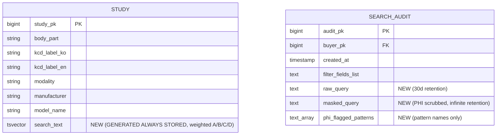
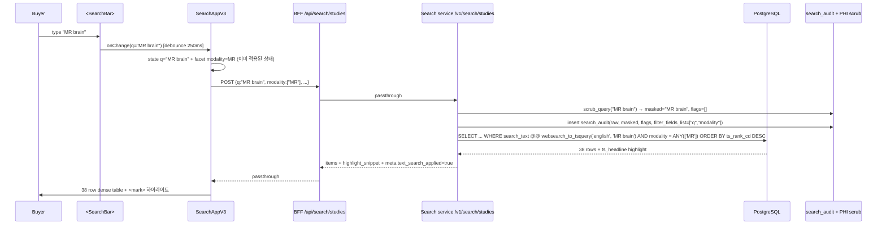
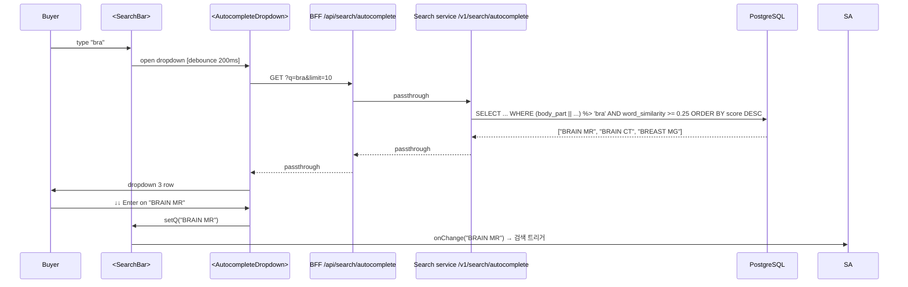
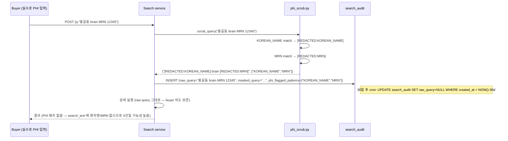
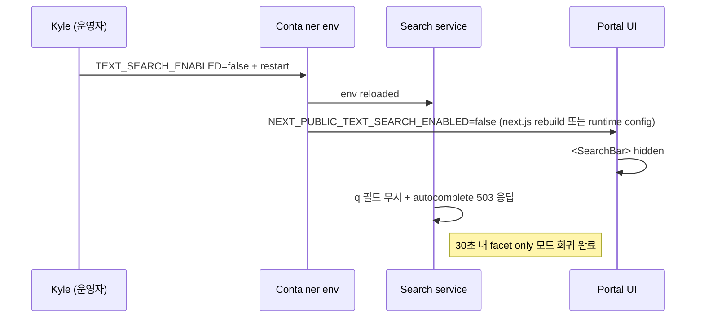

# 개발지시서 — Text Search (Postgres FTS + pg_trgm, safe-field tsvector)

> **Status**: Draft v0.1 · **Feature slug**: `text-search-description` · **Last updated**: 2026-04-26
> **작성자**: @planner (Claude Opus 4.7 [1M])
>
> **본 문서가 갱신/보완**:
> - `dev-spec-buyer-search-v3.md` — `SearchRequest` 에 `q: str | None` 추가 + `StudyItem.highlight_snippets` 옵션 추가 (additive). v3 의 13 컬럼 dense table / facet sidebar 와 충돌 없음.
> - `dev-spec-portal-redesign.md` — 검색 페이지 hero 영역에 `<SearchBar>` 추가. v3 의 facet sidebar / dense table 위에 얹혀짐.
> - `docs/ARCHITECTURE.md` §4.1 — "검색 엔진 TBD" → Phase 1 = Postgres FTS+trgm 명시 / Phase 3 (≈30만 study 또는 p95 > 500ms) = ES 전환 trigger 명시. 본 dev-spec 의 NEXT_STEP 으로 ARCHITECTURE 갱신 PR 분리.
> - `docs/prd.md` §4.2 — "자유 텍스트 검색" 항목 추가 (현재 facet 만 명시). 본 dev-spec 의 NEXT_STEP 으로 PRD 갱신 PR 분리.
> - 기존 De-ID dev-spec — DCM 코드 113111 → 113105 (Clean Descriptors Option) 정정 PR 별도 (본 dev-spec 범위 외, NEXT_STEP 명시).
>
> **근거**:
> - 리서치: [`docs/research/text-search-postgres-fts-research.md`](../research/text-search-postgres-fts-research.md) (435 줄, Q1-Q4 + Phase 1/2 권장).
> - 선행 spec: [`dev-spec-buyer-search-v3.md`](./dev-spec-buyer-search-v3.md) (facet only, dense table 13 컬럼, KCD/region/age 추출).
> - 선행 spec: [`dev-spec-portal-redesign.md`](./dev-spec-portal-redesign.md) FR-INF-* (search 서비스 bootstrap).
> - PRD: [`prd.md`](../prd.md) §4.2 (코호트 검색), §4.3 (구매자 포털).
> - ARCHITECTURE: [`ARCHITECTURE.md`](../ARCHITECTURE.md) §4.1 (Metadata Index DB), §3.2 (De-ID Engine — 113105 적용 위치).
>
> **Kyle 결정 (이미 내려진 4개, 2026-04-26)**:
> 1. **PHI 정책 (Q1)**: Phase 1.0 = description 필드 (StudyDescription/SeriesDescription/ProtocolName) **추출 안 함**. Phase 1.5 에 whitelist regex + IRB 검토 후 도입.
> 2. **DCM 코드 정정 (Q2)**: 본 dev-spec 에 113105 = Clean Descriptors Option 으로 명시 + 기존 De-ID dev-spec 정정은 별도 PR.
> 3. **search_audit PHI (Q3)**: 본 phase 에 포함. Buyer 가 검색바에 `"환자 홍길동 brain"` 같은 PHI 입력 가능 → 검색어 자체도 audit 시 마스킹 / 정규식 scrub.
> 4. **250 sample audit (Q4)**: Phase 1.5 prep 으로 진행. Phase 1.0 은 차단되지 않음.

---

## 1. 기능 개요

### 1.1 한 줄 요약

RadiVault buyer portal `/search` 에 **자유 텍스트 검색바** 를 추가하고, Postgres FTS (`english` analyzer) + pg_trgm 으로 구현한다. **Phase 1.0 (본 dev-spec)** 은 PHI 위험을 회피하기 위해 description 텍스트 (StudyDescription/SeriesDescription/ProtocolName) 는 **추출하지 않으며**, 기존 safe 필드만 (body_part / kcd_label_ko / kcd_label_en / modality / manufacturer / model_name) 으로 tsvector 를 구축한다. Kyle 의 핵심 use case "MR Brain" 검색은 modality + body_part 매치로 해결된다.

### 1.2 배경

- **현 상태**: `dev-spec-buyer-search-v3.md` 까지의 검색은 **facet only** — buyer 가 modality/body_part/KCD/age/region 체크박스로만 좁힐 수 있다. 자유 텍스트 검색 (e.g. `"MR Brain"`, `"chest CT"`) 은 불가능.
- **buyer pain point**: 글로벌 AI 회사 데이터 엔지니어가 "MR Brain" 같은 직관 쿼리를 입력해 즉시 후보 코호트를 보고 싶어함. facet 만으로는 modality 드롭다운 + body_part 드롭다운 2 단계 클릭이 필요해 friction 이 크다.
- **PHI 제약**: DICOM `StudyDescription` / `SeriesDescription` / `ProtocolName` 은 자유 텍스트 필드로 운영자명·환자명·날짜 등 PHI 가 자주 섞여 들어간다 ([리서치 §1.3](../research/text-search-postgres-fts-research.md)). DCM 113105 (Clean Descriptors Option) 의 strict 해석 = **default empty**.
- **Phase 1.0 결론**: description 추출 보류, safe 필드만 tsvector. Kyle 의 "MR Brain" use case 는 `modality=MR + body_part=BRAIN` 매치로 90% 충족.

### 1.3 Phase 정의 (본 dev-spec 의 위치)

| Phase | 일정 | 범위 | 본 dev-spec |
|-------|------|------|-------------|
| **Phase 1.0** | D-13+15 (≈2026-05-23), 2주 | 검색바 UI + safe-field tsvector + autocomplete + search_audit PHI scrub | **본 dev-spec** |
| Phase 1.5 | D-13+30 (≈2026-06-07), +2주 | description 텍스트 추출 (whitelist regex + 113105 + 250 sample human audit) | 별도 dev-spec (`dev-spec-text-search-description-phase15.md`) |
| Phase 2 | D-13+90 (≈2026-08-06) | 한국어 형태소 분석기 (mecab-ko 또는 nori) + whitelist 정교화 + popular_queries materialized view | 별도 dev-spec |
| Phase 3 | trigger-driven (30만 study 또는 p95 > 500ms) | Elasticsearch / OpenSearch 전환 | 별도 dev-spec |

### 1.4 D-13+15 ship 가능성

- 250 study scale 에서 alembic migration + GIN 빌드 < 5 초.
- search bar UI + autocomplete dropdown 은 React component 1 개 + BFF route 1 개.
- search_audit PHI scrub 은 정규식 6-8 개 + Pydantic validator.
- critical path: §10 단계적 배포 표 참조.

---

## 2. 사용자 스토리

- **As a** buyer (글로벌 AI 회사 데이터 엔지니어), **I want** `/search` hero 영역의 검색바에 `"MR Brain"` 을 입력하면 modality=MR + body_part=BRAIN 인 study 가 즉시 노출되길 원한다, **so that** facet 드롭다운 2 단계 클릭 없이 직관적으로 코호트를 좁힐 수 있다.
- **As a** buyer, **I want** 검색바에 `"chest"` 까지만 입력해도 dropdown 에 `"CHEST CT"`, `"CHEST MR"`, `"CHEST CR"` 등 자동완성 후보가 < 100ms 내 노출되길 원한다, **so that** 검색어 typo 나 정확 표기를 모를 때도 빠르게 후보를 확보한다.
- **As a** buyer, **I want** 검색 결과의 매치 토큰이 `<mark>` 로 하이라이트되길 원한다, **so that** 어떤 필드가 왜 매치되었는지 즉시 인식한다.
- **As a** buyer, **I want** `q=brain` + `modality=MR` (facet) 을 동시에 적용하면 둘이 AND 로 결합되길 원한다, **so that** 자유 텍스트와 facet 의 강점을 동시에 쓸 수 있다.
- **As a** Compliance/RA, **I want** buyer 가 검색바에 `"환자 홍길동 brain"` 같은 PHI 를 입력했을 때 search_audit 에 raw query 가 영구 보존되지 않고 masked query 만 30일+ 보존되길 원한다, **so that** PIPA §28-8 의 가명정보 처리 원칙 (PHI 누출 방지 + 감사 가능성) 양쪽을 만족한다.
- **As a** Kyle (D-13+15 운영자), **I want** 검색바가 동작 안 할 경우 (인덱스 깨짐 등) `TEXT_SEARCH_ENABLED=false` 환경변수로 즉시 facet only 모드로 회귀할 수 있길 원한다, **so that** 시연 중 사고를 피한다.

---

## 3. 범위

### 3.1 포함 (In-scope)

**데이터 / 스키마**
- `study.search_text tsvector GENERATED ALWAYS AS (... weighted ...) STORED` 컬럼 추가 (Postgres ≥12).
- `idx_study_search_text` GIN 인덱스.
- `idx_study_search_trgm` GIN trigram 인덱스 (자동완성 + 퍼지).
- `search_audit` 테이블 확장: `raw_query text NULL`, `masked_query text NULL`.
- `search_audit` 의 raw_query 30일 후 자동 NULL 처리 cron 또는 trigger (PHI 누출 시간 제한).

**Search service**
- `SearchRequest.q: str | None = Field(None, max_length=200)` 추가.
- `SearchResponse.highlight_snippets: dict[str, str] | None = None` 옵션 추가.
- `executor.py` 의 SQL 에 `WHERE search_text @@ websearch_to_tsquery('english', :q)` 추가 (q non-NULL 시).
- `executor.py` 의 ORDER BY 에 `ts_rank_cd(search_text, websearch_to_tsquery('english', :q)) DESC` 추가 (q non-NULL 시).
- 신규 endpoint: `GET /v1/search/autocomplete?q=<string>&limit=<int default 10>`.
- search_audit 저장 시 `raw_query` + `masked_query` 둘 다 기록.
- PHI scrub 모듈: `src/radivault_search/audit/phi_scrub.py` 신규.

**Portal BFF**
- `/api/search/studies` passthrough — `q` 필드 그대로 전달, `highlight_snippets` 그대로 전달.
- 신규: `/api/search/autocomplete?q=&limit=` proxy.

**Portal UI**
- 신규 컴포넌트: `<SearchBar>` (검색 페이지 hero 영역).
- 신규 컴포넌트: `<AutocompleteDropdown>` (debounce 200ms, 키보드 navigation).
- 기존 `<ResultTable>` 셀 렌더에 `<HighlightedText>` 적용 (매치 토큰 `<mark>` wrap).
- 기존 `<SearchAppV3>` (또는 `SearchApp.tsx`) 가 `q` state 관리 + facet state 와 결합.
- placeholder, clear button, search button (모바일 보조).

**Feature flag**
- `TEXT_SEARCH_ENABLED` 환경변수 (default `true`). `false` 시 search bar 자체가 hidden + `q` 필드 무시 (server side validation 도 통과는 시키되 SQL 에서 무시).

**Backfill / 운영**
- 250 study 의 `search_text` 컬럼은 GENERATED 이므로 alembic migration 적용 즉시 자동 채움. 별도 backfill 스크립트 불필요.
- 단, 신규 `search_text` 컬럼이 비어있는 row 검증 스크립트 (`scripts/demo_seed/verify_search_text_populated.py`) 1 개.

### 3.2 제외 (Out-of-scope) — 명확히 하지 않을 것 (5개+)

1. **Description 필드 추출** (`StudyDescription` / `SeriesDescription` / `ProtocolName`) — Phase 1.5 영역. 본 dev-spec 의 Gateway extract.py 변경 **금지**.
2. **한국어 형태소 분석기** (mecab-ko, nori, unaccent 한국어) — Phase 2 영역. 본 phase 는 `english` analyzer 단일.
3. **NLP 기반 진단명 추출** — `dev-spec-kcd-nlp-mapping.md` (v0.1.5) 영역. 본 dev-spec 은 KCD label 의 기존 텍스트만 인덱싱.
4. **popular_queries materialized view** + 인기순 ranking — Phase 2 영역.
5. **사용자별 검색 history / saved searches** — backlog (v0.2+).
6. **GraphQL 검색 인터페이스** — REST 단일.
7. **Buyer tier 별 검색 ranking 차등** — Phase 2 검토.
8. **Description text PHI 250 sample human audit** — Phase 1.5 prep 으로 별도 진행 (Q4 결정), 본 dev-spec 의 ship 을 차단하지 않음.
9. **Elasticsearch / OpenSearch 전환** — Phase 3 trigger 도달 시.

---

## 4. 기능 요구사항

번호 표기: `FR-TS-<n>`. 모든 FR 은 리서치 / Kyle 결정 / mockup 줄 번호 근거. AC 는 §10 에서 1:1 매핑.

### FR-TS-1 — Search Bar UI (검색 페이지 hero 영역)

- **위치**: `/search` 페이지 hero 영역 (page header 직하, facet sidebar + result table 위 full-width).
- **컴포넌트**: `<SearchBar>` — 신규 React 컴포넌트.
- **레이아웃** (좌→우):
  - icon (magnifier) — 16px, `var(--rv-stone-500)`.
  - input — `flex: 1`, height 44px, font Pretendard 16px.
  - clear button (X) — `q.length > 0` 시만 노출.
  - search button (보조) — 768-1023px 모바일 보조 모드에서만 노출. ≥1024px 데스크톱은 typing 즉시 검색 (debounce 250ms).
- **placeholder** (한·영):
  - en: `"Search by body part, modality, KCD code... (e.g. 'MR brain', 'CT chest', 'I20.9')"`
  - ko: `"부위·모달리티·KCD 코드로 검색 (예: 'MR brain', 'CT chest', 'I20.9')"`
- **상태**: `q: string` 을 SearchAppV3 의 root state 에서 관리. URL query string `?q=<value>` 와 양방향 sync (deep-link 지원).
- **debounce**: 250ms (typing 중 매 키스트로크마다 fetch 회피). `q.length === 0` 또는 `q.length >= 2` 만 fetch 트리거.
- **a11y**: `<input role="searchbox" aria-label="Search studies" aria-controls="search-results-list">`. 키보드 ↓ 누르면 dropdown 첫 항목으로 focus 이동.
- **접근성**: `prefers-reduced-motion` 준수 (dropdown open 애니메이션 50ms 이하).
- **근거**: 리서치 §2.7 `websearch_to_tsquery` 권장, 입력 컨텍스트 §UI 통합 지침.

### FR-TS-2 — `q` Query Parameter + Pydantic Schema 확장

- **모듈**: `src/radivault_search/query/schema.py` `SearchRequest`.
- **신규 필드**:
  ```python
  q: str | None = Field(
      default=None,
      max_length=200,
      description="Free-text search query. Parsed with websearch_to_tsquery."
  )
  ```
- **검증**:
  - `len(q) > 200` → 422 `ERR_QUERY_TOO_LONG`.
  - 허용 문자: 모든 unicode (PHI scrub 은 audit 단계에서, 검증 단계에서는 막지 않음).
  - 빈 문자열 (`""`) 은 `None` 과 동일하게 취급 (regex `r"^\s*$"` matches → None coercion).
- **canonical_filter_dict 갱신**: `q` 필드도 cursor sha256 binding 에 포함 (page2+ 가 page1 과 동일 q 인지 검증).
- **filter_fields_list 갱신**: `q` 가 사용된 경우 audit 의 `filter_fields_list` 에 `"q"` 토큰 포함.
- **근거**: 리서치 §2.7 (`websearch_to_tsquery` 가 사용자 raw input 안전).

### FR-TS-3 — Postgres FTS `english` Analyzer + tsvector GENERATED ALWAYS STORED

- **DB 변경** (alembic migration `0004_text_search_safe_fields`):
  ```sql
  ALTER TABLE study ADD COLUMN search_text tsvector
    GENERATED ALWAYS AS (
      setweight(to_tsvector('english', coalesce(body_part, '')), 'A') ||
      setweight(to_tsvector('english', coalesce(kcd_label_ko, '')), 'B') ||
      setweight(to_tsvector('english', coalesce(kcd_label_en, '')), 'B') ||
      setweight(to_tsvector('english', coalesce(modality, '')), 'C') ||
      setweight(to_tsvector('english', coalesce(manufacturer, '')), 'D') ||
      setweight(to_tsvector('english', coalesce(model_name, '')), 'D')
    ) STORED;
  ```
- **분석기**: `english` (Snowball Porter2 stemmer). 의료 영어 약어 (`MRI`, `CT`, `XR`) 는 stem 안 됨, 일반 영어 (`abdominal` ↔ `abdomens`) 는 stem 호환 (리서치 §2.1).
- **한국어 처리**: kcd_label_ko 에 한글이 들어가도 `english` analyzer 는 한글을 그대로 token 으로 통과시킴 (lexeme 추출만 안 됨, 매치는 정확 일치만 가능). Phase 2 에서 한국어 stemmer 도입 (Q4 deferred).
- **이유 — GENERATED ALWAYS vs trigger**:
  | 측면 | GENERATED STORED | trigger |
  |---|---|---|
  | 정의 위치 | 컬럼 DDL 한 곳 | trigger 함수 + trigger |
  | 동기화 안전 | 자동 (insert/update) | trigger 누락/disable 위험 |
  | 마이그레이션 backfill | 컬럼 추가 시 자동 | UPDATE 별도 필요 |
  → **GENERATED 권장** (리서치 §2.4).
- **위험 R-1**: study UPDATE 시 search_text 재계산 비용 (250 → 30만 scale 에서 측정 후 trigger 분리 결정). §11 위험 매트릭스 참조.
- **근거**: 리서치 §2.4, Crunchy Data Postgres FTS 가이드.

### FR-TS-4 — Weight 전략

| 필드 | 가중치 | 이유 |
|------|-------|------|
| `body_part` | A | study 의 가장 직관적 분류, buyer 검색 의도 직접 매치 빈도 높음 |
| `kcd_label_ko` | B | 한국어 진단명, 한국 buyer 검색 |
| `kcd_label_en` | B | 영문 진단명, 글로벌 buyer 검색 |
| `modality` | C | facet 으로도 가능하나 `MR` 같은 짧은 토큰 매치 보조 |
| `manufacturer` | D | 보조 — buyer 가 `SIEMENS chest` 같이 검색 시 |
| `model_name` | D | 보조 |

- **ranking**: `ts_rank_cd(search_text, websearch_to_tsquery('english', :q))` 사용 — proximity (cover density) 가산. 짧은 description 에 유리 (리서치 §2.6).
- **default weights array**: `{0.1, 0.2, 0.4, 1.0}` (D, C, B, A) — Postgres 기본값 사용.
- **근거**: 리서치 §2.5 (Kyle 입력의 가중치 재배치).

### FR-TS-5 — GIN Index on `search_text`

- **DDL**:
  ```sql
  CREATE INDEX idx_study_search_text ON study USING GIN(search_text);
  ```
- **빌드 시간** (리서치 §4.4):
  | scale | 빌드 시간 |
  |---|---|
  | 250 | < 1s |
  | 5만 | ~5s |
  | 30만 | ~30s |
- **production migration**: `CREATE INDEX CONCURRENTLY` 사용 (alembic op 분리, transaction block 외부). 250 scale 에서는 보통 alembic 으로도 OK.
- **maintenance_work_mem**: 30만+ scale 에서 256MB+ 권장 (리서치 §4.4).

### FR-TS-6 — pg_trgm GIN Index (자동완성 + 퍼지)

- **extension 확인**:
  ```sql
  CREATE EXTENSION IF NOT EXISTS pg_trgm;
  ```
- **DDL**:
  ```sql
  CREATE INDEX idx_study_search_trgm ON study USING GIN(
    (coalesce(body_part,'') || ' ' || coalesce(kcd_label_en,'') || ' ' || coalesce(kcd_label_ko,'')) gin_trgm_ops
  );
  ```
- **용도**: 자동완성 (`word_similarity`) + 오타 fallback (`brian` → `brain`, similarity ≥ 0.3).
- **빌드 시간**: 250 < 1s, 30만 ~60s.
- **근거**: 리서치 §3.1 (100k 행 < 100ms), §3.2 (`word_similarity` 권장).

### FR-TS-7 — `ts_rank_cd` 결과 정렬

- **executor.py 변경**:
  ```python
  if request.q:
      sql += """
        AND search_text @@ websearch_to_tsquery('english', :q)
      """
      order_by = "ts_rank_cd(search_text, websearch_to_tsquery('english', :q)) DESC, ingested_at DESC"
  else:
      order_by = "<기존 sort 로직>"
  ```
- **q + 기존 sort 동시 사용**: q 가 non-NULL 이면 ts_rank_cd 우선, secondary sort 는 기존 enum (`date_desc`, `ingested_desc` 등). 사용자가 명시적으로 sort 지정 시는 사용자 sort 우선 (ts_rank_cd 미적용).
- **근거**: 리서치 §2.6 (`ts_rank_cd` 가 짧은 description 에 유리).

### FR-TS-8 — 자동완성 Endpoint

- **경로**: `GET /v1/search/autocomplete?q=<string>&limit=<int default 10>`.
- **모듈**: `src/radivault_search/routers/autocomplete.py` 신규 (또는 기존 `routers/search.py` 에 추가).
- **인증**: 기존 buyer bearer 와 동일.
- **알고리즘**:
  1. 입력 `q` 가 빈 문자열 또는 length < 1 → 400 `ERR_INVALID_QUERY`.
  2. SQL:
     ```sql
     SELECT DISTINCT
       (body_part || ' ' || coalesce(modality, '')) AS suggestion,
       word_similarity(:q, body_part || ' ' || coalesce(modality, '')) AS score
     FROM study
     WHERE (body_part || ' ' || coalesce(modality, '')) %> :q
       AND word_similarity(:q, body_part || ' ' || coalesce(modality, '')) >= 0.25
     ORDER BY score DESC
     LIMIT :limit;
     ```
  3. Result 에서 중복 제거 (case-insensitive), top N 반환.
- **응답**:
  ```json
  {
    "suggestions": ["BRAIN MR", "BRAIN CT", "CHEST CT"],
    "computed_at": "2026-04-26T12:34:56Z"
  }
  ```
- **성능 목표**: p95 < 100ms (NFR-TS-PERF-2).
- **threshold**: `pg_trgm.similarity_threshold` = 0.25 (리서치 §3.2 권장 — autocomplete recall 우선).
- **rate limit**: 60 req/min/buyer (typing 단위 호출이라 search 보다 높게 — 단, abuse 방지 위해 cap 적용).
- **에러**: 400 `ERR_INVALID_QUERY`, 401 `ERR_AUTH_EXPIRED`, 429 `ERR_RATE_LIMIT`, 500 표준 envelope.
- **debounce (client side)**: 200ms (FR-TS-1 의 250ms 와 다름 — autocomplete 가 더 짧음).
- **근거**: 리서치 §3.2 (`word_similarity`, threshold 0.25), Kyle 입력 §FR-TS-8.

### FR-TS-9 — 결과 하이라이트

- **목표**: 검색 결과 row 에서 매치된 토큰을 `<mark>` 로 wrap.
- **구현 방법** (server-side):
  - executor.py 의 SELECT 에 `ts_headline` 사용:
    ```sql
    SELECT
      ...,
      CASE WHEN :q IS NOT NULL THEN
        ts_headline('english',
          coalesce(body_part, '') || ' ' || coalesce(kcd_label_en, ''),
          websearch_to_tsquery('english', :q),
          'MaxFragments=1, MaxWords=10, MinWords=3, StartSel=<mark>, StopSel=</mark>'
        )
      ELSE NULL END AS highlight_snippet
    FROM study WHERE ...
    ```
  - 응답: `StudyItem.highlight_snippet: str | None`.
- **클라이언트**: `<HighlightedText>` 컴포넌트가 server 에서 받은 HTML 을 안전하게 렌더 (DOMPurify 또는 React 의 `dangerouslySetInnerHTML` + 화이트리스트 `<mark>` 만 허용).
- **CSS** (design-spec 위임): `<mark>` 토큰 → Pretendard semibold + teal background (`var(--rv-teal-100)`), navy text.
- **opt-out**: `q` 가 NULL 이면 `highlight_snippet: null`, `<HighlightedText>` 는 raw 텍스트만 렌더.
- **XSS 방지**: server 에서 `StartSel`/`StopSel` 로 `<mark>` 만 삽입, ts_headline 이 자동으로 다른 HTML escape 처리. 클라이언트는 추가로 DOMPurify 권장.
- **근거**: PostgreSQL 12.3 `ts_headline` docs.

### FR-TS-10 — search_audit 에 Query 저장 (PHI Scrub)

- **모듈**: `src/radivault_search/audit/phi_scrub.py` 신규.
- **PHI 패턴 (정규식)**:
  ```python
  KOREAN_NAME_PATTERN = r'[가-힣]{2,4}(?=[\s,]|$)'  # 한글 이름 2-4자 (단독 토큰)
  ENGLISH_NAME_PATTERN = r'\b[A-Z][a-z]+(?:[\s,.]+[A-Z]\.?)?(?:[\s,.]+[A-Z][a-z]+)?\b'  # Smith, J. Smith, Smith,J
  RRN_PATTERN = r'\b\d{6}-?\d{7}\b'  # 주민번호
  MRN_PATTERN = r'\b(MRN|PT|ID)[\s:]?\d{4,}\b'  # MRN: 12345
  PHONE_PATTERN = r'\b0\d{1,2}-?\d{3,4}-?\d{4}\b'  # 한국 전화번호
  EMAIL_PATTERN = r'\b[\w.+-]+@[\w-]+\.[\w.-]+\b'  # 이메일
  LONG_DIGIT_PATTERN = r'\b\d{7,}\b'  # 7자리 이상 연속 숫자 (MRN-like)
  ```
- **scrub 함수**:
  ```python
  def scrub_query(raw: str) -> tuple[str, list[str]]:
      """
      Returns (masked_query, flagged_patterns).
      masked_query: PHI 패턴이 [REDACTED] 또는 [REDACTED:KIND] 로 치환된 문자열.
      flagged_patterns: 매치된 패턴 종류 리스트 (audit metric 용).
      """
  ```
- **search_audit 테이블 변경**:
  ```sql
  ALTER TABLE search_audit ADD COLUMN raw_query TEXT NULL;
  ALTER TABLE search_audit ADD COLUMN masked_query TEXT NULL;
  ALTER TABLE search_audit ADD COLUMN phi_flagged_patterns TEXT[] NULL;
  ```
- **저장 정책**:
  - `raw_query`: 검색 시점에 저장. **30일 후** cron job 으로 NULL 처리 (PHI 누출 시간 제한). PIPA §28-8 가명정보 처리 원칙 일관.
  - `masked_query`: 검색 시점에 저장. **무기한 보존** (audit 5년+).
  - `phi_flagged_patterns`: `["KOREAN_NAME", "RRN"]` 같은 패턴 종류만. raw 값 미저장.
- **30일 cron**:
  ```sql
  -- daily cron: scripts/ops/scrub_old_search_audit_raw.sql
  UPDATE search_audit SET raw_query = NULL WHERE created_at < NOW() - INTERVAL '30 days' AND raw_query IS NOT NULL;
  ```
- **근거**: Kyle Q3 결정 (search_audit PHI 본 phase 포함), 리서치 §1.5 (정규식 세트), PIPA §28-8.

### FR-TS-11 — Cursor Pagination 유지

- **변경 없음** (additive). 기존 cursor sha256 binding 에 `q` 필드도 포함 (FR-TS-2).
- 검증: page1 → page2 이동 시 동일 q 값 사용. 다른 q 로 이동 시 cursor invalid (400 `ERR_CURSOR_INVALID`).

### FR-TS-12 — 빈 Query 시 회귀 없음 (기존 facet only 동작)

- `q` 가 NULL 또는 빈 문자열 → executor.py 의 SQL 에 FTS WHERE 절 미포함, ranking 미적용.
- 기존 `dev-spec-buyer-search-v3.md` 의 facet only 동작과 100% 동일 (regression test 필수, AC-TS-12).

### FR-TS-13 — Combined Query (q + facets)

- `q=brain` + `modality=MR` 동시 적용 시 SQL:
  ```sql
  WHERE search_text @@ websearch_to_tsquery('english', :q)
    AND modality = ANY(:modality_array)
    AND ...
  ```
- 둘 다 AND 결합. ranking 은 `ts_rank_cd` 우선, secondary 는 `ingested_at DESC`.

### FR-TS-14 — Feature Flag `TEXT_SEARCH_ENABLED`

- **환경변수**: `TEXT_SEARCH_ENABLED` (default `true`).
- **scope**:
  - search service: `false` 시 `q` 필드 무시 (validation 통과는 하나 SQL 에 미반영). `/v1/search/autocomplete` 는 503 `ERR_FEATURE_DISABLED` 반환.
  - portal UI: `NEXT_PUBLIC_TEXT_SEARCH_ENABLED` 동기화. `false` 시 `<SearchBar>` 컴포넌트 자체 hidden.
- **목적**: 시연 중 인덱스 깨짐 / 성능 이슈 발견 시 1 줄 환경변수 변경 + 컨테이너 재시작 (≤ 30초) 으로 즉시 회귀.
- **근거**: Kyle 입력 §위험 / 롤백, 시연 안전성.

---

## 5. 비기능 요구사항

| 항목 | 코드 | 요구 |
|------|------|------|
| **성능** | NFR-TS-PERF-1 | `/v1/search/studies` (q 포함) p95 < 200ms (250 study). 100k study scale 에서 p95 < 200ms 유지 (리서치 §3.1 근거). |
| **성능** | NFR-TS-PERF-2 | `/v1/search/autocomplete` p95 < 100ms (250 study). 100k 에서 < 200ms. |
| **성능** | NFR-TS-PERF-3 | tsvector + trigram GIN 인덱스 빌드: 250 study < 5초, 30만 study < 3분 (리서치 §4.4). |
| **성능** | NFR-TS-PERF-4 | search_audit insert (PHI scrub 포함) 부하 < 5ms (단일 쿼리당). |
| **보안** | NFR-TS-SEC-1 | 신규 endpoint `autocomplete` 도 buyer bearer 검증. 익명 호출 거부 (401). |
| **보안** | NFR-TS-SEC-2 | `q` 필드 검증: max_length 200, 모든 unicode 허용 (PHI scrub 은 audit 단계). SQL injection 방지: `websearch_to_tsquery` 가 user input safe parsing 보장 (리서치 §2.7). |
| **보안** | NFR-TS-SEC-3 | search_audit `raw_query` 30일 후 NULL 처리. `masked_query` 는 PHI scrub 검증 통과 (PHI 정규식 6+ 패턴, false negative 측정 → 250 sample 0건 목표). |
| **컴플라이언스** | NFR-TS-COMPLIANCE-1 | description 텍스트 (StudyDescription/SeriesDescription/ProtocolName) 는 본 phase 추출 금지. Gateway extract.py 변경 0줄 (회귀 검증). |
| **컴플라이언스** | NFR-TS-COMPLIANCE-2 | DCM 113105 (Clean Descriptors Option) 본 dev-spec 에 명시. 기존 De-ID dev-spec 의 113111 → 113105 정정은 별도 PR (NEXT_STEP). |
| **가용성** | NFR-TS-AVAIL-1 | `TEXT_SEARCH_ENABLED=false` 시 30초 내 facet only 모드 회귀. UI 깨짐 0건. |
| **가용성** | NFR-TS-AVAIL-2 | autocomplete endpoint 다운 시 검색바 자체는 동작 (typing → POST /search/studies 직접 호출, dropdown 미노출). |
| **로깅·감사** | NFR-TS-AUDIT-1 | search_audit 에 `raw_query`, `masked_query`, `phi_flagged_patterns` 3 컬럼 채움. `q` 가 NULL 이면 모두 NULL. |
| **로깅·감사** | NFR-TS-AUDIT-2 | search_audit 의 `filter_fields_list` 에 `q` 사용 시 `"q"` 토큰 포함. |
| **국제화** | NFR-TS-I18N-1 | placeholder, autocomplete 라벨, error message 모두 ko/en 양쪽 제공. |
| **접근성** | NFR-TS-A11Y-1 | `<SearchBar>` `role="searchbox"`, autocomplete dropdown `role="listbox"` + `role="option"`. 키보드 navigation 100% (Tab/↑↓/Enter/Esc). |
| **호환성** | NFR-TS-COMPAT-1 | `SearchRequest.q` additive — 기존 클라이언트 (q 미전송) 가 break 없이 동작. |
| **회귀** | NFR-TS-REGRESSION-1 | `q=NULL` 시 결과 행이 v3 facet only 동작과 byte-identical (regression test). |

---

## 6. 데이터 모델

### 6.1 Alembic Migration (단일 migration, version `0004_text_search_safe_fields`)

```sql
-- 1. extension 확인
CREATE EXTENSION IF NOT EXISTS pg_trgm;

-- 2. study.search_text (GENERATED ALWAYS STORED, weighted)
ALTER TABLE study ADD COLUMN search_text tsvector
  GENERATED ALWAYS AS (
    setweight(to_tsvector('english', coalesce(body_part, '')), 'A') ||
    setweight(to_tsvector('english', coalesce(kcd_label_ko, '')), 'B') ||
    setweight(to_tsvector('english', coalesce(kcd_label_en, '')), 'B') ||
    setweight(to_tsvector('english', coalesce(modality, '')), 'C') ||
    setweight(to_tsvector('english', coalesce(manufacturer, '')), 'D') ||
    setweight(to_tsvector('english', coalesce(model_name, '')), 'D')
  ) STORED;

-- 3. GIN index on search_text
CREATE INDEX idx_study_search_text ON study USING GIN(search_text);

-- 4. trigram GIN index for autocomplete + fuzzy
CREATE INDEX idx_study_search_trgm ON study USING GIN(
  (coalesce(body_part,'') || ' ' || coalesce(kcd_label_en,'') || ' ' || coalesce(kcd_label_ko,'')) gin_trgm_ops
);

-- 5. search_audit 확장 (PHI scrub)
ALTER TABLE search_audit ADD COLUMN raw_query TEXT NULL;
ALTER TABLE search_audit ADD COLUMN masked_query TEXT NULL;
ALTER TABLE search_audit ADD COLUMN phi_flagged_patterns TEXT[] NULL;

-- 6. (선택) raw_query 30일 retention 위한 idx — cron job 효율
CREATE INDEX idx_search_audit_raw_age ON search_audit (created_at) WHERE raw_query IS NOT NULL;
```

`downgrade()`:
```sql
DROP INDEX IF EXISTS idx_search_audit_raw_age;
ALTER TABLE search_audit DROP COLUMN IF EXISTS phi_flagged_patterns;
ALTER TABLE search_audit DROP COLUMN IF EXISTS masked_query;
ALTER TABLE search_audit DROP COLUMN IF EXISTS raw_query;
DROP INDEX IF EXISTS idx_study_search_trgm;
DROP INDEX IF EXISTS idx_study_search_text;
ALTER TABLE study DROP COLUMN IF EXISTS search_text;
-- pg_trgm extension 은 다른 곳에서 쓸 수 있으므로 DROP 안 함
```

**선행 조건**: `dev-spec-buyer-search-v3.md` 의 `0003_v3_kcd_age_region` 마이그레이션이 먼저 적용되어 있어야 함 (kcd_label_ko/en, manufacturer, model_name 컬럼 존재 보장).

### 6.2 ER 변경 (mermaid)



### 6.3 데이터 흐름 — search_text 동기화

- `study` row INSERT/UPDATE 시 → Postgres 가 자동으로 `search_text` 재계산 (GENERATED ALWAYS).
- 기존 250 study 는 alembic migration 적용 시점에 자동 채워짐 (no separate backfill).
- 검증: `scripts/demo_seed/verify_search_text_populated.py` 가 `SELECT COUNT(*) FROM study WHERE search_text IS NULL` = 0 검증.

### 6.4 PHI Scrub 매트릭스 (search query 자체)

| 패턴 코드 | 정규식 | 예시 입력 | masked 출력 |
|---|---|---|---|
| `KOREAN_NAME` | `[가-힣]{2,4}(?=[\s,]\|$)` | `홍길동 brain` | `[REDACTED:KOREAN_NAME] brain` |
| `ENGLISH_NAME` | `\b[A-Z][a-z]+(?:[\s,.]+[A-Z]\.?)?(?:[\s,.]+[A-Z][a-z]+)?\b` | `Smith, J. brain` | `[REDACTED:ENGLISH_NAME] brain` |
| `RRN` | `\b\d{6}-?\d{7}\b` | `900101-1234567 chest` | `[REDACTED:RRN] chest` |
| `MRN` | `\b(MRN\|PT\|ID)[\s:]?\d{4,}\b` | `MRN 12345 brain` | `[REDACTED:MRN] brain` |
| `PHONE` | `\b0\d{1,2}-?\d{3,4}-?\d{4}\b` | `010-1234-5678 brain` | `[REDACTED:PHONE] brain` |
| `EMAIL` | `\b[\w.+-]+@[\w-]+\.[\w.-]+\b` | `kyle@radivault.io brain` | `[REDACTED:EMAIL] brain` |
| `LONG_DIGIT` | `\b\d{7,}\b` | `1234567 brain` | `[REDACTED:LONG_DIGIT] brain` |

**한계 명시**:
- `KOREAN_NAME` 패턴은 일반 한국어 진단명 (예: `심장`, `폐렴`) 도 false positive 위험 → 실제 `kcd_label_ko` 사전을 화이트리스트로 활용하는 전략 (Phase 2 정교화). 본 phase 는 over-redaction 허용 (PHI 안전 우선).
- `ENGLISH_NAME` 패턴은 `Smith` (의사명) 와 `Brain` (해부학명) 의 capitalization 충돌 위험 → 의학 용어 사전 (RadLex 고유명) 화이트리스트로 정교화 (Phase 2).
- 250 sample false negative 측정은 Phase 1.5 prep 으로 진행 (Q4 결정).

---

## 7. API 계약

### 7.1 POST `/v1/search/studies` (확장)

**Request** (신규/변경 필드 굵게):

```jsonc
{
  "q": "MR brain",                  // NEW (Phase 1.0)
  "modality": ["MR"],
  "body_part": ["BRAIN"],
  "sex": ["F", "M"],
  "age_min": 35,
  "age_max": 65,
  "kcd_code": null,
  "hospital_region": null,
  "manufacturer": null,
  "model_name": null,
  "study_date_shifted": null,
  "min_hospitals": null,
  "sort": "date_desc",
  "limit": 25,
  "cursor": null,
  "include_facets": true
}
```

**Response** (신규 필드 굵게):

```jsonc
{
  "items": [
    {
      "pseudo_study_uid": "1.2.840.HOSP1.7392.20240815.001",
      "modality": "MR",
      "body_part": "BRAIN",
      "patient_age": 52,
      "sex": "F",
      "study_date_shifted": "2024-08-15",
      "manufacturer": "SIEMENS",
      "model_name": "MAGNETOM Vida",
      "n_instances": 312,
      "n_series": 3,
      "total_bytes": 502267904,
      "hospital_opaque_id": "HOSP-001-opaque",
      "hospital_region_pseudo": "SEOUL-A",
      "kcd_code": "G45.9",
      "kcd_label_ko": "일과성 뇌허혈 발작, 상세불명",
      "kcd_label_en": "Transient ischaemic attack, unspecified",
      "ingested_at": "2024-08-16T03:42:11Z",
      "preview_status": "verified",
      "preview_slice_count": 312,
      "highlight_snippet": "BRAIN <mark>MR</mark> ...",  // NEW (q non-NULL 시)
      "_search_score": 0.842                              // NEW (q non-NULL 시, debug 용 옵션)
    }
  ],
  "facets": { /* §dev-spec-buyer-search-v3 §7.1 와 동일 */ },
  "pagination": { "next_cursor": null, "has_more": false, "page_size": 25 },
  "meta": {
    "total_hint": 38,
    "query_duration_ms": 42,
    "buyer_tier": "preview",
    "text_search_applied": true   // NEW (q non-NULL 시 true)
  }
}
```

**Errors** (신규):
- 422 `ERR_QUERY_TOO_LONG` — `q.length > 200`.
- 503 `ERR_FEATURE_DISABLED` — `TEXT_SEARCH_ENABLED=false` + `q` 가 non-NULL 인 경우 (단, default 는 q 무시 + warning).

### 7.2 GET `/v1/search/autocomplete` (신규)

**Request**:
```
GET /v1/search/autocomplete?q=brain&limit=10
Authorization: Bearer <buyer_token>
```

**Response**:
```jsonc
{
  "suggestions": [
    "BRAIN MR",
    "BRAIN CT",
    "BRAIN MR Transient ischaemic attack"
  ],
  "computed_at": "2026-04-26T12:34:56Z"
}
```

**Errors**:
- 400 `ERR_INVALID_QUERY` — `q` 비어있음 또는 length > 100.
- 401 `ERR_AUTH_EXPIRED`.
- 429 `ERR_RATE_LIMIT` — 60 req/min 초과.
- 503 `ERR_FEATURE_DISABLED` — `TEXT_SEARCH_ENABLED=false`.

### 7.3 Portal BFF Routes

| 경로 | 메서드 | 변경 |
|------|--------|------|
| `/api/search/studies` | POST | passthrough (q 필드 그대로 전달, highlight_snippet 그대로 전달). TS 타입 갱신 (FR-TS-2 / FR-TS-9). |
| `/api/search/autocomplete` | GET | **신규** proxy. 패턴: 기존 `kcd-autocomplete/route.ts` 답습. |

신규 파일:
- `web/portal/src/app/api/search/autocomplete/route.ts` — passthrough proxy.

---

## 8. 시퀀스·플로우

### 8.1 자유 텍스트 검색 + facet 결합



### 8.2 자동완성 dropdown



### 8.3 PHI Scrub 검증 (search_audit)



### 8.4 Feature Flag 회귀



---

## 9. 의존성

### 9.1 상위 모듈 / 외부

- **PostgreSQL ≥ 12** (GENERATED ALWAYS STORED 컬럼 지원).
- **PostgreSQL `pg_trgm` extension** (이미 설치되어 있을 가능성, 없으면 `CREATE EXTENSION` 필요 — superuser 권한).
- **DOMPurify** (Portal UI 의 highlight HTML 안전 렌더 — 이미 portal 에 있으면 reuse, 없으면 add).
- **`@radix-ui/react-popover`** 또는 자체 구현 (autocomplete dropdown — 이미 portal 에 radix 가 있으면 reuse).

### 9.2 하위 모듈 / 영향

- `radivault_search.query.schema` — `SearchRequest.q` + `StudyItem.highlight_snippet` 추가.
- `radivault_search.query.executor` — SQL 의 WHERE/ORDER BY/SELECT 분기 추가.
- `radivault_search.routers.search` — `/autocomplete` 엔드포인트 추가 (또는 신규 `routers/autocomplete.py`).
- `radivault_search.audit.phi_scrub` — **신규 모듈**.
- `radivault_search.audit.repository` — `search_audit` insert 시 raw/masked/flags 컬럼 추가.
- `web/portal/src/app/api/search/autocomplete/route.ts` — **신규 BFF route**.
- `web/portal/src/app/api/search/studies/route.ts` — passthrough (TS 타입만 갱신).
- `web/portal/src/components/buyer/SearchBar.tsx` — **신규 컴포넌트**.
- `web/portal/src/components/buyer/AutocompleteDropdown.tsx` — **신규 컴포넌트**.
- `web/portal/src/components/buyer/HighlightedText.tsx` — **신규 컴포넌트**.
- `web/portal/src/app/search/SearchApp.tsx` (또는 `SearchAppV3.tsx`) — `q` state 통합 + `<SearchBar>` 마운트.
- `web/portal/src/lib/types/search.ts` — TS 타입 갱신.
- `scripts/demo_seed/verify_search_text_populated.py` — **신규 검증 스크립트**.
- `scripts/ops/scrub_old_search_audit_raw.sql` — **신규 cron SQL**.

### 9.3 선행 조건

- `dev-spec-buyer-search-v3.md` 구현 완료 (`SearchAppV3`, `SearchRequest`, `kcd_label_ko/en` 컬럼 존재). **충족 필수**.
- `dev-spec-portal-redesign.md` FR-INF-* 구현 완료 (search 서비스 `buyer` / `buyer_api_key` 테이블 존재, bootstrap 동작). **충족 필수**.

### 9.4 후속 dev-spec 영향

- `dev-spec-text-search-description-phase15.md` (Phase 1.5, 별도 dev-spec) — description 텍스트 추출 + whitelist regex + 113105 적용 + 250 sample human audit. 본 dev-spec 의 tsvector 정의를 확장하여 `study_description` / `series_description_concat` / `protocol_name` 추가.
- `dev-spec-text-search-korean-stemmer.md` (Phase 2) — `english` config → `korean_medical` config 전환. 한국어 형태소 분석기 (mecab-ko 또는 nori) 도입.
- `dev-spec-popular-queries.md` (Phase 2) — `search_audit` 의 masked_query 일별 집계 → `popular_queries` materialized view → autocomplete 2단 (인기순 + trigram fallback).
- `dev-spec-de-id-engine-v0.2.md` (병행) — DCM 113111 → 113105 정정 (본 dev-spec 의 NEXT_STEP).

---

## 10. 수용 기준 (Acceptance Criteria)

`@qa` 가 본 체크리스트로 검수. 자동화 + 수동 시나리오 혼합. 1:1 FR 매핑.

### 10.1 Data 계층

- [ ] **AC-TS-DATA-1**: alembic migration `0004_text_search_safe_fields` upgrade + downgrade 양방향 적용 가능.
- [ ] **AC-TS-DATA-2**: 250 study 마이그레이션 직후 `study.search_text` non-NULL 비율 100%.
- [ ] **AC-TS-DATA-3**: `idx_study_search_text` (GIN) 존재 + EXPLAIN 시 `Bitmap Index Scan on idx_study_search_text` 노출 (q non-NULL 쿼리).
- [ ] **AC-TS-DATA-4**: `idx_study_search_trgm` (GIN trgm) 존재 + autocomplete 쿼리에서 사용.
- [ ] **AC-TS-DATA-5**: `search_audit` 테이블에 `raw_query`, `masked_query`, `phi_flagged_patterns` 3 컬럼 존재.
- [ ] **AC-TS-DATA-6**: study INSERT 시 `search_text` 자동 재계산 (수동 트리거 불요).

### 10.2 API 계층

- [ ] **AC-TS-API-1**: `POST /v1/search/studies` 가 `q="MR brain"` 수신 시 200 + `meta.text_search_applied=true`.
- [ ] **AC-TS-API-2**: `q="MR brain"` 결과가 modality=MR, body_part=BRAIN 인 study 우선 노출 (ts_rank_cd 정렬).
- [ ] **AC-TS-API-3**: `q.length > 200` → 422 `ERR_QUERY_TOO_LONG`.
- [ ] **AC-TS-API-4**: `q=NULL` 또는 `q=""` 시 `meta.text_search_applied=false` + 응답이 facet only 동작과 byte-identical (NFR-TS-REGRESSION-1).
- [ ] **AC-TS-API-5**: `q="MR brain"` + `modality=["CT"]` (모순) → 0 행 (AND 결합 검증).
- [ ] **AC-TS-API-6**: `q` 가 non-NULL 시 `StudyItem.highlight_snippet` 노출, `<mark>` 토큰 포함.
- [ ] **AC-TS-API-7**: `GET /v1/search/autocomplete?q=bra&limit=10` 200 응답 + `suggestions` 배열 (≥ 1 항목).
- [ ] **AC-TS-API-8**: `autocomplete?q=` (빈) → 400 `ERR_INVALID_QUERY`.
- [ ] **AC-TS-API-9**: `autocomplete` bearer 없이 호출 → 401.
- [ ] **AC-TS-API-10**: cursor pagination — page1 의 q 와 page2 의 q 가 다르면 400 `ERR_CURSOR_INVALID`.
- [ ] **AC-TS-API-11**: `TEXT_SEARCH_ENABLED=false` + `q` non-NULL → q 무시 + warning 로그 (또는 503 `ERR_FEATURE_DISABLED`, 구현 결정).

### 10.3 PHI Scrub 계층

- [ ] **AC-TS-PHI-1**: `q="홍길동 brain"` → search_audit `masked_query="[REDACTED:KOREAN_NAME] brain"`, `phi_flagged_patterns=["KOREAN_NAME"]`, `raw_query="홍길동 brain"`.
- [ ] **AC-TS-PHI-2**: `q="900101-1234567 chest"` → `masked_query="[REDACTED:RRN] chest"`, `phi_flagged_patterns=["RRN"]`.
- [ ] **AC-TS-PHI-3**: `q="MRN 12345 brain"` → `masked_query="[REDACTED:MRN] brain"`, `phi_flagged_patterns=["MRN"]`.
- [ ] **AC-TS-PHI-4**: `q="010-1234-5678 brain"` → `masked_query="[REDACTED:PHONE] brain"`, `phi_flagged_patterns=["PHONE"]`.
- [ ] **AC-TS-PHI-5**: `q="kyle@radivault.io brain"` → `masked_query="[REDACTED:EMAIL] brain"`, `phi_flagged_patterns=["EMAIL"]`.
- [ ] **AC-TS-PHI-6**: `q="MR brain"` (PHI 없음) → `masked_query="MR brain"`, `phi_flagged_patterns=[]`.
- [ ] **AC-TS-PHI-7**: 30일 cron 실행 후 `created_at < NOW()-30d` 인 row 의 `raw_query` 가 NULL, `masked_query` 는 보존.
- [ ] **AC-TS-PHI-8**: search_audit insert 부하 < 5ms (p95, NFR-TS-PERF-4).

### 10.4 BFF 계층

- [ ] **AC-TS-BFF-1**: `/api/search/studies` 가 `q` 필드 그대로 전달 + `highlight_snippet` 그대로 통과.
- [ ] **AC-TS-BFF-2**: `/api/search/autocomplete` proxy 동작 + 401 fallback.

### 10.5 UI 계층

- [ ] **AC-TS-UI-1**: `/search` 페이지 hero 영역에 `<SearchBar>` 노출 (full-width, facet sidebar 위).
- [ ] **AC-TS-UI-2**: placeholder 텍스트가 ko/en 양쪽 정확 (FR-TS-1).
- [ ] **AC-TS-UI-3**: typing → debounce 250ms 후 결과 자동 갱신.
- [ ] **AC-TS-UI-4**: typing → debounce 200ms 후 autocomplete dropdown 노출 (≥ 2자).
- [ ] **AC-TS-UI-5**: dropdown 키보드 navigation (↑↓ 이동, Enter 선택, Esc 닫기) 동작.
- [ ] **AC-TS-UI-6**: clear button (X) 클릭 시 `q=""` + 결과 facet only 모드로 회귀.
- [ ] **AC-TS-UI-7**: 결과 row 의 매치 토큰이 `<mark>` 로 wrap, CSS 스타일 적용 (Pretendard semibold + teal bg).
- [ ] **AC-TS-UI-8**: URL `?q=brain` 으로 진입 시 검색바에 자동 채워지고 결과 노출 (deep-link).
- [ ] **AC-TS-UI-9**: `NEXT_PUBLIC_TEXT_SEARCH_ENABLED=false` 시 `<SearchBar>` 자체 hidden.
- [ ] **AC-TS-UI-10**: autocomplete API 500 시 dropdown 자동 닫힘 + `<SearchBar>` 자체는 동작 유지 (typing → POST /search/studies 직접).

### 10.6 NFR / 성능

- [ ] **AC-TS-NFR-PERF-1**: `/v1/search/studies` (q 포함) p95 < 200ms (k6 또는 hey 측정, 250 study).
- [ ] **AC-TS-NFR-PERF-2**: `/v1/search/autocomplete` p95 < 100ms.
- [ ] **AC-TS-NFR-PERF-3**: alembic migration + GIN 빌드 250 study 환경에서 < 5초.
- [ ] **AC-TS-NFR-PERF-4**: search_audit insert (PHI scrub 포함) p95 < 5ms.
- [ ] **AC-TS-NFR-COMPLIANCE-1**: Gateway extract.py 변경 0줄 (description 추출 안 됨, NFR-TS-COMPLIANCE-1).
- [ ] **AC-TS-NFR-A11Y-1**: `<SearchBar>` `role="searchbox"`, dropdown `role="listbox"`, 키보드 navigation 100%.

### 10.7 회귀 / 호환성

- [ ] **AC-TS-COMPAT-1**: 기존 클라이언트 (q 미전송) 가 break 없이 동작 (NFR-TS-COMPAT-1).
- [ ] **AC-TS-REGRESSION-1**: `q=NULL` 응답이 v3 facet only 응답과 byte-identical (highlight_snippet 만 null 차이).

### 10.8 Demo (E2E, D-13+15)

- [ ] **AC-TS-DEMO-1**: 검색바에 `"MR brain"` 입력 → 250 중 MR + BRAIN 매치 row 만 노출, ts_rank_cd 정렬.
- [ ] **AC-TS-DEMO-2**: 검색바에 `"chest"` 입력 → autocomplete dropdown 에 `"CHEST CT"`, `"CHEST MR"`, `"CHEST CR"` 등 노출.
- [ ] **AC-TS-DEMO-3**: `"brain"` 검색 + facet `modality=MR` 클릭 → AND 결합, 결과 좁혀짐.
- [ ] **AC-TS-DEMO-4**: `"브레인"` (typo) 또는 `"brian"` (오타) → 결과 부족 시 trigram fallback 으로 `brain` 매치 노출 (Phase 1.0 best effort, AC 는 매치 보장 아님).
- [ ] **AC-TS-DEMO-5**: 검색바에서 X 클릭 → 검색 초기화, 250 study 전체 재노출.

---

## 11. 위험 매트릭스 / 롤백

### 11.1 위험

| ID | 위험 | 가능성 | 영향 | 완화책 |
|----|------|--------|------|--------|
| **R-1** | `search_text` GENERATED ALWAYS 가 study UPDATE 시 비싼 재계산 | 중 | 중 (UPDATE p95 증가) | 250→30만 scale 측정 후 trigger 분리 결정. 본 phase 는 GENERATED 유지 (250 scale 영향 미미). |
| **R-2** | pg_trgm 자동완성이 100k+ 에서 200ms 초과 | 낮 | 중 (autocomplete UX 저하) | 별도 `popular_queries` materialized view fallback (Phase 2). 본 phase 는 250 scale 에서 < 50ms 예상. |
| **R-3** | search_audit `q` PHI scrub false negative (e.g. `김민수` 가 `KOREAN_NAME` 패턴에 매치 안 됨) | 중 | 높 (PHI raw 영구 보존 위험) | (a) 30일 raw_query NULL cron 으로 시간 제한, (b) Phase 2 에서 `kcd_label_ko` 화이트리스트로 정교화, (c) 250 sample audit (Q4, Phase 1.5 prep). |
| **R-4** | `<mark>` HTML 렌더 XSS | 낮 | 높 (XSS 취약) | (a) ts_headline 의 `StartSel`/`StopSel` 사용으로 server-side escape, (b) DOMPurify 클라이언트 추가 검증, (c) 화이트리스트 `<mark>` 만 허용. |
| **R-5** | `english` analyzer 가 한국어 진단명 (`kcd_label_ko`) 을 stem 못 함 | 높 (이미 알려진 한계) | 중 (한국어 검색 recall 낮음) | Phase 2 에서 한국어 stemmer (mecab-ko/nori). 본 phase 는 영어 buyer 우선 (Kyle 결정). |
| **R-6** | feature flag `TEXT_SEARCH_ENABLED` 가 server-side 만 적용되고 portal UI 동기화 누락 | 낮 | 중 | next.js public env 명시 (`NEXT_PUBLIC_TEXT_SEARCH_ENABLED`) + AC-TS-UI-9 검증. |
| **R-7** | description 추출 코드가 실수로 본 phase 에 포함됨 | 낮 | 매우 높 (PHI 누출) | NFR-TS-COMPLIANCE-1 + AC-TS-NFR-COMPLIANCE-1 (Gateway extract.py 변경 0줄 검증). @qa 가 git diff 로 검증. |

### 11.2 롤백

- **즉시 롤백 (≤ 30초)**: `TEXT_SEARCH_ENABLED=false` + 컨테이너 재시작. UI 의 `<SearchBar>` 자동 hidden + server q 필드 무시.
- **부분 롤백**: `TEXT_SEARCH_ENABLED=true` 유지 + autocomplete 만 `AUTOCOMPLETE_ENABLED=false` (별도 환경변수 — 본 dev-spec 에 추가 가능). 자유 텍스트 검색은 동작, autocomplete dropdown 만 비활성.
- **DB 롤백**: alembic `downgrade 0003_v3_kcd_age_region`. GIN 인덱스 + search_text 컬럼 제거. **단, search_audit 의 raw/masked/flags 컬럼은 데이터 보존 위해 보존 권장 (별도 cleanup script).
- **데이터 무결성**: GENERATED 컬럼이라 study 데이터 자체는 손상 없음. 인덱스만 drop 후 재빌드 가능.

---

## 12. 단계적 배포 / 일정

### 12.1 D-13+15 (Phase 1.0) — 본 dev-spec, 2주

| Day | 작업 | 담당 | 산출물 |
|-----|------|------|--------|
| D-13+1 | dev-spec 합의 + design-spec 착수 | @planner / @designer | 본 dev-spec v1.0 |
| D-13+2 ~ D-13+3 | design-spec 완료 + alembic migration 작성 | @designer / @developer | design-spec + `0004_text_search_safe_fields` |
| D-13+4 ~ D-13+5 | search service `q` schema + executor SQL + autocomplete endpoint | @developer | PR 1 |
| D-13+6 ~ D-13+7 | PHI scrub 모듈 + search_audit 확장 | @developer | PR 2 |
| D-13+8 ~ D-13+10 | Portal UI: `<SearchBar>` + `<AutocompleteDropdown>` + `<HighlightedText>` + SearchApp 통합 | @developer | PR 3 |
| D-13+11 | BFF route + TS 타입 갱신 + verify_search_text_populated.py | @developer | PR 4 |
| D-13+12 ~ D-13+13 | 250 study migration 적용 + E2E 검증 + feature flag 토글 테스트 | @developer + Kyle | demo runbook 갱신 |
| D-13+14 | @qa 검수 (PHI scrub false negative + perf benchmark) | @qa | qa-report-text-search-description.md |
| D-13+15 | Ship | — | — |

**Critical path**: PHI scrub 정규식 합의 (D-13+1) → search service 구현 (D-13+4 ~ D-13+5). 2일 안에 PHI 정규식 합의 못 하면 ship 불가.

### 12.2 D-13+30 (Phase 1.5) — 별도 dev-spec, +2주

- description 텍스트 추출 (StudyDescription/SeriesDescription/ProtocolName).
- whitelist regex (영어 modality + anatomy 만 통과).
- 113105 strict 적용 (Gateway extract.py 의 scrub 함수).
- 250 sample human audit (Kyle spot-check).
- IRB / PIPA 검토 (Kyle 외부 트랙).

### 12.3 D-13+90 (Phase 2)

- 한국어 형태소 분석기 (mecab-ko 또는 nori).
- whitelist 정교화 (kcd_label_ko 사전 활용).
- popular_queries materialized view + autocomplete 2단.

---

## 13. 법적·보안 고려

### 13.1 PHI 정책 일관성

- 본 phase (Phase 1.0) 는 **DICOM description 텍스트 추출 0건** — DCM 113105 (Clean Descriptors Option) 의 strict 해석. PIPA §28-8 가명정보 처리 원칙과 일관.
- 인덱싱되는 safe 필드 (body_part, kcd_label_ko/en, modality, manufacturer, model_name) 는 모두 기존 `dev-spec-buyer-search-v3.md` 에서 PHI free 로 검증된 필드.

### 13.2 search_audit 의 query PHI 위험

- buyer 가 검색바에 PHI 를 입력할 가능성 존재 (실수 또는 의도적). 예: `"환자 홍길동 brain"`, `"010-1234-5678 chest"`.
- **방어 3단**:
  1. **server-side scrub**: 정규식 7 패턴 (KOREAN_NAME, ENGLISH_NAME, RRN, MRN, PHONE, EMAIL, LONG_DIGIT) 으로 masked_query 생성.
  2. **시간 제한**: raw_query 30일 후 NULL cron.
  3. **Phase 2 정교화**: kcd_label_ko 사전 화이트리스트 (의학 용어 vs 사람 이름 구분).
- **buyer 계약 명시 권장 (Compliance/RA)**: "검색바에 환자 식별 정보 입력 금지. 발견 시 즉시 알림 의무 + 해당 query log 격리." 본 dev-spec 의 NEXT_STEP 으로 buyer 계약서 갱신 요청.

### 13.3 DCM 113xxx 코드 정정

- **본 dev-spec 에 명시**: DCM **113105** = Clean Descriptors Option (description 필드 PHI 제거 옵션). RadiVault 적용 = ON (default empty).
- **DCM 113111** = Retain Safe Private Option. RadiVault 적용 = **OFF** (private 태그 통째 제거).
- **이전 De-ID dev-spec 의 113111 → 113105 정정**: 별도 PR 로 진행 (NEXT_STEP). 본 dev-spec 범위 외.
- **출처**: [DICOM PS3.15 Annex E §E.3.5](https://dicom.nema.org/medical/dicom/current/output/chtml/part15/sect_E.3.5.html), [RSNA Anonymizer Deidentification Protocol](https://rsna.github.io/anonymizer/2_deidentification%20protocol.html).

### 13.4 SQL Injection 방지

- `q` 필드는 raw user input. **`websearch_to_tsquery('english', :q)`** 가 user input safe parsing 보장 (리서치 §2.7). syntax error / injection 시도 모두 안전하게 처리됨.
- autocomplete SQL 도 `:q` parameterized binding. 직접 string concat 금지.

### 13.5 XSS 방지 (highlight_snippet)

- server: `ts_headline` 의 `StartSel=<mark>, StopSel=</mark>` 만 사용. 다른 HTML 자동 escape.
- client: DOMPurify 로 추가 검증 + 화이트리스트 `<mark>` 만 허용.

### 13.6 규제 적합성

- **PIPA §28-8**: 가명정보 처리 — search_audit 의 raw_query 30일 retention 으로 일관.
- **HIPAA**: de-identification Safe Harbor — description 미추출로 위반 위험 제거.
- **GDPR (Phase 3 EU buyer 시)**: data minimization + purpose limitation — search_audit 의 masked_query 만 무기한 보존.

---

## 14. 오픈 질문 / Kyle 결정 필요

본 dev-spec 의 입력은 Kyle 결정 4건이 이미 합의됨. 단 다음 항목은 구현 중 발견 시 Kyle 확인 필요:

1. **autocomplete rate limit 60 req/min** — typing 단위 호출이라 buyer 1명이 1분 60회 입력 가능. 너무 낮으면 typing 중 cap → autocomplete dropdown 끊김. 1분 120 req 까지 허용 검토 가능.
2. **`KOREAN_NAME` 패턴 false positive** — 한글 진단명 (`심장`, `폐렴`) 도 매치 위험. 본 dev-spec 은 over-redaction 허용 (PHI 안전 우선). 250 sample 측정 후 재검토.
3. **`highlight_snippet` 응답 크기** — ts_headline 이 row 당 ~100 byte 추가. 250 row x 100 byte = 25KB. 100k row 페이지네이션 시 영향 미미.
4. **`AUTOCOMPLETE_ENABLED` 별도 환경변수 분리** — `TEXT_SEARCH_ENABLED` 와 별개로 autocomplete 만 끄기 가능. 본 dev-spec 은 단일 환경변수로 통합. 분리 필요 시 NEXT_STEP.
5. **search_audit raw_query 30일 retention** — PIPA 가명정보 처리 기간 준수. 단, 운영 정책상 더 짧게 (7일) 또는 더 길게 (90일) 조정 가능. 30일 default.
6. **description 추출 시점 (Phase 1.5)** — 본 dev-spec 의 ship 후 즉시 착수. 별도 dev-spec 작성 필요. NEXT_STEP 으로 @planner 호출 권장.

---

## 15. 변경 이력

| 버전 | 날짜 | 작성자 | 변경 |
|------|------|--------|------|
| 0.1 | 2026-04-26 | @planner | 최초 작성. Kyle 결정 4건 (PHI Phase 1.0 description 미추출, DCM 113105 정정, search_audit PHI 본 phase 포함, 250 sample audit Phase 1.5 prep) 반영. FR 14개 + AC 50+ + PHI scrub 7 패턴 + 위험 매트릭스 7건. |

---

### NEXT_STEP

- **완료 산출물**: `docs/specs/dev-spec-text-search-description.md` (Draft v0.1)
- **제안 다음 단계**:
  - **@designer** — `design-spec-text-search-description.md` 작성 (search bar + autocomplete dropdown + 하이라이트 토큰 UI + ko/en placeholder + a11y spec). Phase 1.0 ship 일정 (D-13+15) 맞추려면 D-13+2 까지 완료 권장.
  - **@developer** — design-spec 확정 후 2주 일정 구현 (§12.1 일정표 참조). W1 = migration + executor + PHI scrub, W2 = router + BFF + UI + autocomplete.
  - **@qa** — 구현 완료 후 `qa-report-text-search-description.md` 작성. 검수 우선순위: (1) PHI scrub false negative 7 패턴 + 250 sample, (2) p95 perf benchmark (250 study + 100k 시뮬), (3) feature flag 회귀, (4) Gateway extract.py git diff 0줄 검증 (NFR-TS-COMPLIANCE-1).
- **아키텍처 영향**:
  - `docs/ARCHITECTURE.md` §4.1 갱신 필요 — "검색 엔진 TBD" → "Phase 1 = Postgres FTS+trgm, Phase 3 trigger = ES (30만 study 또는 p95 > 500ms)". **별도 PR**.
  - `docs/ARCHITECTURE.md` §3.2 갱신 필요 — De-ID 단계의 113111 → 113105 정정. **별도 PR**.
- **PRD 영향**:
  - `docs/prd.md` §4.2 갱신 필요 — "자유 텍스트 검색 (q parameter, websearch_to_tsquery + pg_trgm autocomplete)" 항목 추가. 현재는 facet only 명시. **별도 PR**.
- **Kyle 결정 필요 사항**:
  - autocomplete rate limit 60 vs 120 req/min (§14 Q1).
  - search_audit raw_query retention 7/30/90일 (§14 Q5).
  - description Phase 1.5 dev-spec 착수 시점 (§14 Q6) — D-13+15 ship 직후 즉시 vs 1주 buffer 후.
- **부수 NEXT_STEP (별도 dev-spec)**:
  - `dev-spec-de-id-engine-v0.2-correction.md` — DCM 113111 → 113105 정정 + retain safe private OFF 확인. @planner 호출.
  - `dev-spec-text-search-description-phase15.md` — description 추출 + whitelist regex + 250 sample human audit + IRB. @planner 호출.
